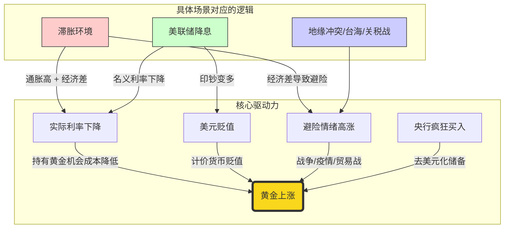

# 和美元紧密相关
黄金是纸币的反面镜像，儿美元是纸币的领头羊，所以黄金又是美元的反面镜像，比如美元经济和币值好，黄金就跌，反之，黄金就涨。
ID: 1774612229514

## 黄金增长所需要的核心驱动力
- 是否滞胀
- 美元利率
- 通货膨胀率
- 关税率
ID: 1774612229517

- 比如
	- ==关税==政策让黄金涨了 33%
		- 由于关税会形成滞胀，而滞胀的环境对黄金有利，这就是让黄金增值的原因
	- 2020 年的新冠疫情，黄金大跌，因为人们需要用现金购买吃喝生活用品
		- 然后美国政府为了刺激经济，有大量购买国债，将国债投入到老百姓和企业的生产中刺激消费，这种行为形成了新一轮的通货膨胀，同时导致美元贬值，由于黄金是美元的镜面，所以黄金升值
	- 2025 年可能影响黄金增长的三大因素
		1. 通胀放缓：由于关税对本国产业造成了危害，所以特朗普取消关税也意味着==物价上涨==结束，黄金不会再增长
		2. ==关税==政策失败
			- 原因：
				- 由于中国是世界第一的稀土出口大国，美国 90%的稀土来源于中国，如果继续加关税，中国拒绝向美国出口
				- 中国也是美国最大的大豆购买国，并且这些大豆农民都是川普的支持者，如果继续加关税，中国将拒绝购买大豆
			- 主要由于以上两个原因，中国才和美国达成了妥协，重新合作
		3. 近期军队内部更换九位上将这是以及公开表示要推进两岸和平发展，这意味着短期内将不会台海冲突
	- ==美联储降息==，也会导致黄金价格上涨

---

虽然你提到了滞胀和关税，但黄金的涨跌其实可以归纳为**四大核心驱动力**。掌握这四个，你就能看懂99%的黄金行情。

#### 1. 实际利率（Real Interest Rates）—— 黄金的一生之敌
这是最专业、最硬核的指标。
*   **公式：** `实际利率 = 名义利率（银行给你的利息） - 通货膨胀率`
*   **通俗解释：**
    *   黄金是个“懒汉”，它**不产生利息**（不像存银行有死利息，买股票有分红）。
    *   如果银行利息很高（比如5%），而通胀很低（1%），你把钱存银行能赚4%的真金白银。这时候谁买黄金谁傻，黄金就会跌。
    *   如果银行利息低（比如1%），但通胀很高（5%），你存钱每年亏4%。这时候大家就会惊恐地把钱取出来买黄金保值。
*   **结论：实际利率越低（甚至为负），黄金越涨。**
ID: 1774612229519

#### 2. 美元指数（USD）—— 黄金的跷跷板
*   黄金是全球用**美元**定价的。
*   **通俗解释：** 想象黄金是一个固定的蛋糕。
    *   如果美元变“强”了（值钱了），买同一块蛋糕需要的美元就少了 -> **黄金跌**。
    *   如果美元变“弱”了（贬值了，比如印多了），买同一块蛋糕就需要更多美元 -> **黄金涨**。
ID: 1774612229522

#### 3. 避险情绪（Geopolitics/Panic）—— 黄金的防空洞
*   这就是你笔记中提到的台海、贸易战、疫情。
*   **通俗解释：** 当世界和平时，大家去炒股、炒房、做生意。当世界要打仗、要暴雷时，大家觉得什么资产都不安全，只有拿在手里的金条最踏实。
ID: 1774612229525

#### 4. 央行购金（Central Bank Buying）—— 黄金的大庄家
*   这是一个较新的强劲因素（特别是中国、俄罗斯、印度等央行）。
*   **通俗解释：** 以前各国央行喜欢存美元国债做储备。现在因为地缘政治（怕被美国制裁冻结资产），各国央行开始狂买黄金代替美元。**庄家在买，价格难跌。**
ID: 1774612229528

---

### 📊 第三部分：Mermaid 逻辑图解

为了让你更直观地理解，我画了一张黄金涨跌的因果关系图：
ID: 1774612229532

---

### 🗣️ 第四部分：费曼学习法——讲个故事

试着把这些知识想象成一个**“黄金村”的故事**，讲给别人听：
ID: 1774612229535

> “想象一下，黄金是一个**‘又懒又胆小’的老人**，但他非常有信誉。
>
> 1.  **关于利息（实际利率）：** 隔壁‘美元银行’如果给的利息特别高，大家就会抛弃这个老人，去银行存钱；但如果银行利息低，甚至赶上物价飞涨（通胀），存钱等于亏钱，大家就会跑回来找这个老人保值。
> 2.  **关于和平（避险）：** 只要村里打架（战争）、闹瘟疫（疫情）或者村长乱印票子（美元贬值），大家就会觉得手里的纸币不安全，纷纷躲到老人身后寻求庇护。
> 3.  **关于滞胀：** 这是老人最喜欢的环境。因为物价涨（通胀利好黄金），生意还难做（经济停滞，没处投资），这时候老人就是全村唯一的希望。”

---

### 📚 第五部分：拓展学习

如果你想从浅入深进一步研究，建议关注以下几个方向：
ID: 1774612229538

1.  **TIPS（通胀保值债券）收益率：** 这是观察美国实际利率最好的指标，它和黄金价格走势高度负相关。
2.  **去美元化（De-dollarization）：** 研究一下金砖国家（BRICS）为什么都在买黄金，这将决定黄金长期的底部在哪里。
3.  **黄金ETF vs 实物黄金：** 了解纸黄金（交易用）和实物黄金（传家用）的区别。

---

### ⚔️ 第六部分：强化训练（课后测验）

为了确认你真的掌握了，请尝试回答以下两道题目（先自己想，再看答案）：
ID: 1774612229541

#### 题目 1：关于实际利率
假设明年美联储宣布**降息**（名义利率从 5% 降到 3%），但是，由于油价暴跌，美国的**通胀率**从 4% 一下子掉到了 1%。
请问：在这种情况下，单纯从“实际利率”的角度看，对黄金是**利好**还是**利空**？
ID: 1774612229544

👉 点击查看答案与解析

**答案：利空（或不如预期涨得多）。**

**解析：**
我们套用公式：`实际利率 = 名义利率 - 通胀率`
*   **降息前：** 5%（名义） - 4%（通胀） = **1%（实际利率）**
*   **降息后：** 3%（名义） - 1%（通胀） = **2%（实际利率）**

**惊人的发现：** 虽然美联储降息了（名义上），但因为通胀跌得更厉害，导致**实际利率反而上升了**（存钱变得更划算了）。这在历史上真的发生过，叫“通缩性降息”，这对黄金其实是不利的。所以，**降息不一定黄金必涨，要看通胀有没有跟着降！**

#### 题目 2：关于滞胀与危机
如果在2025年，美国虽然GDP停止增长（经济停滞），但因为AI技术突破导致生产效率极高，商品价格大幅下跌（通缩）。此时并没有发生战争。
请问：这种情况属于“滞胀”吗？黄金会大涨吗？
ID: 1774612229547

👉 点击查看答案与解析

**答案：不属于滞胀，黄金大概率不会大涨（甚至可能跌）。**

**解析：**
*   **是否滞胀：** 滞胀必须同时满足“停滞”+“通胀”。题目中是“停滞”+“通缩（价格下跌）”。这不叫滞胀，这叫“衰退”或“通缩性萧条”。
*   **黄金走势：** 黄金最怕通缩（物价跌，钱更值钱了，没必要买黄金保值）。虽然经济不好可能带来一点避险买盘，但失去了“抗通胀”这个最大的动力，加上没有战争，黄金很难大涨。

---

这堂课你听明白了吗？你的笔记基础很好，只要加上**“实际利率”**这个核心概念，你的分析水平就能超过90%的散户！加油！🪙