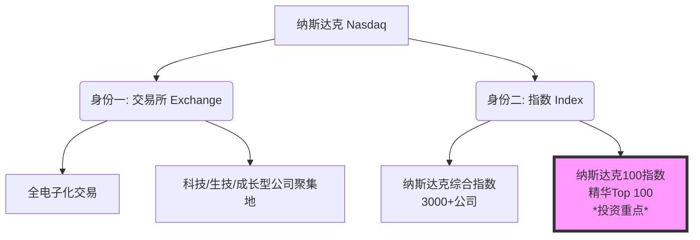
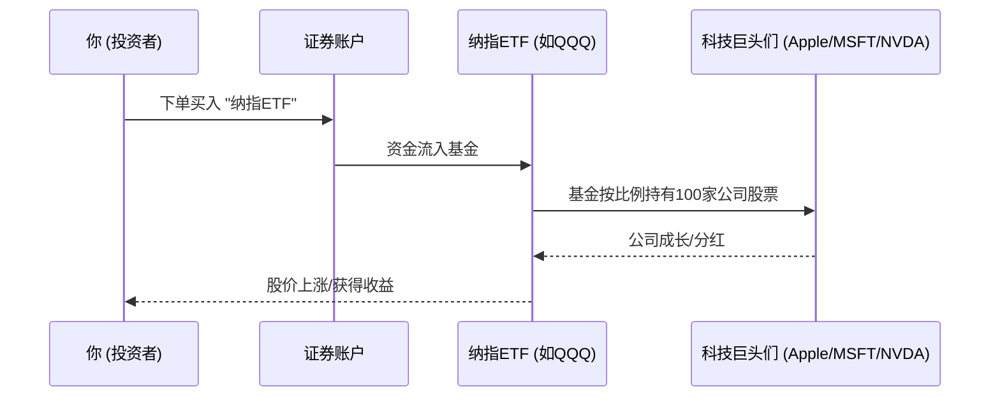

你好！很高兴看到你有理财投资的意识。我是你的专属导师。

提到“纳斯达克”（Nasdaq），很多人的第一反应是：“哦，那是美国搞科技股的地方！” 这句话对，但也不全对。

要想真的掏钱投资，咱们不能只懂个皮毛。今天我把你带入一个**“数字化未来都市”**的场景，用费曼学习法把纳斯达克掰开了、揉碎了讲给你听。

---

### 🎓 第一部分：什么是纳斯达克？（两个身份）

为了不让你晕头转向，你必须先明白，纳斯达克有两个身份：

#### 1. 身份一：一个完全电子化的“大卖场” (The Exchange)
想象一下，传统的证券交易所（比如纽约证券交易所 NYSE）像是一个**传统的菜市场**，很多人在场地里大喊大叫地交易（虽然现在也电子化了，但保留了人工传统）。

而**纳斯达克股票交易所**，从诞生那天起（1971年），就是一个**科幻电影里的虚拟交易中心**。它没有物理的交易大厅，它是世界上第一个**电子股票交易所**。
*   **特点：** 它是科技公司、初创公司、高增长公司的最爱。
*   **住户：** 苹果、微软、亚马逊、特斯拉这些“改变世界”的公司都“住”在这里。

#### 2. 身份二：一个反映科技冷暖的“温度计” (The Index)
当你听到新闻里说“今天纳斯达克大涨2%”，他们说的不是那个交易所，而是**纳斯达克指数**。
*   **纳斯达克综合指数**：包含了在纳斯达克上市的3000多家公司，大杂烩。
*   **纳斯达克100指数 (Nasdaq 100)**：这是**精华中的精华**。它剔除了金融股（银行等），选出了市值最大的100家非金融公司。**如果你想投资纳斯达克，通常指的就是投资这100家最牛的公司。**

#### 📊 图解：纳斯达克的双重身份

---

### 💡 第二部分：为什么要投资它？（生动比喻）

把投资股票市场比作**组建一支足球队**。

*   **道琼斯指数**：像是那种全是**老将**的球队，稳重，都是可口可乐、麦当劳这种传统巨头。
*   **纳斯达克100**：这是一支**全明星前锋队**。
    *   **进攻性极强**：这里面都是搞AI的、搞芯片的、搞互联网的。只要世界还在科技进步，这支队伍就能进球（赚钱）。
    *   **波动大**：因为进攻太猛，防守有时候不太行。遇到经济不好（比如加息），这支队伍跌得也比别人惨。

**投资纳斯达克，本质上就是赌：人类的科技未来会更好。**

---

### 🛠 第三部分：实战教学——如何投资？

你不可能把纳斯达克那100家公司的股票都买一遍（那需要几十万美元）。我们需要一个**“打包盒”**。

#### 1. 核心工具：ETF（交易所交易基金）
ETF就像是一个果篮。你买了这个果篮，就等于拥有了篮子里所有的水果（苹果、微软、谷歌等）。

*   **最著名的代码：QQQ**
    *   这就是追踪**纳斯达克100指数**的ETF。
    *   你买入一股QQQ，就相当于按比例买入了苹果、微软、英伟达等100家公司。

#### 2. 常用场景举例

> **场景 A：懒人定投法**
> *   **你的想法**：“我看好AI和互联网，但我不想天天看盘，也不懂选股。”
> *   **操作**：每个月发工资后，拿出$500美元，买入对应金额的纳斯达克100 ETF（如QQQ或国内对应的连接基金）。
> *   **结果**：十年后，你享受了全球科技进步的平均红利。

> **场景 B：对冲风险（进阶）**
> *   **你的想法**：“我觉得最近科技股涨太疯了，全是泡沫，要崩盘。”
> *   **操作**：买入反向ETF（如SQQQ，这是做空的），或者卖出QQQ。
> *   **警告**：新手请勿尝试场景B，风险极高！

#### 📉 图解：资金流向

---
## 二、纳斯达克的“性格”：为什么大家说它“代表科技成长”

- 行业集中：纳斯达克100排除了金融股，前十大权重多为科技/信息技术与可选消费、通信服务巨头。成长倾向明显。
- 权重偏大市值：是“市值加权”，龙头公司涨跌影响更大。
- 波动更大：历史上回撤更深。2000年互联网泡沫后，纳指最大回撤超过-70%；2022年利率快速上行，纳指100最大回撤也达-35%左右。收益更高的同时，坐过山车的频率也更高。
- 对利率敏感：成长股现金流在更远的未来，贴现率上升（加息）时估值压力更明显。

### 三、交易所层面：怎么在纳斯达克上“买卖”

- 交易时间（美国东部时间 ET）
    - 盘前：04:00-09:30
    - 正常：09:30-16:00（北京时间标准时段约22:30-05:00；夏令时21:30-04:00）
    - 盘后：16:00-20:00
- 订单类型
    - 市价单：立刻成交，但价格可能滑点
    - 限价单：设定价格上限/下限，成交不一定立刻，但可控价格
    - 止损/止损限价：跌破某价触发卖出或挂限价，控制亏损
- 市场结构
    - 电子化撮合+多做市商（market maker）提供流动性
    - 分层上市：Capital/Global/Global Select，门槛从低到高
- 风险小贴士
    - 盘前盘后成交量薄、点差大，滑点风险高
    - “日内交易者”规则（PDT）：美股保证金账户在5个交易日内日内交易≥4次且账户低于$25,000会触发限制

### 四、指数与常见投资工具

- 指数
    - 纳斯达克综合指数（IXIC）：覆盖面广，少有直接跟踪的低费率ETF
    - 纳斯达克100（NDX）：最常被投资的“科技代表”
- ETF（示例，非推荐）
    - QQQ（Invesco）：跟踪纳斯达克100，流动性好、历史悠久
    - QQQM：同样跟踪NDX，费率更低，规模与流动性略逊于QQQ
    - ONEQ：跟踪纳斯达克综合指数
    - 注意：还有杠杆/反向产品（如TQQQ、SQQQ），波动巨大，适合短线策略与专业投资者，不适合新手长期“死拿”
- 中国投资者的可达路径
    - 美股券商账户：如盈透IBKR、雪盈、老虎、富途等（合规前提下）。需外汇换汇与跨境资金合规。
    - 港股市场ETF：港交所多只追踪纳指100的ETF（示例：CSOP、华夏等发行的“纳指100”ETF）。请以券商实际可交易产品为准。
    - 境内QDII公募基金/LOF/ETF联接：多家基金公司有“纳斯达克100”或“美国科技指数”主题的QDII。注意费率、跟踪误差与申赎规则。购买前在基金官方与销售平台核对最新代码与资料。

### 五、账户、费用与税务要点（跨境需特别留意）

- 账户与费用
    - 佣金：许多美股券商标称“0佣金”，但有价差成本与监管/交易所小额费用（卖出时SEC/FINRA费用）
    - 汇兑：CNY→USD的换汇点差与手续费是隐性成本
    - 托管/平台费：不同券商不同
- 税务（一般性提示，非税务建议）
    - 非美国税务居民通常需提交W-8BEN表
    - 股息预提税：中美税收协定一般可降至10%（以券商实际代扣为准）
    - 资本利得税：多数情形下美方对非税务居民的股票资本利得不征联邦税，但你在居住国的纳税义务需自查
    - 遗产税：非居民持有美国资产超过一定门槛可能涉及美国遗产税规划问题
    - 若通过QDII或港股ETF投资，分配与税务处理路径不同，以基金公告为准

### 六、如何开始：一个可操作的“路线图”

- 第1步：明确目标与风险承受
    - 资金用途与期限（≥5年更适合股权类资产）
    - 心理可承受回撤幅度（例如-30%是否还能拿得住）
- 第2步：选产品与账户路径
    - 追踪标的：偏科技就选NDX（QQQ/QQQM/港股或QDII替代）；想更广泛可研究总市值/全市场基金
    - 路径：境外券商直投 vs. 港股ETF vs. 境内QDII公募
- 第3步：定投与仓位计划
    - 分批买入（定投/分层建仓）降低择时风险
    - 设定目标配置比例（比如60%股票指数、40%债券/货币，或“核心—卫星”：核心指数+少量主题）
- 第4步：风险控制
    - 单一主题不超过总资产一定比例（如不超过50%）
    - 预设再平衡规则（如每年或偏离5%-10%时再平衡）
    - 紧急备用金与保障先行
- 第5步：复盘与纪律
    - 记录买卖原因与假设，每季度回看
    - 避免追热点与频繁交易

### 七、估值与周期：何时更可能“舒服”，何时要格外谨慎

- 估值指标：市盈率（P/E）、远期P/E、市销率（P/S）、盈利增速（EPS growth）
- 宏观变量：10年期美债收益率、流动性（QE/QT）、美元指数
- 风险提示：
    - 高集中度：前十大成分占比高，个别龙头波动影响整体
    - 主题轮动：科技→价值/能源之间会轮动
    - 黑天鹅：监管、反垄断、地缘、AI竞争格局变化

### 八、几个常见的“实用场景”举例

- 长期投资者（5-10年）：用追踪纳指100的ETF做核心持仓的一部分，每月定投，年度再平衡。
- 想简化管理：通过QDII公募基金一键配置纳指100，自动分红再投，省去外汇与跨境操作。
- 想降低波动：纳指100搭配中短债或货币基金做“股债平衡”（例如60/40或70/30），回撤更可控。
- 想避免单一风格：纳指100（成长）+ 标普500或全市场指数（更均衡）组合，降低风格偏离。

### 九、和其他指数的对比与互补

- 标普500：涵盖美股大盘、含金融，风格更均衡。与纳指100搭配使用，可分散行业集中风险。
- 道琼斯工业平均：成分少、价格加权，象征意义更强，投资代表性弱于前两者。
- 罗素1000/2000：按市值覆盖大盘/小盘，若你想加入小盘风险溢价，可配合使用。

### 十、常见误区，提前避坑

- 误把“纳斯达克”当成“唯一指数”：你买的是哪个？综合指数还是纳指100？对应ETF不同。
- 过度自信追涨：纳指历史收益亮眼，但回撤也“很疼”。没有仓位与节奏管理，容易高位重仓。
- 杠杆/反向当长期配置：复利拖累和波动损耗会让长期体验很差，谨慎使用。
- 忽视汇率风险：人民币相对美元的变动，会放大或对冲你的收益/亏损。
- 只看故事不看现金流：成长要落地为盈利和自由现金流，财报才是硬通货。

### 十一、一个“上手流程”示意

### 费曼式自我讲解（请你大声“教给”别人，来检验是否真的懂了）

- 我可以用自己的话解释：纳斯达克既是一个电子交易所，也是多条指数的名字；投资“纳斯达克”通常指买跟踪纳斯达克100的ETF（如QQQ），这类产品科技权重高、波动大、对利率敏感。
- 我能画出投资路径：直投美股账户、买港股的纳指100 ETF、或在国内买QDII基金。三条路成本、税务和便捷性不同。
- 我知道核心风险：行业集中、估值与利率敏感、历次大回撤。用分批买入和股债搭配来缓释。
- 我能举例：若我每月定投纳指100，同时配30%债券指数基金，并在每年偏离10%时再平衡，我就是在用规则对抗情绪和择时。

### 当下两道小测试（自查理解）

1. 你打算“买纳斯达克”，在券商里输入QQQ、QQQM、ONEQ，这三者分别跟踪什么？有什么关键差别？
2. 如果未来一年美联储大幅加息、10年期美债收益率快速上行，你对纳指100的预期和操作会如何调整？为什么？

### 拓展学习（由浅入深）

- 入门
    - 指数基础：市值加权 vs. 等权重；跟踪误差与费率
    - 美股交易基础：订单类型、交易时段、PDT规则
- 进阶
    - 行业与风格轮动：成长/价值、大小盘切换
    - 宏观与估值：收益率曲线、贴现模型、盈利周期
    - 税务与合规：W-8BEN、分红预提、跨境资金合规
- 高阶
    - 期权对冲与增强：保护性看跌、备兑开仓（需系统学习）
    - 因子配置：质量、动量、低波，与纳指的互补
    - 资产配置框架：风险平价、永续组合、再平衡机制设计

### 温馨提示

- 本回答不构成投资建议。投资前请核对最新产品资料与合规要求，并根据自身情况（目标、期限、风险承受、税务）制定计划。
- 如果你愿意，我可以根据你的资金规模、期限与偏好，帮你做一个“纳指为核心”的示例配置与定投节奏。你也可以先回答上面的两道小题，我们再有针对性地完善计划。

### 🗣️ 第四部分：费曼学习法——你可以这样讲给别人听

如果你的朋友问你：“哎，你要买纳斯达克，那是啥玩意？”
你可以这样告诉他：

> “想象一下，有一个**'未来科技精英俱乐部'**。
> 
> 这里的会员都是苹果、微软、英伟达这种在这个星球上最聪明、最赚钱的公司。
> 
> 我没那么多钱去跟每个老板谈生意，但是我可以买一张这个俱乐部的**'入场券'（ETF）**。
> 
> 买了这张券，只要这些精英公司还在赚钱，我就能跟着分一杯羹。虽然有时候他们会因为大家没钱（经济危机）而暂时消沉，但只要人类还需要手机、电脑和AI，这个俱乐部的价值就会越来越高。”

---

### 🚀 第五部分：拓展学习（由浅入深）

当你掌握了纳斯达克的基础，可以按照以下路径深入学习：

1.  **初级拓展**：
    *   **S&P 500（标普500）**：纳斯达克太激进？看看这个更均衡的指数，它是美国经济的基石。
    *   **加息与降息**：了解美联储的利率政策为什么是纳斯达克的“死对头”（利率高，科技股通常跌）。

2.  **中级拓展**：
    *   **FAAMG**：深入了解纳斯达克的前几大权重股（Facebook, Apple, Amazon, Microsoft, Google）。因为这几家公司占了指数很大比例，它们打个喷嚏，指数就感冒。
    *   **P/E Ratio（市盈率）**：学习如何判断现在的纳斯达克是贵了还是便宜了。

3.  **高级拓展**：
    *   **纳斯达克期货 (NQ)**：这是一种带有杠杆的衍生品，风险巨大，是专业交易员的战场。
    *   **VIX指数**：恐慌指数，用来衡量市场的恐慌程度。

---

### 📝 第六部分：随堂测验（加强理解）

为了确认你是否真的懂了，请在心里回答这两个问题：

**题目 1：**
如果你看好美国的传统工业、银行和消费品（比如可口可乐、摩根大通），你应该优先全力投资纳斯达克吗？
*   A. 应该，纳斯达克代表美国所有好公司。
*   B. 不应该，纳斯达克主要偏重科技和成长型公司，金融和传统工业较少。

**题目 2：**
我想投资纳斯达克，但我只有1000美元，买不起亚马逊（假设一股就要100多）和微软的股票组合，我该怎么办？
*   A. 没办法，必须凑够几万美元才能进场。
*   B. 购买追踪纳斯达克100指数的ETF（如QQQ），它可以让我用小资金买入一篮子股票。

---

🔎 点击查看答案

**答案 1：选 B**
*   **解析**：纳斯达克是科技股的大本营。如果你喜欢传统工业和银行，应该去看“道琼斯指数”或者“标普500指数”。

**答案 2：选 B**
*   **解析**：这就是ETF的魅力，低门槛实现分散投资。

希望这次讲解让你对纳斯达克有了立体的认识！准备好开始你的投资之旅了吗？