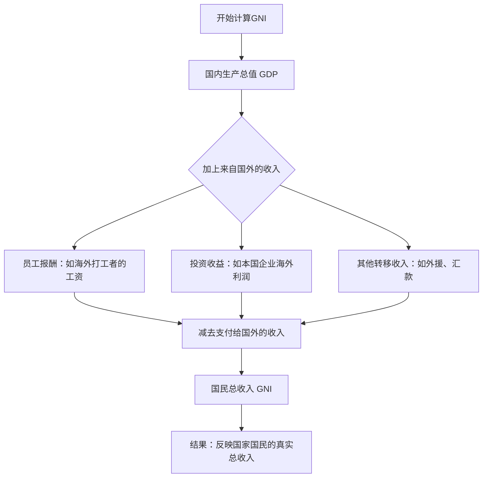

---
aliases:
  - 国民总收入
  - GNI
  - Gross National Income
---
把一个国家想象成一个“全球打工的大家庭”。GDP是这家人在“本国工地”一年做成的所有活的总价值；而GNI（国民总收入）则是这家居民一年“赚到的收入账本”，不管是在国内拿到的工资和利润，还是去国外打工或投资拿回来的钱，都要算进来；同时要减去外籍居民在本国赚了、又带走的那部分收入，它帮助我们理解一个国家真正的经济实力和人们的平均生活水平。

```ad-Example
想象一下，你有一个家庭：爸爸在国内开工厂赚钱，妈妈在国外工作寄钱回家，孩子在学校读书。这个家庭的“总收入”不仅包括爸爸在国内赚的钱，还包括妈妈从国外寄回来的钱，减去家里支付给外国人的费用（比如请了外国家教）。
```

### 简明定义

- GNI（Gross National Income，国民总收入）：本国居民在一定时期内获得的总收入＝国内生产创造的收入＋居民从国外获得的要素收入净额（减去外国居民在本国获得并汇出的要素收入）。
- “要素收入”包括：工资与薪酬、利息、股息、利润、地租等。
- 与过去的GNP（国民生产总值）几乎等义；现代统计体系更常用GNI。


和GDP的区别（一句话版）

- GDP看“地点”：本国境内生产的总价值。
- GNI看“身份”：本国“居民”赚到的总收入（无论在国内还是国外）。

### 一个小公式和例子

- 公式（口语版）：GNI = GDP + 本国居民从国外赚到的收入 − 外国居民在本国赚到并带走的收入。
- 例子：
    - 某国一年GDP=1000；居民海外拿到利息和工资=+100；外资企业在本国赚了利润并汇出=−150；则GNI=1000+100−150=950。说明该国对外“净付出”较多，居民拿到的总收入比境内产出少。
    - 若相反（海外收入大、外资回流少），就可能出现GNI>GDP。
---
	- A国：GDP = 1000亿美元，海外收入 = 50亿美元，支付给外国 = 20亿美元 → GNI = 1000 + 50 - 20 = 1030亿美元。
	- B国：GDP = 1200亿美元，但海外收入 = 10亿美元，支付给外国 = 100亿美元（如大量外资企业利润） → GNI = 1200 + 10 - 100 = 1110亿美元。  
	    尽管B国GDP更高，但GNI只略高于A国，显示B国的国民实际收入增长空间受限。


### 有什么用

- 评估居民真正的“收入归属”：在外资占比较大或居民海外收入比重高的经济体，GNI比GDP更能反映本国人拿到的那份“蛋糕”。
- 国际比较与分组：世界银行按“人均GNI”（常用Atlas方法平滑汇率）来划分低、中、高收入经济体。
- 政策分析：理解对外投资、外资利润汇出、跨境劳务和资本所得，对宏观政策（税制、外资政策、产业升级）有指导意义。


### GNI与中等收入陷阱
一个国家可能GDP增长迅速（如通过吸引外资），但如果GNI增长缓慢（因为大部分收益被外国人拿走），就可能陷入中等收入陷阱。这是因为GNI更直接反映本国居民的购买力和生活改善程度。例如，一些拉美国家GDP高，但GNI停滞，导致无法跨越到高收入水平。


### 可能的误区与局限

- 不等于“居民可支配收入”：GNI是总额，未扣除折旧与税费，也不考虑政府转移后的分配。
- 汇率与物价影响：用市场汇率换算的人均GNI受汇率波动影响很大；用购买力平价（PPP）更适合比较生活水平。
- 分配不均看不见：GNI不告诉你这份“蛋糕”如何切分，需配合基尼系数等指标。
- 跨国公司利润转移：如爱尔兰这类经济体，利润的跨境归属会扭曲GDP与GNI的关系；当地统计部门甚至编制修正指标（如GNI*）来更真实反映国民收入。


用一张图看清关系



### 再比一比GDP与GNI何时会显著不同

- GNI通常高于GDP：本国居民大量持有海外资产或临时外出工作并把收入带回（例如部分移民输出国；需注意统计上“工资”与“汇款”的口径差异）。
	- 
```ad-Example


	  例如，如果一个国家大量输出劳工（如印度），GNI可能高于GDP；反之，如果外国公司主导经济（如某些非洲国家），GNI可能低于GDP。
	  
- **成功案例**：爱尔兰是一个高收入国家，部分因为其低企业税吸引跨国公司，但GNI高于GDP，因为许多爱尔兰企业在海外赚取利润。这就像一个家庭，爸爸在国内工作，但孩子在美国硅谷高薪就业，家庭总收入更高。
- **对比例子**：中国GDP很高（世界第二），但GNI略低于GDP，因为外国公司在中国赚的钱较多；而菲律宾GNI常高于GDP，因为大量海外劳工寄钱回家。
- **个人联系**：想象你投资了外国股票——你的个人“GNI”就包括这些海外收益，而不仅仅是工资。国家同理！
```


- GNI通常低于GDP：外资占比较大，利润大量汇出（例如资源型经济或跨国公司集聚但利润归属海外的经济体）。

## 相关概念拓展（由浅入深）

- 入门
    - GDP（国内生产总值）：看“境内产出”。
    - 人均GNI：用来比较居民平均收入水平。
    - 名义与实际：是否剔除通胀。
    - - **GDP vs. GNI的区别**：学习这两个指标的核心差异，为什么有时GDP高而GNI低（参考爱尔兰例子）。
	- **人均GNI**：理解将GNI除以人口数得到的人均值，这常用于划分低收入、中等收入和高收入国家（世界银行标准：2023年，人均GNI < 1,085为低收入；1,085为低收入；1,085为低收入；1,086-13,205为中等收入；>13,205为中等收入；> 13,205为中等收入；>13,205为高收入）。
	- **实际应用**：查看世界银行数据，比较中国、印度、美国等国的GNI变化趋势（例如，中国通过海外投资增加GNI）。
- 进阶
    - 要素收入与国际收支中的“初次收入”（Primary income）。
    - Atlas方法与购买力平价（PPP）：两种人均GNI换算与比较方式。
    - GNP与GNI的历史与口径差异。
    - **国民总收入计算细节**：深入要素收入（员工报酬、财产收入等），了解如何统计跨国数据。
	- **GNI与生活质量**：关联人类发展指数（HDI），探讨GNI如何影响教育、健康等社会指标（例如，高GNI国家往往有更好的医疗系统）。
	- **全球化与GNI**：分析外国直接投资（FDI）、汇款对GNI的影响，讨论全球化对贫富差距的作用。
- 深入
    - 净国民收入（NNI）：从GNI中扣除“资本折旧”，更接近可持续收入。
    - 收入分配与基尼系数、HDI：从“总量”走向“质量”的衡量。
    - 利润转移与统计修正（如爱尔兰的GNI*），多国企业如何影响国民收入指标。
    - **GNI作为经济政策工具**：研究政府如何通过政策（如税收优惠、海外投资激励）提升GNI，避免中等收入陷阱。
	- **历史案例分析**：比较成功跨越中等收入陷阱的国家（如韩国、新加坡）如何利用GNI增长策略，以及失败案例（如阿根廷）的教训。
	- **可持续发展目标（SDGs）**：探索GNI与联合国SDGs的联系，例如如何平衡经济增长与环境保护。
	- **GNI作为经济政策工具**：研究政府如何通过政策（如税收优惠、海外投资激励）提升GNI，避免中等收入陷阱。


如果你愿意，我可以继续用具体国家的真实数据，演示GDP与GNI的差距是如何产生的，以及政策改变（比如企业税或劳务出入境）会怎样影响这两个指标。