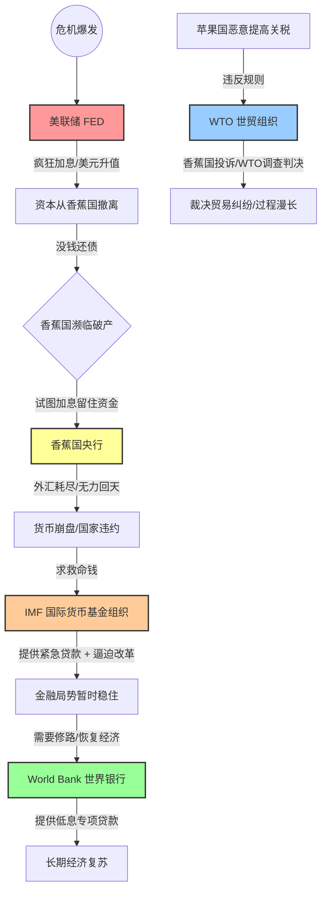
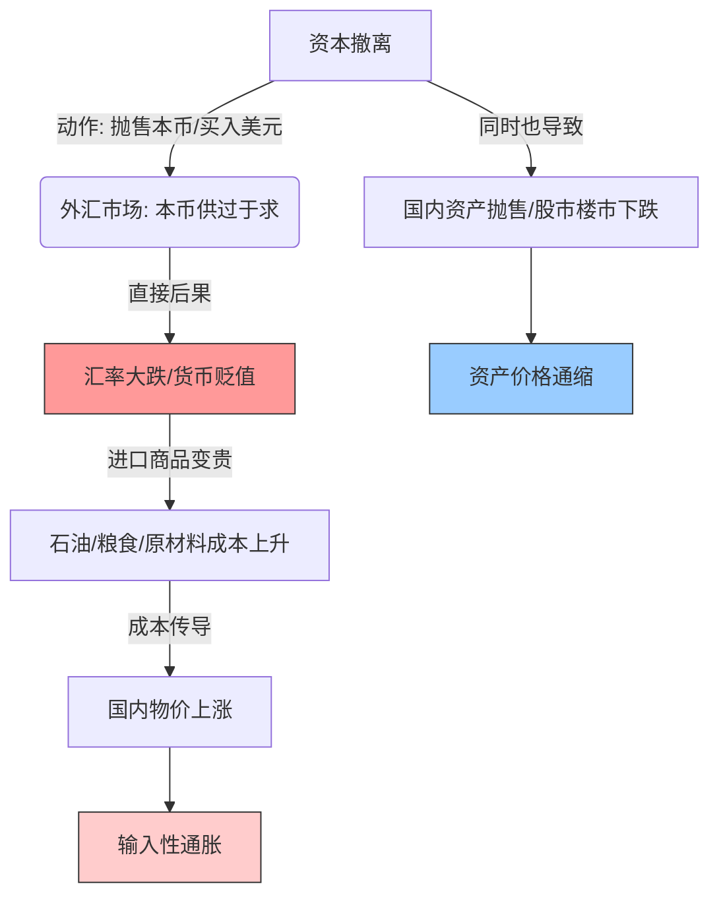

你好！这是一个非常宏大的问题，因为你提到的这些机构构成了整个地球的经济骨架。

为了让你听得懂、记得住，我们把**全球经济看作一个巨大的“地球村”**。在这个村子里，有大户人家（大国），也有小农户（发展中国家），大家做生意、借钱、修路，这就需要不同的管理者和服务机构。

我将为你介绍村里的**“四大天王”**和一个**“村委会裁判”**，最后用一部“经济灾难片”的剧本把它们串联起来。

---

### 第一部分：地球村的“核心班底”介绍

#### 1. 美联储 (The Fed) —— 村里的“水龙王”兼“印钞机”
*   **全称：** 美国联邦储备系统（美国的央行）。
*   **角色：** **全球流动性总阀门**。
*   **通俗解释：** 虽然它名义上只是美国的央行，但因为美元是世界通用货币（大家都认美元），所以美联储掌握着地球村的水龙头。
    *   **它放水（降息）：** 全球钱变多，大家日子好过，资产涨价。
    *   **它抽水（加息）：** 全球钱变少，资金回流美国，小国容易缺钱破产。
*   **举例：** 2022年美联储疯狂加息，导致斯里兰卡等国家因为借不到美元还债而国家破产。
ID: 1774612229313

#### 2. 中央银行 (Central Banks，如中国央行 PBOC) —— 各自家里的“财政管家”
*   **角色：** **本国货币守护者**。
*   **通俗解释：** 每个国家都有自己的管家。比如中国人民银行（PBOC）。美联储管美元，PBOC管人民币。
*   **职责：** 调节家里的钱够不够用，物价会不会太高（通胀），汇率稳不稳。
*   **互动：** 当美联储“兴风作浪”时，各国央行往往需要通过政策来防御（比如美联储加息，其他国家可能被迫跟着加息，防止钱跑光）。
ID: 1774612229316

#### 3. WTO (世界贸易组织) —— 村里的“生意裁判”
*   **角色：** **贸易规则制定者与纠纷调解员**。
*   **通俗解释：** 村民之间做买卖，比如A国卖香蕉给B国。如果没有WTO，B国可能随便加收100%的关税，或者A国倾销烂香蕉。WTO就是制定《村规民约》并吹哨判罚的裁判。
*   **举例：** 之前美国限制中国芯片，中国就可以向WTO提起诉讼，指责美国违反贸易公平原则。
ID: 1774612229319

#### 4. IMF (国际货币基金组织) —— 村里的“急诊室医生” (ICU)
*   **角色：** **救急不救穷的最后贷款人**。
*   **通俗解释：** 当一个国家把钱花光了，欠了一屁股外债还不上，货币崩盘（比如津巴布韦、阿根廷），马上要“死”了。这时候只有IMF敢借钱给它“续命”。
*   **代价：** 找IMF借钱条件非常苛刻，就像进ICU要签生死状。IMF通常会要求该国削减福利、出售国有资产、开放市场等。
ID: 1774612229322

#### 5. 世界银行 (World Bank) —— 村里的“扶贫施工队”
*   **角色：** **帮助发展的慈善工程师**。
*   **通俗解释：** 它的目标是“消除贫困”。如果一个穷国想修路、建大坝、盖学校，但没钱，也没人借给它（因为没利润），世界银行就会给它提供长期、低利息的贷款。
*   **区别：** IMF管“救命”（短期的金融危机），世界银行管“发展”（长期的基础设施建设）。
ID: 1774612229325

---

### 第二部分：实战剧本 —— 当危机降临时

为了展示它们如何联动，我们假设发生了这样一件大事：**虚构的发展中国家“香蕉国”遭遇了经济危机。**
ID: 1774612229328

**剧本背景：**
1.  **美联储**疯狂加息，美元回流美国。
2.  **香蕉国**出口暴跌，外汇储备耗尽。
3.  邻国**苹果国**趁机对香蕉国发起贸易制裁。

**处理顺序与职责联动图 (Mermaid)：**

**详细解说：**

1.  **导火索（美联储）：** 美国为了压自己的通胀，宣布加息。这就好比村里的首富（美国）突然说：“来我家存钱利息高！”于是，“香蕉国”里的钱都被吸走了。
2.  **第一道防线（香蕉国央行）：** 香蕉国的央行试图干预，卖出美元买入本国货币，想稳住汇率，结果钱太少，外汇储备花光了，防线失守。
3.  **贸易冲突（WTO）：** 此时，隔壁“苹果国”落井下石，禁止进口香蕉。香蕉国走投无路，去**WTO**打官司。WTO虽然受理，但流程很慢，远水解不了近渴。
4.  **急救（IMF）：** 香蕉国彻底没钱还外债了，政府要关门。此时只能找**IMF**。IMF说：“给你钱可以，但你必须勒紧裤腰带，减少政府开支，把你的矿山抵押给我。”香蕉国含泪签字，拿到了救命钱。
5.  **重建（世界银行）：** 5年后，香蕉国挺过了危机，但国内设施破烂。为了重新发展，香蕉国向**世界银行**申请贷款修了一条通往港口的高速公路，经济开始慢慢复苏。

---

### 第三部分：知识拓展（SWIFT系统）

还有一个隐藏的BOSS你必须知道：**SWIFT系统**。
ID: 1774612229331

*   如果说上面那些是管理机构，SWIFT就是地球村的**“通讯电缆”**。
* 
*   它不存钱，但是全世界银行转账的信息都通过它传输。
*   **核弹级威力：** 如果美国想彻底制裁一个国家（比如俄罗斯），不需要派兵，只需要把它踢出SWIFT系统。该国就成了金融孤岛，没法跟外国人做生意（因为没法汇款），这被称为“金融核弹”。

---

### 第四部分：费曼式强化测验

看看你是否真的理解了这些机构的区别：
ID: 1774612229334

**题目 1：**
某非洲贫困国家虽然没有发生金融危机，但因为太穷，国民喝不上干净的水。该国政府想建一个大型自来水净化厂，但手里没钱。请问，他应该哪怕去填申请表，最对口的机构是哪一个？
A. IMF (国际货币基金组织)
B. WTO (世界贸易组织)
C. World Bank (世界银行)
D. Federal Reserve (美联储)

**题目 2：**
新闻标题：“为了应对汇率暴跌，阿根廷不得不接受苛刻条件，承诺削减赤字以换取400亿美元的援助贷款。” 请问这笔钱是谁借给阿根廷的？
A. 世界银行
B. IMF (国际货币基金组织)
C. WTO
D. 联合国

---
*(你可以尝试回答，我将为你进行点评和解析)*

# 曾经有人将通缩和通胀比喻成水，购买力比喻成里面的米，水越多粥越稀 这就是通胀，但是你上面为什么又说本国货币外逃之后水应该减少了，应该会形成通缩才对

这是一个非常棒的问题！你能提出这个问题，说明你已经开始运用逻辑去批判性地思考了。**你发现了宏观经济学中最容易让人晕头转向的一个矛盾点：流动性紧缩（钱少了） vs 货币贬值（钱不值钱了）。**
ID: 1774612229337

你的逻辑是：
> 资本撤离 = 钱流走 = 锅里的水少了 = 粥应该变稠（钱更值钱/通缩）。

这个逻辑在封闭环境下是完全正确的。但在开放的国际经济中，我们需要引入**“两个市场”**和**“汇率”**的概念来修正这个比喻。

让我们把这个逻辑理顺，你会发现“水少了”其实是指两个不同的池子。

---

### 一、 关键误区：钱去哪了？

当资本外逃时，投资者并不能直接把人民币（RMB）装进箱子运到美国去花。**人民币只能在中国用，美元只能在美国用。**
ID: 1774612229342

**资本外逃的真实动作是：**
1.  我在中国卖掉房产/股票，拿到 **人民币**。
2.  我拿着人民币去外汇市场（门口的兑换处），**卖出人民币，买入美元**。
3.  我把换来的 **美元** 转走到美国。

**注意重点：**
在这个过程中，**人民币并没有消失！** 它只是被狠狠地**“抛售”**到了外汇市场上。

---

### 二、 修正比喻：锅里的水 vs 门口的水

我们可以把经济分成两个地方：**“家里的锅（国内市场）”** 和 **“门口的交易所（国际外汇市场）”**。
ID: 1774612229346

#### 1. 为什么会贬值？（门口的交易所）
想象一下，本来门口交易所里，人民币和美元的兑换比例很稳定。
突然，一大群人（资本撤离）冲到门口，手里举着大量的人民币喊：“我不想要人民币了，谁有美元？我换！”
ID: 1774612229350

*   **现象：** 门口堆满了没人要的人民币（供给暴增）。
*   **结果：** 人民币在门口的交易所里变得**“不值钱”**了。以前7块钱换1美元，现在要7.3块才能换1美元。
*   **结论：这就是汇率贬值。**

#### 2. 为什么通常会导致通胀（水变稀）而不是通缩？
现在回到你说的“家里的锅”。既然钱流出了，锅里的水好像确实少了（流动性收紧），理论上确实有通缩压力（资产价格下跌，比如股市楼市跌）。
ID: 1774612229353

**但是！有一个更猛烈的反向力量会把粥强行变稀——“输入性通胀”。**

*   **逻辑：** 你的国家需要买石油、芯片、大豆、天然气吧？这些东西在国际上是用**美元**计价的。
*   **传导：**
    *   以前买一桶油要 100美元 = 700人民币。
    *   现在汇率贬值了（7.3），买同样一桶油要 = 730人民币。
    *   油价涨了 -> 运费涨了 -> 种地的肥料涨了 -> 超市里的菜价涨了。
*   **结果：** 虽然国内的钱可能变少了，但因为货币对外部贬值得太厉害，导致东西变贵了。**你手里的钱能买到的东西变少了，这对于老百姓来说，感觉就是“通胀”（粥变稀了）。**

---

### 三、 图解：为什么钱走了，反而会有通胀？

ID: 1774612229357

---

### 四、 央行的左右为难（补充视角）

这里还有一个更深层的逻辑，解释为什么很难发生单纯的通缩。
ID: 1774612229360

当资本外逃，国内资金池真的“干枯”时，**央行（妈妈）通常会被迫放水。**

1.  **情景：** 钱都跑了，国内工厂借不到钱要倒闭，股市要崩盘（这就是你理解的通缩/水少了）。
2.  **央行反应：** 央行不能眼睁睁看着经济死掉，它会启动印钞机（降准降息），往锅里**注水**，来填补外资撤离留下的窟窿。
3.  **最终结果：**
    *   外资撤离导致汇率贬值。
    *   央行为了救市印了更多钞票。
    *   **双重打击 = 严重的通货膨胀（货币对内对外都贬值）。**

    *（典型案例：土耳其、阿根廷。外资跑得越快，他们印钱印得越快，结果就是超级通胀。）*

---

### 五、 费曼式总结

让我们回到你的“米和水”的比喻，进行最后修正：
ID: 1774612229363

*   **资本撤离**，不是把锅里的水舀走倒进下水道消失了。
*   而是把锅里的水（本币）疯狂地倒进**门口的换汇池**里。
*   门口的池子水漫金山，导致你的水**“对外”不值钱**了（汇率崩）。
*   因为对外不值钱，你想买国外的“进口米”放入锅里，就得花更多的水。
*   **最终：** 你的锅里，虽然水总量可能没变甚至变少了，但因为米（进口商品）变得超级贵（少），**喝起来的感觉依然是——粥变稀了（购买力下降）。**

---

### 六、 强化测验

**题目：**
如果一个依赖进口石油和粮食的国家（如土耳其），发生了严重的资本外逃。
1.  **汇率：** 土耳其里拉会升值还是贬值？
2.  **物价：** 国内的面包价格（需要进口小麦和天然气烘焙）会便宜（通缩）还是变贵（通胀）？
ID: 1774612229367

*(尝试用刚才的逻辑推理一下，特别是“输入性通胀”这个点)*