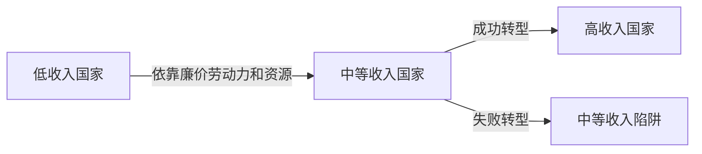
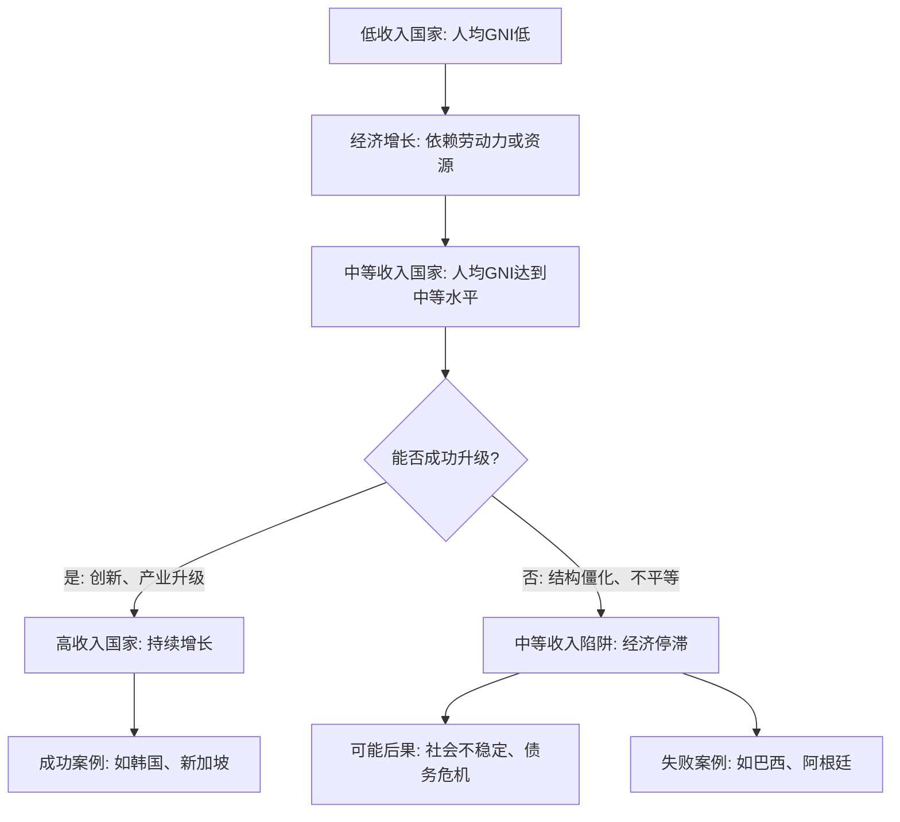

### 什么是中等收入陷阱？

想象一下，一个国家就像一辆汽车，从贫穷的泥泞小路（低收入阶段）奋力开出来，终于驶上了一条平坦的柏油路（中等收入阶段）。但这时，如果司机（国家政策和社会结构）不升级引擎（产业和技术），车子就可能因为动力不足、轮胎磨损或交通拥堵而卡在半路，无法加速开往富裕的高速公路（高收入阶段）。这就是“中等收入陷阱”的生动比喻——一个国家在达到中等收入水平后，由于各种内部和外部原因，经济增长放缓甚至停滞，难以突破到高收入行列。

现在，让我们从多个角度深入探讨这个概念，确保你不仅能理解它，还能看到它如何影响现实世界。我会用通俗的语言、生动的例子，并配合图表来加深印象。

#### 1. **定义和核心概念**
中等收入陷阱指的是国家经济发展到一个特定阶段（通常为人均GDP约4,000-12,000美元）后，由于未能成功实现经济转型，导致经济增长停滞，长期停留在中等收入水平的困境。

- **为什么重要？** 它不仅是经济问题，还涉及社会、政治和环境因素。如果国家陷入这个陷阱，可能会导致失业率上升、社会不稳定，甚至引发危机。例如，许多拉美国家在20世纪80年代后经历了这种情况，而亚洲“四小龙”（如韩国和新加坡）则成功跨越。

#### 2. **多方面原因解析**

中等收入陷阱不是单一因素造成的，而是多种力量交织的结果。我们可以从以下角度来理解：

- **经济角度**：
    - **产业结构僵化**：国家依赖低端制造业或资源出口（如纺织、矿产），但缺乏高附加值产业（如高科技、金融服务）。就像一家工厂只会生产简单零件，却不会研发智能机器人，最终在竞争中落伍。
    - **创新能力不足**：研发投入低、教育体系薄弱，导致技术模仿多、原创少。比如，如果一个国家总是“山寨”别人的产品，而不是发明自己的，就很难在全球化中领先。
    - **投资效率低下**：大量资金流向房地产或基础设施，而非创新领域，造成资源浪费和债务风险。
- **社会角度**：
    - **收入不平等**：财富集中在少数人手中，中产阶级萎缩，消费需求不足。想象一个社会里，富人开豪车，穷人却买不起面包，整体经济就像一辆失衡的马车，跑不起来。
    - **教育和健康问题**：劳动力素质不高，人口老龄化加剧，拖累生产力。好比一支球队，如果队员体力差、技术糙，就很难赢得比赛。
- **政治和环境角度**：
    - **制度腐败**：政府效率低、法治不健全，企业不敢长期投资。这就像一场马拉松，如果裁判总吹黑哨，选手们就会失去动力。
    - **环境压力**：过度开发资源导致污染，影响可持续增长。例如，依赖煤炭的国家可能面临气候变化带来的经济打击。

为了更直观地展示这个过程，我用Mermaid语法画一个流程图。它描绘了一个国家从低收入到高收入的路径，以及可能陷入陷阱的关键点。图表如下：

**图表解释**：这个流程图显示，国家从低收入起步，通过经济增长进入中等收入阶段。关键在于“能否成功升级”？如果能（通过创新和改革），就迈向高收入；如果不能，就陷入陷阱，导致停滞和问题。图表中的例子帮助你联系现实——韩国通过发展高科技产业成功跨越，而巴西因依赖大宗商品出口而卡住。

