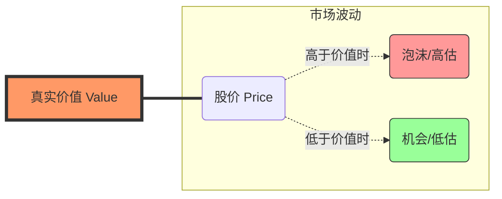

这是一个非常深刻的问题，你直接触及到了投资的灵魂！🧐

巴菲特有一句名言：**“价格是你付出的（Price），价值是你得到的（Value）。”**

股票软件上跳动的数字只是**价格**（大家吵出来的结果），而**真实价值**（公司到底值多少钱）是看不见的，需要我们去“估算”。

没有上帝视角的“绝对真理”，但我们有三把尺子，可以用来测量公司的“真实价值”。

---

### 1. 第一把尺子：看“家底” —— 市净率 (P/B)
**适用于：银行、钢铁、煤炭等重资产行业。**

这把尺子算的不是公司能赚多少钱，而是**如果公司今天倒闭了，变卖锅碗瓢盆还债后，股东还能分到多少钱？** 这叫**“净资产”**（Book Value）。

*   **公式**：$$ \text{市净率 (PB)} = \frac{\text{股价}}{\text{每股净资产}} $$
*   **通俗理解**：
    *   如果不做生意了，把店里的桌椅板凳都卖了，每股值 **10块钱**。
    *   现在的股价是 **8块钱** (PB = 0.8)。
    *   **结论**：**严重低估！** 现在的价格比破烂价还便宜，这就是“捡烟蒂”策略。

> **场景**：如果一家科技公司只有几台电脑和人脑，这把尺子就不准了（因为人脑和专利很难变卖计价）。

---

### 2. 第二把尺子：看“未来现金流” —— 绝对估值法 (DCF)
**这是理论上最准确，但最难算的尺子。**

一家公司的真实价值，等于它**这辈子能为你赚到的所有现金，折算到现在**的总和。

*   **通俗理解（金鹅的故事）**：
    *   有一只金鹅，预计还能活10年。
    *   它每年下一个金蛋，值100元。
    *   这只鹅的真实价值是 $100 \times 10 = 1000$ 元吗？
    *   **不对！** 因为明年的100元不如现在的100元值钱（有通胀，或者我可以存银行拿利息）。
    *   你需要打个折（折现）。也许算下来，这只鹅现在的真实价值是 **800元**。
    *   **决策**：如果那人卖你500元，你就买；卖你900元，你就别买。

> **缺点**：只要你猜错了它能活几年，或者猜错了金蛋的价格，算出来的结果就会差十万八千里。

---

### 3. 第三把尺子：看“邻居” —— 相对估值法 (PE对比)
**适用于：大部分普通投资者。**

如果算不准绝对价值，我们就**货比三家**。

*   **通俗理解（买房）**：
    你不知道这套房子到底值多少钱。但是你看看隔壁老王、楼上老李的房子，户型一样，他们都卖 **200万**。
    *   如果这套房子卖 **150万**，那它的价值可能被低估了。
    *   如果这套房子卖 **300万**，那它可能太贵了。

*   **股票应用**：
    *   **纵向比**：看这家公司过去10年的市盈率。如果现在处于历史最低位，可能便宜。
    *   **横向比**：看同行业的对手。如果可口可乐市盈率25倍，百事可乐只有15倍，那百事可能相对便宜（也就是价值被低估）。

---

### 4. 📊 图解：价格与价值的钟摆

价值通常是缓慢增长的，但价格（股价）却像疯狗一样围着主人（价值）跑。

**核心逻辑：** 我们无法算出精确的价值点（比如10.53元），但我们可以算出一个**模糊的区间**（比如 8~12元）。
*   当股价掉到 **5元** 时：闭眼买（安全边际高）。
*   当股价涨到 **20元** 时：赶紧跑（泡沫大）。

---

### 5. 💡 总结与拓展

要判断真实价值，不能只看一个数字，要综合看：

1.  **看家底 (PB)**：破产了值多少钱？（保底线）
2.  **看未来 (DCF)**：未来能赚多少真金白银？（天花板）
3.  **看同行 (PE/PEG)**：比别人贵还是便宜？（参照物）

**拓展学习：安全边际 (Margin of Safety)**
这是格雷厄姆（巴菲特的老师）提出的概念。如果你算出真实价值是10元，你不要在10元买，你要在 **6元** 买。这就给自己留了4块钱的“犯错空间”。**买得越便宜，风险越低。**

---

### 6. 🗣️ 费曼学习法引导输出

请尝试回答这个问题：
> “如果一家公司只要100块钱（市值），但它账上的现金和卖得掉的厂房加起来有120块钱（净资产），而且没有欠债。用我们今天学的知识，它的价值是被低估还是高估了？这种时候该看哪把‘尺子’？”

---

### 7. 📝 随堂小测试

**题目一：**
分析师预测 A 公司未来每年利润增长 20%，目前市盈率 30倍。
B 公司未来每年利润增长 2%，目前市盈率 10倍。
单纯从“成长性与价格的匹配度”（真实价值）来看，谁可能更划算？

点击查看答案

答案：**A公司可能更划算（或者差不多）。**
解析：这里可以用 PEG 指标（市盈率 ÷ 增长率）。
A公司 PEG = 30 ÷ 20 = 1.5。
B公司 PEG = 10 ÷ 2 = 5。
B公司虽然市盈率低，但它几乎不增长，是个“烂公司”，所以它可能只值这个价，甚至还贵了。A公司虽然贵，但成长快，更接近其真实价值。

**题目二：**
你打算买一家奶茶店的股票。
*   方法A：你计算了店里的冰箱、桌椅折旧后值多少钱。
*   方法B：你预测了未来5年能卖出多少杯奶茶，把利润算到现在。
请问，哪个是**市净率(PB)**思维，哪个是**现金流折现(DCF)**思维？

点击查看答案

答案：
方法A 是 **市净率 (PB)** 思维（看家底）。
方法B 是 **现金流折现 (DCF)** 思维（看未来赚钱能力）。

