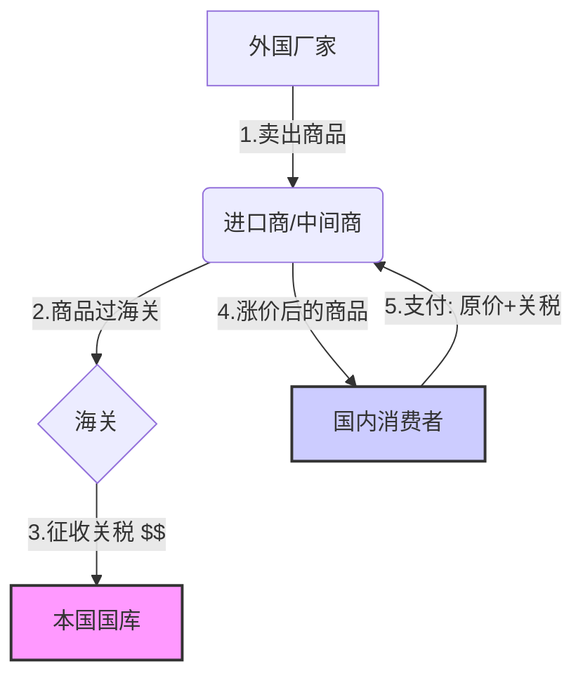
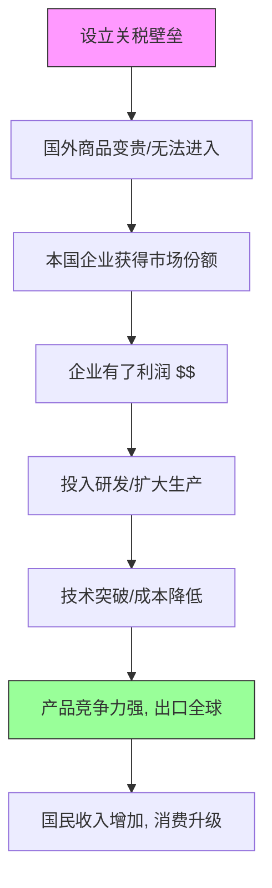

 # 关税与国家 进口税收以及国内人民消费税收三者之间的关系
你好！很高兴能为你解答这个问题。你的思考非常深入，这其实是经济学界争论了几百年的核心问题。🧐

你的逻辑（保护国内产业）是政府征收关税的**初衷**（也是官方说法），而“收割国内财富”则是经济学家眼中的**实际后果**。

为了讲清楚这个“反直觉”的道理，我们还是用**费曼学习法**，把宏大的国际贸易变成家门口的小卖部故事。

---

### 1. 费曼学习法：关税到底是谁在付钱？

想象一下，你家楼下有个“小区门口（海关）”。
ID: 1774612229244

1.  **正常情况**：美国老王卖的苹果手机，出厂价 5000 元。你买只需要花 5000 元。
2.  **加关税后**：小区保安（海关）说：“老王卖的手机要进小区，必须交 1000 元过路费（关税）。”
3.  **谁掏腰包？**
    *   **误区**：大家以为这 1000 元是美国老王自掏腰包交给了保安，老王赚少了。
    *   **真相**：老王为了不亏本，把手机售价改成了 **6000 元**。
    *   **结局**：你买手机时，付了 6000 元。其中 5000 给老王，**1000 实际上是你通过老王的手，交给了保安（国家）**。

**一句话总结**：**关税虽然名义上是向外国商品征收，但实际上往往通过“涨价”的方式，最终由国内消费者（你）买单。**

---

### 2. 图解：钱是怎么流动的？💸

为了看清“收割”的真相，我们需要看看钱的流向。你会发现，并没有“双向收割”，因为外国厂家很难被你直接割到。
ID: 1774612229247

**图解分析**：
*   **外国厂家（A）**：如果他因为关税太高卖不动了，他损失的是**销量**，而不是直接交罚款给我国。
*   **国内消费者（D）**：你需要掏出更多的钱才能买到同样的商品。这多出来的钱，就是从你的口袋转移到了国库。这就是所谓的“财富转移”。

---

### 3. 深度解析：为什么说是“收割国内财富”？

除了直接涨价，还有一个更隐蔽的逻辑，叫做**“保护伞下的涨价”**。这才是最狠的“收割”。

#### 逻辑一：进口商品变贵了（直接收割）
这是最直观的。你买进口奶粉、进口车、进口药，因为关税，你需要付出比国际市场高得多的价格。
*   **结果**：你的购买力下降了。原本能买两罐奶粉的钱，现在只能买一罐。你的财富变相缩水。

#### 逻辑二：国产商品跟着涨价（间接收割）
这才是重点！你说关税是为了“发展国内生产”。没错，但国内厂家会怎么做呢？
*   **场景**：
    *   没关税时：外国车卖 20 万，国产车为了竞争，只能卖 15 万。
    *   加关税后：外国车被迫涨到 30 万。
    *   国产车反应：嘿嘿，对手变弱了！我不需要卖 15 万了，**我涨到 25 万也有人买**（因为还是比外国车便宜）。
*   **结果**：即使你不买外国货，买国产货，你依然**多付了 10 万冤枉钱**！这部分钱变成了国内厂家的“超额利润”。

**结论**：
所谓“收割国内人民”，是指关税创造了一个**“高价环境”**。在这个环境里，无论是买外国货（钱交给国家）还是买国货（钱交给国内老板），**普通老百姓付出的成本都比以前更高了**。

---

### 4. 举例说明：现实很骨感 🍎🚗

#### 案例 A：著名的“大豆/猪肉”传导
*   **背景**：假设我国对某国大豆加征 25% 关税。
*   **过程**：
    1.  进口大豆变贵。
    2.  大豆是榨油和做猪饲料的主要原料。
    3.  饲料成本上涨 $\rightarrow$ 养猪成本上涨。
    4.  猪肉价格上涨。
*   **结局**：大妈去菜市场买猪肉，发现每斤贵了 2 块钱。**这 2 块钱，就是大妈承担了贸易战的成本。**

#### 案例 B：奢侈品与电子产品
*   很多电子产品在国外的价格比国内便宜很多，中间的差价很大一部分是税（关税+增值税）。
*   一个喜欢摄影的年轻人，想买个好相机，国外卖 1万，国内卖 1.3万。他多辛苦工作一个月赚的 3000 元，就这样因为关税“消失”了。

---

### 5. 你的疑问解答：是否收了双份钱？

> ❓ **疑问**：是不是既收割了国外厂家，又收割了国内人民？

**回答：并不完全是“双份”。**

1.  **对国外厂家**：很难直接收割他们的“钱”。关税不仅没收他们的利润，反而可能让他们赚不到钱（因为涨价导致没人买了）。我们收割的是他们的**“市场份额”**和**“就业机会”**，而不是直接拿走他们的现金。
2.  **对国内人民**：是实打实的**“收割现金”**。因为商品涨价，是从你的存款里多掏了钱出来。

**所以**：这更像是一种**“杀敌一千（让对方少卖货），自损八百（让自己百姓多花钱）”**的七伤拳。

---

### 6. 拓展知识：由浅入深 📚

理解了关税的代价，我们可以拓展两个经济学术语：

1.  **无谓损失 (Deadweight Loss)**：
    *   这是关税最糟糕的部分。因为价格太高，导致一部分人彻底放弃了消费（比如太贵就不买车了）。这部分交易消失了，买家没享受到商品，卖家没赚到钱，国家也没收到税。这是纯粹的社会财富浪费。
2.  **消费者剩余 (Consumer Surplus)**：
    *   指你心理价位和实际支付价格的差额。关税会强行剥夺“消费者剩余”，将其一部分转化为“政府税收”，另一部分转化为“无谓损失”。
3.  **比较优势 (Comparative Advantage)**：
    *   经济学祖师爷大卫·李嘉图认为，每个国家都应该只生产自己最擅长的东西，然后交换。关税打破了这种分工，导致全球效率降低。

---

### 7. 随堂小测验：确认理解 ✅

请尝试回答以下两道题，检验你是否看透了关税的本质：

#### 题目 1：逻辑推理
假设国家为了保护国内的“高档红酒”产业，对进口红酒征收 100% 的关税。
进口红酒从 200 元涨到了 400 元。
这时，国内原本卖 200 元的红酒，将价格提到了 350 元。
**请问：如果你买了一瓶国产红酒，多花的这 150 元（350-200），属于谁的财富被谁收割了？**

*   A. 属于国家的税收
*   B. 属于消费者的财富，转移给了国内酒厂老板
*   C. 属于外国酒庄的损失

#### 题目 2：情景判断
某国对进口钢铁征收高关税，国内钢厂欢呼雀跃，利润大增。但是，该国的“汽车制造业”和“建筑业”却叫苦连天，甚至出现裁员。
**请问：这是为什么？**

---

### ⬇️ 答案解析

#### 题目 1 解析：
*   **答案：B**。
*   **解析**：你买的是国产酒，没过海关，所以国家没收到关税。但这 150 元确实是从你口袋里掏出来的，进了国内老板的腰包。这就是关税导致的**“财富向少数生产者转移”**。

#### 题目 2 解析：
*   **原因**：因为钢铁是汽车和建筑的**原材料**。
*   **解析**：关税导致国内钢铁价格上涨（保护了钢厂），但对于下游的汽车厂和建筑商来说，意味着**成本暴涨**。为了维持利润，他们不得不涨价或裁员。这说明关税保护往往是**“拆东墙补西墙”**，保护了上游，可能伤害了下游。

---
希望这个解释能帮你解开关税“收割”之谜！虽然关税有保护幼稚产业、国家安全等政治作用，但从纯经济账算，买单的确实往往是老百姓。🪙

# 关税对国家发展长期和短期的影响对比

> [!question]
> 就关税而言，短期来说也许是你说的杀敌一千自损八百，但是长期来讲，既然他提供了更多的本国的市场份额和就业机会，，那么就会让本国国民更加富有，有机会创造更多贸易顺差，增强本国工业发展和科技进步，让国民有更多的财富可以消费，提供更强大的内需循环，那从长期来讲还是杀敌一千自损八百嘛

你的这个观点非常精彩！👍 这一刻，你不再只是从消费者的角度看问题，而是站在了**国家战略家**的高度。

你所描述的这套逻辑，在经济学史上大名鼎鼎，被称为**“幼稚产业保护论” (Infant Industry Argument)**。这也是德国、美国、日本、韩国以及咱们中国，在崛起阶段都运用过的核心心法。

既然是长期博弈，这就不是简单的“杀敌一千自损八百”了，而是一场**“先苦后甜的战略投资”**。但这场投资能不能赚，取决于几个关键变量。

我们继续用费曼学习法，把这个复杂的宏观战略拆解开来。

---

### 1. 理想剧本：从“温室花朵”到“参天大树” 🌲

你的逻辑是完全成立的，我们把它画成一个**“正向循环图”**：

**生动解读**：
就像养孩子。
*   **第一阶段（关税保护）**：孩子（本国产业）还小，打不过隔壁壮汉（发达国家成熟企业）。于是家长（国家）关起门来，不让壮汉进屋抢饭吃。
*   **第二阶段（市场换技术/资本积累）**：孩子吃独食，长身体，攒钱报补习班（研发）。
*   **第三阶段（出关）**：孩子长大了，比隔壁壮汉还壮，这时候打开门，去赚全世界的钱。

**典型案例**：**中国的光伏、新能源汽车**。
早期如果没有补贴和保护，特斯拉和德国车企早把国产车冲垮了。但保护之后，国产车企“卷”出了技术，现在反向出口，确实实现了你说的“国民更富有、科技更进步”。

---

### 2. 现实风险：为什么有时候会变成“养懒汉”？🛌

既然这逻辑这么通，为啥很多拉美国家（如阿根廷、巴西）以前也搞高关税保护，最后却经济崩盘了呢？
ID: 1774612229250

因为这里有一个巨大的人性陷阱——**“没断奶的巨婴”**。

如果关税这堵墙一直都在，国内企业可能会想：“反正外国货进不来，老百姓只能买我的，**我为什么要辛苦搞研发？我直接涨价躺着赚钱不好吗？**”

**负面循环**：
1.  **缺乏竞争**：国内企业一家独大，变成垄断，服务差、质量差、价格高。
2.  **效率低下**：因为没有外部危机感，资源被浪费在低效的生产上。
3.  **甚至更穷**：老百姓长期忍受高价低质商品，消费能力被透支，根本形不成内需循环。

**结论**：长期的关税保护，如果不配合**“内部激烈的竞争”**（比如中国虽然挡住了外国车，但让几百家国产车企互殴），就会养出一群**没有战斗力、只会吸血的“懒汉企业”**。这就真的是“自损一千”了。

---

### 3. 还有一个大麻烦：对手也会“掀桌子” 🏓

你提到“创造更多贸易顺差”，这里有一个前提：**别人得让你卖**。
ID: 1774612229253

国际贸易是双向的。
*   如果你长期搞高关税，只卖不买（试图赚光别人的钱）。
*   **结果**：别的国家也会报复，对你的出口商品加征关税。
*   **结局**：这就变成了**贸易战**。你的工业发展了，但东西卖不出去了（因为对方也关门了）。产能过剩，工厂倒闭，工人失业。

**例子**：现在的全球局势。当你太强时，别人就不按自由贸易规则跟你玩了，他们会针对你的优势产业专门设防。

---

### 4. 辩证总结：是“收割”还是“投资”？

所以，判断关税长期来看好不好，不能一概而论，要看**“三个条件”**：
ID: 1774612229256

1.  **是否真的是“潜力股”？**
    *   如果保护的是**芯片、新能源、航空航天**这种高附加值产业，值得！忍受短期的涨价，换未来的星辰大海。
    *   如果保护的是**低端组装、落后产能**，那就是纯粹的收割百姓，因为这些产业怎么保护也变不出花来。

2.  **是否有“退出机制”？**
    *   保护必须是**暂时**的。像学骑自行车，辅助轮（关税）最终必须拆掉。如果不拆，这孩子永远学不会平衡。

3.  **是否有“内部竞争”？**
    *   关起门来，必须让自家的狼群互相撕咬，选出狮王。如果关起门来大家都躺平，那就完了。

---

### 5. 你的逻辑升华 🚀

回到你的话：
> “长期来讲...让本国国民更加富有...提供更强大的内需循环”
ID: 1774612229260

**你是对的，这是大国崛起的唯一路径。**
这叫**“产业升级”**。所有的发达国家（英、美、德、日）在变富之前，都经历过高关税保护时期。

**区别在于**：
*   **短期的“收割”**：是必须付出的“学费”和“启动资金”。老百姓多花的钱，实际上是在给国家工业化集资。
*   **长期的“回馈”**：只有当企业真正争气，把技术攻克了，把价格打下来了（像现在的国产电视、手机），这个循环才算**闭环成功**。

如果企业不争气，那就是“白白收割”；如果企业争气了，那就是“伟大的战略投资”。

---

### 6. 随堂小测验：战略眼光测试 🧐

为了巩固你的战略思维，请分析下面两个场景：
ID: 1774612229263

#### 题目 1：
国家A决定对**“手工编织草鞋”**行业实施 200% 的关税保护，禁止国外草鞋进入。
**请问：从长期看，这能让国家A变得富有吗？**
*   A. 能，保护了草鞋工人的就业。
*   B. 不能，因为草鞋属于低技术产业，没有技术迭代空间，只会导致国民一直穿昂贵的草鞋。

#### 题目 2：
国家B对进口汽车征收高关税，但同时规定：**“国内车企必须每年投入 10% 利润研发，且每 3 年关税降低 10%，直到降为零。”**
**请问：这属于哪种策略？**
*   A. 纯粹收割百姓财富。
*   B. “胡萝卜加大棒”的幼稚产业保护，有望成功。

---

### ⬇️ 答案解析

#### 题目 1 解析：
*   **答案：B**。
*   **理由**：关税保护的核心目的是**技术进步**。如果没有技术含量的行业，保护它只是保护了落后，长期来看阻碍了大家去从事更高效的工作（比如大家应该去学修机器，而不是都在编草鞋）。

#### 题目 2 解析：
*   **答案：B**。
*   **理由**：这就是最聪明的做法。既给了保护期（高关税），又给了紧迫感（逐步降低关税），还强制要求进步（研发投入）。这就是**把短期的“自损”（百姓多花钱）转化为了长期的“杀敌”（产业竞争力）**的正确姿势。

希望这个回答能让你对“国家财富”和“关税”的关系有更透彻的理解！这一块你已经看得很深了。🌟

