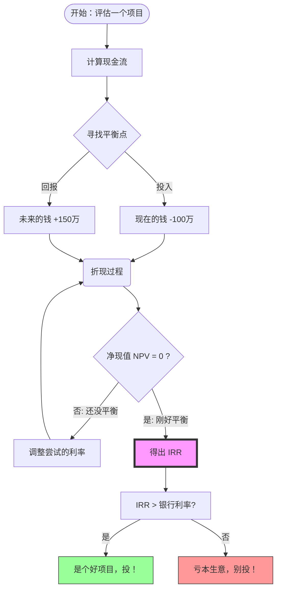
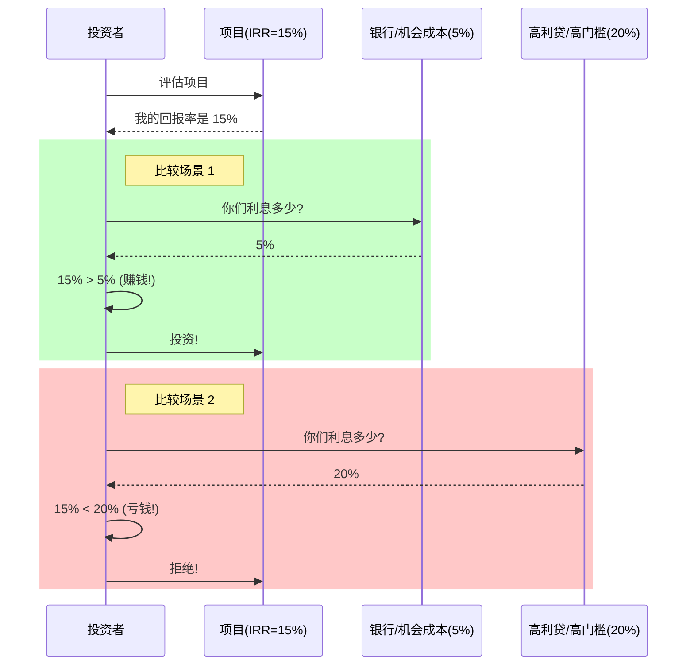

---
aliases:
  - IRR
  - 内涵回报率
  - 内部利率
---
你好！欢迎来到我的课堂。我是你的老师，今天我们要解开金融界一个非常迷人，同时也非常“狡猾”的概念——**内涵回报率 (Internal Rate of Return，简称 IRR)**。

不用被这个高大上的名字吓到。想象一下，你不是在学金融，而是在**鉴定一台“印钞机”的性能**。

---

### 🎓 第一部分：IRR 到底是什么？（直观理解）

#### 1. “神奇存钱罐”的比喻
想象你有一个神奇的存钱罐（或是投资项目）：
*   **今天**，你必须往里投入 **100元**（这是成本）。
*   **明年**，它吐出来 **10元**。
*   **后年**，它吐出来 **20元**。
*   **大后年**，它吐出来 **110元**。

这时候，如果你问：“老师，这个存钱罐的**收益率**到底是多少？”

因为钱是分批回来的，时间点不同，你不能简单地把钱加起来除以成本。这时候，**IRR 就是那个能够代表这个项目“真实赚钱速度”的百分比。**

#### 2. 通俗定义
**IRR 就是项目自带的“内部利率”。**
它告诉你：如果你把这笔钱投在这个项目里，这就**等同于**你把钱存在一个年利率为 **IRR** 的银行账户里，复利滚动。

*   **IRR 越高**，说明这台“印钞机”马力越足，赚钱越快。
*   **IRR 越低**，说明动力不足，甚至可能亏钱。

---

### 🧠 第二部分：深入骨髓——为什么要这么算？

要真正懂 IRR，我们必须引入一个概念：**时间就是金钱（货币的时间价值）**。

#### 1. 钱是会缩水的
今天的100元，比明年的100元值钱。因为今天的100元存银行（假设利率5%），明年就变成105元了。
反过来说，明年的105元，折算回今天（**折现**），只值100元。

#### 2. 寻找平衡点
IRR 的数学本质，是在玩一个“天平游戏”。

*   **左边**：是你现在的投入（流出的钱）。
*   **右边**：是未来的回报（流入的钱），但这些回报必须**打折**（折现）算回今天的价值。

**IRR 就是那个神奇的“打折率”，它能让 [未来回报的折现值] 刚好等于 [现在的投入]。**

用专业术语说：**IRR 是使净现值  (NPV) 等于零时的折现率。**

---

### 📊 第三部分：如何使用 IRR 做决策？

计算出 IRR 只是第一步，关键是**怎么用**。你需要一把尺子来衡量它，这把尺子通常是你的**资金成本**（比如银行贷款利息，或者你预期的最低收益率）。

#### 场景模拟：开一家奶茶店
*   **投入**：10万。
*   **算出 IRR**：15%。

**决策过程：**

1.  **情况 A：你的钱是借来的，利息 5%。**
    *   IRR (15%) > 成本 (5%)。
    *   **结论**：**投！** 这生意能覆盖利息，还有得赚。

2.  **情况 B：你的钱是借高利贷的，利息 20%。**
    *   IRR (15%) < 成本 (20%)。
    *   **结论**：**撤！** 赚的钱还不够还利息，越做越亏。

---

### ⚠️ 第四部分：老师的特别提醒（IRR 的陷阱）

虽然 IRR 很好用，但它有两个巨大的**缺陷**，很多新手容易被忽悠：

1.  **规模陷阱（小而美 vs 大而稳）**
    *   项目A：投1元，赚2元。IRR = 100%。
    *   项目B：投100万，赚120万。IRR = 20%。
    *   虽然A的IRR极高，但只能赚1块钱。B虽然IRR低，但能赚20万。**IRR 只看效率，不看规模。**

2.  **再投资假设（最大的谎言）**
    *   IRR 假设你赚到的每一分钱，都能**以同样的 IRR 收益率**再次投出去。
    *   比如你的奶茶店 IRR 是 50%，第一年赚了1万。IRR 算法默认你这1万块还能马上找到一个 50% 收益率的地方投进去。这在现实中很难，通常钱闲置了或者存银行了，收益率就拉低了。

---

### 📚 第五部分：知识拓展与进阶学习路径

听完了今天的课，如果你想成为投资高手，请按以下路径继续修炼：

**1. 基础夯实（幼儿园级）：**
*   **货币时间价值 (TVM)**：深入理解为什么“今天的钱 > 明天的钱”。
*   **复利 (Compound Interest)**：世界第八大奇迹，IRR 的数学基石。

**2. 核心关联（小学级）：**
*   **净现值 (NPV)**：**非常重要！** 它是 IRR 的好兄弟。通常也是更靠谱的决策指标。IRR 告诉你百分比，NPV 告诉你具体赚多少钱。
*   **投资回收期 (Payback Period)**：不看利息，只看几年能回本。简单粗暴。

**3. 进阶修正（中学级）：**
*   **MIRR (修正的内涵回报率)**：解决了上面提到的“再投资假设”陷阱，比 IRR 更诚实。
*   **WACC (加权平均资本成本)**：就是上面用来和 IRR 做比较的那个“及格线”是怎么算出来的。

**4. 大师视角（大学级）：**
*   **XIRR**：现实中资金进出是不定期的，Excel 中的 XIRR 函数专门处理非定期现金流。

---
**老师寄语：**
IRR 就像汽车的仪表盘，它告诉你速度（收益率）有多快，但不能只看这一个表，还得看油箱（现金流）、路况（市场环境）。希望你不仅能算出 IRR，更能看透它背后的逻辑！