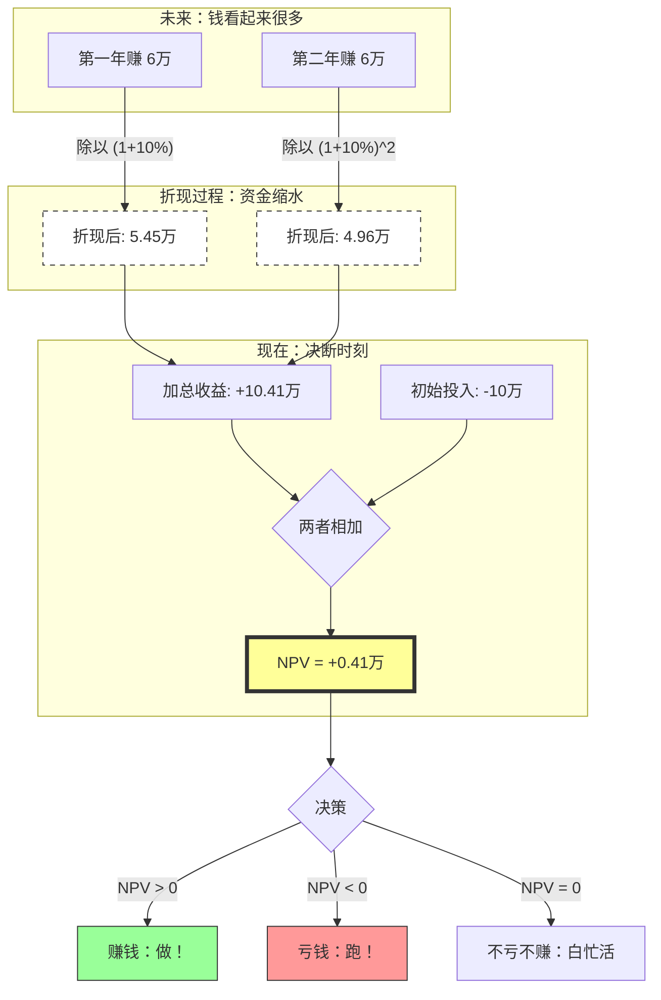

---
aliases:
  - NPV
  - 净现值
---
你好！很高兴看到你继续深究。刚才我们讲了 **IRR（内部收益率）**，它是衡量赚钱的“速度”或“效率”；那么现在的 **NPV（净现值）**，就是衡量你到底赚了多少“真金白银”的**绝对值**。

如果说 IRR 是告诉你这款理财产品的“利息”高不高，那 NPV 就是直接告诉你：**做完这个生意，你口袋里到底是多了钱，还是少了钱。**

### 1. 什么是净现值（NPV）？

**NPV (Net Present Value)**，中文叫**净现值**。
要把这个词拆开理解：
*   **净 (Net)**：扣除成本后的净利。
*   **现 (Present)**：现在的价值。
*   **值 (Value)**：金额。

**一句话定义：**
NPV 就是把未来赚到的每一分钱，按照一个合理的“折现率”，换算成**今天的钱**，然后再减去你**今天投入的成本**。

#### 为什么不能直接加减？（核心概念：时间价值）
想象一下：
*   方案A：今天给你 100 万。
*   方案B：10 年后给你 100 万。

虽然数字一样，但你肯定选 A。因为今天的 100 万可以存银行生利息，10年后可能变成 150 万。反过来说，**未来的 100 万，根本不如今天的 100 万值钱**。这叫“钱缩水了”。

NPV 的作用，就是**把未来的钱“缩水”还原到今天**，看看它到底值多少，再跟成本比。

---

### 2. 生动案例：奶茶店投资

假设你要开一家奶茶店：
1.  **现在投入**：10 万元（这是成本，发生在今天）。
2.  **第一年赚**：6 万元。
3.  **第二年赚**：6 万元。
4.  **你的心理预期（折现率）**：10%（比如你不理财也能有10%收益，或者通胀率等）。

**普通人的账本（不看 NPV）：**
$-10 + 6 + 6 = +2$ 万。
结论：赚了 2 万！好像不错？

**金融人的账本（看 NPV）：**
我们要把未来的钱“翻译”成今天的价值。
*   **第一年的 6 万**：要除以 $1.1$（打个折）。
    $6 \div 1.1 \approx 5.45$ 万。
    *(意味着明年的6万，只相当于今天的5.45万)*
*   **第二年的 6 万**：要除以 $1.1$ 的平方（打两次折，因为过了两年）。
    $6 \div 1.21 \approx 4.96$ 万。
    *(后年的6万，只相当于今天的4.96万)*

**计算 NPV：**
$5.45 + 4.96 - 10 = \mathbf{0.41}$ **万**。

**结论：** 虽然账面赚了 2 万，但算上时间价值，你其实只赚了 **4100 块钱**的“真金白银”。如果 NPV 是负数，说明你还不如把钱扔银行里躺平。

---

### 3. 图像化理解：时光穿梭机

我们用 Mermaid 画一张“资金时光机”的图，帮你理解资金是如何穿越回现在的。

### 4. NPV 的决策法则（照妖镜）

NPV 就像一面照妖镜，照出项目的原形：

1.  **NPV > 0（正数）**：
    *   **含义**：这笔投资不仅跑赢了通胀/利息，还额外赚了钱。
    *   **动作**：**投！** (这是股东财富的增加)。
2.  **NPV < 0（负数）**：
    *   **含义**：虽然账面可能盈利，但因为回款太慢或太少，实际上亏了本（不如存银行）。
    *   **动作**：**拒！** (这是在毁灭财富)。
3.  **NPV = 0**：
    *   **含义**：刚好回本，刚好达到你的预期回报率（此时的折现率其实就是我们上一节课讲的 IRR）。
    *   **动作**：**纠结一下**（通常不投，除非为了战略目的）。

---

### 5. NPV 和 IRR 的关系（重点）

这两个是死对头，也是好基友。

*   **NPV（净现值）** 告诉你**赚了多少钱**（绝对值）。
    *   *比如：赚了 500 块。*
*   **IRR（内部收益率）** 告诉你**赚得有多快**（百分比）。
    *   *比如：年化回报 15%。*

**老师的建议：**
一般情况下，**以 NPV 为准**。
为什么？
因为假设有两个项目：
*   **小项目A**：投100块，赚50块。IRR = 50%（效率高，但赚得少）。
*   **大项目B**：投100万，赚20万。IRR = 20%（效率低，但赚得多）。
如果你想发财，你会选 B（NPV更高），虽然 A 的 IRR 看起来很美。

---

### 6. 拓展学习：由浅入深

恭喜你掌握了 NPV！这是金融估值体系中最核心的基石。接下来的学习路线如下：

1.  **折现率（Discount Rate）的选择**：
    *   *关键问题*：刚才例子里的 10% 是怎么定的？
    *   *深造*：学习如何确定折现率（通常使用 WACC 加权平均资本成本）。折现率定得太高，NPV 就会变低。
2.  **敏感性分析（Sensitivity Analysis）**：
    *   *实战*：如果明年没赚到 6 万，只赚了 4 万怎么办？NPV 会怎么变？这能帮你评估风险。
3.  **DCF 模型（现金流折现模型）**：
    *   *终极应用*：巴菲特怎么给股票估值？就是预测这家公司未来所有的现金流，算出 NPV。这就是股票的“内在价值”。
4.  **机会成本（Opportunity Cost）**：
    *   *经济学思维*：投入这 10 万，意味着你放弃了其他的投资机会。NPV 的本质就是在和机会成本做比较。

现在的你，已经可以用 NPV 的思维去审视身边的任何投资了（包括买房、买保险，甚至考证学习——因为时间也是成本哦！）。还有什么疑问吗？