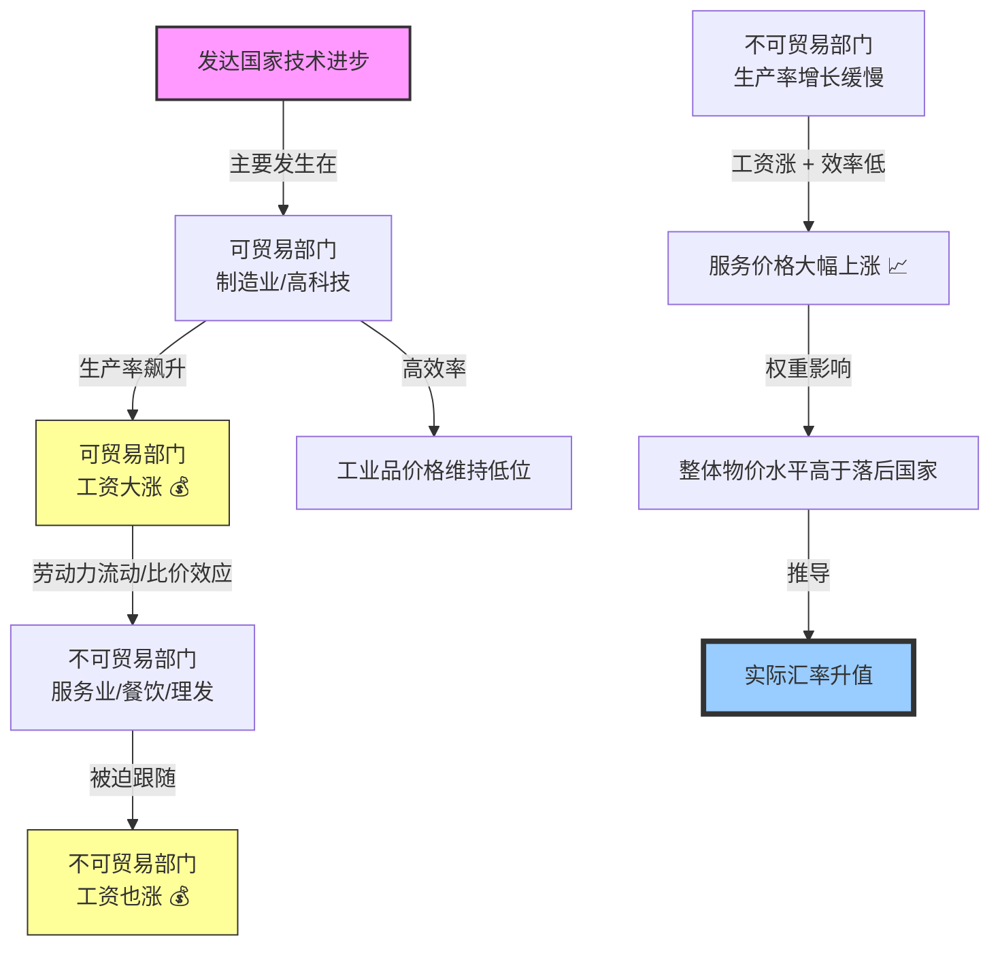

---
aliases:
  - 巴拉萨-萨缪尔森效应
  - 萨缪尔森效应
---
你好！我是你的经济学老师。今天我们要解开一个大家出国旅游时常有的疑惑：

**“为什么明明是一样的理发技术，在纽约剪头发要 50 美元，而在东南亚只要 5 美元？但由于全球贸易，两地的 iPhone 价格却差不多？”**

这背后的原理，就是大名鼎鼎的——**巴拉萨-萨缪尔森效应 (Balassa-Samuelson Effect)**。

---

### 1. 费曼学习法：通俗理解核心逻辑

想象一个国家只有两个部门：
1.  **高科技工厂（可贸易部门）：** 生产汽车、芯片。
2.  **理发店（不可贸易部门）：** 提供剪发服务。

#### 故事开始：
**第一步：技术大爆炸** 🚀
发达国家（比如美国）的**高科技工厂**引入了机器人，生产效率极高。以前一天造1辆车，现在一天造10辆。
*   **结果：** 因为效率高，工厂老板赚得多，于是给工人们**涨了高工资**。

**第二步：羡慕嫉妒恨** 😤
**理发店**的理发师Tony老师看到隔壁工厂老王工资涨了，心里不平衡：“如果我不涨工资，我就辞职去工厂拧螺丝了！”
*   **结果：** 为了留住理发师，理发店老板被迫也给Tony老师**涨了工资**。

**第三步：关键的“剪刀差”** ✂️
虽然Tony老师工资涨了，**但他剪头发的速度并没有变快**（因为剪头发是手艺活，机器很难替代，效率提升极慢）。
*   **结果：** Tony老师工资高了，效率没变，理发店老板为了不亏本，只能**大幅提高剪头发的价格**。

#### 故事结局：
在发达国家，虽然工业品（可贸易）很便宜（效率高），但服务业（不可贸易）**超级贵**。这导致了整个国家的**物价水平（CPI）** 比发展中国家高，进而导致货币的**实际汇率升值**。

---

### 2. 图解逻辑：Mermaid 流程图

我们用一张图来理清这个连锁反应：

---

### 3. 多角度解析

为了让你彻底明白，我们拆解几个关键概念：

#### 🔍 什么是“可贸易”与“不可贸易”？
*   **可贸易品 (Tradable Goods)：** 比如 iPhone、汽车、石油。因为可以在全球买卖，受**一价定律**约束，纽约和上海的 iPhone 价格折算汇率后相差不大（不考虑税）。
*   **不可贸易品 (Non-tradable Goods)：** 比如理发、看病、餐馆服务、保姆。你不可能为了便宜理发专门飞去越南，也没法把越南的理发服务“进口”到美国。所以这类价格由**本地供需和工资水平**决定。

#### 💡 核心矛盾是什么？
是**工资的统一性** vs **生产率的不平衡**。
*   一个国家内部，不同行业的工资倾向于拉平（不然低薪行业招不到人）。
*   但是，不同行业的生产率增速差异巨大（造车越来越快，剪头永远那么慢）。
*   **这种错配，导致了富国的服务业必然昂贵。**

---

### 4. 举例说明：生活中的经济学

#### 场景一：星巴克拿铁指数
*   **咖啡豆（可贸易）：** 无论在美国还是中国，咖啡豆的采购成本是接近的（全球定价）。
*   **咖啡师的服务（不可贸易）：**
    *   **美国：** 因为美国IT、金融行业工资极高，星巴克必须付给咖啡师 15-20 美元时薪才能招到人。一杯拿铁可能卖 5-6 美元。
    *   **发展中国家：** 制造业工资较低，星巴克付给咖啡师 3-4 美元时薪就有人排队做。一杯拿铁可能只卖 3-4 美元。
*   **结论：** 同样一杯咖啡，因为**包含服务成本**，富国比穷国贵。

#### 场景二：中国几十年的变化
回想一下 20 年前的中国：
*   那时中国制造业刚起步，工资低，理发只要 5 块钱，保姆也很便宜。
*   **现在：** 中国制造业（华为、比亚迪等）生产率大增，工人工资涨了。
*   **影响：** 于是，现在的快递小哥、外卖员、理发师的工资也必须水涨船高。虽然理发技术没本质突破，但现在理发要 30-50 块甚至更贵。这就是**中国版的巴拉萨-萨缪尔森效应**。

---

### 5. 拓展学习：由浅入深

学习了这个效应，你可以进一步探索以下知识点：

1.  **购买力平价 (PPP, Purchasing Power Parity)：**
    *   由于 B-S 效应，用市场汇率计算 GDP 往往会低估发展中国家的经济规模。
    *   **拓展：** 为什么世界银行在比较各国生活水平时，更喜欢用 PPP 而不是汇率？（因为 PPP 修正了不可贸易品的价格差异）。

2.  **巨无霸指数 (Big Mac Index)：**
    *   《经济学人》杂志推出的趣味指数。虽然巨无霸是标准品，但因为它包含了店租、人工（不可贸易部分），所以它能很好地反映 B-S 效应。

3.  **鲍莫尔病 (Baumol's Cost Disease)：**
    *   这是一个非常相似的概念。指由于某些行业（如艺术表演、教育、医疗）生产率无法提高，但工资必须随着其他行业上涨，导致这些服务的成本越来越高。
    *   **思考：** 为什么大学学费和医疗费用的涨幅总是超过通货膨胀？

4.  **实际汇率与名义汇率：**
    *   如果一个国家经济增长快（生产率提升快），它的**实际汇率**通常会升值。这意味着，哪怕名义汇率（银行牌价）不变，该国的物价相对于外国也会变贵。

---

### 6. 课后测验：确认理解 💪

如果不做题，知识就不是你的。请尝试回答以下两个问题：

#### 题目 1：
假设 A 国是一个快速发展的新兴国家，B 国是一个停滞不前的富国。
A 国的制造业生产率每年增长 10%，服务业生产率增长 1%。
B 国的制造业和服务业生产率增长都为 0%。
**请问：长期来看，A 国相对于 B 国的物价水平（CPI）会如何变化？A 国货币的实际汇率会倾向于升值还是贬值？**

点击查看答案解析

**答案：** A 国物价水平会相对上涨，实际汇率倾向于升值。
**解析：**
1. A 国制造业效率暴涨 -> 制造业工资暴涨。
2. 为了留人，A 国服务业工资也被迫暴涨。
3. 但 A 国服务业效率没咋涨 -> 服务业价格飙升。
4. 这推高了 A 国的整体物价。相对于停滞的 B 国，A 国变“贵”了，这在经济学上表现为实际汇率升值。

#### 题目 2：
根据巴拉萨-萨缪尔森效应，如果我在比较“人均 GDP”来衡量老百姓的真实生活幸福感（能买多少东西）时，直接使用**市场汇率**换算，通常会**高估**还是**低估**发展中国家（穷国）的老百姓生活水平？

点击查看答案解析

**答案：** 低估。
**解析：**
1. 发展中国家的服务业（理发、吃饭、房租）价格因为 B-S 效应，比发达国家便宜很多。
2. 100 美元在纽约可能只够吃一顿饭，但在越南可以吃一周。
3. 市场汇率忽略了这种价格差异。因此，直接用汇率算的 GDP 会让穷国看起来比实际上更穷。使用 PPP（购买力平价）调整后，发展中国家的 GDP 数值通常会变大。

---
希望这个讲解能让你彻底搞懂“为什么发达国家物价死贵”这个经济学常识！还有哪里不清楚吗？