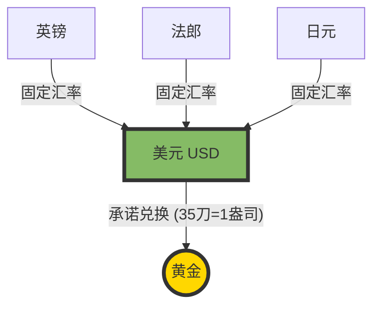

---
aliases:
  - Bretton Woods System
---
上一节课我们讲了“金本位”，大家知道它是货币界的“老皇历”了。今天，我们要讲的是它的**升级版**，也是确立美元霸权地位的关键战役——**布雷顿森林体系 (Bretton Woods System)**。

如果说“金本位”是大家都听黄金的，那么“布雷顿森林体系”就是：**大家都听美元的，而美元听黄金的。**

1971 年之后

---

### 1. 什么是“布雷顿森林体系”？（核心概念）

**背景故事**：
1944年7月，二战即将结束。44个国家的代表聚在美国新罕布什尔州一个叫“布雷顿森林”的度假酒店里，开了一个神仙会。目的是讨论：**战后的世界怎么做生意？钱该怎么算？**

当时美国是世界首富，手里握着全球 **75%** 的黄金。于是，美国代表拍着桌子说：“别搞以前那种乱七八糟的了，以后全听我的！”

**核心规则（双挂钩原则）**：
这个体系建立了两个“挂钩”，构成了战后世界经济的骨架：

1.  **美元挂钩黄金**：美国政府承诺，**35 美元 = 1 盎司黄金**。这就是为什么美金被称为“美金”。
2.  **各国货币挂钩美元**：其他国家的货币（英镑、法郎、马克等）都要死死盯着美元，保持固定汇率。

#### 核心机制图解

---

### 2. 生动形象的例子：赌场的筹码

想象一下，世界就是一个**大赌场**。

*   **黄金**：是真金白银的现金。
*   **美元**：是赌场发行的**“超级筹码”**。
*   **其他货币**：是玩家手里的小票。

**布雷顿森林体系的规则是**：
赌场老板（美国）说：“各位玩家，带着黄金太沉了，不方便。这样吧，你们把黄金给我，我给你们发‘超级筹码’（美元）。你们拿着筹码在赌场里随便玩（国际贸易）。无论什么时候，你们拿着筹码来前台，我保证按 **35 个筹码换 1 块金砖** 的比例把黄金退给你！”

**结果**：
全世界都信了。大家发现美元确实好用，信誉好，还能换金子。于是，美元成了世界的“硬通货”。

---

### 3. 体系下的“双子星”：IMF 和世界银行

这次会议不仅定了美元的地位，还生了两个“孩子”，至今还在影响世界：

1.  **国际货币基金组织 (IMF)**：
    *   **角色**：急救医生。
    *   **作用**：如果哪个国家做生意亏惨了，没钱还债，IMF 就借钱给它救急，防止它破产引发连锁反应。
2.  **世界银行 (World Bank)**：
    *   **角色**：扶贫包工头。
    *   **作用**：借钱给战后国家修桥铺路，恢复经济（比如一开始是为了复兴欧洲，后来主要帮助发展中国家）。

---

### 4. 致命缺陷：特里芬难题 (The Triffin Dilemma)

听起来很完美对吧？但这个体系有一个**逻辑上的绝症**，由经济学家特里芬提出。

**逻辑死结**：
*   **为了支持全球贸易** $\rightarrow$ 美国必须让全世界手里都有美元（大家才能用美元买东西） $\rightarrow$ 美国必须一直买外国货，甚至借债，把美元撒出去（**美国得保持贸易逆差**）。
*   **为了保持美元信誉** $\rightarrow$ 美国手里必须有足够的黄金来支撑这些美元 $\rightarrow$ 美国不能乱撒钱，必须由顺差赚回美元（**美国得保持贸易顺差**）。

**矛盾点**：美国**既要撒钱（提供流动性），又要省钱（保持含金量）**。这就像那个赌场老板，发出去的筹码越来越多，但金库里的金子却没变多。大家开始慌了：“你的金子够赔吗？”

---

### 5. 崩塌：尼克松冲击 (1971)

到了 20 世纪 60 年代，美国打了**越南战争**，花钱如流水，印了大量美元。
此时，法国总统戴高乐很聪明，他觉得美国要赖账，于是派军舰把法国手里的美元运到美国，要求：“**别废话，给我换成黄金！**”

其他国家一看，也跟着去换。美国的黄金储备急剧减少。

**结局**：
1971 年 8 月 15 日，美国总统尼克松发表电视讲话，实际上就是一句话：“**不换了！**”
美国单方面宣布：**美元与黄金脱钩**。

至此，布雷顿森林体系瓦解。世界进入了**浮动汇率**和**纯信用货币**时代（就是我们要多少印多少，不再看黄金脸色）。

---

### 6. 拓展学习：由浅入深

*   **浅层拓展**：
    *   **牙买加体系**：布雷顿森林体系倒台后，现在的世界货币体系叫什么？（现在的体系叫牙买加体系，特点是黄金非货币化，汇率自由浮动）。
    *   **凯恩斯的“班科”(Bancor)**：在 1944 年会议上，英国代表凯恩斯其实提出了一个更公平的方案——一种超主权货币“班科”，不让任何一国货币独大。可惜当时英国没钱，没人听他的。但这被认为是未来货币的理想形态。

*   **深层拓展**：
    *   **石油美元 (Petrodollar)**：美元脱钩黄金后，为什么还能当霸主？因为美国找到了新的锚——**石油**。70年代美国和沙特达成协议：想买石油？必须用美元！这给美元续了命。
    *   **特别提款权 (SDR)**：这是 IMF 发明的一种“人造资产”，被称为“纸黄金”，试图解决特里芬难题，作为美元的补充储备资产。

---

### 7. 课后测验：确认理解

**题目 1：**
在布雷顿森林体系下，如果德国马克想要兑换成黄金，通常的流程是什么？
A. 德国央行直接找金矿购买
B. 德国马克直接按固定汇率兑换黄金
C. 德国马克先按固定汇率兑换成美元，再向美国兑换黄金
D. 无法兑换，黄金被禁止流通

**题目 2：**
导致布雷顿森林体系崩溃的根本原因（特里芬难题）是指什么矛盾？
A. 美国黄金太多与世界黄金太少之间的矛盾
B. 美元作为国际货币，“提供流动性”与“保持币值稳定”之间的矛盾
C. 美国与苏联冷战的矛盾
D. 银行家与政治家之间的矛盾

---

### 答案解析

**题目 1 答案：C**
*   **解析**：这就是“双挂钩”。其他货币挂钩美元，只有美元直接挂钩黄金。所以德国马克必须先换成美元这个“中间人”。

**题目 2 答案：B**
*   **解析**：这就是那个“死结”。要当世界货币，就得往外撒钱（逆差）；要维持对黄金的信誉，就得收紧钱（顺差）。这两个目标无法同时实现，最终导致体系崩溃。

现在你对战后世界经济秩序的建立和崩塌是不是有清晰的画面了？下一步，我们可以聊聊**“石油美元”**或者**“通货膨胀”**，你想听哪个？