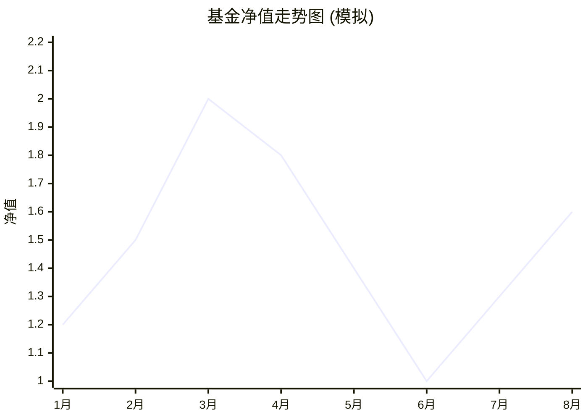

你好！我是你的投资理财课代表。今天我们不背枯燥的定义，我带你去爬一座山，你就懂什么是**“最大回撤率”**了。🎓

---

### 1. 费曼学习法：三句话讲透核心

想象你在爬山（投资基金），山路起起伏伏。
ID: 1774612229047

1.  **最倒霉的情况**：假设你在**山顶**（净值最高点）因为太激动冲进场买入，结果第二天开始跌了。
2.  **最惨痛的结局**：你一直拿不住，直到跌到了之后的**谷底**（最低点），你崩溃割肉卖出了。
3.  **亏了多少**：这个**从“最高点”跌到“最低点”的幅度百分比**，就是这段时间的最大回撤率。

**一句话总结**：**最大回撤率，就是如果你运气最差，买在最高点、卖在最低点，最多会亏多少钱。**

---

### 2. 图解：一眼看懂“过山车” 📉

为了让你更直观地理解，我画了一张基金走势图。请看下面的图表：
ID: 1774612229050

**图解分析**：
*   **A点（山顶）**：看**3月**，净值达到了最高点 **2.0**。这时候大家都很嗨，你进场了。
*   **B点（谷底）**：看**6月**，净值跌到了 **1.0**。这时候你绝望了，卖出了。
*   **计算**：
    *   跌掉的金额 = $2.0 - 1.0 = 1.0$
    *   最大回撤率 = $\frac{1.0}{2.0} \times 100\% = 50\%$

> ⚠️ **注意**：最大回撤一定是**先有高点，再有低点**。如果你在1月买（1.2），2月卖（1.5），那是赚钱，不叫回撤。回撤专门用来衡量**“下跌的风险”**。

---

### 3. 生动场景与举例：这东西有啥用？🤔

最大回撤率是衡量基金经理**“抗揍能力”**和**“你的心脏承受能力”**的关键指标。
ID: 1774612229054

#### 场景一：不仅看赚多少，还要看吓不吓人
*   **基金 A**：一年赚了 30%，最大回撤 5%。
    *   *体验*：稳稳的幸福，每天睡得香，像坐高铁。
*   **基金 B**：一年赚了 30%，最大回撤 40%。
    *   *体验*：虽然结局也是赚30%，但中间有几个月你的资产缩水了快一半！你会吓得失眠、甚至在底部割肉离场。这像坐过山车，很多人还没到终点就吐了。
ID: 1774612229057

**结论**：收益率一样的情况下，**最大回撤越小越好！**

#### 场景二：深坑难爬（数学陷阱）
这是一个非常残酷的数学题，请务必记住：
*   亏了 **10%**，需要涨 **11%** 才能回本。
*   亏了 **20%**，需要涨 **25%** 才能回本。
*   亏了 **50%**（如上面的例子），需要涨 **100%** 才能回本！
ID: 1774612229061

**应用**：当你看到一只基金的最大回撤经常超过 30% 甚至 40%，你要问自己：*“我有耐心等它翻倍涨回来吗？”* 如果没有，请远离。

---

### 4. 知识拓展：由浅入深 📚

学会了最大回撤，我们可以接着了解这些“进阶装备”：
ID: 1774612229064

1.  **夏普比率 (Sharpe Ratio)**：
    *   *通俗解释*：性价比。不仅看赚多少，还看冒了多大风险。夏普比率越高，代表基金经理用“更小的回撤/波动”换来了“更高的收益”。
2.  **卡玛比率 (Calmar Ratio)**：
    *   *公式*：年化收益率 ÷ 最大回撤。
    *   *通俗解释*：这个指标专门治“最大回撤”。如果数值大于2，说明这只基金性价比很不错（每冒1份风险，能赚2份收益）。
3.  **修复天数**：
    *   *通俗解释*：跌坑里了，花了多少天才爬回原来的高度？有些基金跌得深但弹得快（弹性好），有些基金跌下去三年都爬不起来（这种要避坑）。

---

### 5. 随堂小测验：确认你真的懂了吗？📝

请尝试回答以下两道题，答案在下方（建议先自己想）：
ID: 1774612229068

#### 题目 1：计算题
某只基金的历史走势如下：
*   第一天净值：1.0
*   第二天净值：1.5 （创出新高）
*   第三天净值：1.2
*   第四天净值：0.9
*   第五天净值：1.1
ID: 1774612229072

请问这段时间，这只基金的**最大回撤率**是多少？

#### 题目 2：理解题
小明想买基金存结婚用的钱（要在1年后用），他看上了两只基金：
*   **基金X**：过去3年平均年化收益 20%，最大回撤 45%。
*   **基金Y**：过去3年平均年化收益 10%，最大回撤 5%。
ID: 1774612229076

作为老师，你会建议小明买哪一只？为什么？

---

### ⬇️ 答案解析

#### 题目 1 解析：
*   **最高点**：第二天净值 **1.5**。
*   **最高点后的最低点**：第四天净值 **0.9**。
*   **计算**：$(1.5 - 0.9) \div 1.5 = 0.6 \div 1.5 = 0.4$。
*   **答案**：最大回撤率是 **40%**。
ID: 1774612229080

#### 题目 2 解析：
*   **建议买 基金Y**。
*   **原因**：虽然基金X赚钱多，但它的最大回撤高达45%。小明的钱是**短期刚需**（1年后就要结婚），如果买了X，万一运气不好碰上那45%的大跌，10万块本金变成5万5，婚可能就结不成了！
*   **核心逻辑**：**钱的用途和期限，必须匹配基金的风险（最大回撤）。**
ID: 1774612229083

这一课讲完了，现在你对“最大回撤”是不是更有感觉了？⛰️