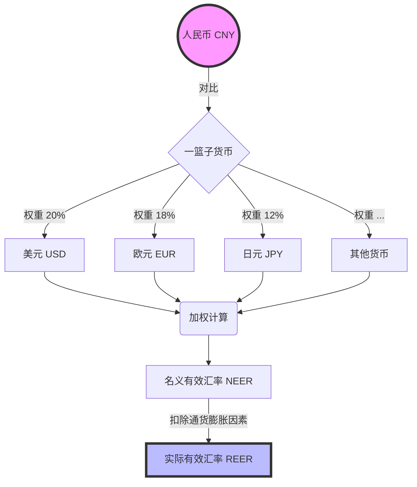

---
aliases:
  - 双边汇率
  - 有效汇率
  - REER
---

### 🎓 第一部分：什么是有效汇率？（费曼讲解版）

#### 1. 直观理解：从“单挑”到“群架”

想象一下，你是一个格斗选手（代表**人民币**）。

*   **双边汇率（Bilateral Exchange Rate）：**
    你今天跟泰森（**美元**）打了一架，你赢了。但这能说明你已经是“世界最强”了吗？不一定，可能你只是刚好克制泰森，但你打不过李小龙（**欧元**）或者成龙（**日元**）。
    *   *这就是平时我们看到的汇率：人民币对美元汇率。它只代表两个国家货币的相对价格。*

*   **有效汇率（Effective Exchange Rate）：**
    为了评价你的**真实综合实力**，裁判安排你跟一群人打（美元、欧元、日元、英镑...）。但是，这些对手的分量不一样。泰森（美元）很重要，占比重很大；只有5岁的小朋友（某个小国货币）占比重很小。
    我们会根据对手的重要性（通常是**贸易量**）给他们分配权重，最后算出一个**加权平均分**。
    *   *这就是有效汇率：一种货币相对于“一篮子”其他货币的加权平均汇率。它反映的是在这个地球村里，你的货币总体的强弱。*

#### 2. 核心公式逻辑（非数学版）

$$ \text{有效汇率} = \text{人民币对美元} \times (\text{美元权重}) + \text{人民币对欧元} \times (\text{欧元权重}) + ... $$

*   **权重怎么定？** 看跟谁做生意多。中国跟美国、欧盟贸易量大，那美元、欧元的权重就高；跟某个偏远小岛国贸易少，权重就几乎为零。

---

### 📊 第二部分：图解有效汇率

为了更清晰地展示这个“一篮子”概念，请看下面的图表：

---

### 🧐 第三部分：名义 vs. 实际（关键区别！）

很多时候新闻里说“有效汇率”，其实有两个版本，这个区别非常重要，就像**税前工资**和**购买力**的区别。

1.  **名义有效汇率 (NEER - Nominal EER)：**
    *   这就是纯粹看牌面上的汇率数字算出来的平均值。
    *   *比喻：* 你的工资数字涨了。

2.  **实际有效汇率 (REER - Real EER) —— 这个更重要！**
    *   它在NEER的基础上，剔除了**通货膨胀（物价）**的影响。它反映了你的货币真正的**外部购买力**和**出口竞争力**。
    *   *比喻：* 你的工资涨了，但是物价涨得更凶，实际上你的日子反而过得紧巴巴了。

> **老师划重点：**
> *   **REER 上升（升值）：** 说明本国商品在国际市场上变**贵**了，**出口困难**（外国人买你的东西觉得贵），但**进口便宜**（你买外国东西觉得爽）。
> *   **REER 下降（贬值）：** 说明本国商品变**便宜**了，有利于**出口**，但老百姓出国旅游、海淘会觉得钱**不经花**。

---

### 🍎 第四部分：生活中的举例说明

#### 场景一：只看美元会被“骗”
**背景：** 假设人民币对美元汇率没变（1:7不动），但是美元最近表现很差，对欧元、日元都大跌。
*   **现象：** 你看新闻觉得人民币很稳（对美元没变）。
*   **实际有效汇率：** 因为人民币绑定着美元，美元跌了，等于人民币对欧元、日元也变相跌了。所以，人民币的**有效汇率其实是下降的**。
*   **结果：** 你去美国旅游感觉没变，但去欧洲、日本旅游发现东西变贵了！

#### 场景二：做外贸的老王
**背景：** 老王是卖中国制造的玩具到全世界的。
*   **情况：** 中国通胀低，物价稳定；国外通胀高，物价飞涨。
*   **影响：** 即使名义汇率没变，因为国外东西越来越贵，中国东西相对越来越便宜。
*   **结果：** 人民币的**实际有效汇率（REER）下降**。老王的玩具在国际上更有竞争力，订单接到手软。

---

### 📚 第五部分：拓展学习（由浅入深）

当你掌握了有效汇率，可以进一步探索以下领域：

1.  **购买力平价 (PPP)：** 麦当劳巨无霸指数。如果一个巨无霸在中国卖20元，美国卖5美元，那理论汇率应该是1:4。这有助于理解长期的汇率趋势。
2.  **巴拉萨-萨缪尔森效应 (Balassa-Samuelson Effect)：** 为什么经济增长快的国家（如当年的日本、现在的中国），实际汇率往往会升值？
3.  **蒙代尔-弗莱明模型 (Mundell-Fleming Model)：** 在开放经济下，汇率、利率和产出是如何互动的？（进阶宏观经济学）
4.  **BIS指数：** 国际清算银行（BIS）每个月都会发布各国的有效汇率指数，是很多经济学家参考的标准。

---

### ✅ 第六部分：课后小测验（费曼检验）

为了确认你是否真的掌握了，请尝试回答下面两道题：

**题目 1：**
如果人民币对美元升值了5%，但是对欧元、日元、英镑都贬值了10%。假设这些货币在“篮子”里的权重都差不多。那么，人民币的**名义有效汇率**大概率是？
A. 上升
B. 下降
C. 不变

**题目 2：**
对于一个完全依赖**出口**廉价商品来赚钱的国家来说，通常他们希望看到本国货币的**实际有效汇率 (REER)** 发生什么变化？
A. 大幅升值
B. 保持适度贬值或稳定
C. 剧烈波动

---

**思考一下再看答案哦！**

...
...
...

**答案解析：**

1.  **答案 B (下降)。**
    *   **解析：** 虽然打赢了泰森（美元），但输给了其他所有人。因为是加权平均，少数服从多数，整体评分（有效汇率）是下降的。这说明只盯着美元看汇率是不全面的。

2.  **答案 B (保持适度贬值或稳定)。**
    *   **解析：** 实际有效汇率贬值意味着本国商品在国际上相对价格变低，更有竞争力，好卖。如果REER大幅升值，东西卖太贵，外国人就不买了，工厂就要倒闭。

你答对了吗？如果还有疑问，随时举手提问！

---
欢迎回到课堂！我们要深入“厨房”，看看那些宏观经济数据到底是怎么“炒”出来的。

别被公式吓跑，只要你会算**加权平均分**（比如你的期末考试成绩），你就能学会计算有效汇率；只要你会算**超市购物小票**的涨幅，你就能学会计算通货膨胀率。

我们一个一个来拆解。

---

欢迎回到课堂！我们要深入“厨房”，看看那些宏观经济数据到底是怎么“炒”出来的。

别被公式吓跑，只要你会算**加权平均分**（比如你的期末考试成绩），你就能学会计算有效汇率；只要你会算**超市购物小票**的涨幅，你就能学会计算通货膨胀率。

我们一个一个来拆解。

---

### 🧮 第一部分：怎样计算有效汇率 (NEER & REER)

计算有效汇率的核心思想就是：**不仅看跟谁打（汇率），还要看对手分量有多重（权重）。**

#### 1. 名义有效汇率 (NEER) 的计算步骤

想象你在计算**期末总成绩**：
*   数学（很重要，学分高）= 权重高
*   体育（次要，学分低）= 权重低

**计算逻辑：**

1.  **确定“篮子”和“权重” ($w$)：**
    *   通常根据**双边贸易额**（进口+出口）来定。
    *   比如中国总贸易额里，美国占20%，欧盟占15%，日本占10%...
    *   公式：$w_{US} = \frac{\text{中国对美贸易额}}{\text{中国总贸易额}}$

2.  **指数化处理 ($E$)：**
    *   汇率每天都在变，为了方便比较，我们选定某一年（比如2010年）作为**基期**，设为100。
    *   如果现在的汇率比2010年升值了10%，那现在的指数就是110。

3.  **加权平均 (公式)：**
    *   虽然专业机构（如BIS）通常用几何平均数，但为了理解，我们用算术加权平均演示：
  
    $$ \text{NEER} = (E_{\text{美元}} \times w_{\text{美元}}) + (E_{\text{欧元}} \times w_{\text{欧元}}) + ... $$

    > **🌰 举个栗子：**
    > 假设中国只跟A国、B国做生意。
    > *   A国（大客户）：权重 80%，人民币对A国货币指数 110（升值了）。
    > *   B国（小客户）：权重 20%，人民币对B国货币指数 90（贬值了）。
    >
    > $\text{NEER} = (110 \times 0.8) + (90 \times 0.2) = 88 + 18 = 106$
    > **结论：** 总体来看，人民币名义上是升值的。

#### 2. 实际有效汇率 (REER) 的计算步骤

算出了NEER，只是算出了**面子**；要算**里子**（真实购买力/竞争力），必须剔除物价因素。

**公式逻辑：**

$$ \text{REER} = \text{NEER} \times \frac{\text{本国物价指数 (CPI)}}{\text{外国物价指数 (CPI)}} $$

*   **直观理解：**
    *   如果你家（本国）东西涨价（分子变大），你的东西在外国人眼里就变贵了 $\rightarrow$ **REER上升** $\rightarrow$ **出口竞争力下降**。
    *   如果别人家（外国）东西涨价（分母变大），你的东西相对就便宜了 $\rightarrow$ **REER下降** $\rightarrow$ **出口竞争力上升**。
