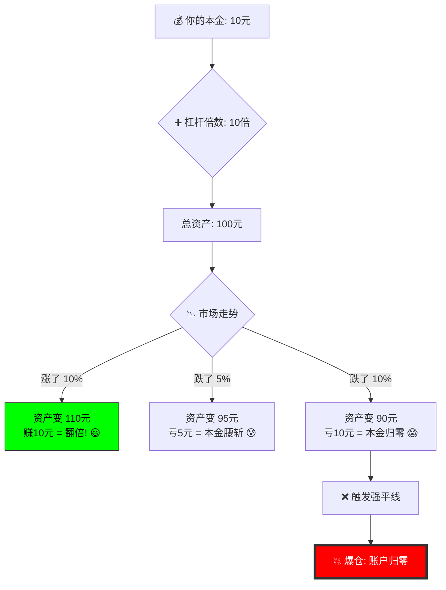

---
aliases:
  - Liquidation
  - 平仓
---
### 金融投资领域（特别是期货、外汇、数字货币）听起来很“惊悚”的词——**爆仓（Liquidation）**。

简单来说，爆仓就是：**借钱炒股/炒币，结果亏得连裤衩都不剩了，被系统强制踢出局。**

为了让你彻底听懂，我们把金融术语抛开，用一个生活中的例子来打比方。


---

### 1. 生动形象的通俗讲解

#### 🚗 例子：借车去比赛
想象一下，你只有 **10万块钱**（这是你的**本金/保证金**），但你想开一辆价值 **100万的法拉利**（这是**加杠杆**）去参加赛车比赛赢奖金。

1.  **租车（开仓）**：车行老板（交易平台）说：“行，你把10万押在我这，剩下的90万车款算我借你的（10倍杠杆），车你开走。”
2.  **规则（维持保证金）**：老板补充了一句：“如果车撞坏了，修车费先扣你的押金。如果修车费快要超过10万了，为了防止我也亏钱，我会立刻把车收回来卖掉！”
3.  **意外（行情波动）**：你开着车上路了，结果不小心蹭到了柱子，车身受损贬值了。
4.  **爆仓（强制平仓）**：
    *   **轻微受损**：修车要花2万。老板一看，你的押金10万还够扣，没事，继续开。
    *   **严重受损**：车撞得有点狠，修车费预估要达9.5万了！老板一看，再撞下去这10万押金就不够赔了，甚至要亏老板自己的钱。
    *   **结果**：老板**瞬间**把车拖走（强制卖出），没收你的押金赔偿损失。**你手里一分钱都没了，车也没了，这就叫“爆仓”。**

---

### 2. 深入剖析：为什么会爆仓？

爆仓的核心原因只有两个字：**杠杆**。

#### 核心逻辑
在没有杠杆的现货交易中（比如你有100块买100块的苹果），只要苹果不烂成灰，你永远拥有一堆苹果，不会爆仓。

但在**杠杆交易**中，你用小钱撬动了大钱。
*   **做多爆仓（买涨）**：你借钱买入，结果价格**大跌**。跌幅吃光了你的本金，平台为了不亏借给你的钱，强制卖出。
*   **做空爆仓（买跌）**：你借货卖出，结果价格**大涨**。涨幅让你买回货物的成本超过了你的承受力，平台强制买入平仓。

---

### 3. 可视化流程图（Mermaid）

我们可以用流程图来看看，从“自信满满”到“血本无归”的过程：



**图解说明：**
你看，虽然市场只是跌了 **10%**（看起来不多），但因为你有 **10倍杠杆**，对于你的本金来说，就是亏损了 **10% × 10 = 100%**。这就是杠杆的放大效应，也是爆仓的数学原理。

---

### 4. 总结与警示

爆仓是高风险交易中最残酷的惩罚机制。它告诉我们一个道理：**在金融市场，活下去比赚大钱更重要。**

*   **对于平台**：爆仓是保护机制，防止客户亏得还不起钱（导致平台坏账）。
*   **对于散户**：爆仓是毁灭打击，意味着你失去了翻本的筹码。

---

### 5. 拓展学习：由浅入深

为了让你不仅懂概念，还能懂操作和避险，请按以下路径拓展学习：

#### 第一阶段：基础概念（弄懂规则）
*   **保证金（Margin）**：你押在平台里的钱。
*   **杠杆（Leverage）**：倍数工具，比如 10x, 50x, 100x。
*   **维持保证金率**：这是“生死线”，当保证金比例低于这个数值（比如0.5%），就会触发爆仓。

#### 第二阶段：进阶机制（了解过程）
*   **追加保证金（Margin Call）**：在快要爆仓前，平台会发通知（打电话/邮件）喊你：“快充钱！不然要强平了！”如果你及时充钱，可以避免爆仓。
*   **穿仓（Negative Balance）**：比爆仓更惨。遇到极端行情（如黑天鹅），价格跳水，系统来不及卖出，导致你不仅本金没了，还倒欠平台钱。
*   **全仓 vs. 逐仓**：
    *   *全仓*：所有鸡蛋在一个篮子里，一个仓位爆了，账户里所有钱一起亏光。
    *   *逐仓*：专门划拨一部分钱亏损，爆仓只亏这一部分，不影响账户里的其他钱。

#### 第三阶段：风险控制（学会生存）
*   **止损（Stop-Loss）**：这是防止爆仓的唯一法宝。在爆仓之前，主动认亏离场。**截断亏损，让利润奔跑。**
*   **凯利公式（Kelly Criterion）**：数学上的资金管理公式，教你每次交易该投入多少比例的资金，才能长期不破产。
*   **风险回报比**：计算每一笔交易值得不值得做。

希望这个讲解能帮你彻底理解“爆仓”！投资有风险，尤其是加杠杆，千万要量力而行！还有什么不懂的，随时问老师！


## 平仓和爆仓一样吗？

### 这是一个非常棒的问题！**平仓和爆仓完全不一样。**

简单直接的回答是：**平仓是“动作”，爆仓是“事故”。**

如果把投资交易比作**开车**：
*   **平仓**：是你主动踩刹车、停车、熄火。无论你是到了目的地（赚钱），还是觉得路况不好想掉头（止损），这都是**你控制**的操作。
*   **爆仓**：是车撞毁了，或者因为没油被交警强制拖走了。这是**被迫**发生的，通常意味着严重的事故和损失。

下面我来详细拆解它们的区别，并通过图表让你一目了然。

---

### 1. 核心区别：谁说了算？

| 比较维度 | **平仓 (Closing a Position)** | **爆仓 (Liquidation)** |
| :--- | :--- | :--- |
| **定义** | 结束当前的交易头寸（把买进的卖出，把卖出的买回）。 | 账户保证金不足，被平台强制结束交易。 |
| **主动权** | **在你手里**（或者是你设置的止损/止盈指令）。 | **在平台/系统手里**（你无法控制）。 |
| **结果** | 可能是**赚了**（止盈），也可能是**亏了**（止损）。 | 几乎总是**巨额亏损**，甚至本金归零。 |
| **心态** | 理性、计划内、从容。 | 恐慌、意外、绝望。 |
| **比喻** | 赌桌上，你觉得不想玩了，拿着筹码（无论剩多少）**起身离开**。 | 赌桌上，你输光了筹码，保安把你**赶出**赌场。 |

---

### 2. 深入理解：它们的关系

其实，**爆仓是平仓的一种极端形式**。
*   “平仓”是一个中性词，只是描述“离场”这个动作。
*   “爆仓”是被动的、强制性的平仓（Forced Liquidation）。

**即使是亏钱，主动平仓也是好事！**
很多新手如果不舍得“主动平仓（止损）”，死扛单子，最后的结果往往就是“被动爆仓”。所以交易员常说：“学会平仓（止损），才能避免爆仓。”

---

### 3. 图像化解析 (Mermaid 流程图)

让我们用一张流程图来看看，一笔交易是如何走向“平仓”或“爆仓”的。

```mermaid
graph TD
    A[开始: 开仓 (买入/做多 或 卖出/做空)] --> B{市场走势如何?}
  
    %% 路径1: 主动平仓
    B -->|走势符合预期| C[赚钱了]
    B -->|走势不符但可控| D[亏点小钱]
    C --> E[**主动平仓** (止盈): 落袋为安]
    D --> E[**主动平仓** (止损): 保住本金]
  
    %% 路径2: 被动爆仓
    B -->|走势严重反向 & 有杠杆| F[亏损巨大, 保证金告急]
    F --> G{是否追加保证金?}
    G -->|是, 补钱| B
    G -->|否, 没钱补| H[**系统强制平仓** (爆仓)]
  
    %% 结果对比
    E --> I[结果: 资金回到账户, 游戏继续]
    H --> J[结果: 本金大部分或全部消失, 游戏结束]

    style E fill:#9f9,stroke:#333,stroke-width:2px
    style H fill:#f96,stroke:#333,stroke-width:4px
```

---

### 4. 总结

*   **平仓 = 下车**。你可以选择在风景好的地方下车（赚钱），也可以在发现走错路时赶紧下车（止损）。
*   **爆仓 = 翻车**。是因为车速太快（杠杆太高）且路况太差（行情剧烈波动），导致车毁人亡。

**高手的境界**：高手非常擅长**平仓**（特别是止损平仓），所以他们几乎从来不会**爆仓**。

---

### 5. 拓展学习：由浅入深

为了让你从“懂概念”变成“会操作”，建议学习以下内容：

1.  **入门知识**：
    *   **止损 (Stop Loss)**：这是平仓的一种，也是防止爆仓的最重要工具。学习如何设置自动止损线。
    *   **止盈 (Take Profit)**：学习在什么位置主动平仓锁定利润，不要让赚钱的单子变成亏钱。

2.  **进阶策略**：
    *   **仓位管理**：为什么说“轻仓”能避免爆仓？学习凯利公式或固定比例投资法。
    *   **追加保证金 (Margin Call)**：当快要爆仓前，系统发出的警告。学习在收到这个警告时该怎么做（是补钱死扛，还是认输离场？）。

3.  **高阶思维**：
    *   **穿仓 (Negative Balance)**：比爆仓更惨的情况。爆仓是归零，穿仓是欠平台钱。了解为什么会出现这种情况（如极端行情下的流动性枯竭）。
    *   **交易心理学**：为什么人类本能不愿意“主动平仓止损”？这是导致爆仓的心理根源（厌恶损失）。

希望这个对比让你彻底明白了平仓和爆仓的区别！如果需要了解具体怎么设置“止损”来防止爆仓，随时问我！

## 只要不加杠杆就不会有爆仓的概念？
答案是肯定的：**在“现货交易”中，只要你不加杠杆（完全用自己的钱买），理论上是不存在“爆仓”这个概念的。**

让我用最通俗的语言和图表，帮你彻底把这个逻辑钉在脑海里。

---

### 1. **核心逻辑：为什么不加杠杆就不会爆仓？**

- **不加杠杆（现货交易）**：
    
    - **性质**：这是“全款买房”。
    - **逻辑**：你花1万元买了价值1万元的股票或比特币。东西完全属于你。
    - **最坏情况**：价格跌到 0.0001 元，你的资产缩水了99.99%，但**那个东西还在你手里**。只要你不主动卖（不割肉），系统没有任何权利没收你的资产。你有无限的时间等待它涨回来。
- **加杠杆（融资/合约交易）**：
    
    - **性质**：这是“按揭买房”甚至“借高利贷炒房”。
    - **逻辑**：你出1万，借了9万，买了10万的东西。这东西名义上是你控制，但实际上抵押给了借钱给你的人（平台）。
    - **最坏情况**：只要跌一点点（比如跌10%），把你的本金（那1万块）亏完了，借钱的人为了保证他的9万块安全，会立刻**强行卖出**你的东西。这就叫爆仓。结果是：**钱没了，东西也没了。**

## 现货
不加杠杆就是现货

