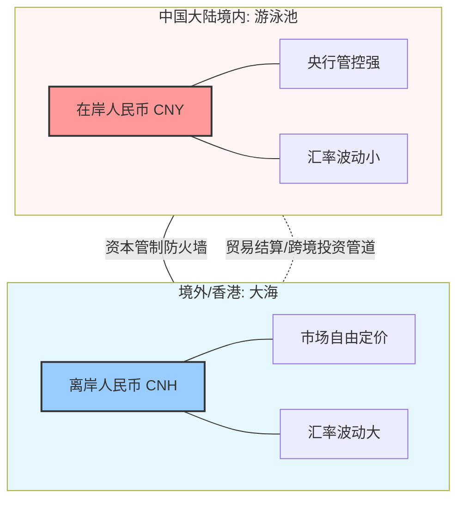
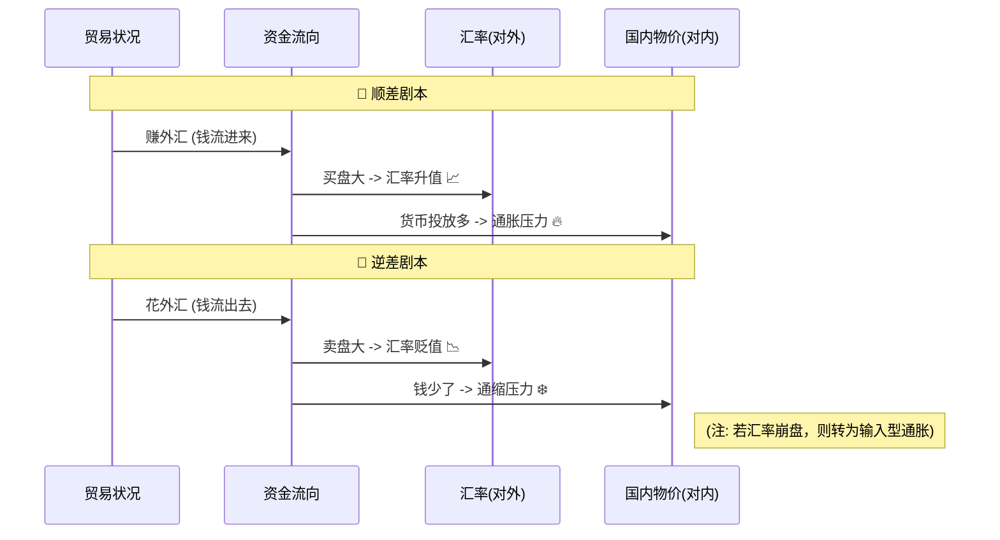

---
aliases:
  - 在岸人民币
  - 离岸人民币
  - CNY
  - CNH
---


刚才我们聊了国家经济的“身体状况”（产业空心化），现在我们来聊聊大家都喜欢的“钱”。

你可能在看财经新闻时，一会儿听到 **CNY**，一会儿听到 **CNH**，搞得晕头转向：**“我就有一张红色的百元大钞，它到底是离岸还是在岸？难道我有两种钱？”**

别急，用**费曼学习法**，我把你当成一个刚准备出国旅游的小白，咱们把这事儿彻底理清楚。

---

### 1. 核心概念：一对“双胞胎”

首先，你要明白：**在岸人民币（CNY全称：Chinese Yuan）** 和 **离岸人民币（CNH(Chinese Yuan Offshore，H最初指香港)），在**物理上**是一模一样的钱。
你钱包里的那张毛爷爷，带到北京花叫CNY，带到香港花或者存在香港银行，它在账面上就变成了CNH。
ID: 1774612228721


它俩的区别在于：**它们“玩耍”的场地不同，遵守的规则也不同。**

我们可以把它们想象成**“游泳池里的水”**和**“大海里的水”**：

#### 🏊 在岸人民币 (CNY) —— 游泳池里的水
*   **地点：** 中国大陆境内。
*   **特点：**
    *   **有人管：** 就像游泳池有救生员和管理员。中国央行（PBOC）会盯着它，不让水位（汇率）忽高忽低，每天有个“指导价”，上下浮动不能太大（目前是2%）。
    *   **有围墙：** 这水不能随便流出去，想换汇（把水舀出去）有额度限制（比如每人每年5万美元）。
*   **代号：** CNY (Chinese Yuan)。
ID: 1774612228724


#### 🌊 离岸人民币 (CNH) —— 大海里的水
*   **地点：** 中国大陆以外（主要在香港，H代表Hong Kong，还有新加坡、伦敦等）。
*   **特点：**
    *   **更自由：** 大海里没围墙，风浪大。汇率完全由**市场供需**决定（大家想买的人多就涨，想卖的人多就跌），央行一般不直接插手，波动比较大。
    *   **随便流：** 只要你在海外有账户，想怎么换就怎么换，没有额度限制。
*   **代号：** CNH (Chinese Yuan Offshore，H最初指香港)。
ID: 1774612228727


---

### 2. 图解：两者的关系与隔阂

虽然是同一种货币，但因为有一道**“资本管制”**的墙，导致它们的价格（汇率）经常不一样。
ID: 1774612228730




---

### 3. 为什么要搞两个名字？（应用场景）

你可能会问：“为什么不干脆统一算了？”
因为中国经济体量太大，如果一下子把围墙拆了，国际上的金融大鳄（像索罗斯那种）兴风作浪，我们的金融系统可能扛不住。所以，我们要**搞一个“缓冲区”**（离岸市场），先在外面练练兵，这就是人民币国际化的步骤。
ID: 1774612228733


#### 举个实用的栗子：

**场景一：你要出国留学**
*   **动作：** 你在国内银行用人民币换美元交学费。
*   **用的是：** **在岸汇率 (CNY)**。
*   **体验：** 汇率相对稳定，但每个人每年只能换5万美元，还要填表说明用途。
ID: 1774612228736


**场景二：一家外贸公司**
*   **动作：** 一家美国公司买了中国公司的货，想用人民币付款。它在美国或者香港的银行买人民币。
*   **用的是：** **离岸汇率 (CNH)**。
*   **体验：** 汇率随行就市。如果那天国际上觉得中国经济不好，疯狂抛售人民币，CNH就会大跌，比国内的CNY这就便宜很多。

---

### 4. 谁在影响谁？

*   **以前：** CNY（老大哥）带着 CNH（小弟）走。
*   **现在：** 互动很紧密。
    *   如果国际上发生大事（比如美元加息），**CNH（离岸）** 反应最快，通常会先跌。
    *   **CNH** 跌多了，会把恐慌情绪传导回国内，带着 **CNY** 也往下跌。
    *   如果差距太大，央行会出手干预，把价差抹平。
ID: 1774612228740


---

### 5. 拓展学习：套利与国际化

学完基础，我们来点高级的：
ID: 1774612228743


1.  **汇率差与套利 (Arbitrage)：**
    *   因为CNY和CNH价格经常不一样，就有人想钻空子。
    *   *比如：* 1美元在境内能换7.0元(CNY)，在境外能换7.1元(CNH)。
    *   这就有人想把美元带到境外换成7.1元人民币，再想办法运回国内。
    *   *但是：* 因为有“资本管制墙”，这事儿操作起来很难，成本很高。

2.  **人民币国际化：**
    *   国家的最终目标是让人民币像美元一样，全球通用。那时候CNY和CNH可能就会合并，墙就会消失。现在的CNH就是通往这个目标的**试验田**。

---

### 6. 课后加强：看看你真的懂了吗？

请尝试回答以下两道题：
ID: 1774612228746


**题目一：选择题**
> 最近国际金融市场动荡，美元疯狂升值。投资者看空非美货币。请问，通常情况下，人民币的哪个汇率会**率先**出现大幅下跌？
> A. 在岸人民币 (CNY)
> B. 离岸人民币 (CNH)

<details>
<summary>点击查看答案</summary>
**答案：B (离岸人民币 CNH)**
**解析：** CNH 是“大海里的水”，直接面对国际投资者的情绪，反应最快，且没有涨跌停板限制。CNY 有央行管着，反应会滞后且波动较小。
</details>

**题目二：情景分析题**
> 你的公司在香港，账户里有很多人民币（CNH）。如果你发现今天的汇率是：
> 在岸人民币 (CNY) 1美元 = 7.0 人民币
> 离岸人民币 (CNH) 1美元 = 7.2 人民币
>
> 此时，相对于在岸价格，离岸人民币是**贵了**还是**便宜了**？这说明国际市场对人民币的态度偏向于什么？

<details>
<summary>点击查看答案</summary>
**答案：便宜了；贬值预期。**
**解析：**
1. 同样的1美元，在岸只要7块钱就能买到，在离岸要花7.2块钱（或者反过来说，拿人民币去换美元，离岸需要更多的人民币才能换1美元），说明在离岸市场上，人民币**不值钱（便宜了）**。
2. 离岸价更低（即兑换美元需要的更多），说明国际投资者在抛售人民币，市场情绪偏向于**贬值**。
</details>

---

同学，现在你能分清这对“双胞胎”了吗？
*   **CNY** 是家里的乖孩子（受管束，汇率稳）。
*   **CNH** 是在外面闯荡的野孩子（自由，反应快）。


你好！我是你的老师。

这几个概念是宏观经济学里最迷人、也最容易把人绕晕的“三角恋”。别担心，我们还是用**费曼学习法**，把国家想象成一个**做生意的人**，把这些概念拆解得清清楚楚。

---

### 1. 搞懂基本概念：顺差 vs 逆差

首先，把国家想象成**老王**，他在村里（国际市场）做生意。
ID: 1774612228749


*   **🤑 贸易顺差 (Trade Surplus)：**
    *   **定义：** 卖出去的多，买进来的少。出口 > 进口。
    *   **通俗理解：** 老王不仅自家种的菜够吃，还卖给邻居很多，邻居得给老王钱。老王**赚钱**了。
*   **💸 贸易逆差 (Trade Deficit)：**
    *   **定义：** 买进来的多，卖出去的少。进口 > 出口。
    *   **通俗理解：** 老王不仅自家菜不够吃，还得花钱买邻居的。老王**花钱**了。

---

### 2. 第一幕：对汇率（货币价格）的影响

汇率就是**钱的价格**。商品价格由供需决定，钱也一样。
ID: 1774612228753


#### 📈 顺差如何让货币“升值”？
*   **场景：** 中国（老王）卖了很多手机给美国（邻居）。
*   **流程：**
    1.  美国人想买中国手机，手里只有美元。
    2.  但中国厂家要收人民币发工资。
    3.  美国人必须**卖掉美元，买入人民币**。
    4.  **结果：** 大家都抢着买人民币，**人民币的需求变大，价格（汇率）就涨了（升值）**。
ID: 1774612228756


#### 📉 逆差如何让货币“贬值”？
*   **场景：** 土耳其（老李）从国外买了很多汽车。
*   **流程：**
    1.  土耳其人要买外国货，手里只有里拉。
    2.  外国卖家只要美元或欧元。
    3.  土耳其人必须**卖掉里拉，买入美元**。
    4.  **结果：** 市场上到处都在抛售里拉，**里拉没人要，价格（汇率）就跌了（贬值）**。
ID: 1774612228759


#### 🧜‍♂️ Mermaid 图解：贸易与汇率的跷跷板

```mermaid
graph LR
    subgraph 顺差国 [顺差国: 中国/德国]
    A[出口 > 进口] --> B(外国人需要买我的货币来付账)
    B --> C{货币需求增加}
    C --> D[汇率升值 📈]
    end
ID: 1774612228761


    subgraph 逆差国 [逆差国: 某发展中国家]
    E[进口 > 出口] --> F(我需要卖掉货币去换外汇)
    F --> G{货币抛售增加}
    G --> H[汇率贬值 📉]
    end
```

---

### 3. 第二幕：对通胀/通缩（钱的一般购买力）的影响

这一步稍微绕一点，我们要看**钱和货在谁手里**。
ID: 1774612228764


#### 🔥 顺差与通胀（钱多了，货少了）
通常情况下，**长期的巨额顺差容易引发国内通货膨胀**。
*   **逻辑 1（外汇占款）：**
    *   你出口赚了1亿美元回来。
    *   国家（央行）不能让你直接花美元，于是印了7亿人民币给你换（结汇）。
    *   **结果：** 市场上凭空多了7亿人民币。**钱变多了，东西自然就贵了。**
*   **逻辑 2（供需）：**
    *   好东西都卖给外国人了（出口），国内留下的商品相对少了，但大家手里钱却多了。
    *   **结果：** 钱多货少 -> **通胀**。
ID: 1774612228767


#### ❄️ 逆差与通缩（钱走了，货多了）
通常情况下，**单纯的逆差有通缩压力**（但也可能引发另一种通胀，看下面拓展）。
*   **逻辑 1（资金外流）：**
    *   你为了买外国货，把国内的钱换成外汇花出去了。
    *   **结果：** 国内流通的钱变少了。**钱少了，大家没钱消费，物价就跌了（通缩）**。
*   **逻辑 2（输入廉价商品）：**
    *   你之所以进口，是因为外国东西便宜。
    *   大量便宜的外国货涌入，会把国内物价打下来。
ID: 1774612228770


---

### 4. 举个栗子：生动的现实

#### 案例 A：顺差带来的烦恼（2005-2015年的中国）
*   **现象：** 中国是“世界工厂”，出口巨量，顺差巨大。
*   **影响：**
    1.  **汇率：** 全世界都要买人民币付账，人民币**升值**压力极大（从1:8升到1:6）。
    2.  **通胀：** 央行为了收进这几万亿美元的外汇，被迫印了十几万亿的人民币投放到国内市场。结果大家都觉得**国内钱毛了，房价涨了，物价涨了**。
ID: 1774612228773


#### 案例 B：逆差的恶性循环（某些拉美/新兴国家）
*   **现象：** 自己不生产，全靠买（逆差）。
*   **影响：**
    1.  **汇率：** 钱都流出去了，本国货币狂跌（**贬值**）。
    2.  **输入型通胀（特殊情况）：** 虽然理论上钱走了会通缩，但因为汇率跌得太惨（比如货币贬值一半），导致进口的石油、粮食价格翻倍。这叫**“输入型通货膨胀”**。
ID: 1774612228776


---

### 5. 总结：一张图看懂全貌

我们把它们串起来，形成一个闭环：
ID: 1774612228779




---

### 6. 拓展学习：自动调节机制

经济也是有自我修复能力的。
**顺差会不会一直大下去？** 理论上不会。
ID: 1774612228782


1.  **顺差导致升值** -> 你的货币贵了。
2.  **升值导致出口困难** -> 外国人觉得你的东西变贵了，不买了；你觉得外国东西便宜了，开始买外国货。
3.  **结果** -> 出口减少，进口增加，顺差自动缩小。

这就是为什么美国一直逼着人民币升值，他们认为人民币升值了，美国人就买不起中国货，就能减少美国的逆差。

---

### 7. 课后加强：看看你真的懂了吗？

请尝试回答以下两道题：

**题目一：推理题**
> A国是一个资源出口大国，最近石油价格大涨，A国出现了巨额**贸易顺差**。
> 请预测：A国的货币汇率会怎么走？A国国内的物价大概率会发生什么变化？

<details>
<summary>点击查看答案</summary>
**答案：汇率升值；物价上涨（通胀）。**
**解析：**
1. 石油大卖，外国人拼命买A国货币来支付油款 -> 汇率升值。
2. 巨额美元流入A国，换成A国货币进入市场，市场上的钱多了 -> 通货膨胀。
</details>

**题目二：反转题（难点）**
> B国长期贸易逆差，导致货币大幅度**贬值**（比如从1:1跌到了1:10）。
> 按照“逆差导致资金外流引发通缩”的理论，B国物价应该下跌。但现实中，B国的老百姓发现面包和汽油价格疯涨。这是为什么？

<details>
<summary>点击查看答案</summary>
**答案：这是“输入型通货膨胀”。**
**解析：**
虽然资金外流了，但因为汇率跌得太惨（贬值10倍），原本卖1美元（1元B币）的进口汽油，现在虽然还是1美元，但折合成本国货币变成了10元B币。生活必需品依赖进口，导致国内物价被汇率暴跌“倒逼”上涨。
</details>

---

同学，现在你明白了吗？
*   **顺差** = 赚钱 = 货币升值 = 容易通胀（钱多）。
*   **逆差** = 花钱 = 货币贬值 = 容易通缩（钱少），但如果贬值太狠，反而会物价飞涨！