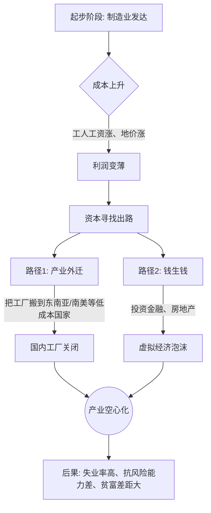

---
aliases:
  - 产业空心化
---

你好！我是你的老师。今天我们要聊一个听起来有点像“蛀牙”，但实际上发生在国家经济身上的大事——**“产业空心化” (Industrial Hollowing-out)**。

为了让你彻底听懂，我们先抛弃那些枯燥的经济学术语，用**费曼学习法**（用最简单的语言教会别人）的思路来拆解它。

---

### 1. 什么是“产业空心化”？（通俗理解）

想象一下，你家里原来是开**面包房**的（实体制造业）。
*   **过去：** 你们全家老小起早贪黑，揉面、烤面包、卖面包。虽然辛苦，但每赚的一分钱都是靠实实在在的面包换来的，心里踏实，邻居也都有活干。
*   **后来：** 你们发现，烤面包太累了，利润还低。既然家里已经攒了点钱，不如把烤箱卖了，把工人辞了。把钱拿去**炒股、买房、放贷**（金融、房地产、服务业）。
*   **结果：** 表面上看，你家更有钱了，穿得西装革履。但是，**如果你家厨房里连一个烤箱都没了，一旦股市崩盘或者房价下跌，你家连个充饥的面包都做不出来。**

这就是**产业空心化**：
一个国家或地区的**制造业（做实物的）** 逐渐衰退或流向国外，而**虚拟经济（玩钱的、服务的）** 飞速膨胀。整个经济体像一个**甜甜圈**，外表光鲜亮丽，**中间却是空的**。

---

### 2. 为什么会发生空心化？（图解流程）

就像水往低处流，资本也是逐利的。我们用Mermaid流程图来看一下这个过程是怎么发生的：

#### 关键点解析：
1.  **嫌贫爱富的资本：** 当一个国家发达了，工人工资高了，老板觉得在国内开厂不划算，就把工厂搬到落后国家去（因为那边人工便宜）。
2.  **赚快钱的诱惑：** 做实业（造手机、造汽车）回本慢、风险大；炒房、玩金融回本快。大家都去赚快钱，没人愿意干脏活累活了。

---

### 3. 多角度看：是好是坏？

这就好比孩子长大了要分家，有两种情况：

*   **良性的“腾笼换鸟” (升级)：**
    *   我也许不再做低端的“缝袜子、做塑料盆”了，我把这些低端产业转移出去，自己改行做“芯片、航空发动机、生物医药”。
    *   **这不是空心化，这是进化。**

*   **恶性的“产业空心化” (危机)：**
    *   我把“缝袜子”的扔了，但我**没学会**做芯片。我就靠吃老本、玩金融过日子。
    *   **这才是真正的空心化。** 根基断了。

---

### 4. 举个栗子：实实在在的案例

#### 案例一：美国“铁锈地带” (The Rust Belt)
*   **场景：** 曾经的底特律是“汽车之城”，无比辉煌。
*   **过程：** 后来因为人工太贵、工会强势，美国车企把工厂搬到了墨西哥、亚洲等地。
*   **结果：** 底特律工厂倒闭，工人失业，城市破产，房子没人住，变成了“鬼城”。这就是典型的产业空心化带来的阵痛——**由于缺乏实体产业支撑，中产阶级塌陷。**

#### 案例二：日本的“失去的二十年”
*   **场景：** 1985年《广场协议》后，日元升值，日本东西卖得贵了。
*   **过程：** 日本企业为了生存，大规模把工厂搬到东南亚和中国。本土这就剩下了总部和研发。
*   **结果：** 虽然日本跨国公司在海外赚了很多钱，但日本**国内**的工作机会少了，年轻人成了“草食系”，国内经济长期停滞。

---

### 5. 拓展学习：由浅入深

为了让你更深入理解，我们可以拓展以下几个概念：

1.  **荷兰病 (Dutch Disease)：**
    *   指一个国家因为自然资源（如石油、天然气）太丰富，导致光靠卖资源就能暴富，从而忽视了制造业的发展。一旦资源价格下跌，国家就崩溃了。这是产业空心化的另一种形式。
2.  **再工业化 (Re-industrialization)：**
    *   现在欧美国家意识到“空心化”的危害了（比如口罩造不出来、呼吸机造不出来），开始喊“制造业回流”，这就是再工业化，试图把“空了的心”填回去。
3.  **微笑曲线 (Smiling Curve)：**
    *   在一个产业链中，研发（左端）和销售/品牌（右端）利润最高，中间的制造（底部）利润最低。空心化往往是国家想抛弃底部，往两头走。但如果两头没抓稳，底部又丢了，那就摔惨了。

---

### 6. 课后加强：看看你真的懂了吗？

请尝试回答以下两个问题，来检验你的学习成果：

**题目一：判断题**
> 小明所在的城市原来有很多服装厂。最近，市长决定关停所有服装厂，将地皮用来建设“高科技软件园”和“金融中心”。但是，原来的服装厂工人因为没有技能，无法在软件园工作，导致大量失业，且新的软件园招商困难，很多楼是空的。
> **请问：这个城市出现了“产业空心化”的迹象吗？为什么？**

点击查看答案

**答案：是。**
**解析：** 虽然市长的目标是“产业升级”，但在旧产业（服装）被淘汰后，新产业（软件/金融）并没有成功建立起来填补空白（软件园招商困难），且造成了实体经济萎缩和就业问题。这就是典型的“旧的去了，新的没来”的空心化现象。

**题目二：思考题**
> 为什么现在很多发达国家（如美国、德国）都在拼命强调“高端制造”回流，而不是只搞金融？请用“产业空心化”的危害来解释。

点击查看答案

**解析：**
1. **抗风险能力：** 只有金融和服务业的国家，在面临战争、瘟疫或金融危机时非常脆弱（比如疫情期间连基本物资都生产不了）。
2. **就业与社会稳定：** 金融业只能容纳少数精英就业，而制造业可以提供大量中层岗位。空心化会导致贫富差距极度拉大，社会动荡。
3. **创新根基：** 很多技术创新是在工厂车间里“磨”出来的。没有制造业作为土壤，很多高科技研发也成了空中楼阁。

---

同学，这下你明白什么是“产业空心化”了吗？它就像人不能光练嘴皮子（服务业/金融），还得有强壮的肌肉（制造业）才能扛得住事儿！-