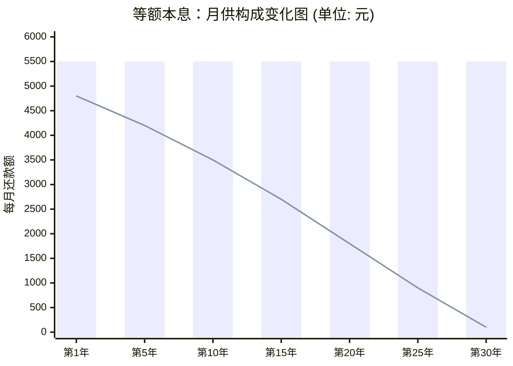

---
aliases:
  - 等额本金
---

这是买房、买车、消费贷最常见的还款方式。学会它，你不仅能看懂房贷合同，还能理解银行设计产品的底层逻辑——**资金的时间价值**。

- 字面意思：
	- 等额本金：可以直接先从字面意思来理解，这种利息计算方式是根据剩余欠款减少而减少的，比如十万元还10个月，第一个月需要用十万来计算第一个月的利息，而第二个月只需要计算剩下欠款九万，之后都是用剩下欠款乘以利率来计算的。
	- 等额本息：那些是一直相等的每月以相同的金额偿还贷款本息（即每月的总还款额一致，其中利息逐月递减，本金逐月增加）。

![[assets/68707c1c7abcc7f86d3f16c54fa844f8_MD5.png]]

图1：等额本息计算公式-信义房屋
- 误区：
	- 等额本金和等额本息差一个字，意义也略有区别，每月偿还相同金额的本金，由于剩余本金减少，每月的利息也逐月减少，因此每月的还款金额也相应递减。

![[assets/0669ead77ed3c0e72304a28399856b9e_MD5.png]]
		- 
[[assets/9281d897dc98a24b823c7ef17506779b_MD5.jpg|Open: image.png]]

![[assets/9281d897dc98a24b823c7ef17506779b_MD5.jpg]]

[[assets/d508d84e0099b911721800e072f7e1d2_MD5.jpg|Open: image.png]]
![[assets/d508d84e0099b911721800e072f7e1d2_MD5.jpg]]
我们按照**“本质原理 -> 图像直观 -> 数学公式 -> Excel应用”**的步骤，层层剥茧。

---

### 1. 💡 本质与原理：租借资金的游戏

不要去死记硬背，我们用一个生动的比喻来理解。

想象你从地主那借了一大袋米（本金），约定每个月还同样重量的米（月供）。
这个“月供”由两部分组成：
1.  **租金（利息）**：你因为占用了地主的米，必须付出的代价。
2.  **归还的米（本金）**：你把借的米还回去一部分。

**核心逻辑是：**
*   **租金（利息）是按“剩余欠款”计算的。**
*   刚开始，你欠的米很多，所以**租金（利息）很贵**。你交的“月供”里，大部分被拿去抵租金了，只有一小撮是真正还债的。
*   随着时间推移，你还的债越来越多，欠的米越来越少，**租金（利息）就便宜了**。
*   因为你的“月供”总额不变，既然租金少了，那**用来还债（本金）的比例就自动变大了**。

> **一句话总结：** 总额固定，前期还在替银行打工（还利息），后期才是给自己赎身（还本金）。

---

### 2. 📊 图像化理解：此消彼长的跷跷板

让我们用Mermaid图表来看清这几十年的变化。假设贷款30年。

*   **柱状图（高度不变）**：代表你每个月雷打不动要掏的钱（月供）。
*   **折线图（下降趋势）**：代表其中**利息**的占比。
*   **柱子减去折线剩下的部分**：就是你还的**本金**，它会越来越高。

---

### 3. 🧮 数学推导：公式是怎么来的？

这里稍微有一点点硬核，但这是理解的“天花板”。
银行不是拍脑袋算出来的，这是基于**等比数列求和**推导出来的。

**推导思路（费曼思路）：**
银行认为：现在的钱比未来的钱值钱。
如果在第 $n$ 个月还款 $A$ 元，那么这笔钱现在的价值（现值）是 $A / (1+r)^n$。
**你未来几十年还得所有钱，折算到现在，必须刚好等于你借的本金 $P$。**

$$P = \frac{A}{(1+r)^1} + \frac{A}{(1+r)^2} + ... + \frac{A}{(1+r)^n}$$

这是一个标准的等比数列求和。经过数学家的一顿操作（求和公式、移项），得到了最终的**万能公式**：

$$A = P \times \frac{r(1+r)^n}{(1+r)^n - 1}$$

**其中：**
*   $A$ = 每月还款额 (Answer)
*   $P$ = 贷款本金 (Principal)
*   $r$ = **月利率** (Rate) —— *注意：通常要把年利率除以12*
*   $n$ = 还款总月数 (Number)

---

### 4. 📝 实战演练：手算房贷

假设你要买房：
*   **贷款本金 ($P$)**：100万元
*   **年利率**：4.2%
*   **期限**：30年

**第一步：参数转化**
*   $P = 1,000,000$
*   $n = 30 \times 12 = 360$ 个月
*   $r = 4.2\% \div 12 = 0.0035$ (即0.35%)

**第二步：套入公式**
$$A = 1,000,000 \times \frac{0.0035(1+0.0035)^{360}}{(1+0.0035)^{360} - 1}$$

计算其中的 $(1.0035)^{360} \approx 3.514$

$$A = 1,000,000 \times \frac{0.0035 \times 3.514}{3.514 - 1}$$
$$A = 1,000,000 \times \frac{0.0123}{2.514}$$
$$A \approx 4890.17$$

**结论：** 你每个月要还 **4890.17元**。

---

### 5. 🛠️ 现代工具：Excel 一键搞定

没人会真的拿笔去算那个360次方。在职场和生活中，我们要用Excel的 **`PMT`** 函数。

**函数语法：**
`=PMT(rate, nper, pv, [fv], [type])`

*   **Rate (利率)**：月利率。输入 `4.2%/12`
*   **Nper (期数)**：月数。输入 `30*12`
*   **Pv (现值)**：本金。输入 `1000000` (或者输入 `-1000000`，这取决于你想要结果显示正数还是负数，金融学中流出为负，流入为正)。

**操作演示：**
在单元格输入：
`=PMT(4.2%/12, 360, 1000000)`
回车，Excel会直接告诉你结果是 **-4,890.17**。

---

### 6. 🎓 拓展知识：由浅入深

1.  **等额本息 vs 等额本金**与其实际意义：
    *   **等额本息**：每月还的一样多，利息总额高，适合收入稳定、想把现金流留在手里的年轻人。
    *   **等额本金**：每月还得不一样（越来越少），首月压力最大，利息总额少，适合年纪稍大或手头现金充裕的人。

2.  **提前还款怎么算？**
    *   如果你在第5年想提前还款，银行会看你这5年还了多少**本金**。
    *   在等额本息的前几年，你还的大多是利息，本金没还多少。所以**前期提前还款最划算**，后期（比如最后5年）因为本金还得差不多了，剩下的全是本金，利息很少，提前还款意义不大。

---

### ⚔️ 费曼学习法：过关测试

为了确认你是否真的掌握了，请尝试回答以下两道题目：

#### 题目一：概念辨析
小明贷款买了房，采用**等额本息**还款。第1个月他还要还4000元，第100个月他还要还4000元。
请问：第1个月还款中的“本金部分”和第100个月还款中的“本金部分”，哪个更多？为什么？
*(提示：用“租金”的比喻来思考)*

#### 题目二：计算逻辑
某网贷广告宣称：“借款12000元，分12个月还，每月只需要还1100元（含1000本金+100手续费）”。
请问，这个月利率可以直接用 $100 \div 1000 = 10\%$ 这种方式理解吗？如果用Excel的PMT反推逻辑，它的真实利率比表面看起来更高还是更低？

---
*请尝试在心中或纸上回答，如果你准备好了，告诉我，我来公布答案和解析！*