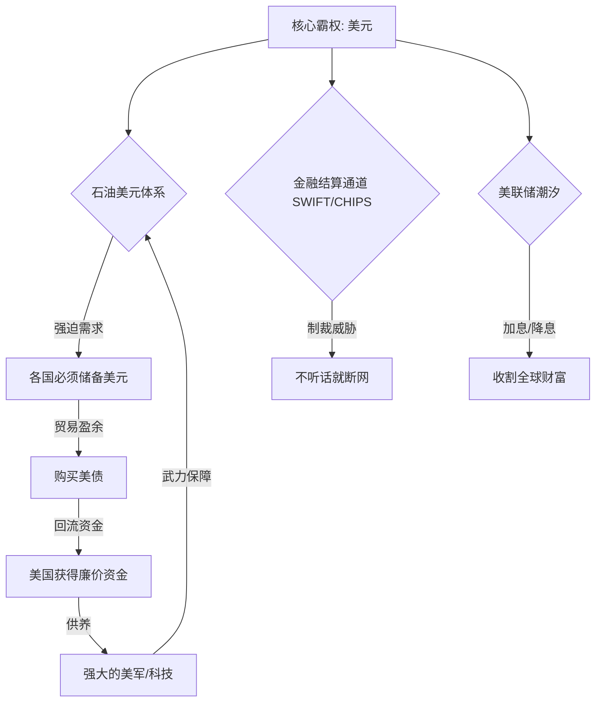

这是一个非常深刻且直指核心的问题！你问到了现代金融世界的**“底层代码”**。

为什么美联储（The Fed）能成为“世界央行”？为什么它咳嗽一声，全世界都要吃药？这并不是因为它挂了个“联储”的牌子，而是因为美国构建了一套**精密且霸道**的闭环系统。

我们可以把这套系统称为**“美元霸权的三叉戟”**：**石油绑定（锚）、SWIFT系统（通道）、美债（蓄水池）。**

听我为你层层拆解这个“阳谋”。

---

### 第一维度：锚定物——“必须用我的钱买必需品” (石油美元)

在1971年之前，美元是和**黄金**绑定的（布雷顿森林体系），那时候大家信美元是因为美元=黄金。
后来美国赖账了，不给换黄金了。为了不让美元变成废纸，美国走了一步绝妙的棋：**寻找新的锚定物——石油。**

*   **逻辑：** 工业社会，你可以不戴金首饰，但你不能不开车、不开机器、不发电。石油是工业的血液。
*   **手段：** 20世纪70年代，美国和沙特（欧佩克老大哥）达成协议：**“美国给你提供绝对的军事保护，保你王位稳固；条件是，你们卖石油，必须、只能用美元结算。”**
*   **结果：** 全世界只要想发展工业，就得买石油；想买石油，手里就必须有美元。
    *   这就强迫所有国家必须储备美元，必须通过贸易赚取美元。
    *   **比喻：** 就像村长（美国）规定，村里唯一的井水（石油）只能用他的“白条”（美元）买。不管你家里种什么，你都得先去换点白条防身。

### 第二维度：通道控制——“必须走我的路” (SWIFT与CHIPS)

你有美元了，你想买东西，怎么转账呢？这就涉及到了**SWIFT（环球银行金融电信协会）**和**CHIPS（纽约清算所银行同业支付系统）**。

*   **SWIFT（通讯录）：** 发送汇款指令的。
*   **CHIPS（结算中心）：** 真正进行美元资金划拨的，位于纽约。
*   **手段：** 全球90%以上的国际贸易（不仅是石油）都用美元结算。只要你用美元，这笔钱最终都要经过纽约的计算机系统转一圈。
*   **威力：** **金融核按钮。**
    *   如果美国看哪个国家不爽（比如俄罗斯、伊朗），它就把该国的银行从SWIFT里踢出去，或者禁止CHIPS为你服务。
    *   **后果：** 你有钱也花不出去，收不到货款，这就变成了一座“金融孤岛”。你没法买药、没法买零件、没法卖货，经济瞬间瘫痪。

### 第三维度：收割机制——“潮汐收割” (美联储的镰刀)

这就是你提到的“牵制和管控”的动态手段。美联储利用美元的全球流动性，进行**“养、套、杀”**。

1.  **降息（放水）：** 美联储利息极低。美元这就便宜了，大量的美元流向新兴市场（如东南亚、拉美），去投资建厂、炒房。这些国家经济看起来一片繁荣。
2.  **加息（抽水）：** 美联储突然提高利息。资本是逐利的，一看美国利息高且安全，瞬间从新兴市场撤资回流美国。
3.  **收割：** 新兴市场的外资跑了，本国货币暴跌，股市楼市崩盘，资产价格跌成白菜价。这时候，华尔街的资本拿着回流的美元，再杀个回马枪，用极其便宜的价格买下这些国家的优质资产（矿山、银行、大楼）。

#### 📊 逻辑图解：美元霸权的闭环

---

### 具体的牵制手段举例

#### 场景一：如果你想绕过美元？（军事/政治打击）
*   **萨达姆（伊拉克）：** 曾宣布伊拉克的石油要用**欧元**结算。结果：美国拿着试管洗衣粉说你有大规模杀伤性武器，打。
*   **卡扎菲（利比亚）：** 曾计划建立全非洲的黄金货币来替代美元石油交易。结果：政权被推翻，人没了。
*   **逻辑：** 谁敢动“石油美元”的根基，就是动美国的命根子，美军就会出动。

#### 场景二：如果你持有太多美元？（通胀稀释）
*   **情况：** 中国、日本辛苦卖货，攒了几万亿外汇储备（主要是美债）。
*   **手段：** 美国如果欠债太多还不上了，它可以**“印钞”**（量化宽松）。
*   **结果：** 美元多了，就贬值了。你手里的债权虽然数字没变，但购买力缩水了。相当于美国兵不血刃地赖掉了一部分账。

---

### 💡 费曼学习法总结（输出理解）

如果有人问：“凭什么美国能收割世界？”你可以这样生动地回答：

> “这就好比大家在一个大赌场里玩，**美国是赌场的发牌员，也是老板，还是保安队长。**
>
> 1.  **筹码垄断（石油美元）：** 进门你要玩游戏（发展经济），必须先换他的筹码（美元），因为连买水喝（石油）都只能用筹码。
> 2.  **通道控制（SWIFT）：** 所有的筹码兑换都要经过他的柜台。如果不听话，他直接封你的号，让你手里的筹码变成废纸，赢了钱也拿不走。
> 3.  **作弊收割（加息降息）：** 他还能随时改规则。今天说筹码便宜借给你（降息），等你下注了，明天突然说筹码贵了要收回（加息），让你破产，然后他把你身上的衣服裤子（优质资产）都扒走。
>
> 所以，大家不是心甘情愿听他的，而是被这一套系统绑架了，不得不听。”

---

### 🧠 拓展知识：破局之路

既然这么霸道，世界就在忍吗？现在的趋势是**“去美元化”**：

1.  **人民币国际化：** 中国买沙特石油，开始尝试用人民币结算（打破石油美元绑定）。
2.  **CIPS系统：** 中国建立的人民币跨境支付系统，就是为了在SWIFT被切断时，还有一个备用通道。
3.  **央行数字货币 (CBDC)：** 利用区块链技术，点对点交易，绕过美国的清算中心。
4.  **囤黄金：** 各国央行（包括中国）最近都在疯狂买黄金，卖美债，就是为了减少对美元的依赖。

---

### ✅ 课后测验（加强理解）

**题目一：**
为什么俄罗斯被踢出SWIFT系统被称为“金融核弹”打击？这会对俄罗斯的普通人生活造成什么具体影响？

**题目二：**
经常听到新闻说“美债收益率倒挂”或者“各国抛售美债”。如果中国把自己手里的美债全部瞬间卖光，能不能搞垮美元霸权？为什么？

*(请在心里想好答案，再看下方的解析)*

 
 
 

---

#### 📝 答案解析

**题目一解析：**
*   **因为切断了与世界的资金联系。**
*   **影响：** 俄罗斯的银行无法与国外银行转账。普通人没法用Visa/Mastercard海淘，留学生收不到家里的生活费，俄罗斯企业卖了石油收不到钱，想买进口的药、汽车零件也没法付款。整个国家的对外贸易被迫退回到“以物易物”或者现金手提箱的原始状态，效率极低。

**题目二解析：**
*   **不能彻底搞垮，且是“伤敌一千，自损八百”。**
*   **理由：**
    1.  **接盘侠：** 虽然中国持有很多，但美联储自己可以印钱接盘（左手倒右手），或者其他盟友会接盘。
    2.  **资产贬值：** 瞬间抛售会导致美债价格暴跌。中国手里的美债还没卖完，剩下的就已经不值钱了，自己的资产大幅缩水。
    3.  **极端对抗：** 这被视为金融宣战，美国可能会直接宣布冻结没收中国的资产（参考俄罗斯外汇被没收）。
    *   *正确策略是：* **温水煮青蛙**，慢慢卖，有序减持，同时换成黄金或其他资源。