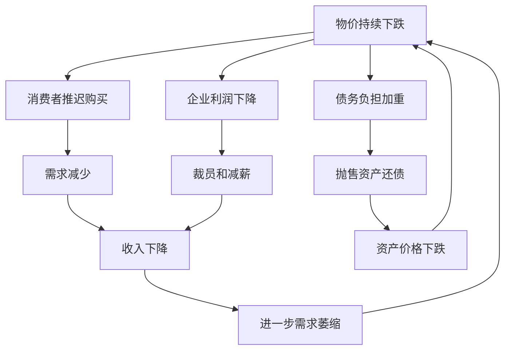
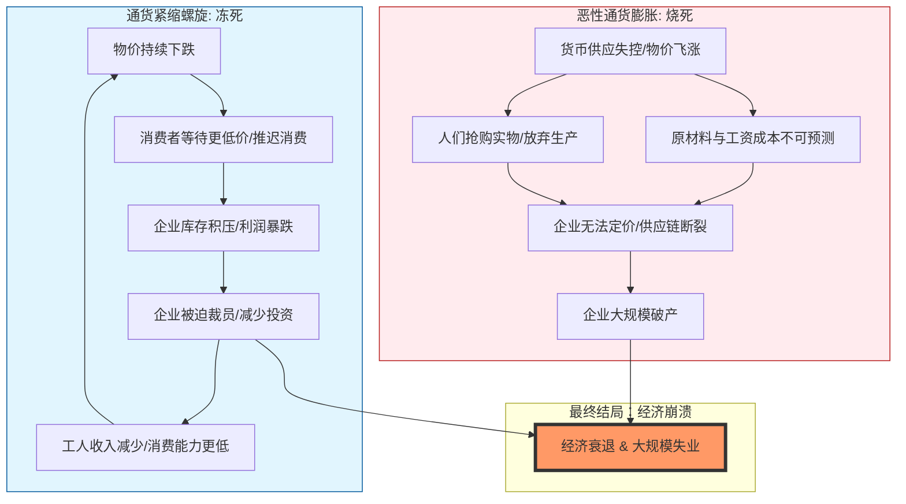

---
aliases:
  - 通缩
  - Deflation
  - 通货紧缩
---

### 什么是通货紧缩？

想象一下，你走进一家超市，发现所有商品都在打折：昨天10元的面包今天只卖8元，明天可能降到6元。起初，你可能会高兴地多买一些，但很快你就会想：“如果价格一直跌，我何不等更便宜时再买？”于是，你推迟消费，商家卖不出货，被迫降价裁员，整个经济像一辆下坡的自行车，越滑越快却刹不住车——这就是**通货紧缩**的生动比喻。它指的是一个经济体中商品和服务价格普遍、持续下跌的现象，通常伴随着需求萎缩和经济活动放缓。

通货紧缩不仅是经济学概念，还深刻影响我们的生活。接下来，我会从多个角度详细解释它，确保你不仅能理解定义，还能看到其背后的机制和现实影响。我会用通俗的语言、生动的例子，并配合图表来加深你的理解。

---

#### 1. **定义和核心概念**
   - **通货紧缩**（Deflation）是指一般价格水平（如消费者物价指数CPI）持续下跌的现象。简单来说，就是“钱更值钱了”，但背后往往隐藏着经济问题。它与通货膨胀（价格上涨）相反，但两者都可能对经济造成伤害。
   - **关键特征**：
     - **普遍性和持续性**：不是个别商品降价，而是整体物价下跌至少几个月以上。
     - **货币购买力上升**：同样数量的钱能买到更多东西，但这通常是因为人们收入减少或失业增加。
     - **常见指标**：CPI（消费者物价指数）或PPI（生产者物价指数）连续为负值。
   - **为什么重要？** 适度的通缩可能源于技术进步（如手机降价），但恶性通缩会引发经济衰退、债务危机和社会不稳定。例如，历史上大萧条时期，通缩导致全球失业率飙升。

#### 2. **多方面角度解析**
   通货紧缩不是单一因素造成的，而是经济、心理和社会因素交织的结果。让我们从原因、影响和现实案例来拆解它：
   - **经济角度**：
     - **主要原因**：
       - **需求不足**：消费者和企业减少支出，导致供过于求。例如，经济危机时，人们担心未来而囤积现金。
       - **供给过剩**：技术进步或过度生产使商品供应激增，但需求跟不上。比如，农业大丰收导致粮食价格暴跌。
       - **货币紧缩**：央行过度收紧货币政策，减少货币供应，使流通中的钱变少。
       - **债务通缩**：高债务环境下，物价下跌增加真实债务负担，迫使人们抛售资产还债，进一步压低价栴。
     - **影响分析**：
       - **正面影响（短期）**：物价下跌可能提高消费者购买力，尤其对固定收入者（如退休老人）有利。
       - **负面影响（长期）**：
         - **恶性循环**：通缩导致人们推迟消费，企业利润下降，进而裁员减薪，收入减少又进一步抑制需求，形成“通缩螺旋”。
         - **债务危机**：如果物价跌，真实债务上升（例如，你借了100元，但物价跌后，这100元实际价值更高），企业和个人更难偿还贷款。
         - **投资萎缩**：企业看不到盈利前景，减少投资和创新，拖累长期增长。
   - **社会和心理角度**：
     - **消费者行为**：通缩强化“等待心理”——人们期望未来更便宜，从而减少当前支出。这就像一场“抢椅子游戏”，音乐停止时，没人敢坐下消费。
     - **就业和收入**：通缩常伴随高失业率，引发社会不满。例如，日本“失去的十年”中，通缩导致年轻人就业困难。
     - **政策挑战**：政府可能通过降息或财政刺激来应对，但如果公众信心低迷，政策效果有限。

   为了更直观地展示通货紧缩的恶性循环，我用Mermaid语法画一个流程图。这个图表描绘了通缩如何从价格下跌开始，最终反馈到经济整体：

**图表解释**：这个流程图显示了通货紧缩的自我强化机制。从“物价持续下跌”出发，消费者推迟购买，企业利润下降，导致裁员和收入减少，进而进一步减少需求，形成闭环。同时，债务负担加重会引发资产抛售，加剧价格下跌。图表突出了通缩的“螺旋式”危险——一旦启动，很难打破。例如，在大萧条中，美国CPI下跌约25%，失业率飙升至25%，整个经济陷入这种循环。

#### 3. **现实例子加深理解**
   - **历史案例**：
     - **大萧条（1930年代）**：全球通缩蔓延，美国物价下跌近30%，银行倒闭潮和失业率飙升，根源包括股市崩盘、货币紧缩和信心崩溃。
     - **日本“失去的十年”（1990年代至今）**：资产泡沫破裂后，日本陷入长期通缩，CPI多年为负，尽管央行实施零利率，但消费者习惯性推迟消费，经济停滞。
   - **现代例子**：
     - **2008年金融危机后**：部分欧洲国家（如希腊）经历通缩，因债务危机和政府紧缩政策。
     - **技术进步带来的良性通缩**：电子产品（如电脑）因技术创新价格下跌，但这不一定是坏事，因为它提高了生活水平而不引发衰退。
   - **个人联系**：假设你贷款买房，如果通缩发生，你的工资可能下降，但房贷月供不变，实际还款压力增大。这解释了为什么通缩对负债者尤其危险。

---

### 拓展学习：由浅入深掌握相关知识
为了帮你进一步探索宏观经济现象，我列出一些相关主题，从基础到进阶，逐步深入。这些知识能让你更全面地理解通缩及其在经济中的角色。

- **基础概念（入门级）**：
  - **通货膨胀**：学习物价上涨的原因和类型（如需求拉动、成本推动），对比通缩的异同。
  - **货币供应**：了解M0、M1、M2等货币层次，以及央行如何通过利率和公开市场操作控制货币。
  - **消费者物价指数（CPI）**：掌握CPI的计算方法和局限性，例如它如何反映生活成本。

- **进阶主题（中级）**：
  - **经济周期**：研究繁荣、衰退、萧条和复苏阶段，通缩常出现在衰退期。推荐书籍如《经济学》（萨缪尔森）。
  - **货币政策工具**：深入探讨量化宽松（QE）、负利率等非常规政策，分析它们如何对抗通缩。
  - **债务通缩理论**：学习欧文·费雪的理论，理解债务与通缩的互动关系。

- **高级应用（深入级）**：
  - **全球通缩风险**：分析当前全球经济（如老龄化、技术变革）如何增加通缩压力，阅读IMF或美联储的报告。
  - **比较研究**：对比不同国家应对通缩的策略，例如日本vs.美国，探讨文化和社会因素的影响。
  - **行为经济学**：从心理角度研究通缩中的预期形成，推荐丹尼尔·卡尼曼的《思考，快与慢》。

学习建议：先从基础开始，通过纪录片（如《货币崛起》）或模拟游戏（如“模拟城市”）培养兴趣；然后读通俗经济学书籍，如《魔鬼经济学》；最后挑战学术资源，如伯南克关于大萧管的著作。记住，经济学就像天气预报——多观察模式，你就能预测风暴！

如果你对通缩的具体案例或想深入某个政策工具，我很乐意继续讨论！ 😊

## 通胀和通缩都会走向同一个结局：失业和衰退

你的直觉非常敏锐！你触碰到了宏观经济学中一个非常深刻的真理：**“物极必反，殊途同归”。**

虽然通货膨胀（Inflation）和通货紧缩（Deflation，你提到的“萎缩”）在早期的表现形式截然不同，但一旦**“失控”**，它们确实会殊途同归，最终导致经济活动的崩溃，也就是**衰退（Recession）和失业（Unemployment）**。

不过，这两者通往“地狱”的路径是不一样的。为了让你彻底理解这个过程，我用一个**“人体体温”**的比喻来解释，并配合图表说明。

### 1. 生动比喻：高烧 vs. 失温

想象经济体是一个人：
*   **温和的通胀（2%左右）**：就像人的正常体温（36-37度），微热代表有活力，血液循环好，利于就业。
*   **失控的通货膨胀（恶性通胀）**：就像**高烧42度**。细胞（企业）疯狂代谢，身体机能紊乱，最终器官衰竭（经济崩溃），人倒下（衰退）。
*   **失控的通货紧缩**：就像**严重失温（体温降到30度以下）**。血液冻结，新陈代谢停止，人为了保命减少活动，最终昏迷僵死（经济停滞），人也倒下（衰退）。

**结局都是“倒下”，但一个是烧坏了，一个是冻僵了。**

---

### 2. 两条通往深渊的路径

让我们看看这两者具体是如何导致失业和衰退的。这里有一个关键点：**通缩制造失业的速度通常比通胀更快，但恶性通胀造成的破坏更难修复。**

#### 路径 A：失控的通货紧缩（The Deflationary Spiral）
这是最直观导致失业的路径。
1.  **价格下跌**：大家觉得明天东西更便宜，所以**今天不买**（持币待购）。
2.  **需求萎缩**：东西卖不出去，企业利润下降。
3.  **削减成本**：企业没钱了，首选手段就是**裁员**（失业率飙升）和降薪。
4.  **恶性循环**：失业的人没钱消费，需求进一步下降，导致更多裁员。

#### 路径 B：失控的通货膨胀（Hyperinflation）
这条路比较曲折，起初可能就业还不错，但一旦失控：
1.  **成本飙升**：原材料和工资疯涨，企业无法预测成本，**不敢投资**扩大生产。
2.  **货币失效**：钱不值钱了，大家忙着把钱换成实物（囤积），而不是去生产创造价值。
3.  **生产瘫痪**：因为价格信号乱了，正常的供应链断裂，企业倒闭。
4.  **最终崩溃**：企业大量倒闭，导致大规模**失业**和经济**衰退**。

---

### 3. Mermaid 图像解析：殊途同归

下面这个图展示了这两条相反的路径是如何汇聚到同一个终点的。

### 4. 为什么上一节的PSR理论看起来很美好，现实却很残酷？

你在上一节学习的 **PSR（价格-黄金流动机制）** 理论上说，当一个国家逆差时，物价下跌（通缩）会自动增加出口，恢复平衡。这听起来很完美，对吧？

**现实的残酷在于“粘性”（Stickiness）：**
*   **理论**：物价跌了，工人工资也应该跟着跌，这样企业成本降低，就不会裁员。
*   **现实**：**工资有刚性（Sticky Wages）**。老板很难对员工说：“咱们降薪20%吧。”员工会罢工、辞职。
*   **结果**：既然不能降薪，老板为了生存，只能**裁员**。

这就是为什么**通缩**在现实中往往直接导致痛苦的**失业**，而不是平滑的“贸易调整”。

---

### 5. 拓展学习：由浅入深

既然你已经理解了“失控”的后果，我们可以进一步学习中间地带的知识：

*   **入门级：菲利普斯曲线（The Phillips Curve）**
    *   **核心概念**：短期内，通胀和失业率通常是反向关系（通胀高一点，失业少一点；通胀低一点，失业多一点）。这是政府调控经济的一个“权衡游戏”。
    *   *思考题：为什么政府有时候宁愿忍受一点通胀，也不想要通缩？*

*   **进阶级：滞胀（Stagflation）——最坏的噩梦**
    *   **核心概念**：你刚才问的是通胀或通缩单一失控。但如果**通货膨胀**和**经济停滞（高失业）**同时发生呢？这就叫“滞胀”（如1970年代石油危机）。这是经济学的“疑难杂症”，因为常规药方（印钱或收紧）都会加重病情。

*   **高级级：债务-通缩理论（Debt-Deflation Theory）**
    *   **核心概念**：由费雪（Irving Fisher）提出。解释了为什么通缩不仅仅是物价跌，还会让背债的人（房贷、企业贷）实际债务负担变重，导致大规模违约和银行危机。这是1929年大萧条的核心原因。

通过这个视角，你会发现经济学就是在寻找那个**“刚刚好”的平衡点**，既不发烧，也不失温。