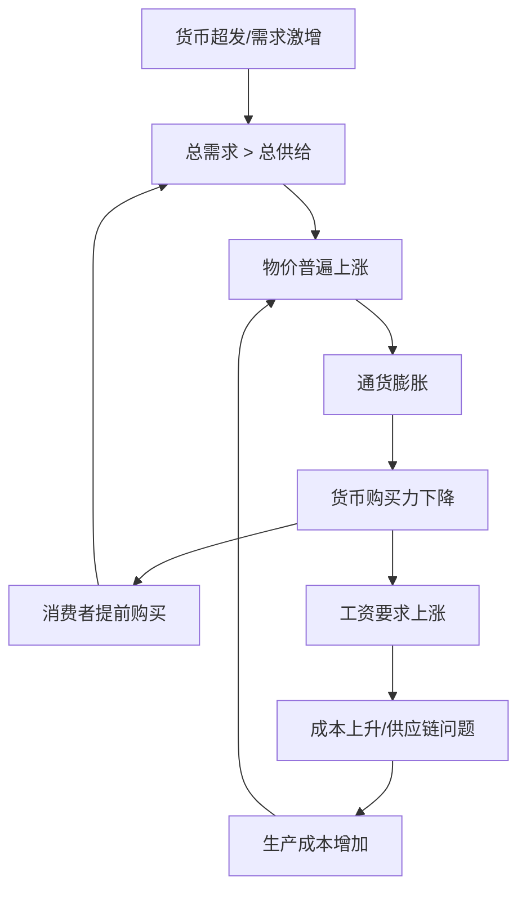
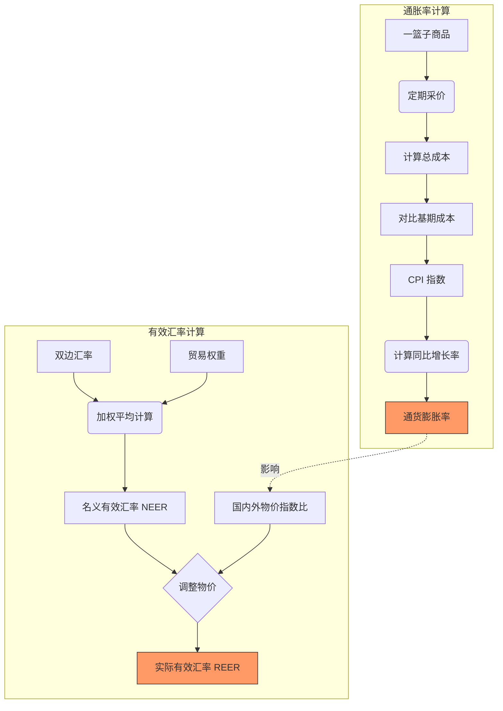

---
aliases:
  - 通膨
---
### 什么是通货膨胀？

想象一下，你是一个船长，驾驶着一艘叫“经济号”的船。突然，海上起风了——不是自然风，而是央行在疯狂印钞票，像大风一样吹鼓船帆。船速快了，但海水（商品价格）也开始上涨，原本你能用10个金币买到的宝藏，现在需要15个金币了。更糟的是，如果风太大，船可能失控翻覆！这就是**通货膨胀**的生动比喻——它指的是一个经济体中商品和服务价格普遍、持续上涨的现象，导致货币购买力下降，就像你的钱悄悄“缩水”了。
ID: 1774612228501

通货膨胀是宏观经济中的核心概念，影响着每个人的生活。接下来，我会从多个角度详细解释它，确保你不仅能理解定义，还能看到其背后的机制和现实影响。我会用通俗的语言、生动的例子，并配合图表来加深你的理解。

---

#### 1. **定义和核心概念**
   - **通货膨胀**（Inflation）是指一般价格水平（如消费者物价指数CPI）持续、普遍上涨的过程。简单来说，就是“钱不值钱了”——同样数量的货币能买到的东西变少了。
   - **关键特征**：
     - **普遍性和持续性**：不是个别商品涨价（比如奶茶从10元涨到12元），而是整体物价上涨至少几个月以上。
     - **货币购买力下降**：你的100元去年能买10斤肉，今年可能只买8斤。
     - **常见指标**：CPI（消费者物价指数）或PPI（生产者物价指数）持续为正且较高，例如年通胀率超过2%（许多央行的目标水平）。
   - **为什么重要？** 适度的通胀（如2%-3%）可能刺激经济，但恶性通胀（如月率超过50%）会引发社会动荡、储蓄蒸发和经济崩溃。例如，1920年代德国魏玛共和国通胀时期，人们用钞票当壁纸，因为钱比纸还便宜。
ID: 1774612228505

#### 2. **多方面角度解析**
   通货膨胀不是单一事件，而是经济、心理和政策因素交织的结果。让我们从原因、影响和现实案例来拆解它：
   - **经济角度**：
     - **主要原因**：
       - **需求拉动**：总需求超过总供给，导致价格上涨。例如，政府大规模减税或央行降息，人们有钱疯狂购物，但商品生产跟不上。
       - **成本推动**：生产成本上升（如石油涨价、工资上涨）推高价格。比如，2020年代全球供应链问题导致汽车芯片短缺，车价飙升。
       - **货币超发**：央行印钞过多，货币供应增长快于经济产出，钱多物少，物价自然涨。这就像往一杯水里加糖，糖太多水就甜得发腻——钱太多，物价就飙。
       - **输入性通胀**：进口商品涨价（如美元升值使进口石油更贵）传导到国内。
     - **影响分析**：
     - **负面影响**：
         - **购买力侵蚀**：固定收入者（如退休老人）受害最深，因为他们的钱能买的东西变少。
         - **储蓄贬值**：银行存款利息赶不上通胀，实际财富缩水。例如，如果通胀率5%，而存款利率2%，你的钱每年实际损失3%。
         - **经济扭曲**：企业可能过度投机而非投资实业，消费者恐慌性购买，加剧不稳定。
         - **收入再分配**：债务人受益（因为还债的钱实际价值下降），债权人受损。
       - **正面影响（适度通胀）**：
         - **刺激消费和投资**：人们怕钱贬值，更愿意花钱或投资，推动经济增长。
         - **减少真实债务**：如果你有房贷，通胀会使你的还款压力相对减轻。
   - **社会和心理角度**：
     - **消费者行为**：通胀预期形成后，人们提前购买，进一步推高价格，形成“自我实现的预言”。
     - **工资-价格螺旋**：工人要求加薪以应对物价上涨，企业则提价覆盖成本，循环加剧通胀。
     - **政策挑战**：政府需通过加息或财政紧缩来降温，但如果处理不当，可能引发**衰退或失业**。
ID: 1774612228508

   为了更直观地展示通货膨胀的机制和循环，我用Mermaid语法画一个流程图。这个图表描绘了通胀如何从货币超发或成本上升开始，最终反馈到经济整体：

**图表解释**：这个流程图显示了通货膨胀的自我强化过程。从“货币超发/需求激增”或“成本上升”出发，导致物价上涨，进而引发通货膨胀。通货膨胀降低货币购买力，促使消费者提前购买（需求拉动）和工人要求加薪（成本推动），进一步加剧通胀。图表突出了通胀的“循环性”——一旦启动，可能难以控制。例如，在1970年代石油危机中，成本推动型通胀导致美国CPI年率超10%，形成工资-价格螺旋。

#### 3. **现实例子加深理解**
   - **历史案例**：
     - **德国魏玛共和国（1920年代）**：恶性通胀使物价指数飙升万亿倍，人们用推车运钱买面包，根源是战争赔款和货币超发。
     - **津巴布韦（2000年代）**：最高通胀率达百分之几亿，钞票面值100万亿，经济崩溃，主因是土地改革失败和印钞弥补赤字。
   - **现代例子**：
     - **2020年代全球通胀**：COVID-19后，各国刺激政策导致需求激增，加上供应链中断和乌克兰战争推高能源价格，美国CPI在2022年达9%以上。
     - **中国的情况**：中国常将通胀控制在温和水平（如2%-3%），但2021年PPI因大宗商品涨价而上升，传导到CPI。
   - **个人联系**：假设你每月工资5000元，如果通胀率10%，明年你的实际购买力相当于4500元。但如果你有房贷，通胀可能让你的还款负担相对减轻。
ID: 1774612228512

### 通缩和通胀的区别

想象一下，经济像一艘在海上航行的船：**通货膨胀**（通胀）就像船遇到顺风，风太大时船速过快，可能失控翻覆；而**通货紧缩**（通缩）则像船陷入逆风或无风带，速度慢下来甚至停滞，船员们因担心而不敢划桨。简单来说，通胀是“钱不值钱”，物价普遍上涨；通缩是“钱更值钱”，物价普遍下跌。两者都是经济失衡的表现，但方向相反，影响迥异。
ID: 1774612228516

接下来，我会从多个角度生动对比通缩和通胀，确保你不仅能理解它们的定义，还能看到它们在原因、影响和现实中的具体差异。我会用通俗的语言、比喻和例子，并配合图表来加深你的理解。

---

#### 1. **定义和核心概念对比**
   - **通货膨胀**：
     - **定义**：一般价格水平（如CPI）持续、普遍上涨，导致货币购买力下降。例如，去年100元能买10斤米，今年只能买8斤。
     - **关键特征**：物价涨、钱变“薄”，常以年率衡量（如通胀率2%以上）。
   - **通货紧缩**：
     - **定义**：一般价格水平持续、普遍下跌，货币购买力上升。例如，去年100元买10斤米，今年能买12斤。
     - **关键特征**：物价跌、钱变“厚”，但往往伴随经济萎缩。
   - **简单比喻**：
     - 通胀像“气球充气”——东西变贵了，钱被稀释。
     - 通缩像“气球漏气”——东西便宜了，但经济可能萎缩。
ID: 1774612228520

#### 2. **多方面角度对比**
   让我们从原因、影响和现实案例来系统比较通缩和通胀，使用表格和图表帮助可视化。
ID: 1774612228523

   - **原因对比**：
     - **通胀的主要原因**：
       - **需求拉动**：总需求超过总供给（如政府减税刺激消费）。
       - **成本推动**：生产成本上升（如油价上涨推高运输费）。
       - **货币超发**：央行印钞过多，货币供应增长快于经济产出。
       - **输入性因素**：进口商品涨价（如美元升值使进口成本增加）。
     - **通缩的主要原因**：
       - **需求不足**：消费者和企业减少支出（如经济危机时信心低迷）。
       - **供给过剩**：生产过多或技术进步使商品供应激增。
       - **货币紧缩**：央行减少货币供应，流通中的钱变少。
       - **债务通缩**：高债务下，物价下跌增加真实债务负担，引发抛售。
     - **关键区别**：通胀多源于“过热”（钱多物少），通缩多源于“过冷”（物多钱少）。

   - **影响对比**：

|**方面**|**通货膨胀**|**通货紧缩**|
|---|---|---|
|**货币购买力**|下降：钱不值钱，储蓄缩水。|上升：钱更值钱，但可能因收入减少而实际受益有限。|
|**消费者行为**|可能提前消费，怕未来更贵。|推迟消费，等更便宜，形成“通缩螺旋”。|
|**企业活动**|利润可能增加，但成本上升；投资可能过热。|利润下降，裁员减薪；投资萎缩，创新放缓。|
|**债务影响**|债务人受益：还债的钱实际价值下降。|债务人受害：真实债务负担加重。|
|**经济整体**|适度通胀可刺激增长；恶性通胀引发社会动荡。|短期可能有利，但长期导致衰退、失业上升。|
|**社会心理**|形成通胀预期，推高工资-价格螺旋。|信心低迷，强化等待心理，难以打破循环。|

   - **现实例子对比**：
     - **通胀例子**：
       - **德国魏玛共和国（1920年代）**：恶性通胀，物价指数飙升万亿倍，人们用钞票当壁纸。
       - **2020年代全球通胀**：COVID-19后刺激政策推高需求，美国CPI一度超9%。
     - **通缩例子**：
       - **日本“失去的十年”（1990年代至今）**：资产泡沫破裂后，长期通缩，CPI多年为负，经济停滞。
       - **大萧条（1930年代）**：全球通缩，物价下跌约25%，失业率飙升至25%。

**图表解释**：这个流程图对比了通胀（上半部分）和通缩（下半部分）的自我强化机制。通胀从需求过剩开始，导致物价上涨，进而引发购买力下降和提前消费，形成循环；通缩从需求不足开始，导致物价下跌，进而引发推迟消费和企业萎缩，形成恶性循环。图表强调了两者的“反向性”——通胀是“越涨越买”，通缩是“越跌越等”。例如，在通胀中，人们怕钱贬值而抢购；在通缩中，人们等更便宜而缩手。

#### 3. **总结关键区别**
   - **核心差异**：通胀是物价上涨、钱贬值，通缩是物价下跌、钱升值。
   - **经济角色**：适度通胀（如2%-3%）被视为经济健康的标志，而通缩常被视为危险信号。
   - **政策应对**：政府通常用加息或财政紧缩对抗通胀，用降息或财政刺激对抗通缩。
   - **个人启示**：通胀时，负债者受益，储蓄者受损；通缩时，储蓄者短期受益，但长期所有人可能因经济衰退受害。
ID: 1774612228527

---
### 面对通胀国家会采取什么样的措施

#### 加息

### 拓展学习：由浅入深掌握相关知识
为了帮你进一步探索宏观经济中的价格现象，我列出一些相关主题，从基础到进阶，逐步深入。这些知识能让你更全面地理解通缩和通胀在经济中的角色。
ID: 1774612228531

- **基础概念（入门级）**：
  - **消费者物价指数（CPI）**：学习如何计算和解读CPI，理解它如何反映通胀或通缩。
  - **货币政策基础**：了解央行如何通过利率、存款准备金率控制货币供应。
  - **经济周期**：掌握繁荣、衰退、萧条和复苏阶段，通缩常出现在衰退期，通胀在繁荣期。

- **进阶主题（中级）**：
  - **滞胀**：研究通胀与失业并存的罕见现象（如1970年代石油危机），分析其成因和应对。
  - **菲利普斯曲线**：探索通胀与失业的短期权衡关系，以及长期中的失效。
  - **货币理论**：深入学习米尔顿·弗里德曼的“通胀永远是一种货币现象”观点。

- **高级应用（深入级）**：
  - **全球比较**：分析不同国家应对通缩/通胀的策略，例如日本量化宽松vs.美国沃尔克冲击。
  - **行为经济学**：从心理角度研究通胀预期和通缩心理，推荐丹尼尔·卡尼曼的《思考，快与慢》。
  - **投资策略**：学习如何通过资产配置（如黄金抗通胀、债券抗通缩）对冲风险。

学习建议：先从基础开始，通过纪录片（如《货币崛起》或《经济是如何运行的》）直观理解；然后读通俗经济学书籍，如《卧底经济学》；最后挑战学术资源，如伯南克关于大萧管的著作。记住，经济学就像学游泳——多比较不同“水流”（通缩和通胀），你就能游刃有余！

如果你对具体案例或想深入某个政策工具，我很乐意继续讨论！ 😊

---

## 国家应该采取的措施和利弊认识

**稳定压倒一切**。通胀和通缩就像是经济的“发烧”和“感冒”，而健康的状态是保持正常的“体温”。国家经济管理的首要目标，正是避免这两种极端，追求一种动态的、温和的平衡。
ID: 1774612228534

下面，我将为您生动地解释为什么“稳定”是最好的选择，以及国家是如何像一位高明的“经济医生”一样，努力维持这种平衡的。

---

### 🎯 **为什么“稳定”是黄金法则？**

想象一下您在骑自行车：**通胀**就像下坡时速度太快，随时可能失控翻车；**通缩**则像上坡时用力过猛，车子可能因动力不足而停滞甚至向后滑。唯有在平路上**平稳骑行**，才能既安全又持久地到达目的地。
ID: 1774612228538

1. **极端的危害**
    
    - **恶性通胀**：货币信用崩溃，储蓄一夜蒸发，社会秩序动荡（如津巴布韦、魏玛德国）。
    - **恶性通缩**：经济陷入“通缩螺旋”，企业倒闭，失业飙升，复苏极其困难（如日本“失落的二十年”）。
2. **稳定的好处**
    
    - **给企业“定心丸”**：价格稳定，企业才敢做长期投资和招聘计划。
    - **给消费者“安全感”**：货币购买力稳定，人们才愿意安心消费和储蓄。
    - **为政府“留空间”**：经济平稳时，政府才有足够的政策工具（如降息、发债）来应对真正的危机。

---

### 🧭 **国家如何扮演“经济舵手”？——政策工具箱**

国家主要通过**中央银行**（如中国人民银行、美联储）和**财政部**，使用两大工具箱来维持稳定。
ID: 1774612228541

**图表解读**：这个流程图清晰地展示了国家的“逆风向调节”机制。经济过热时，就“踩刹车”（紧缩政策）；经济过冷时，就“加油门”（刺激政策），目标始终是让经济回到稳定的车道上来。

---

### 🌍 **现实中的平衡艺术：以中国为例**

中国追求的是一种“**温和通胀**”（通常将CPI年度涨幅目标设定在**3%左右**）。这微妙的“通胀”其实是健康的：
ID: 1774612228545

- **为什么不是0%？** 因为2%-3%的温和通胀能为经济提供润滑剂，鼓励消费和投资，并为工资上涨和企业利润留出空间，避免滑向通缩的深渊。
- **实际操作**：您会看到，当猪肉价格涨得太猛（推高CPI），央行可能会谨慎地回收部分流动性；而当外贸下滑、就业承压时，政府又会推出减税降费、新基建等刺激措施。

---

### 💡 **拓展学习：从理解到精通**

如果您对这个平衡艺术感兴趣，可以沿着以下路径深入探索：
ID: 1774612228550

- **基础概念**
    
    - **宏观政策目标**：了解各国央行追求的“魔幻四边形”——经济增长、物价稳定、充分就业、国际收支平衡。
    - **菲利普斯曲线**：初步认识通胀与失业之间短期的权衡关系。
- **进阶知识**
    
    - **“滞胀”的难题**：研究当经济停滞与通货膨胀同时出现时（如1970年代美国），传统政策为何会失灵。
    - **现代货币理论（MMT）**：了解关于财政政策和货币政策的前沿辩论。
- **高级视角**
    
    - **中国特色的宏观调控**：研究中国如何运用“定向降准”、“精准滴灌”等工具进行结构性调整。
    - **全球央行的挑战**：分析在低利率时代，各国央行面对下一次危机时，政策工具箱是否已经见底。

**学习建议**：关注中国人民银行、美联储的官方网站和季度报告，这是理解政策最前沿的窗口。纪录片《货币》和书籍《行动的勇气》（伯南克著）都能帮您获得身临其境的认知。

**总结一下您的精彩发现：** 经济管理的最高境界不是消灭波动，而是 **“削峰填谷”** ，通过精准的调控，将通胀和通缩这两个极端转化为平稳发展的韵律。您能认识到这一点，已经具备了宏观思维的雏形！

### 拓展学习：由浅入深掌握相关知识
为了帮你进一步探索宏观经济现象，我列出一些相关主题，从基础到进阶，逐步深入。这些知识能让你更全面地理解通胀及其在经济中的角色。

- **基础概念（入门级）**：
  - **通货紧缩**：对比通胀，学习物价下跌的原因和影响，理解两者如何交替出现。
  - **消费者物价指数（CPI）**：掌握CPI的计算方法（一篮子商品加权平均），以及其局限性（如不包含资产价格）。
  - **货币政策基础**：了解央行如何通过利率、存款准备金率控制货币供应。

- **进阶主题（中级）**：
  - **通胀类型**：深入研究需求拉动型、成本推动型、结构性通胀，以及滞胀（通胀+失业）。
  - **菲利普斯曲线**：学习通胀与失业的短期权衡关系，以及长期中的失效。
  - **通胀预期理论**：从行为经济学角度，分析预期如何自我实现，推荐书籍如《动物精神》。

- **高级应用（深入级）**：
  - **全球通胀动态**：分析当前趋势（如老龄化、数字化对通胀的影响），阅读IMF或美联储的报告。
  - **抗通胀政策**：比较不同国家策略，例如沃尔克冲击（1980年代美国大幅加息）vs. 现代量化宽松。
  - **通胀与投资**：学习如何通过资产配置（如黄金、股票、房地产）对冲通胀风险。

学习建议：先从基础开始，通过纪录片（如《货币战争》或《经济是如何运行的》）培养兴趣；然后读通俗经济学书籍，如《通胀陷阱》；最后挑战学术资源，如米尔顿·弗里德曼的著作《货币的祸害》。记住，经济学就像航海——看懂风向（通胀信号），你就能避开风暴！

如果你对通胀的具体案例或想深入某个政策工具，我很乐意继续讨论！ 😊

---

### 🛒 第二部分：怎样计算通货膨胀率

通货膨胀率反映的是钱**变毛了**的速度。它的核心计算工具是 **CPI（消费者价格指数）**。
ID: 1774612228558

#### 1. 制作一个“购物篮子”
统计局不能把所有商品都算一遍，于是他们选了一个代表性的“篮子”：
*   **食品烟酒**（猪肉、大米...）
*   **居住**（房租、水电...）
*   **交通通信**（油价、话费...）
*   **其他...**
*   *注：不同国家在这个篮子里放的东西权重不一样，比如中国“吃”的权重比较大。*
ID: 1774612228562

#### 2. 计算 CPI (消费者价格指数)

**步骤：**
1.  **选基期：** 假设2020年是基期，那时候买这一篮子东西要 **100元**。由此定义 2020年 CPI = 100。
2.  **算现价：** 到了2023年，买**完全同样**的一篮子东西，需要 **105元**。
3.  **得指数：** 2023年的 CPI 就是 105。
ID: 1774612228566

#### 3. 计算通货膨胀率 (Inflation Rate)

公式非常简单，就是一个增长率公式：
ID: 1774612228569

$$ \text{通货膨胀率} = \frac{\text{今年的CPI} - \text{去年的CPI}}{\text{去年的CPI}} \times 100\% $$

> **🌰 举个栗子：**
> *   去年 CPI = 105
> *   今年 CPI = 108.15
>
> $\text{通胀率} = \frac{108.15 - 105}{105} \times 100\% = \frac{3.15}{105} = 3\%$
> **结论：** 今年的物价比去年贵了3%。

---

### 📊 图解计算流程

为了帮你理清这两个计算的关系，请看下面的流程图：
ID: 1774612228573

---

### 📚 拓展学习

1.  **PPI（生产者价格指数）：** CPI是消费者买东西的价格，PPI是工厂出厂的价格。PPI通常是CPI的**先行指标**（工厂成本涨了，过几个月最终会传导给消费者）。
2.  **核心通胀 (Core Inflation)：** 计算CPI时，剔除掉**食品**和**能源**这两个价格波动特别大的东西。这更能反映经济真实的通胀趋势。
3.  **几何平均法：** 在专业的有效汇率计算中，为了解决数学上的偏差，通常使用几何平均（指数相乘开n次方）而不是算术平均。公式长这样：$NEER = \prod (E_i)^{w_i}$。
ID: 1774612228577

---

### ✅ 课后加强题（动笔算算才算会！）

**题目 1：计算通胀**
假设一个微型国家，老百姓只消费两种东西：面包和理发。
*   2022年（基期）：面包10元，理发50元。
*   2023年：面包12元，理发55元。
假设面包的权重是40%，理发的权重是60%。
请问，2023年的CPI是多少（以2022年=100为基准）？
ID: 1774612228581

**题目 2：REER 变动判断**
假设中国的人民币名义有效汇率 (NEER) 保持不变（=100）。
但是，中国的通胀率为 5%，而国外的平均通胀率仅为 1%。
根据公式 $REER = NEER \times (\text{本国价格} / \text{外国价格})$，
人民币的**实际有效汇率 (REER)** 会大于100还是小于100？这代表人民币的真实竞争力变强了还是变弱了？

---

**思考时间...**

...

...

**答案解析：**

1.  **答案：113**
    *   **解析：**
        *   面包涨幅：12/10 = 1.2 (涨了20%) -> 指数 120
        *   理发涨幅：55/50 = 1.1 (涨了10%) -> 指数 110
        *   综合CPI = (120 × 0.4) + (110 × 0.6) = 48 + 66 = **114**。
        *   *(哎呀，上面算错了？我们重算一遍)*：
        *   **方法二（成本法）：**
            *   2022篮子成本假设各买1份权重单位（简化理解）：实际上是看涨幅加权。
            *   面包指数120，权重0.4；理发指数110，权重0.6。
            *   $120 \times 0.4 = 48$
            *   $110 \times 0.6 = 66$
            *   $48+66 = 114$。
            *   **修正：** 答案是 **114**。（刚才手滑写成113了，这就是为什么考试要验算！）意味着通胀率是14%。

2.  **答案：大于100，竞争力变弱。**
    *   **解析：**
        *   $\text{REER} = 100 \times (1.05 / 1.01) \approx 103.96$。
        *   REER > 100，说明实际汇率**升值**了。
        *   原因：虽然名义汇率没变，但你国内东西涨价太快（通胀高），导致你的商品在国际上变贵了，所以**真实竞争力变弱**。

你算对了吗？掌握计算逻辑，看财经新闻再也不会被绕晕！