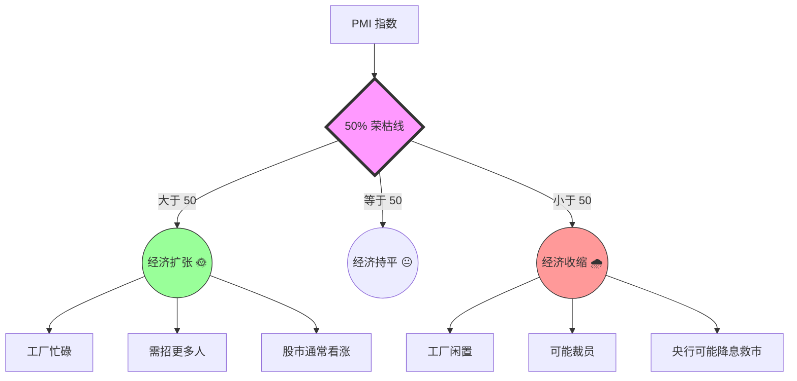

---
aliases:
  - PMI
  - 采购经理指数
---
你好！我是你的专属知识向导。今天我们要揭开经济学中一个非常重要，被称作**“经济晴雨表”**的指标——**PMI（采购经理指数）**。

试想一下，如果你想知道一家餐馆生意好不好，最好的办法不是等年底看财报，而是直接去后厨问负责买菜的大厨：“师傅，最近菜买得多了还是少了？”

**PMI，就是那个去问全世界大厨（采购经理）“最近菜买得多不多”的调查报告。**

---

### 🌟 第一部分：什么是 PMI？（费曼通俗版）

**全称**：Purchasing Managers' Index
**中文**：采购经理指数

#### 1. 核心逻辑：春江水暖“采购”知
在一个公司里，**采购经理**是最先感知市场冷暖的人。
*   如果市场好，订单多，老板会说：“老王，多买点原材料，我们要加班生产！”
*   如果市场差，仓库堆满货，老板会说：“老王，先别买原料了，货卖不出去。”

所以，只要统计这些“老王”们的动向，就能比GDP（国内生产总值）更早地知道经济是在变好还是变坏。因此，PMI 被称为**“先行指标”**。

#### 2. 它是怎么算出来的？
每个月，调查机构会给成千上万个采购经理发问卷，问题很简单，通常只有三个选项：
1.  比上个月**好**（增加）
2.  跟上个月**一样**（持平）
3.  比上个月**差**（减少）

然后通过这就得出了一个 0 到 100 之间的数字。

---

### 📊 第二部分：PMI 的“生命线” —— 50%

PMI 所有的奥秘，都藏在**50**这个数字里。这就像水的冰点和沸点一样分明。

*   **PMI > 50**：代表**扩张**。说明大部分经理在买买买，经济在升温。
*   **PMI = 50**：代表**持平**。
*   **PMI < 50**：代表**收缩**。说明大部分经理在削减采购，经济在降温。

**💡 举个栗子：**
如果上个月PMI是52，这个月变成了54，说明经济不仅在扩张，而且扩张的速度**加快**了（油门踩得更深了）。
如果上个月PMI是52，这个月变成了51，说明经济还在扩张（还在50以上），但扩张速度**变慢**了（油门松了一点）。

---

### 🔍 第三部分：PMI 具体看什么？（五大金刚）

PMI 不是一个单一的数据，它是由5个分项指标加权计算出来的。我们可以把它想象成一份**体检报告**。

1.  **新订单指数（权重30%，最重要！）**：未来的生意怎么样？这是经济的**发动机**。
2.  **生产指数（25%）**：现在机器转得快不快？
3.  **从业人员指数（20%）**：工厂是在招人还是裁员？
4.  **供应商配送时间指数（15%）**：送货是快了还是慢了？（注意：如果送货**慢**了，通常反而是好事，说明生意太火爆，大家都在排队拿货，所以这个指标是反向计算的）。
5.  **原材料库存指数（10%）**：仓库里的存货是多了还是少了？

---

### 🌏 第四部分：中国的“两个” PMI

在中国，你会经常听到两个不同的PMI，这经常让新手困惑。我们来做个对比：

| 特征 | **官方 PMI (国家统计局)** | **财新 PMI (Caixin/Markit)** |
| :--- | :--- | :--- |
| **调查对象** | 以**大型国企**为主 | 以**中小企业、民营企业**为主 |
| **样本范围** | 覆盖面很广，全行业 | 侧重于沿海出口导向型企业 |
| **形象比喻** | **大象**的舞步（代表整体大盘） | **蚂蚁**的忙碌（代表市场活力） |
| **发布时间** | 通常是每月的最后一天或1号 | 通常是每月的第一个工作日（稍晚） |

**使用场景举例：**
*   如果你想看国家宏观大局稳不稳，看**官方PMI**。
*   如果你想看市场最活跃的私营老板们日子好不好过，看**财新PMI**。有时候官方PMI是51（大企业好），财新PMI却是48（小老板难），这就说明经济出现了分化。

---

### 🚀 第五部分：知识拓展（由浅入深）

当你掌握了PMI，你就可以进一步学习以下内容，建立你的宏观经济分析框架：

1.  **非制造业 PMI（服务业 PMI）**：
    *   刚才讲的主要是制造业（造东西的）。还有服务业PMI（理发、旅游、餐饮）。在一个发达经济体中，服务业PMI往往比制造业PMI更重要。

2.  **PPI（生产者价格指数）与 PMI 的关系**：
    *   PMI 是采购经理买东西的**数量**意愿，PPI 是采购经理买东西的**价格**变动。两者结合能看出通货膨胀的苗头。

3.  **PMI 与 股市/债市 的联动**：
    *   **利好**：PMI 超预期上升 -> 经济好 -> 企业盈利好 -> **股市涨**。
    *   **利空**：PMI 远超预期（过热） -> 可能通胀 -> 央行可能加息 -> **债市跌**。

4.  **库存周期（基钦周期）**：
    *   结合“新订单”和“原材料库存”，你可以判断现在是处于“主动去库存”（萧条）还是“被动去库存”（复苏）阶段。

---

### ⚔️ 第六部分：课后实战测试（确认理解）

为了确保你真的懂了，请尝试回答以下两道题目：

**题目一：**
新闻报道：“本月制造业PMI为48.5%，虽然仍处于收缩区间，但较上月回升了1.5个百分点。”
**请问：** 这句话说明经济状况到底是变好了，还是变得更差了？工厂是在扩张还是收缩？

**题目二：**
如果“新订单指数”大幅上涨，但是“从业人员指数”却在下跌，作为一名分析师，你觉得这可能暗示了什么现象？

---

<b>点击查看答案解析</b>

**答案解析：**

**题目一答案：**
经济状况在**边际改善**（变好的趋势），但整体仍处于**收缩**状态。
*   **解释**：因为数值是48.5%，低于50%，所以工厂整体还在收缩（比如还在裁员、减产）。但是“较上月回升”，说明收缩的**程度减轻了**，情况没有上个月那么糟糕了。这通常是触底反弹的信号。

**题目二答案：**
可能暗示了以下几种情况：
1.  **生产效率提高/自动化**：工厂接了很多单，但使用了机器人或更高效的设备，不需要那么多人了。
2.  **招工难**：老板想招人做订单，但是市场上招不到人（劳动力短缺）。
3.  **谨慎乐观**：老板虽然接到了单子，但觉得这只是暂时的，不敢轻易招正式员工，怕以后还得赔钱裁员，所以宁愿让现有员工加班。

希望这次讲解能让你彻底搞懂 PMI！如果还有哪里不清楚，随时问我。