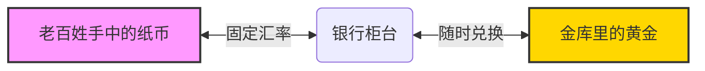
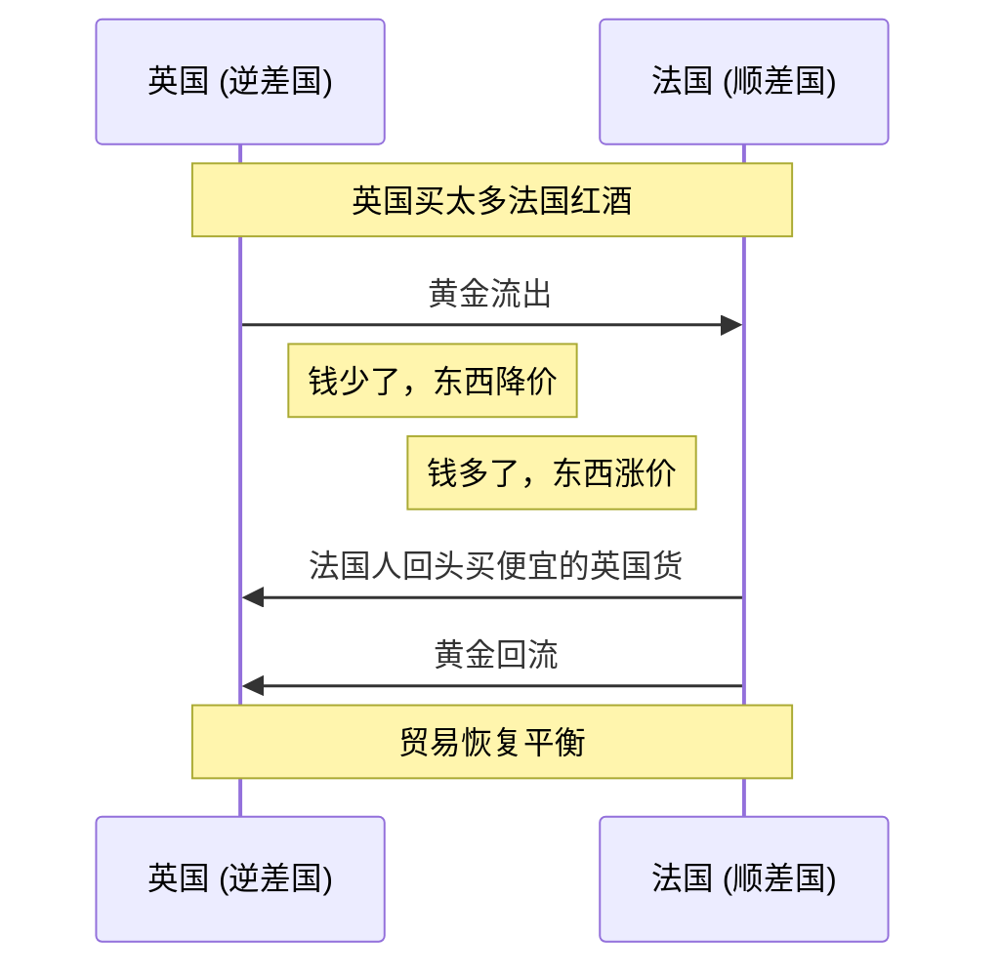

---

### 1. 什么是“金本位”？（费曼式直觉理解）

想象一下，你手中的钞票（比如 100 元），在今天看来，它本质上是一张“信用纸”，它的价值由国家信誉担保。

但在**金本位**时代，那张纸不仅仅是纸，它是**黄金的“取货单”**。

**核心定义**：
金本位是一种货币制度，规定**货币的价值直接挂钩一定重量的黄金**。

*   **承诺**：银行承诺，如果你拿着钞票来柜台，我随时给你兑换成真金白银。
*   **限制**：国家印多少钞票，取决于金库里有多少黄金。不能凭空印钱。

#### 核心机制图解

---

### 2. 生动形象的例子：大英帝国的绅士

让我们穿越到 **19 世纪的伦敦**，这是金本位的鼎盛时期。

**场景一：国内消费**
史密斯先生去买一套西装，价格是 **5 英镑**。
此时的“5 英镑”不仅仅是一个数字，它代表了大约 **36.5 克纯金**（假设值）。史密斯先生既可以直接掏出金币支付，也可以掏出英格兰银行发行的 5 英镑纸币。
裁缝店老板非常乐意收纸币，因为他知道，他随时可以拿着这张纸去银行换回那 36.5 克金子。**纸币 = 黄金的影子**。

**场景二：国际贸易（自动平衡机制）**
英国向法国买了很多红酒，英国出现了**贸易逆差**（买的多，卖的少）。
1.  英国的黄金（货币）流向了法国。
2.  英国国内黄金少了 $\rightarrow$ 货币供应少了 $\rightarrow$ **英国国内物价下跌**。
3.  法国国内黄金多了 $\rightarrow$ 货币供应多了 $\rightarrow$ **法国国内物价上涨**。
4.  结果：英国商品变得便宜，法国商品变贵。于是英国出口增加，黄金又流回来了。

这就是金本位神奇的**“自动调节机制”**。

---
#### 日本

![[日本经济发展和转型繁荣与停泻#^3aszog]]

### 3. 金本位的优缺点：为什么它被抛弃了？

既然金本位听起来这么稳，为什么现在不用了呢？我们可以把它比作一副**“黄金手铐”**。

#### 优点：稳定器
1.  **抑制通胀**：政府不能乱印钱。想印钱？先去挖金矿！这让物价非常稳定。
2.  **汇率固定**：国际做生意很方便，不用担心今天 1 美元换 7 元，明天换 8 元。

#### 缺点：紧箍咒
1.  **缺乏灵活性**：这是最致命的。假设发生战争或经济大萧条（如 1929 年），政府急需印钱救市或发军饷。但因为金库里没金子，政府就**无法印钱**，只能眼睁睁看着经济窒息。
2.  **通货紧缩**：如果工业生产了太多商品，但挖金子的速度跟不上，市场上的钱就不够用，物价就会持续下跌，导致企业倒闭。

---

### 4. 历史演变：从辉煌到终结

金本位的历史就像一部电影的三部曲：

1.  **古典金本位 (1816-1914)**：
    *   黄金是唯一的霸主。各国货币自由兑换黄金。一战爆发后，各国为了印钱打仗，暂停了兑换，这一阶段结束。
2.  **金汇兑本位 (一战后)**：
    *   这是个“低配版”。很多国家不再直接兑换黄金，而是把货币挂钩英镑或美元，再由英镑美元间接挂钩黄金。
3.  **布雷顿森林体系 (1944-1971)**：
    *   **美元与黄金挂钩，其他货币与美元挂钩**（每盎司黄金 = 35 美元）。美元成了世界货币霸主。
    *   **终结 (尼克松冲击)**：1971年，因为美国打越南战争钱不够花，印了太多美元，金库里的金子不够兑换了。尼克松总统宣布：**美元不再兑换黄金！**
    *   从此，人类进入了**信用货币（Fiat Money）**时代。

---

### 5. 拓展学习：由浅入深

学习完金本位，你可以顺藤摸瓜学习以下知识：

*   **浅层拓展**：
    *   **银本位**：中国古代主要用白银，为什么白银后来被黄金淘汰了？（格雷欣法则：劣币驱逐良币）。
    *   **布雷顿森林体系**：二战后世界经济秩序是如何建立的？IMF（国际货币基金组织）和世界银行是怎么来的？
*   **深层拓展**：
    *   **不可能三角 (蒙代尔三角)**：一个国家不可能同时实现资本自由流动、汇率稳定和独立的货币政策。金本位就是为了“汇率稳定”牺牲了“货币政策独立性”。
    *   **现代货币理论 (MMT)**：在没有黄金束缚的今天，国家印钱真的没有上限吗？上限是通货膨胀吗？
    *   **比特币 (数字黄金)**：很多人称比特币为“数字黄金”，因为它总量恒定（2100万枚）。它是否试图在数字世界复刻金本位？

---

### 6. 课后测验：确认理解

为了确保你真的懂了，请尝试回答这两个问题（不要偷看答案哦）：

**题目 1：**
在古典金本位制度下，如果一个国家发现了一座巨大的金矿，这通常会导致该国国内发生什么现象？
A. 物价剧烈下跌（通货紧缩）
B. 物价上涨（通货膨胀）
C. 纸币变得更值钱
D. 银行拒绝兑换黄金

**题目 2：**
为什么在 1929 年大萧条时期，坚持金本位制度的国家反而经济恢复得更慢？
A. 因为黄金太重，阻碍了运输
B. 因为政府无法通过印钞来增加市场流动性，只能看着企业因为缺钱而倒闭
C. 因为没人喜欢黄金了
D. 因为金矿都被挖空了

---

### 答案解析

**题目 1 答案：B**
*   **解析**：金本位下，黄金 = 货币。挖出大金矿 = 凭空多出了很多钱。商品数量没变，钱突然变多了，自然会导致物价上涨（通货膨胀）。

**题目 2 答案：B**
*   **解析**：这就是“黄金手铐”效应。经济危机时市场缺钱，需要政府“放水”救急。但在金本位下，没有新增黄金就不能印钱，政府束手无策，导致经济衰退期延长。

希望这次讲解能帮你彻底理解**金本位**！你是想继续了解“布雷顿森林体系”还是“比特币与黄金的对比”？