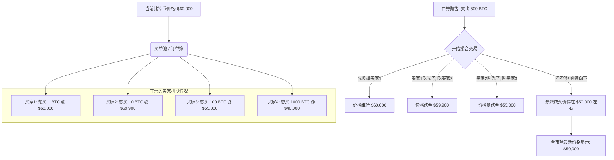

你好！这是一位博学的老师。很高兴能为你解答这个非常经典且深刻的经济学/金融学问题。

你的直觉其实非常有逻辑——**“有人卖就有人买，钱只是转手了，总资金量没变，为什么价格会跌？”** 这是一个典型的**存量思维**误区。

实际上，决定市场价格的不是“总值”，而是**“边际交易”**（也就是**最后一笔成交的价格**）。

让我们通过费曼学习法，拆解这个过程，用生动的例子和图表带你从根源上理解这个现象。

---

### 1. 核心概念拆解：价格是如何产生的？

首先，我们要打破一个幻觉：**市值（Market Cap） $\neq$ 市场里真实的钱。**

如果比特币现价是 60,000 美元，即使市场上只有两个人交易了一枚比特币，全世界所有 1900 万枚比特币的持有着，都会看着账户说：“哇，我的币值 6 万美元！”

**但如果这 1900 万枚币都想变成现金，市场里根本没有那么多现金。**

#### 🍎 通俗案例：村口的苹果市场

想象一个封闭的小村庄：
1.  **总量**：全村只有 **100 个** 金苹果。
2.  **定价**：昨天，老王用 **10 元** 买走了老李的 1 个金苹果。
3.  **幻觉**：全村人觉得金苹果的总市值是 $100 \text{ 个} \times 10 \text{ 元} = 1000 \text{ 元}$。

**巨鲸出货场景：**
突然，村里的首富（持有 50 个金苹果）急着用钱，他跑到村口大喊：“我要卖 **50 个** 金苹果！”

**问题来了：**
*   村口想买苹果的人只有 3 个。
    *   A说：我愿意出 10 元买 1 个。
    *   B说：我只有 9 元，但我愿意买 10 个。
    *   C说：我只有 5 元，我愿意包圆剩下的。

**成交过程（订单簿匹配）：**
1.  首富卖给 A：1 个，成交价 **10 元**。
2.  首富还剩 49 个，为了卖出去，他**不得不**降价卖给 B：10 个，成交价 **9 元**。
3.  首富还剩 39 个，为了彻底套现，他只能含泪卖给 C：39 个，成交价 **5 元**。

**结果：**
*   **最后一笔成交价是 5 元。**
*   村里的广播大喊：“最新成交价，金苹果 5 元一个！”
*   **市场崩塌**：全村剩下的 50 个金苹果持有者，发现自己的资产瞬间缩水了一半。
*   **重点**：虽然首富卖出了苹果，买家也花了钱，但因为**买家的资金（流动性）不足以承接巨大的卖单**，价格必须向下寻找新的买家，从而拉低了**所有**苹果的估值。

---

### 2. 深度解析：订单簿与流动性 (Order Book & Liquidity)

在比特币交易所里，这被称为**“击穿订单簿”**。

让我们看看 Mermaid 图表，直观地理解这个过程：

**解析：**
*   **买一价（Best Bid）** 只是冰山一角。
*   当你只有少量比特币时，你能以现价卖出。
*   当你持有大量比特币时，**现价附近的买单不够你塞牙缝的**。你必须“向下吃单”，这就叫**滑点（Slippage）**。
*   一旦你卖到了低价位，交易所的行情显示就会变成那个低价位。

---

### 3. 心理学与杠杆：多米诺骨牌效应

单纯的卖出导致的下跌可能只是暂时的，但更可怕的是**连锁反应**。

*   **1. 恐慌情绪 (Panic Selling)：**
    小散户看到价格从 60k 跌到 55k，会想：“天哪，是不是出事了？快跑！”于是更多人开始卖，即使没有巨鲸在卖，价格也会继续跌。

*   **2. 杠杆爆仓 (Liquidation Cascade)：**
    这才是比特币暴跌的核心原因。很多人是借钱（开合约）买币的。
    *   如果价格跌破 55k，交易所系统会强制卖出他们的币来还债。
    *   **系统的强制卖出 = 新的巨额抛压**。
    *   这会导致价格进一步下跌，触发更多人的爆仓线，形成**死亡螺旋**。

---

### 4. 费曼学习法总结

请尝试用下面的逻辑向你的朋友解释：

> “嘿，朋友，想象一下，如果咱们小区这栋楼平时卖 500 万一套。突然有个大房东要把手里 100 套房**在一天之内**全部卖掉。
>
> 这一天内，能拿出 500 万买房的人可能只有 1 个。为了卖掉剩下的 99 套，房东只能降价到 400 万、300 万，去吸引那些本来买不起的人来买。
>
> 等最后一套房以 300 万成交时，虽然房东拿到钱离场了，但贝壳找房APP上，咱们小区的均价就变成了 300 万。咱们虽然没卖房，但咱们的资产估值也跟着缩水了。
>
> 这就是为什么巨鲸砸盘，价格会跌。不是钱变少了，而是**愿意按原价接盘的钱不够多**。”

---

### 5. 拓展知识：由浅入深

学习了上面的知识，你可以进一步了解以下概念，完善你的金融世界观：

1.  **OTC（场外交易）**：
    *   *问题*：那巨鲸真的想卖币怎么办？真的只能砸盘吗？
    *   *答案*：不。他们会去 OTC 市场，私下找另一个大买家，商量一个固定价格（比如市价打九八折）一手交钱一手交货。这不会直接影响交易所显示的 K 线图价格。

2.  **市场深度（Market Depth）**：
    *   衡量一个资产是否健康的标志。深度越好（买单卖单越厚），巨鲸砸盘产生的影响越小（比如黄金市场）。比特币相比法币，深度依然较浅。

3.  **做市商（Market Maker）**：
    *   他们的工作就是专门在买卖两端挂单，提供流动性，减缓价格的剧烈波动。

---

### 6. 课后测试：确认你的理解

请尝试回答以下两道题目，检验是否掌握：

**题目 1：**
假设比特币当前价格是 \$10,000。订单簿上，在 \$10,000 位置只有 1 个比特币的买单，在 \$5,000 位置才有第二个买单。
如果有个人此时市价卖出 1.5 个比特币，成交后的市场价格会显示为多少？
A. \$10,000
B. \$7,500 (平均价)
C. \$5,000
D. \$15,000

**题目 2：**
为什么“市值（Market Cap）”被称为一种“虚幻”的指标？
A. 因为交易所的数据是假的。
B. 因为市值假设了所有币都能以当前的“边际价格”卖出，但这在现实中是不可能的。
C. 因为比特币没有实体。
D. 因为买家的钱不够多。

---

**(请先思考，再看下方的答案解析)**

点击查看答案与解析

**题目 1 答案：C ($5,000)**
*   **解析**：市场价格总是显示**“最新一笔成交的价格”**。前 1 个币以 \$10,000 成交，但这已经是过去式了。剩下的 0.5 个币必须以 \$5,000 才能成交。这笔交易完成后，最新价格就是 \$5,000。这就是为什么流动性差的时候，价格会瞬间闪崩。

**题目 2 答案：B**
*   **解析**：这就是我们在“金苹果”案例中讲的乘数效应。市值 = 单价 x 总量。但如果所有人同时卖出，单价会归零，所以那个“市值”并不是这个资产池里真正锁定的资金量。

