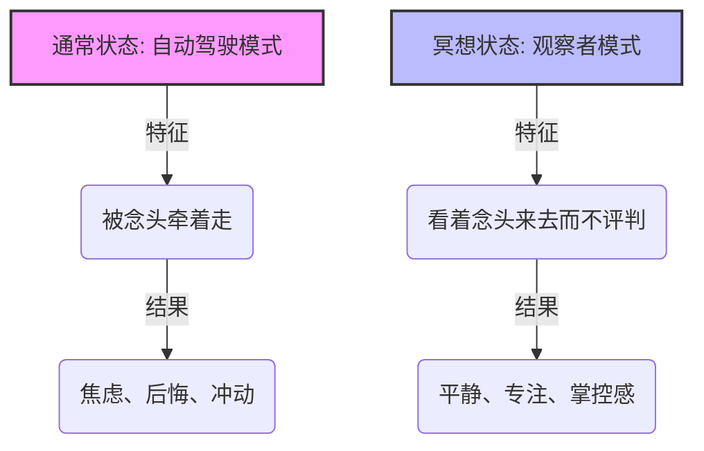
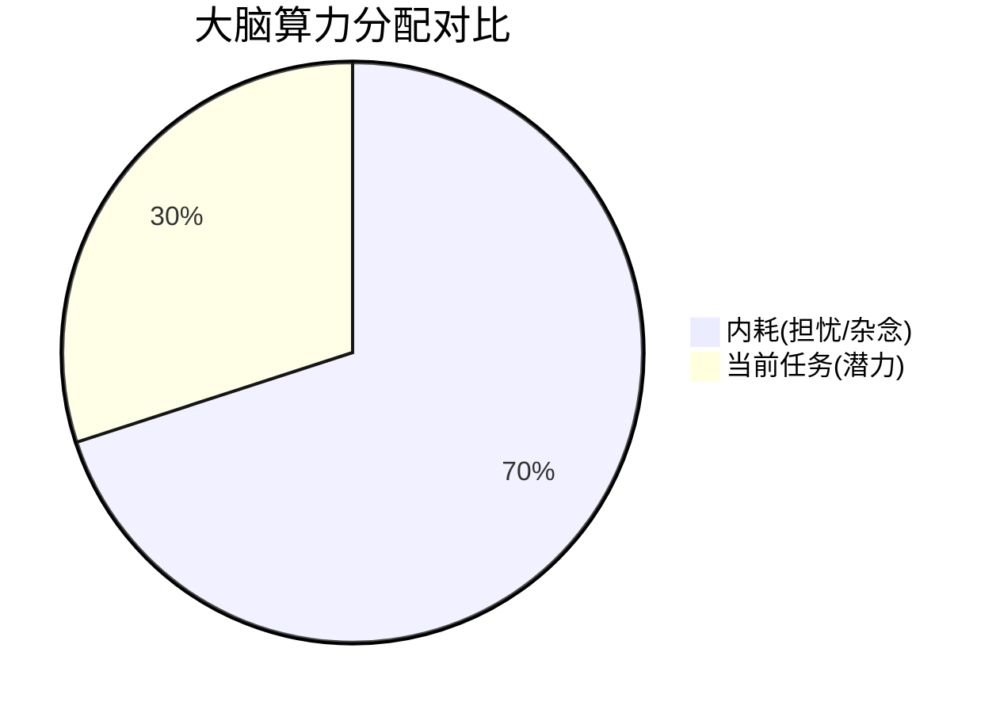
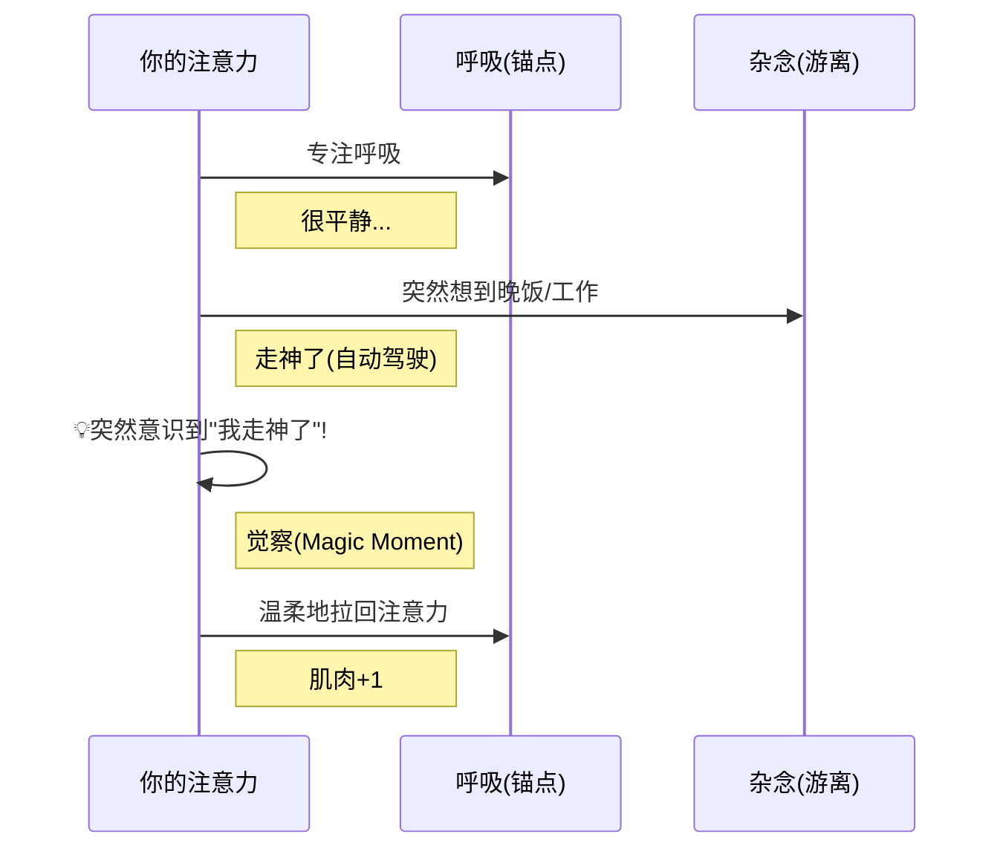

你好！很高兴能为你揭开“冥想”这层看似神秘的面纱。

我是你的老师。今天我们不谈玄学，不谈宗教，我们用**脑科学**、**心理学**和**最直观的比喻**，来把“冥想”这颗洋葱剥开。你会发现，它其实是人类大脑的一种“底层维护工具”。

---

### 第一部分：冥想到底是什么？（费曼式讲解）

想象一下，你的大脑是一台**从不关机的超级电脑**。
哪怕你此刻只是在发呆，后台也运行着无数程序：
*   “中午吃什么？”
*   “刚才那个人的眼神是不是看不起我？”
*   “明天的汇报还没做完……”
ID: 1774612228182

这种状态，就像电脑打开了100个浏览器标签页，风扇呼呼转，CPU过热，这就叫**精神内耗**。

**冥想，就是手动关闭这些后台标签页，只保留一个主窗口（当下）的过程。**

它不是让你“停止思考”（那是死人），而是让你从**“思考者”**变成**“观察者”**。

#### 👁️ 图解：大脑的两种模式

ID: 1774612228185

**通俗比喻：**
*   **平时的你**：像坐在路边看车流（念头），看到一辆红车（焦虑），你马上跳上去，被它拉着跑了十公里才反应过来。
*   **冥想的你**：依然坐在路边看车流，红车来了，你看到了，说“哦，那是红车”，然后看着它开走，**你屁股没动**。

---

### 第二部分：它真的能提升自律和潜力吗？

答案是：**真的。但这虽然不是魔法，却是“健身”。**
ID: 1774612228188

如果你去健身房举铁，你的肌肉纤维会撕裂重组，变得更强壮。
冥想，就是**大脑的健身房**。

#### 1. 关于自律（前额叶皮层的胜利）
自律的生理基础是大脑的**前额叶皮层**（负责理智、决策）。而冲动（想刷手机、想吃甜食）来自**杏仁核**（负责情绪、本能）。
*   **不冥想的人**：杏仁核像个壮汉，前额叶是个瘦子。情绪一来，理智直接被干趴下。
*   **长期冥想**：你的前额叶变厚了（物理意义上的变厚），你能更快察觉到“我想偷懒”这个念头，并拦截它。这就是自律。
ID: 1774612228191

#### 2. 关于潜力（清理内存）
你的潜力就像电脑的算力。如果不清理后台程序（焦虑、恐惧、杂念），你的可用算力只有20%。
冥想帮你清理了80%的垃圾进程，当你去学习、工作时，你是**满血运行**。这就叫发挥潜力。
ID: 1774612228194

*冥想后，蓝色的部分会大幅减少，橙色部分大幅增加。*

---

### 第三部分：具体应该如何冥想？（实操指南）

很多人的误区是：“我必须盘腿坐，必须要点香，必须脑子一片空白。”
**错！** 只要你能呼吸，你就能冥想。
ID: 1774612228197

最经典、最有效的入门法：**观呼吸（Mindfulness of Breathing）**。

#### 步骤说明：

1.  **姿势**：找个舒服的地方坐下（椅子、沙发、床都行），关键是**背要直**（为了不睡着）。闭上眼。
2.  **锚点**：把注意力集中在**呼吸**上。感受空气流过鼻尖的凉意，或者肚子的起伏。这就是你的“锚”。
3.  **游离（必然发生）**：没过几秒，你肯定会走神：“晚上吃火锅吗？”“腿有点痒”。
4.  **魔法时刻（关键！）**：当你**意识到**自己走神的那一瞬间，**恭喜你！这才是冥想最核心的锻炼！**
5.  **回归**：温和地把注意力拉回到呼吸上。不要责怪自己。
ID: 1774612228201

#### 🏋️‍♀️ 冥想循环图（每一次循环就是一次“大脑举铁”）

ID: 1774612228205

**重点：** 冥想不是比谁坐得久，而是比**谁把走神的思绪拉回来的次数多**。走神一千次，就拉回来一千次，你就锻炼了一千次。

---

### 第四部分：实用场景举例

冥想不一定要专门抽30分钟，它可以碎片化。
ID: 1774612228208

#### 场景 1：在这个被老板/老师骂了之后（情绪急救）
*   **惯性反应**：愤怒、委屈、想回嘴、在大脑里重演吵架画面。
*   **冥想介入**：闭眼1分钟（哪怕在厕所）。
    *   深呼吸。
    *   对自己说：“我现在感到很愤怒，我的胸口很闷。”（**标记情绪**，而不是**成为情绪**）。
    *   你会发现，那个愤怒的火球因为被你“看见”了，反而变小了。
ID: 1774612228212

#### 场景 2：睡觉前脑子停不下来（助眠）
*   **惯性反应**：翻来覆去想白天的事。
*   **冥想介入**：做“身体扫描”。
    *   从脚趾头开始，想象一股暖流，慢慢放松脚踝、小腿、大腿……一直到头顶。
    *   注意力只在身体的感受上，脑子就没空想别的了。
ID: 1774612228216

#### 场景 3：不想开始工作/学习（拖延症）
*   **冥想介入**：只做“3次深呼吸冥想”。
    *   告诉自己：我不开始工作，我先坐着呼吸3次。
    *   这3次呼吸会切断多巴胺对手机的渴望，让你的前额叶重新上线。
ID: 1774612228219

---

### 第五部分：拓展学习（由浅入深）

当你掌握了基础的观呼吸，你可以拓展以下领域：
ID: 1774612228223

1.  **正念（Mindfulness）**：
    *   冥想是练习，正念是生活状态。就是吃饭时只吃饭（不看手机），走路时只走路。这是冥想在生活中的延伸。
2.  **神经可塑性（Neuroplasticity）**：
    *   推荐阅读《大脑健身房》或《重塑大脑》。科学证明大脑像橡皮泥，冥想可以物理改变大脑结构（海马体密度增加，杏仁核缩小）。
3.  **慈悲冥想（Metta）**：
    *   如果你容易对自己苛刻或讨厌别人，这种冥想通过在心中默念对他人的祝福，能有效提升幸福感。
4.  **App 辅助**：
    *   初期很难坚持，可以使用 Headspace, Calm，或者国内的潮汐、Keep冥想课进行**引导式冥想**。

---

### 第六部分：加强练习（老师来考考你）

为了确认你真的理解了，请在心里回答这两个问题：
ID: 1774612228227

**题目 1：**
在冥想过程中，如果你的脑子里全是杂念，想东想西，根本静不下来，这是不是说明你**失败**了？如果是你，你会怎么做？

**题目 2：**
冥想所谓的“控制情绪”，是指如果你感到生气，就通过冥想强行压抑住怒火，告诉自己“我不生气”，对吗？

---
*(请先思考一下，再看下方的参考答案)*

.
.
.

**参考答案：**

**答案 1：**
绝对不是失败！
**解析**：只要你**发现**自己静不下来，那个“发现”的瞬间，你就已经成功了。冥想的本质就是“发现走神 -> 拉回注意力”的循环。哪怕全程都在走神和拉回之间搏斗，这也是一次高质量的“大脑举铁”。

**答案 2：**
不对。
**解析**：冥想不是压抑（压抑像堵住洪水，迟早决堤）。冥想是**观察**。是承认“我现在很生气”，然后像看那个“红车”一样看着怒火，不给它加戏。往往当你客观审视情绪时，情绪的控制权就回到了你手中，它自然会消散。

同学，今天的课就上到这里。哪怕今天只试着深呼吸**一分钟**，你也已经踏上了重塑大脑的旅程。开始行动吧！