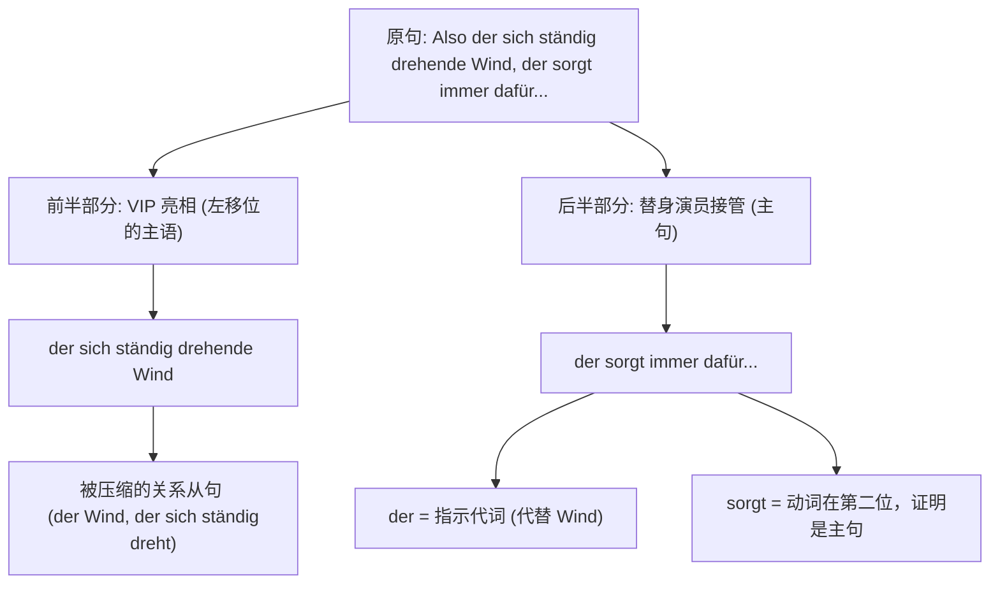

# Wo die Brände nicht gestoppt werden konnten, bietet sich für die Anwohner ein schockierender Anblick.

^twbva4

- 为什么把从句放前面？
- sich 的使用原理？
	- 主语为什么置后了
- 比较特殊的从句引导词有哪些？ wo ..

这句话里包含的是德语最常见的两个语法原理：**从句动尾** 和 **主句动二**。我们先把它拆开，再逐个词看。

句子：

> **Wo die Brände nicht gestoppt werden konnten, bietet sich für die Anwohner ein schockierender Anblick.**

它整体是一个结构：

> **[从句] + [主句]**  
> 从句在前，“第一位置”被整个从句占掉；主句的变位动词紧跟其后。

---

## 一、先看从句

### 「Wo die Brände nicht gestoppt werden konnten」

逐词拆：

| 德语 | 作用/意思 |
|---|---|
| **Wo** | 不是“哪里？”的疑问词，而是“在那些……的地方”= an Orten, an denen。它引导从句。 |
| **die Brände** | 主语，复数，“这些火灾”。单数是 *der Brand*。 |
| **nicht** | 否定词，“不/无法”。 |
| **gestoppt** | 动词 *stoppen* 的过去分词，“被停止/被扑灭”。 |
| **werden** | 被动助动词，“被”。这里因为前面有情态动词，所以用不定式 *werden*，不是 *wurden*。 |
| **konnten** | 情态动词 *können* 的过去式，复数，“能够”。 |

关键原理：  
**Wo 是从属连接词/关系副词，它会把变位动词“踢”到句子末尾。**  
所以 *konnten* 跑到最后，形成了：

> nicht gestoppt werden konnten  
> = could not be stopped  
> = 当时无法被扑灭

这句的意思就是：

> 在那些大火无法被扑灭的地方

---

## 二、再看主句

### 「bietet sich für die Anwohner ein schockierender Anblick」

逐词拆：

| 德语 | 作用/意思 |
|---|---|
| **bietet** | 动词 *bieten* “提供”的第三人称单数。主语是后面的 *ein Anblick*，所以用 *bietet*。 |
| **sich** | 反身代词。和 *bieten* 组成固定搭配 **sich bieten**，意思是“呈现、展现”。 |
| **für die Anwohner** | 介词短语，“对居民们来说”。*für* 后接第四格，*die Anwohner* 是复数，第四格形式不变。 |
| **ein schockierender Anblick** | 主语。“一个令人震惊的景象”。*Anblick* 是阳性名词，所以形容词 *schockierend* 加词尾 **-er**。 |

注意：**这句话真正的主语不是 die Anwohner，而是 ein schockierender Anblick。**

所以直译是：

> 一个令人震惊的景象向他们（居民们）呈现出来。

自然中文是：

> 居民们眼前呈现出一幅令人震惊的景象。

---

## 三、最关键的原理：为什么主句动词开头？

德语陈述句有一条铁律：

> **变位动词永远站在第二位。**

这里的“第二位”不是“第二个单词”，而是“第二个结构位置”。

这句话里：

- 第一位：整个从句 **Wo die Brände nicht gestoppt werden konnten**
- 第二位：主句动词 **bietet**
- 后面：**sich für die Anwohner ein schockierender Anblick**

所以 *bietet* 看起来像在“句首”，其实它仍然是第二位，因为第一位被那个从句占掉了。

这也说明：**一个从句可以当作主句的一个“部件”放在句子的第一个位置。**

---

## 四、还要记住这几点

1. **wo / weil / dass / ob 这类连词，都会让从句动词跑到句尾。**  
   例：  
   - 正常句：Die Brände konnten nicht gestoppt werden.  
   - 变从句：... wo die Brände nicht gestoppt werden konnten.

2. **情态动词 + 被动**的结构是：  
   **Partizip II + werden + Modalverb**  
   - gestoppt werden konnten

3. **sich bieten 是整体词组**，不能丢掉 sich。  
   - sich bieten = sich zeigen = 呈现、展现

4. **形容词词尾跟着名词的性、数、格走。**  
   - *Anblick* 是阳性，主格，前面有 *ein*，所以形容词加 **-er**：  
     ein schockierender Anblick

5. **主语可以后置。**  
   *ein schockierender Anblick* 虽然在句子后面，但它是主语；德语为了保持动词第二位，可以把主语放到动词后面去。

---

## 整句翻译

直译：

> 在大火无法被扑灭的地方，一种令人震惊的景象呈现在居民们面前。

自然中文：

> 在大火没有被扑灭的地方，居民们看到了一幅触目惊心的景象。

# Also der sich ständig drehende Wind, der sorgt immer dafür, dass das Feuer einmal hier und einmal dort stärker ist.这个句子对吗，偶尔的时候在前面不应该是从局吗，什么后面好像是关系重聚 der sorgt  

### 核心知识点一：后面真的是关系从句吗？—— 破解“替身演员” (Linksversetzung)

您观察到后半句 `..., der sorgt immer dafür...` 感觉像是一个关系从句。这是一个极其常见的视觉错觉！

**如何判断它不是关系从句？**

看**动词的位置**！

- 如果是关系从句 (Relativsatz)，动词必须在句尾：_..., der immer dafür **sorgt**._
- 但在您的句子里，动词 `sorgt` 紧紧跟在 `der` 的后面，占据了**第二位 (Position 2)**。这证明它是一个绝对的**主句 (Hauptsatz)**！

那么这个 `der` 是什么呢？它叫做**指示代词 (Demonstrativpronomen)**。这种句型结构在德语中被称为 **左移位 (Linksversetzung)**。

#### 形象类比：VIP 与替身演员

想象一下，主语（也就是那个很长的 `der sich ständig drehende Wind`）是一位好莱坞 **VIP 巨星**。

巨星走红毯时，需要在最前面单独亮相，摆好姿势让大家拍照（句首的位置，加上一个逗号停顿）。但是，巨星很累，不想亲自去干涉后面的具体动作。于是，在逗号之后，巨星派出了他的**替身演员 (指示代词 der)**，由替身演员去完成后面的动作（动词 `sorgt`）。

**公式：[长长的主语 VIP], [替身演员 der/die/das] + [动词] + [其他成分]**

**为什么德国人爱用这个？**

在口语交流中，如果主语太长，说话人为了强调这个主语，会先把它抛出来，停顿一下，然后再用一个简短的 `der/die/das` 把话接下去。这样不仅起到了强调作用，还能让听者的大脑有时间缓冲。

### 核心知识点二：前面为什么不是从句？—— 破解“语法压缩包” (Partizipialattribut)

您敏锐地感觉“前面偶尔的时候应该是个从句”。大师必须给您点个赞！您的直觉完全正确！

前面的 `der sich ständig drehende Wind`（不断改变方向的风），在本质上**就是由一个关系从句变来的**。这种高级语法叫做**扩展分词定语 (erweitertes Partizipialattribut)**。

#### 形象类比：语法 ZIP 压缩包

想象您有一个很大的文件夹，也就是一个完整的关系从句：

- _der Wind, **der sich ständig dreht**_ (那阵风，它不断地在转动)

在 B 2/C 1 的学术或正式文本中，德国人觉得写从句太啰嗦，于是他们把这个从句放入了“语法 ZIP 压缩软件”中：

1. 把动词 `drehen` 变成第一分词 `drehend`。
2. 把从句里的其他成分 (`sich ständig`) 统统塞到冠词 `der` 和名词 `Wind` 之间。
3. 加上形容词词尾 `-e`。

最终解压缩出来的结果就是：`der [sich ständig drehende] Wind`。

这就是为什么您会觉得它“本来应该是个从句”，因为它本身就是一个被强行压缩成形容词短语的从句！

### 语法结构视觉拆解图

为了让您更直观地理解这个复杂句子的结构，我制作了下面的语法逻辑拆解图。Mermaid 是一个 JavaScript 库，它将编写的实体和关系声明转换为图表。如果您对这种通过代码生成图表的技术感兴趣，可以参考一份名为 The Mermaid Guide to Text-Based Diagramming and Visualization 的文件。

代码段

### 结合移民生活场景的实战演练

掌握了“VIP 与替身演员 (左移位)”以及“语法压缩包 (分词定语)”，您的德语口语将瞬间摆脱浓重的“教材味”，变得像本地人一样地道。我们来看看在德国生活时如何使用：

**【场景一：租房事务】**

- _情景：_ 您在向朋友抱怨刚刚看的一套非常贵的房子。
- _德语发音：_ Die gestern frisch **renovierte** Wohnung, die ist mir leider viel zu teuer.
- _解析：_ `gestern frisch renovierte` 是语法压缩包（昨天刚装修好的）；逗号后的 `die` 是替身演员，指代那套房子；动词 `ist` 在第二位。
- _中文翻译：_ 昨天刚装修好的那套公寓，（它）对我来说实在太贵了。

**【场景二：行政办事 (外管局/Arbeitsagentur)】**

- _情景：_ 办事员给您的表格找不到了，您向他强调就是刚才签字的那份。
- _德语发音：_ Das von mir soeben **unterschriebene** Formular, das habe ich Ihnen doch schon gegeben!
- _解析：_ `von mir soeben unterschriebene` 压缩了从句 (das Formular, das ich soeben unterschrieben habe)；`das` 作为替身演员强调这份表格。
- _中文翻译：_ 我刚才签好字的那份表格，（那份表格）我已经交给您了呀！

**【场景三：医疗就诊】**

- _情景：_ 医生问您之前开的药效果如何。
- _德语发音：_ Das mir letzte Woche **verschriebene** Medikament, das hilft wirklich sehr gut.
- _中文翻译：_ 您上周给我开的那个药，（那个药）效果真的非常好。
