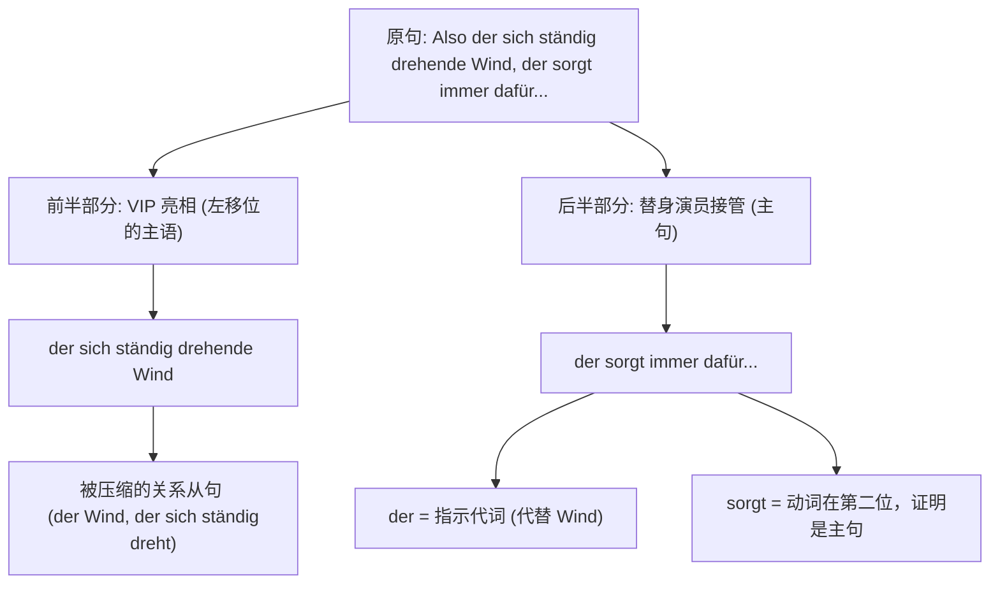

# Wo die Brände nicht gestoppt werden konnten, bietet sich für die Anwohner ein schockierender Anblick.

^twbva4

- 为什么把从句放前面？
- sich 的使用原理？
	- 主语为什么置后了
- 比较特殊的从句引导词有哪些？ wo ..

这句话里包含的是德语最常见的两个语法原理：**从句动尾** 和 **主句动二**。我们先把它拆开，再逐个词看。

句子：

> **Wo die Brände nicht gestoppt werden konnten, bietet sich für die Anwohner ein schockierender Anblick.**

它整体是一个结构：

> **[从句] + [主句]**  
> 从句在前，“第一位置”被整个从句占掉；主句的变位动词紧跟其后。

---

## 一、先看从句

### 「Wo die Brände nicht gestoppt werden konnten」

逐词拆：

| 德语 | 作用/意思 |
|---|---|
| **Wo** | 不是“哪里？”的疑问词，而是“在那些……的地方”= an Orten, an denen。它引导从句。 |
| **die Brände** | 主语，复数，“这些火灾”。单数是 *der Brand*。 |
| **nicht** | 否定词，“不/无法”。 |
| **gestoppt** | 动词 *stoppen* 的过去分词，“被停止/被扑灭”。 |
| **werden** | 被动助动词，“被”。这里因为前面有情态动词，所以用不定式 *werden*，不是 *wurden*。 |
| **konnten** | 情态动词 *können* 的过去式，复数，“能够”。 |

关键原理：  
**Wo 是从属连接词/关系副词，它会把变位动词“踢”到句子末尾。**  
所以 *konnten* 跑到最后，形成了：

> nicht gestoppt werden konnten  
> = could not be stopped  
> = 当时无法被扑灭

这句的意思就是：

> 在那些大火无法被扑灭的地方

---

## 二、再看主句

### 「bietet sich für die Anwohner ein schockierender Anblick」

逐词拆：

| 德语 | 作用/意思 |
|---|---|
| **bietet** | 动词 *bieten* “提供”的第三人称单数。主语是后面的 *ein Anblick*，所以用 *bietet*。 |
| **sich** | 反身代词。和 *bieten* 组成固定搭配 **sich bieten**，意思是“呈现、展现”。 |
| **für die Anwohner** | 介词短语，“对居民们来说”。*für* 后接第四格，*die Anwohner* 是复数，第四格形式不变。 |
| **ein schockierender Anblick** | 主语。“一个令人震惊的景象”。*Anblick* 是阳性名词，所以形容词 *schockierend* 加词尾 **-er**。 |

注意：**这句话真正的主语不是 die Anwohner，而是 ein schockierender Anblick。**

所以直译是：

> 一个令人震惊的景象向他们（居民们）呈现出来。

自然中文是：

> 居民们眼前呈现出一幅令人震惊的景象。

---

## 三、最关键的原理：为什么主句动词开头？

德语陈述句有一条铁律：

> **变位动词永远站在第二位。**

这里的“第二位”不是“第二个单词”，而是“第二个结构位置”。

这句话里：

- 第一位：整个从句 **Wo die Brände nicht gestoppt werden konnten**
- 第二位：主句动词 **bietet**
- 后面：**sich für die Anwohner ein schockierender Anblick**

所以 *bietet* 看起来像在“句首”，其实它仍然是第二位，因为第一位被那个从句占掉了。

这也说明：**一个从句可以当作主句的一个“部件”放在句子的第一个位置。**

---

## 四、还要记住这几点

1. **wo / weil / dass / ob 这类连词，都会让从句动词跑到句尾。**  
   例：  
   - 正常句：Die Brände konnten nicht gestoppt werden.  
   - 变从句：... wo die Brände nicht gestoppt werden konnten.

2. **情态动词 + 被动**的结构是：  
   **Partizip II + werden + Modalverb**  
   - gestoppt werden konnten

3. **sich bieten 是整体词组**，不能丢掉 sich。  
   - sich bieten = sich zeigen = 呈现、展现

4. **形容词词尾跟着名词的性、数、格走。**  
   - *Anblick* 是阳性，主格，前面有 *ein*，所以形容词加 **-er**：  
     ein schockierender Anblick

5. **主语可以后置。**  
   *ein schockierender Anblick* 虽然在句子后面，但它是主语；德语为了保持动词第二位，可以把主语放到动词后面去。

---

## 整句翻译

直译：

> 在大火无法被扑灭的地方，一种令人震惊的景象呈现在居民们面前。

自然中文：

> 在大火没有被扑灭的地方，居民们看到了一幅触目惊心的景象。

# Also der sich ständig drehende Wind, der sorgt immer dafür, dass das Feuer einmal hier und einmal dort stärker ist.这个句子对吗，偶尔的时候在前面不应该是从局吗，什么后面好像是关系重聚 der sorgt  

### 中间 der sorgt immer dafür 怎么理解？

其中 **dafür** 是“代副词”，后面的 **dass 从句**解释“dafür”的具体内容。  
也就是说：

> **dafür, dass ...** = 为“……”这件事 / 使得……

所以整句意思是：

> 这个不断转向的风，总是会让火势一会儿在这里强一些，一会儿在那里强一些。

中间部分 **“der sorgt immer dafür”** 可以理解为：

> 它总是造成 / 它总是导致（后面这个情况）

### 核心知识点二：前面为什么不是从句？—— 破解“语法压缩包” (Partizipialattribut)

前面的 `der sich ständig drehende Wind`（不断改变方向的风），在本质上**就是由一个关系从句变来的**。这种高级语法叫做**扩展分词定语 (erweitertes Partizipialattribut)**。

#### 形象类比：语法 ZIP 压缩包

想象您有一个很大的文件夹，也就是一个完整的关系从句：

- _der Wind, **der sich ständig dreht**_ (那阵风，它不断地在转动)

在 B 2/C 1 的学术或正式文本中，德国人觉得写从句太啰嗦，于是他们把这个从句放入了“语法 ZIP 压缩软件”中：

1. 把动词 `drehen` 变成第一分词 `drehend`。
2. 把从句里的其他成分 (`sich stmändig`) 统统塞到冠词 `der` 和名词 `Wind` 之间。
3. 加上形容词词尾 `-e`。

最终解压缩出来的结果就是：`der [sich ständig drehende] Wind`。

这就是为什么您会觉得它“本来应该是个从句”，因为它本身就是一个被强行压缩成形容词短语的从句！

# Denn eine Gruppe abtrünniger Abgeordneter verweigert die geforderte schriftliche Erklärung loyal zur Partei zu stehen und verlässt die Fraktion.这前面半句的句子里面怎么有两个动词，并且为什么后面又有两个 zu

### 真假美猴王：为什么后面有两个 "zu"？

这是学习者在跨越 B 1 门槛时最容易绊倒的地方：**"...loyal zur Partei zu stehen..."**

这里的两个“zu”，就像是一对长得一模一样但职业完全不同的双胞胎兄弟。我们用一张表格来对比它们的真实身份：

|**词汇**|**真实身份**|**作用与功能**|**在本句中的含义**|
|---|---|---|---|
|**zur** (zu + der)|**导航员**（介词 Präposition）|永远接第三格（Dativ），指示方向或对象。|**对/向**着党派 (zur Partei)|
|**zu** (zu stehen)|**红娘**（不定式符号 Infinitiv mit zu）|牵线搭桥，把名词和补充说明它的动词原形连接起来。|将“声明”与“保持(忠诚)”连接|

- **老大“导航员”（介词 zu）：**
    德语中 `zu` 作为介词时，要求后面的名词必须是第三格（Dativ）。因为 `Partei` 是阴性（die），第三格变成 `der`。为了说话省力，德国人把 `zu + der` 缩写成了 **zur**。它表示的是对象——对谁保持忠诚？**对党派（zur Partei）**。
- **老二“红娘”（带 zu 的不定式）：**
    当我们想要补充说明一个名词（比如 Erklärung 声明）的具体内容时，如果内容包含动作（stehen 站立/保持），就需要用到 `zu + 动词原形`。这里的 **zu stehen** 构成了一个不定式从句，相当于给前面的“声明”打了一个补丁，解释这份声明的内容是“保持忠诚”。
