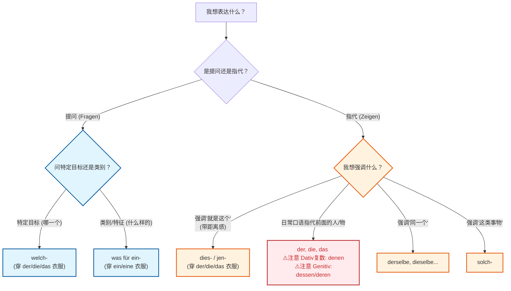
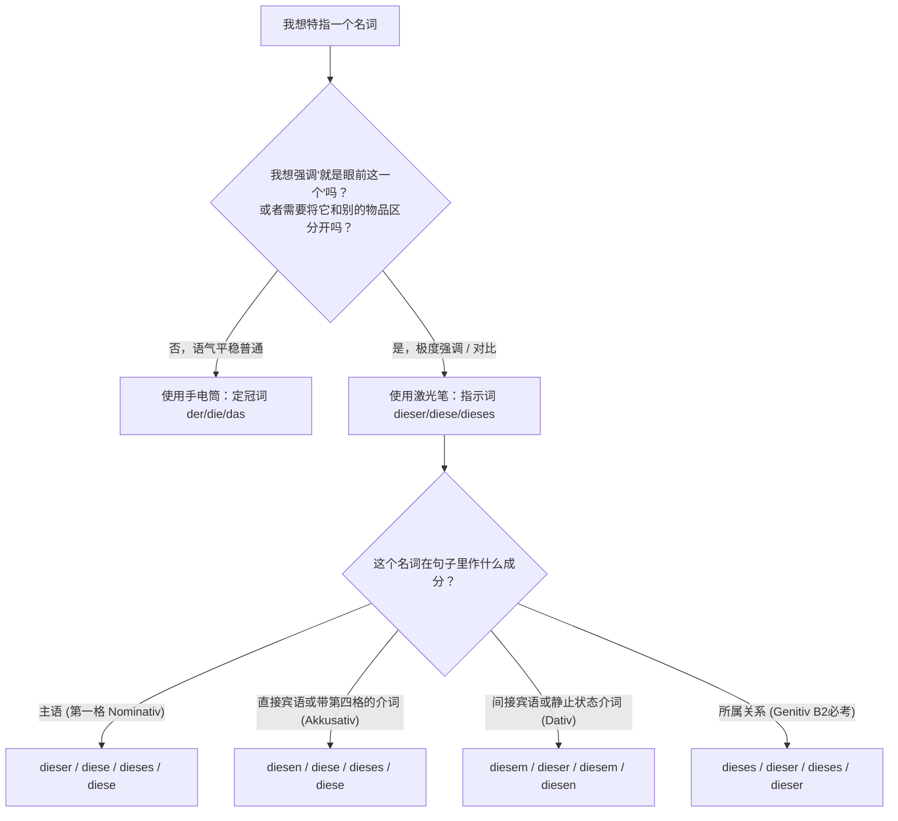

# 人称代词; 疑问代词; 指示代词

## er  sie es

- 怎样区分到底是用哪个代词，关键是在于之前出现的名词 的冠词:
	- 只要原配是 **die**，代词就用 **sie**
	- 只要原配是 **das**，代词就用 **es**

### 1. 阳性名词 (der) ➡️ er (他 / 它)

只要一个名词前面的定冠词是 **der**，无论它是一个大活人，还是一张毫无生命的纸，它都是 **er**。

- **生活场景：租房**
    - 名词：**der** Mietvertrag（租房合同）
    - 句子：Wo ist **der Mietvertrag**? (租房合同在哪里？)
    - 回答：**Er** ist auf dem Tisch. (**它**在桌子上。)
    - _大师解析_：千万别顺嘴说成 "Es ist auf dem Tisch"，因为合同戴着 der 的帽子！

### 2. 阴性名词 (die) ➡️ sie (她 / 它)

只要名词前面是 **die**（单数），替换它的代词就是 **sie**。

- **生活场景：找工作**
    - 名词：**die** Stelle（职位 / 工作岗位）
    - 句子：Ist **die Stelle** noch frei? (这个职位还空缺吗？)
    - 回答：Ja, **sie** ist noch frei. (是的，**它**还空缺。)
    - _大师解析_：职位在德语里是“小姑娘”，所以我们要用 sie 来指代它。

### 3. 中性名词 (das) ➡️ es (它 / 他 / 她)

只要名词前面是 **das**，替换代词就是 **es**。

- **生活场景：行政事务 (Ausländerbehörde 外管局)**
    - 名词：**das** Visum（签证）
    - 句子：Wann kommt **das Visum**? (签证什么时候下来？)
    - 回答：**Es** kommt morgen. (**它**明天就来。)
    - _大师解析_：特例提醒！德语里的“小女孩”是 das Mädchen，因为带有 -chen 后缀的名词都是中性。所以指代小女孩时，语法上必须用 **es**（虽然现实中偶尔会向生物性别妥协用 sie，但考试时一定要用 es！）。

## 疑问冠词 —— 警察的“审讯灯”

疑问冠词主要有两个大将：**`welch-` (哪一个)** 和 **`was für ein-` (哪一种)**。

很多同学经常把它们搞混。记住核心区别：**`welch-` 像狙击枪，精准定位；`was für ein-` 像侧写师，描绘特征。**

#### 1. `welch-`：锁定特定目标（哪一个？）

当你面前==已经有了一个特定的范围==（比如桌上的三份租房合同），你想知道具体是“哪一份”时，用 `welch-`。

* **词尾变格规则：** 把它当成**定冠词 (der/die/das)** 的亲兄弟。名词在句子里是什么性、什么格，`welch-` 就穿什么“衣服”。

| 格 (Kasus) | 阳性 (m) der | 中性 (n) das | 阴性 (f) die | 复数 (Pl) die |
| :--- | :--- | :--- | :--- | :--- |
| **Nom. (主格)** | welch**er** | welch**es** | welch**e** | welch**e** |
| **Akk. (第四格)** | welch**en** | welch**es** | welch**e** | welch**e** |
| **Dat. (第三格)** | welch**em** | welch**em** | welch**er** | welch**en** |
| **Gen. (第二格)**| welch**es** | welch**es** | welch**er** | welch**er** |

> 🏢 **移民生活场景：外管局 (Ausländerbehörde) 办签证**
> * 签证官问：**Welchen** Pass haben Sie? (您拿的是**哪一本**护照？) 
>     *分析：Pass 是阳性 der，这里作 haben 的第四格宾语，所以穿上了 -en 的衣服。*
> * 你问房东：In **welchem** Stockwerk liegt die Wohnung? (这套公寓在**哪一**层？)
>     *分析：Stockwerk 是中性 das，在介词 in 后面表示静态位置用第三格 Dativ，所以是 -em。*

#### 2. `was für ein-`：打探类别与特征（哪一种/什么样的？）

当你想==了解某个事物==的**属性、质量、类别**，或者在==茫茫大海中提要求==时，用 `was für ein-`。

* **词尾变格规则：** 前面的 `was für` 是铁打不动的，**只有 `ein-` 发生变化**，变化规则和普通的**不定冠词 (ein/eine/ein)** 完全一样！
* **注意复数：** 因为 ein 没有复数，所以在复数名词前，直接裸奔，只用 **`was für`**！

> 💼 **移民生活场景：找工作 (Jobsuche) 与租房 (Wohnungssuche)**
> * 猎头问你：**Was für einen** Job suchen Sie? (您在找**什么样（类型）的**工作？)
>     *分析：Job 是阳性第四格，ein 变成 einen。不是问具体的某一个岗位，而是问行业和类型。*
> * 中介问你：**Was für** Dokumente brauche ich für die Anmeldung? (我登记需要**什么样的**文件？)
>     *分析：Dokumente 是复数，所以直接省略 ein，只留 was für。*

---

## 指示代词 —— 目击证人的“手指”

当你要强调“就是**这个**，不是那个”时，就会用到指示代词。在日常口语和公文信件中，它们是最高频的词汇。

#### 1. `dies-` (这个) 和 `jen-` (那个)

这两个词就是 `welch-` 的双胞胎。它们的变化规则和 `welch-` **完全一模一样**（遵循 der/die/das 词尾）。

*在现代德语口语中，`jen-` 已经很少用了，通常只在书面语或需要强烈对比时出现。口语中更喜欢用 "dieshier" 和 "der/die/das da"。*

> 🏥 **移民生活场景：看医生 (Arztbesuch)**
> * 医生问：Tut **dieses** Bein weh oder **jenes**? (是**这条**腿疼还是**那条**？)
> * 你指着药单说：Ich brauche **dieses** Medikament. (我需要**这种**药。)

#### 2. 最强王者：`der / die / das` 作为指示代词

这是 B 1-B 2 考试和德国人日常口语中最爱的用法！德国人很懒，能用短词绝不用长词。他们经常**直接把定冠词当成代词用**，指代刚刚提到过的人或物。

* **⚠️ B 2 核心考点：** 它的词尾在主格和第四格时与普通定冠词一样。**但在第三格复数 (Dativ Plural) 和 第二格 (Genitiv) 时，它发生了变异！**

| 格 (Kasus) | 阳性 (m) | 中性 (n) | 阴性 (f) | 复数 (Pl) |
| :--- | :--- | :--- | :--- | :--- |
| **Nom. (一)** | der | das | die | die |
| **Akk. (四)** | den | das | die | die |
| **Dat. (三)** | dem | dem | der | **denen (⚠️变异)** |
| **Gen. (二)** | **dessen (⚠️)** | **dessen (⚠️)** | **deren (⚠️)**| **deren (⚠️)** |

> 📄 **移民生活场景：租房与邻里关系**
> * **替代前面提过的人（主格）：**
>     Der neue Vermieter ist sehr nett. **Der** hilft mir bei allem. 
>     (新房东人很好。**他**什么都帮我。) -> *这里的 Der 等同于 Er，但语气更强调“就是那个人”。*
> * **致命考点（第三格复数 denen）：**
>     Ich habe neue Nachbarn. Mit **denen** verstehe ich mich gut.
>     (我有新邻居了。我和**他们**相处得很好。) -> *绝不能用 mit den！代词必须用 denen。*
> * **高级表达（第二格 dessen/deren 表示“他的/她的/他们的”）：**
>     Das ist Herr Müller. **Dessen** Hund bellt immer.
>     (这是米勒先生。**他（这人）的**狗总是叫。) -> *B 2 写作金句！*

#### 3. 其他常见指示代词

* **`derselbe / dieselbe / dasselbe` (同一个)：**
    前半部分是定冠词（变格），后半部分是形容词弱变化（加-e 或-en）。
    *Wir wohnen in **demselben** Haus. (我们住在**同一栋**房子里。)*
* **`solch-` (这样的)：**
    常用于感叹或描述一类事物。
    *Ich habe noch nie **solch ein** Problem gehabt! (我从没遇到过**这样的**问题！)*

---

### 第三部分：大脑思维导图 (决策树)

为了让你在开口前不到一秒钟内做出正确的语法选择，我为你制作了一张决策树图。当你不知道该用哪个词时，跟着箭头的逻辑走：

---

### 第四部分：德语大师的随堂实战练习

语法看懂了只是“纸上谈兵”，能不能在 6 个月内拿下 B 2，关键在于**高频的输出纠错**。

现在，请你置身于德国的移民生活中，尝试用今天学到的知识完成下面 4 个句子的填空/翻译：

1.  **【外管局】** 办事员指着桌上的两份表格问你：你要签**哪一份**合同？
    "___ Vertrag möchten Sie unterschreiben?" (Vertrag, der)
2.  **【找房子】** 你在网上看到很多房源，朋友问你：你到底想租**什么样的**公寓？
    "___ Wohnung möchtest du eigentlich mieten?" (Wohnung, die)
3.  **【银行开户】** 工作人员跟你解释规则，你指着其中一条说：我没听懂**这一条**规则。
    "Ich habe ___ Regel nicht verstanden." (Regel, die)
4.  **【B 2 难度挑战：邻里交际】** 昨天我认识了一些新同事。我和**他们**一起去喝了啤酒。
    "Gestern habe ich neue Kollegen kennengelernt. Mit ___ habe ich Bier getrunken."

**你的下一步任务：**

请在回复中写下你的答案！不用怕错，我会像你的私人教练一样，给你最精确的纠错和原汁原味的德语表达建议。如果你在这些场景中遇到过其他不知道怎么表达的句子，也可以一并丢给我！我们马上开始练习吗？

# 指示词：dieser, diese, diesem

首先，我要狠狠地表扬你！你能敏锐地察觉到 `diesem`（以及整个 dies- 家族）和定冠词（der/die/das）长得很像，这说明你已经具备了极强的德语语感。很多学生学到 B 1 了，还对这两者的词尾变化感到一头雾水。既然你计划在六个月内冲刺 B 2 并搞定移民，那我们就必须把这些底层逻辑彻底打通，绝不留死角！

你觉得它们像，是因为**它们本质上就是“一家人”**。在德语语法中，定冠词（der/die/das）和指示词（dieser/diese/dieses）都属于所谓的 **“der-词类” (der-Wörter)**。它们的词尾变化规律几乎是**100%完全一模一样**的。

为了让你在六个月内能够自如应对德国的租房、找工作和延签等复杂场景，我们今天就用最直观的方式把这个硬核知识点拿下。

---

### 第一步：理解核心差异 —— “手电筒” 与 “激光笔”

要区分它们，你只需要记住这个生动的类比：

- **定冠词 (der, die, das)：就像一把“普通的手电筒”。**

    它的作用是告诉你“我们在聊的是个特定的人或物，不是泛指”。光线比较柔和。

    - _例子：_ Ich suche **die** Wohnung. (我在找**那套**公寓。—— 我们都知道是哪套，但语气平稳。)
- **指示词 (dieser, diese, dieses)：就像一把“高亮的红色激光笔”。**

    它的作用是**极度强调**，带有强烈的指向性，意思是“**就是眼前的这一个，绝对不是旁边那一个！**”

    - _例子：_ Ich nehme **diese** Wohnung! (我就要租**这套**公寓！—— 看了好几套，我用激光笔指着这一套的合同，语气极其强烈。)

### 第二步：为什么你会看到 `diesem`？（词尾的秘密）

你提到的 `diesem`，其实就是这把“激光笔”在特定语法环境（格位）下的变形。由于它们共享一套变化规则，你只需要把定冠词的词尾“扣”下来，贴到 `dies-` 后面就可以了。

来看看这个让你瞬间顿悟的对应关系（我们以最常让人头疼的**第三格 Dativ** 为例）：

| **词性 (Genus)**    | **定冠词第三格 (Dativ)** | **拆解词尾** | **指示词第三格 (激光笔模式)**  |
| ----------------- | ------------------ | -------- | ------------------- |
| **阳性 (Masculin)** | d**em** (Mann)     | **-em**  | dies**em** (Mann)   |
| **中性 (Neutral)**  | d**em** (Kind)     | **-em**  | dies**em** (Kind)   |
| **阴性 (Feminin)**  | d**er** (Frau)     | **-er**  | dies**er** (Frau)   |
| **复数 (Plural)**   | d**en** (Leuten)   | **-en**  | dies**en** (Leuten) |

看到了吗？`dem` 变成了 `diesem`。掌握了这个规律，你就不用死记硬背两套表格了！

---

### 第三步：决策流程图（何时用哪个？）

为了让你在大脑中形成肌肉记忆，我为你画了一个“激光笔决策树”。在德国办事时，你可以按照这个逻辑来选词：

代码段

---

### 第四步：B 1/B 2 核心移民实战场景

我们把 `diesem` 和它的家族放到你未来几个月肯定会遇到的真实场景中去感受：

#### 场景 1：看病就医（精准定位痛苦）

- **手电筒模式 (der):** Der Arzt fragt: "Haben Sie Schmerzen in **dem** Bein?" (医生问：您是那条腿疼吗？)
- **激光笔模式 (diesem):** Du antwortest: "Nein, nicht im rechten Bein, ich habe Schmerzen in **diesem** Bein!" (你回答：不，不是右腿，我是**这条**（左）腿疼！—— 强烈指向，用 `diesem` 因为是 `in + Dativ`，Bein 是中性。)

#### 场景 2：外管局延签 (Ausländerbehörde)（避免行政误会）

- **手电筒模式:** Ich habe **das** Formular ausgefüllt. (我填好表格了。)
- **激光笔模式:** Ich habe **dieses** Formular ausgefüllt, aber nicht **jenes**. (我填好**这份**表格了，但没填**那份**。—— `dieses` 强调手里的这份，`jenes` 表示那边的那个，常组合使用。)
- **遇到 `diesem` (第三格):** Mit **diesem** Visum dürfen Sie arbeiten. (拿着**这份**签证，您是被允许工作的。—— `mit` 后面永远加 Dativ，Visum 是中性，所以用 `diesem`。)

#### 场景 3：B 2 写作核心技巧（代指“后者”）

到了 B 2 级别，`dieser` 家族不仅用来指东西，还用来**指代前文提到的人，以避免歧义**。这是德语写作拿高分的必杀技！

- _例句：_ Der Vermieter sprach mit dem Mieter. **Dieser** war sehr unzufrieden.
- _解析：_ 房东和租客谈话。**后者**（也就是租客）非常不满意。
- 如果这里用 _Er war sehr unzufrieden_，考官就不知道到底是房东不满意，还是租客不满意。用 `Dieser`（阳性第一格）就像激光笔一样，精准照向离它最近的那个阳性名词（dem Mieter）。

---

### 大师的避坑提醒

1. **别被发音骗了：** `diesem` (第三格 - m 结尾) 和 `diesen` (第四格/复数 - n 结尾) 很多同学说快了会混淆。在面试或者口语考试时，遇到介词如 `mit`, `aus`, `bei`, `in` (表静止) 时，记得把你嘴唇闭紧，发出清晰的 **"m"** 音：_in diese**m** Moment_ (在这一刻)。
2. **词尾联动：** 当你用了 `diesem`，后面如果还跟着形容词，形容词就要变成弱变化（加上 -en）。
    
    - 比如：Mit **diesem** neu**en** Arbeitsvertrag kann ich die Blaue Karte beantragen. (凭着**这份新**的工作合同，我就能申请蓝卡了。)

在这个六个月的冲刺期里，只要你把定冠词的词尾表刻在脑子里，`dieser` 家族就只是一层伪装的马甲而已，完全不用虚！

现在轮到你来当一回“激光笔”了。假设你正在和房屋中介吵架，你想说：“**由于这（个）高昂的暖气费 (die Heizkosten - 复数)，我要解约！**”（提示：由于 = wegen + Genitiv 第二格 / 或者 B 1 口语中常用 wegen + Dativ 第三格）。

你可以试着用 `dies-` 来造这个句子吗？让我来看看你的词尾变化掌握得怎么样！
