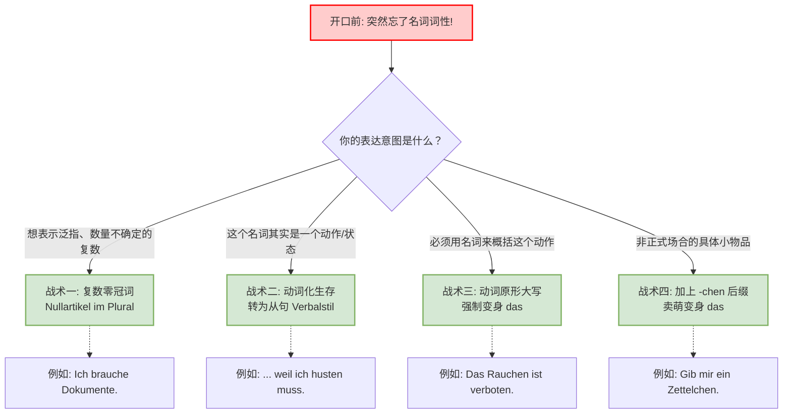
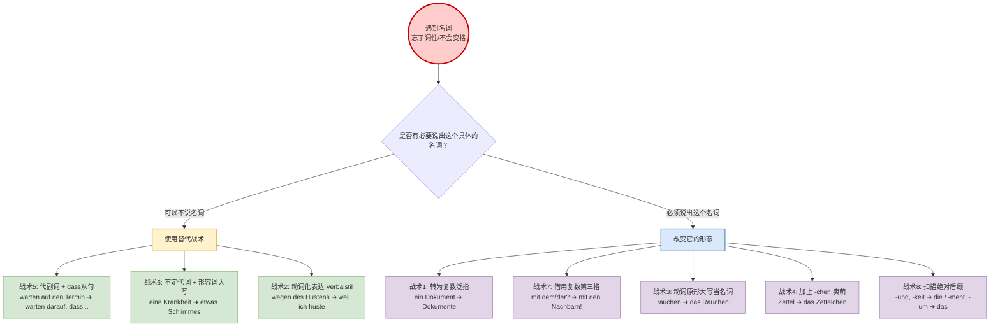

# 不知道词性的备用方案

> [!failure]
> 你知道德语有很多语法，在我们碰到认识单词但是不知道它的词性的时候，也就是定冠词无法确认的时候，是否可以通过一些技巧让冠词消失，从而避免这个错误同时又保证它的语法是正确的

在德语中，死记硬背每一个名词的词性（der/die/das）确实是让无数学习者崩溃的门槛。如果我们碰到一个认识的词，却怎么也想不起它是男、是女还是中性，随便猜一个不仅会暴露外语口音，还会导致后面的形容词词尾（Adjektivdeklination）和格（Kasus）全盘崩溃。

在德语语法的框架内，我们绝对不能像英语那样随便省略冠词（比如你不能说 _Ich kaufe Auto_）。但是，我们确实可以通过一些**完全符合德语语法规则的“隐身术”**，让冠词合法地消失，或者把它们强行统一成我们确定的形式。

### 战术一：复数大逃亡（Nullartikel im Plural）

在德语中，不定冠词（ein/eine/ein）在变成复数时，是**没有复数形式的**。这就产生了一个完美的“零冠词（Nullartikel）”地带！如果你要表达泛指的某类事物，又忘记了它的单数词性，**直接用复数**！

- **语法核心：** 不定冠词的复数即为“无冠词”。
- **应用场景（行政事务 Behördengänge）：** 你去外管局（Ausländerbehörde）办事，需要提交“一份文件”或“一张证明”。你忘了 _Dokument_ 是 das，_Bescheinigung_ 是 die。
- **错误风险：** _Ich brauche einen/eine/ein Dokument._ （一旦猜错，瞬间扣分）
- **大师解法（复数零冠词）：**

    > _Entschuldigung, ich möchte gerne **Dokumente / Bescheinigungen** einreichen._ （打扰了，我想递交**一些文件/证明**。）

**👨‍🏫 大师点评：** 用复数不仅绕过了词性，听起来还特别专业、准备充分！

### 战术二：动词化生存，降维打击（Verbalstil vs. Nominalstil）

这是 B 2 级别最重要的语法分水岭！德国的官方文件特别喜欢用**名词化风格（Nominalstil）**，也就是把动作变成名词，这不仅需要死记词性，还需要搭配复杂的介词和第二格（Genitiv）。 如果你忘了那个抽象名词的词性，最好的办法就是：**把它还原成动词，用从句（Nebensatz）来表达！** 动词是没有词性的！

- **语法核心：** 用从句（如 dass, weil, wenn）替代介词+名词短语。这不仅能规避词性，还能展现你强大的 B 2 从句驾驭能力。
- **应用场景（医疗求诊 Arztbesuch）：** 你去诊所看病，想说“因为剧烈的咳嗽，我睡不着”。你忘了“咳嗽”的名词 _Husten_ 是 der 还是 das。
- **错误风险：** _Wegen der/des/dem Husten(s) kann ich nicht schlafen._ （介词 wegen 支配第二格，没记住词性必错无疑）。
- **大师解法（用 weil 引导的原因状语从句）：**

    > _**Weil ich so stark husten muss**, kann ich nicht schlafen._ （**因为我咳嗽得这么厉害**，我睡不着。）

- **再进阶一步（行政事务 + 被动语态 Passiv）：** 你想要申请“签证的延期”。忘记了 _Verlängerung_ 是 die。

    > 原本想说：_Ich bitte um eine/die Verlängerung meines Visums._ **从句+被动语态解法：** _Ich bitte darum, **dass mein Visum verlängert wird**._ （我请求，**我的签证能够被延期**。）

**👨‍🏫 大师点评：** 用动词代替名词，不仅规避了冠词，而且“动词化风格（Verbalstil）”让语言更具动态感，是 B 2 考试作文中的绝对加分项！

### 战术三：动词原形名词化（Substantivierte Infinitive）

有时候，你必须在句子的主语或宾语位置放一个名词，但你实在想不起那个名词到底是什么，或者忘了词性。怎么办？ **记住这个绝对真理：任何德语动词的“原形大写”，都可以直接当成名词用，并且词性永远是中性（das）！**

- **语法核心：** 动词原形（Infinitiv）首字母大写 = 中性名词（das）。
- **应用场景（租房 Mieten / 房屋守则 Hausordnung）：** 房东抱怨你在深夜发出噪音。你想保证“以后不会在晚上大声放音乐了”。你忘了“播放/听”的专属名词词性。
- **大师解法：**

    > _**Das laute Musikhören** nach 22 Uhr wird nicht mehr vorkommen._ （**晚上 10 点后大声听音乐这件事**，以后不会再发生了。）

**👨‍🏫 大师点评：** 把 _hören_（听）大写变成 _das Hören_，百分之百是 _das_，你再也不用纠结了！

### 战术四：万物皆可“小”（Diminutiv：-chen / -lein 后缀）

这是一招在德国人日常口语中非常讨巧的“卖萌神技”。如果你遇到一个具体的物品，不知道它的词性，只要你在词尾加上 **-chen** 或 **-lein**，它就变成了一个“小东西”，**而所有带有这两个后缀的词，词性无一例外全是中性（das）！**

- **语法核心：** 词根（通常加变音 Umlaut） + -chen = das。
- **应用场景（日常社交 / 职场轻松环境）：** 在办公室，你想问同事要一张便签纸。你突然忘了 _Zettel_（便签）是 der。
- **大师解法：**

    > _Könntest du mir bitte **ein Zettelchen** geben?_ （你能不能给我**一张小纸条**？） _(注：中性的不定冠词第一/第四格都是 ein，极为安全)_

**👨‍🏫 大师点评：** 这一招在非正式场合极其好用，既化解了词性危机，又显得语气亲切委婉。但请注意，千万别在外管局对官员用这招（比如不要说 _das Visumchen_，那听起来像你在开玩笑！）。

### 冠词回避战术全景决策图

为了让你在开口的零点几秒内迅速做出反应，我为你制作了这张战术决策图。你可以把它刻在脑子里：

代码段

德语的语法虽然严谨，但并不是一座无法逾越的死堡。只要你掌握了它的底层逻辑（比如动词原形大写永远是 das、复数不定指可以省去冠词、通过从句替代名词），你就能在规则的框架内自由起舞！

今天我们讲的这四个技巧中，“动词化生存（转为从句）”是 B 2 考试中最核心的得分点，它常常涉及到被动语态或虚拟式的转换。关于这一点，你更想先了解**被动语态（Passiv）在描述租房问题时的实战应用**，还是更想学习**如何用第一虚拟式（Konjunktiv I）在职场中转述别人的话**呢？

### 战术五：代副词（Da-Wörter）的“移花接木”术

在 B 2 级别，介词的搭配（Präpositionen mit Verben）是重中之重。当你使用带有介词的动词时，后面必须接一个带冠词的名词（比如 _warten auf den/die/das..._）。如果你忘了那个名词的词性和格，怎么办？ **不要勉强接名词，直接用“Da-代副词 + dass 从句”替换掉它！**

- **语法核心：** 将“介词 + 名词”替换为“da(r) + 介词，引出 dass 从句”。
- **形象类比：** 就像你不想搬一块沉重的石头（带复杂词性的名词），你干脆扔出一个“轻巧的定位器（Da-Wort）”，然后指着旁边的屏幕说：“看，石头在那里（dass 从句）”。
- **应用场景（找工作 Arbeitssuche / 面试后跟进）：** 你想表达“我在等待那个决定（Entscheidung）”。你忘了 _Entscheidung_ 是 die。
- **错误风险：** _Ich warte auf den/dem/das Entscheidung._ （全错，应该是 auf die Entscheidung）。
- **大师解法（Da-Wörter + 从句）：**

    > _Ich warte **darauf**, **dass** Sie eine Entscheidung treffen._ （我期待**着**，您能做出一个决定。） _(或者更绝，连名词都不用了：)_ _Ich warte **darauf**, **dass** Sie sich entscheiden._ （我期待**着**，您能做出决定。）

**👨‍🏫 大师点评：** 这一招在 B 2 考试的口语和写作中简直是“外挂”！不仅完美避开了词性和格，还顺手展示了你驾驭复杂主从复合句的强大能力，考官看了都要给你亮绿灯。

### 战术六：不定代词（Indefinitpronomen）的“降维打击”

有时候你想描述某个具体的东西，但那个名词太生僻，或者词性你实在拿不准。其实，在很多语境下，你根本不需要说出那个名词！

- **语法核心：** 使用 **etwas** (一些东西), **nichts** (什么都没有), **viel** (很多), **wenig** (很少) + **首字母大写的形容词词尾加 -es**。这样组合出来的新词，**永远是中性（das），且通常不需要加冠词！**
- **形象类比：** 就像你给形容词披上了一件“隐身斗篷”，它瞬间变成了一个 VIP 级别的万能物品，不仅没了原名词的麻烦，还自带高大上的光环。
- **应用场景（医疗求诊 Arztbesuch）：** 你去急诊，想说“我得了一种非常严重的疾病（Krankheit）”。你想不起 _Krankheit_ 是 die 还是 das。
- **大师解法：**

    > _Herr Doktor, ich habe **etwas Schlimmes** gegessen._ (我吃了一些糟糕的东西) 或者：_Ich habe **etwas Ernstes**._ (我得了一些严重的病/出了些严重的问题。)

**👨‍🏫 大师点评：** 与其结结巴巴地去想 _die Krankheit_，不如直接说 _etwas Schlimmes/Ernstes_，德国医生立刻就能明白你的病情严重性，语法绝对满分。

### 战术七：终极避风港——“复数第三格”（Dativ Plural）

我们之前提到了“复数大逃亡”，但如果你碰到必须使用介词（如 _mit, von, aus, bei_ —— 它们永远支配第三格 Dativ）的情况时，复数第三格简直就是天堂！

- **语法核心：** 在复数第三格（Dativ Plural）中，不管这个词原来是 der, die 还是 das，它的冠词**永远是 den**，并且名词词尾（绝大多数情况下）**必须加上一个 -n**。
- **形象类比：** 这就像德语里的一家“统一制服工厂”。不管你是男士、女士还是小孩，只要进了“复数第三格”这个车间，出来的时候统统穿着印着“den ...n”的制服！
- **应用场景（租房 Mieten / 处理邻里关系）：** 你向房东投诉，想说“我和那个邻居（Nachbar）/那几个邻居谈过了”。你忘了单数 _der Nachbar_ 在第三格需要加 n（属于阳性弱变化 n-Deklination）。
- **大师解法（直接升级为复数第三格）：**

    > _Ich habe bereits **mit den Nachbarn** gesprochen._ （我已经**和邻居们**谈过了。）

**👨‍🏫 大师点评：** _mit den Nachbarn_！一句搞定，所有词性的烦恼在 _den ...n_ 面前灰飞烟灭。这在发邮件或者跟德国办事员沟通时极为安全。

### 战术八：词尾 X 光透视眼（Suffix-Erkennung）

这其实不算“逃避”，而是主动出击的终极武器！德国人在造词时是有规律可循的，**只要看到某些特定的词尾（后缀），你就不需要背词性，直接闭着眼睛写！**

- **语法核心：** 名词的词尾决定了它的词性。
- **形象类比：** 就像看动物的尾巴来辨别种类。
    - **永远是 Die (阴性)：** **-ung, -keit, -heit, -schaft, -tion, -tät, -ei**
        - _(Wohn**ung** 公寓, Gesund**heit** 健康, Möglich**keit** 可能性, Gesell**schaft** 社会)_
    - **永远是 Das (中性)：** **-chen, -lein, -ment, -um, -tum**
        - _(Medika**ment** 药物, Dat**um** 日期, Praktik**um** 实习)_
    - **大概率是 Der (阳性)：** **-ismus, -ling, -er** (表示人的职业或身份)
        - _(Vermieter 房东, Flücht**ling** 难民, Kapital**ismus** 资本主义)_
- **应用场景（所有行政与合同场景）：** 你在签工作合同，看到了 _Krankenversicherung_（医疗保险）。
- **大师解法：** 一看到结尾的 **-ung**，管它前面多长，它必定是 **die**！_Ich brauche **eine** Krankenversicherung._ 绝对错不了。

### 德语词性避坑与破解全景图 (终极版)

为了让你建立绝对的肌肉记忆，大师为你生成了这套包含所有 8 个技巧的“德语词性破冰决策图”。在德国生活中遇到单词卡壳，请在大脑中秒速过一遍这张图：

代码段

这 8 个技巧，就是你在德国前六个月冲刺 B 2 的最强铠甲。它们不仅能掩盖你词汇量或记忆上的小瑕疵，更能逼迫你用更具德语母语者逻辑的方式（例如用从句、用代副词）去思考。

现在，底牌已经全交给你了！在这八个终极绝招中，你想先用哪一个战术，结合找工作或者租房的场景，来跟我进行一次实战造句演练？
