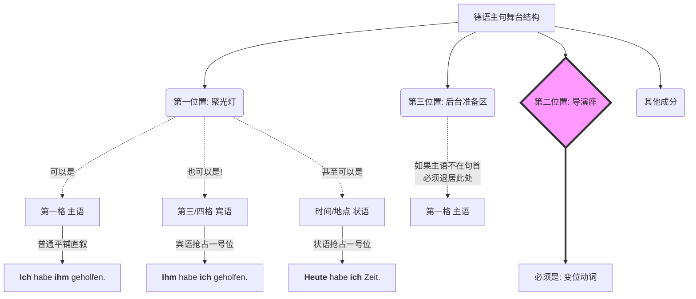

# 为什么有些句子不以第一格主语开头？

您问出的这个问题，价值千金！它直接触碰到了德语语法的“灵魂”。很多学了甚至一两年的同学，在开口说话时依然带着浓浓的“中式德语”或“英式德语”味，就是因为没有想通您今天提出的这个疑惑：**为什么有些句子不以第一格（主语）开头？**

在中文和英文中，我们习惯了雷打不动的“主+谓+宾”（SVO）结构，主语（第一格）永远是老大，必须站在句首。但在德语中，这套规则**完全被颠覆了**！

为了帮您彻底砸碎中英式的语法思维，建立原汁原味的德语句法逻辑，我们引入一个非常核心的类比概念：**“舞台聚光灯法则”**。

### 核心原理解析：德语句子是一个“舞台”

在德语的陈述句中，句子的结构不是一条死板的单行道，而是一个**剧院舞台**。

- **二号位（Position 2）是“导演专属座位”：** 这里永远只坐着变位动词（Verb）。它是全句的核心，雷打不动。
- **一号位（Position 1）是“舞台聚光灯”：** 这是全句最亮眼的地方。**德语允许把任何你想强调的成分（主语、宾语、时间、地点）推到一号位的聚光灯下！**

当第三格（Dat）或第四格（Akk）代词觉得“今天我最重要”，它们就会一脚把主语（第一格）踢到动词后面（三号位），自己站到句首的聚光灯下。

为了让您一目了然，我为您绘制了这张“德语主句舞台结构图”：

代码段

那么，具体在什么情况下，我们会看到第三格或第四格代词堂而皇之地站在句首呢？在 B 1-B 2 的移民生活实战中，主要有三大类情况：

### 第一类：纯粹为了“强调”或“承上启下” (Topikalisierung)

这是最常见的情况。当我们想要特别强调某个动作的“承受者”，或者为了承接上一句话的话题时，就会把宾语放在句首。

**1. 找工作场景（第四格前置）：**

- _正常语序：_ Der Chef hat **mich** heute gelobt. (老板今天表扬了我。)
- _聚光灯语序：_ **Mich** hat der Chef heute gelobt. (今天老板表扬的**可是我**！)
    - _大师解析：_ 此时 **Mich**（第四格）在句首，动词 _hat_ 依然在二号位，真正的主语 _der Chef_ 被挤到了动词后面。

**2. 租房场景（第三格前置）：**

- _语境：_ 房东问你交房租给大楼管理员了吗？
- _正常语序：_ Ich habe **ihm** die Miete schon überwiesen. (我已经把房租转给他了。)
- _聚光灯语序：_ **Ihm** habe ich die Miete schon überwiesen. (**给他**我已经转过房租了/ 至于**他嘛**，我已经转了。)
    - _大师解析：_ 为了承接上文关于管理员的话题，把代表他的 **Ihm** 放到了句首。

### 第二类：“身心状态”与“支配第三格的特殊动词” (Dativ-Verben)

这是德语非常有特色的一点！德语中表达人的生理感觉、心理状态，或者某些特定的从属关系时，主语往往不是“人”，而是“引发状态的事物”或者干脆用个虚词 `es`。这时候，体验这种感觉的“人”只能作为第三格（Dat）出现，并且**习惯性地放在句首**。

**1. 医疗场景（生理感觉）：**

- **Mir** ist übel. (我恶心/我想吐。)
    - _大师避坑警告：_ 千万不能说 _Ich bin übel_！在德语逻辑里，恶心是一种降临在你身上的状态，所以“你”是承受者（第三格）。如果这句还原成完整的语法结构是：_Es ist mir übel._，但虚主语 `es` 常常被省略，于是 **Mir** 就理所当然站在了开头。
- **Mir** tut der Kopf weh. (我头痛。)
    - _大师解析：_ 真正的主语是 _der Kopf_（头），它发出 _wehtun_（痛）的动作，作用在我（**Mir**）身上。

**2. 租房/行政场景（支配第三格的动词）：**

- **Mir** gefällt diese Wohnung. (我喜欢这套公寓。)
    - _大师解析：_ gefällt (gefallen) 要求加第三格。公寓（主语）取悦了“我”（第三格）。
- **Ihnen** fehlt hier noch ein Dokument. (您这里还缺一份文件。)
    - _大师解析：_ 文件（主语）对于“您”（Ihnen，尊称第三格）来说是缺失的。

### 第三类：被动语态中的第三格 (Das Passiv mit Dativ-Objekt)

这也是 B 2 级别的核心考点。当一个主动句变成被动句时，第四格宾语会翻身做主人变成第一格主语。**但是！第三格宾语不管在什么语态下，永远是第三格，死也不变！** 为了让句子不显得头重脚轻，德国人极度喜欢把这个第三格提到句首。

**1. 行政/办公场景：**

- _主动句：_ Man hat **ihm** das Visum verweigert. (人们拒绝了**他的**签证。)
- _被动句（普通）：_ Das Visum wurde **ihm** verweigert. (签证被拒绝给了**他**。)
- _被动句（高阶地道表达）：_ **Ihm** wurde das Visum verweigert. (**他**被拒签了。)
    - _大师解析：_ 把 **Ihm** 放在句首，直接突出了受害者是谁。由于没有第四格变成的主语，这里的被动句依然由 _das Visum_ 充当主语。

### 大师的 B 2 避坑警告（Achtung!）

当您看到一个句子以 `Mir`, `Ihm`, `Mich` 开头时，您的大脑必须立刻拉响警报：**一号位的那个代词，绝不是主语！**

在说写德语时，无论你把什么成分推到了句首（一号位），**你的动词变位（二号位），永远、绝对、必须只能跟着那个藏在后面的真正的“第一格主语”变化！**

- 错误：~~**Mir** gefallen diese Wohnung.~~ (你以为主语是 Mir，其实不是)
- 正确：**Mir** gefällt diese Wohnung. (真正的主语是单数的 diese Wohnung，所以动词用 gefällt)。

理解了“聚光灯法则”，你就等于拿到了一把解开德语长难句和高级表达的万能钥匙。打破“主语必须在第一位”的执念，你的德语将立刻摆脱翻译腔，变得地道、灵活。

为了检验您是否真的掌握了这个“聚光灯转移”的魔法，大师给您布置一个极具实战意义的小挑战：

假设您在找工作，HR 问您：“是谁帮助您修改的这份简历？”

请您用德语回答：**“是他帮了我。”**

（提示：用 `helfen` 这个词，它支配第三格。请尝试使用我们今天讲的“聚光灯法则”，把代表他的代词放在句首！）

告诉我您的答案，或者任何您觉得还没吃透的地方！
