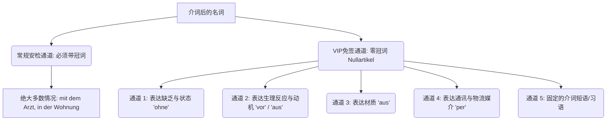

# 这些介词后面不需要带冠词 也就是零冠词的介词

针对您的疑问：“**是所有介词后面的名词都是零冠词，还是只有几个是零冠词？**”

我的直接回答是：**绝对不是所有！恰恰相反，德语中绝大多数介词后面都必须跟着带有冠词的名词。介词后使用“零冠词”（Nullartikel）是一种特殊情况，只有在特定的几个“固定搭配”或“特定语境”下才会发生。**

### 核心原理解析：介词与名词的“安检通道”

在德语语法的海关里，介词（Präpositionen）**就像是严格的安检员。正常情况下，它们要求每个通过的**名词（Nomen）都必须出示完整的“身份证”（定冠词或不定冠词），以证明自己的格（第三格 Dat 或 第四格 Akk）。

然而，对于某些特殊属性的名词，或者在某些特定的搭配中，安检员会开启“VIP 免签通道”（零冠词）。

为了帮您建立清晰的直觉，我为您生成了这张介词后的零冠词分类图：

代码段

### 完整解析：介词后“零冠词”的五大 VIP 通道

只要介词后面的名词符合以下五种情况之一，请果断扔掉冠词！

#### 通道 1：表达“缺乏”与“状态”的介词 (`ohne`)

当使用介词 `ohne` (没有、无) 加上一个抽象名词或不可数名词时，通常使用零冠词。

- **医疗/行政场景：**
    - Ich brauche dringend einen Arzt, aber ich bin hier **ohne Termin**.
    - _(我急需看医生，但我来这儿**没有预约**。)_
    - **Ohne Visum** dürfen Sie nicht einreisen.
    - _(**没有签证**您不允许入境。)_

#### 通道 2：表达“生理反应”或“内心动机” (`vor` / `aus`)

当我们想表达因为某种强烈的情感、生理状态而做出某个动作时，极其常用 `vor` (由于...) 或 `aus` (出于...) 加上抽象名词，此时绝对零冠词。

- **医疗场景 (`vor` + 生理/心理失控)：**
    - Der Patient zittert **vor Schmerz**.
    - _(病人**痛得**发抖。—— 疼痛是抽象生理反应)_
    - Ich konnte **vor Angst** nicht schlafen.
    - *(我吓得（出于恐惧）*_睡不着觉。)_
- **日常交流 (`aus` + 理性动机)：**
    - Er lernt Deutsch **aus Interesse**.
    - _(他**出于兴趣**学习德语。)_

#### 通道 3：表达“材质”与“成分” (`aus`)

当介词 `aus` 用来解释一个东西是由什么材料（物质名词）制成时，因为材料不可数，所以零冠词。

- **租房/购买家具场景：**
    - Dieser Tisch ist **aus Holz**, nicht **aus Plastik**.
    - _(这张桌子是**木头做的**，不是**塑料的**。)_

#### 通道 4：表达通讯与物流的“媒介” (`per`)

介词 `per` (通过...) 几乎总是搭配零冠词，尤其在现代职场和德国严谨的行政流程中非常高频。

- **找工作/行政事务场景：**
    - Bitte senden Sie uns Ihre Bewerbungsunterlagen **per E-Mail**.
    - _(请您**通过电子邮件**发送您的求职材料。)_
    - Sie bekommen die Kündigungsbestätigung **per Post**.
    - _(您会**通过邮寄**收到解约确认书。)_

#### 通道 5：固定的介词短语与习语 (Feste Verbindungen)

德语中有大量约定俗成的固定搭配（Nomen-Verb-Verbindungen 动名词结构），在这些结构里，名词已经失去了具体的实指意义，变成了一个动作概念，因此不需要冠词。

- **多场景通用：**
    - **zu Fuß** (步行)：Ich gehe **zu Fuß** zur Ausländerbehörde. _(我**步行**去外管局。)_
    - **nach Hause / zu Hause** (回家 / 在家)：Ich bin **zu Hause**. _(我**在家**。)_
    - **in Anspruch nehmen** (使用/要求)：Sie können diese medizinische Leistung kostenlos **in Anspruch nehmen**. _(您可以免费**享受/使用**这项医疗服务。)_
    - **in Kontakt treten** (取得联系)：Wir werden bald mit Ihnen **in Kontakt treten**. _(我们将很快与您**取得联系**。)_

### 大师的 B 2 避坑警告（Achtung!）

**千万不要把英语的零冠词习惯带入德语！**

这是中国学生和英语母语者最容易犯的错误：交通工具的表达。

在英语中，我们说 "by bus", "by car", "by train"（全都是零冠词）。

但是！在德语中，使用介词 `mit` 表达交通工具时，**必须带上完整的冠词（通常是定冠词的第三格）**！

- **错误示范 (中式/英式德语)：** Ich fahre mit Auto zur Arbeit. ❌
- **大师正解 (标准德语)：** Ich fahre **mit dem Auto** zur Arbeit. ✅ (用汽车)
- **大师正解 (标准德语)：** Ich fahre **mit der U-Bahn**. ✅ (用地铁)

总结来说：介词后面遇到**抽象情感、不可数材质、`ohne/per` 的特定用法以及固定习语**时，走零冠词通道。除此以外，老老实实为名词加上冠词，您的德语就会显得极为严谨且地道。
