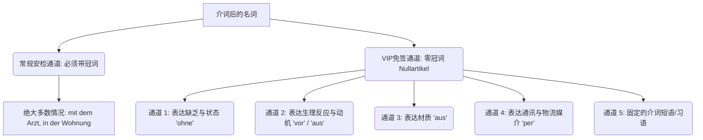

# 零冠词的所有情况
# 德语「名称（Eigennamen / 专有名称）不带冠词」全面解析

> 说明：德语中"名称"不带冠词的根本原因是——**专有名称本身已具备"唯一所指（definite, unique reference）"，冠词的限定功能在此冗余**。这一用法在语法上称作**零冠词（Nullartikel）**。下文穷尽所有名称类别、例外、以及"冠词回流"的情形。

---
[[语言学习/德语/公共知识语法/格; 限定词.md#^FI_NOsFm_-9j1xY1GvdPl]]

## 一、总论：零冠词的本质与三条判定线

^tmh0uz

| 判定线 | 含义 | 结果 |
|---|---|---|
| ① 独占性 | 名称指向世间独一无二的对象 | 通常**无冠词**（柏林、歌德、宝马） |
| ② 类别归一性 | 名称属于"天然有冠词"的类别（河流、山脉、特定国名） | **必须带冠词**（die Donau、der Iran） |
| ③ 定语触发 | 名称被形容词/关系从句修饰、或被特指 | 冠词**回归**（das alte Berlin、der junge Goethe） |

记忆口诀：**"独一无二→裸名；天然定冠→带冠；一旦被修饰→冠词回来"**。

---

## 二、人名（Personennamen）

### 2.1 基本形式：名/姓/全名一律无冠词

- **Goethe** schrieb den „Faust".
  → 解析：Goethe 主语，专有名词零冠词；schrieb 过去时；den „Faust" 宾格定冠词（作品名带冠词）。
  （歌德写了《浮士德》。）
- **Maria** kommt aus **Österreich**. （玛丽亚来自奥地利。）
- **Thomas Mann** erhielt den Nobelpreis. （托马斯·曼获诺贝尔奖。）

### 2.2 称谓、头衔、职业衔、军衔（Anrede / Titel）——仍无冠词

| 结构 | 例句 | 解析 |
|---|---|---|
| Herr/Frau + 姓 | **Herr Müller** ist da. | 头衔+姓，整体零冠词（≠ der Herr Müller，见 §8） |
| Doktor/Professor + 姓 | **Professor Schmidt** forscht. | 同上 |
| 军衔/官衔 | **General Meier** befahl. | 同上 |
| 名+姓+称谓 | **Frau Dr. Anna Weber** | 层级叠加仍零冠词 |
| 皇帝/教皇名号 | **Kaiser Wilhelm II.** | 名号式，零冠词 |

> **Vokativ（呼语）**：作称呼语时永远零冠词——„**Hans**, komm her!"（汉斯，过来！）

### 2.3 贵族名号 von / zu / von und zu——无冠词

- **Otto von Bismarck**（奥托·冯·俾斯麦）
- **Ludwig van Beethoven**（路德维希·凡·贝多芬）
- **Karl zu Guttenberg**

解析：von/zu 后接地名/家族名，整体视为一个专名，零冠词。

### 2.4 同位语（Apposition）中的名称

- Mein Freund **Klaus** wohnt hier. （我朋友克劳斯住这儿。）
- 解析：同位语 **Klaus** 与中心词同指，零冠词。

### 2.5 人名"必须带冠词"的情形

| 情形 | 形式 | 例句 | 说明 |
|---|---|---|---|
| 形容词定语 | 定冠词+形容词+名 | **der junge Goethe** | 被修饰→冠词回归 |
| 特指"那位著名的" | der/die+名 | **der Goethe** der deutschen Klassik | 强调"这一位" |
| 家族复数 | die+姓+s | **die Müllers** kommen. | 表"米勒一家" |
| "某个" | ein+名 | **ein gewisser Müller** rief an. | 表不认识的某人 |
| 口语指人（南方/方言） | der/die+名 | **Der Hans** is a Depp.（巴伐利亚） | 见 §11 |

---

## 三、地理名称（Geografische Namen）

### 3.1 大陆、政治洲——零冠词

**Europa, Asien, Afrika, Amerika, Australien, Antarktis**（注意：Antarktis 亦作 die Antarktis）

- **Europa** wächst zusammen. （欧洲正在融合。）

### 3.2 中性国名（绝大多数国家）——零冠词

**Deutschland, Frankreich, Italien, Spanien, Polen, Russland, China, Japan, Brasilien, Kanada, Norwegen, Schweden, Österreich, Belgien, Portugal, Griechenland, Ägypten, Indien …**

- Ich fahre **nach Deutschland**. （我去德国。）
  解析：nach + 国名（无冠词），nach 后无冠词时表方向。
- Er lebt **in Japan**. （他住在日本。）

### 3.3 城市、乡镇、村——零冠词

**Berlin, München, Wien, Zürich, Hamburg, Paris, Rom, New York …**

- Sie studiert **in Heidelberg**. （她在海德堡念书。）
- Wir fahren **nach Köln**. （我们去科隆。）
  解析：城市名前介词 nach/in，无冠词。

> 城市名派生形容词（-er）亦零冠词且不变格：**Berliner** Luft、**Hamburger** Hafen、**Schweizer** Käse。**Zürcher** Zeitung。

### 3.4 必须带定冠词的国名 / 地区（完整清单）

#### (a) 阴性国名（die）

| 国名 | 例句 |
|---|---|
| die Schweiz | in **der Schweiz** |
| die Türkei | in **der Türkei** |
| die Slowakei | in **der Slowakei** |
| die Ukraine | in **der Ukraine** |
| die Mongolei | in **der Mongolei** |
| die Mandschurei | in **der Mandschurei** |
| die Antarktis | in **der Antarktis** |
| die Zentralafrikanische Republik | — |
| die Dominikanische Republik | — |
| die Elfenbeinküste (Côte d'Ivoire) | — |
| die Westsahara | — |
| die Arktis（地区） | — |

#### (b) 阳性国名（der）

**der Iran, der Irak, der Sudan, der Südsudan, der Libanon, der Jemen, der Kongo, der Niger, der Tschad, der Kosovo, der Vatikan**（个别如 Oman、Senegal 说法不一，多作无冠词）

- Er kommt **aus dem Iran**. （他来自伊朗。）
  解析：aus + dem Iran，阳性国名必须带定冠词。

#### (c) 复数国名（die）

**die Niederlande, die USA, die Vereinigten Staaten, die Philippinen, die Malediven, die Komoren, die Bahamas, die Seychellen, die Salomonen, die Vereinigten Arabischen Emirate, die Färöer, die Kanarischen Inseln**

- Sie lebt **in den USA**. （她住在美国。）

#### (d) 德语区/欧洲地区名（带冠词）

- 阴性：die Pfalz, die Lausitz, die Bretagne, die Normandie, die Provence, die Toskana, die Lombardei, die Steiermark, die Wachau, die Walachei
- 阳性：der Schwarzwald, der Spessart, der Harz, der Balkan, der Kaukasus, der Ural
- 中性：das Elsass, das Allgäu, das Sauerland, das Münsterland, das Burgenland, das Baltikum, das Rheinland, das Vogtland

- Wir wandern im **Schwarzwald**. （我们在黑森林徒步。）

### 3.5 "天然带冠词"的地貌名称（与国名规则相反）

| 类别 | 冠词 | 例 | 说明 |
|---|---|---|---|
| 河流 | 阴性/阳性 | **die** Donau, **der** Rhein, **die** Elbe, **der** Main, **die** Mosel | 一律带冠词（an der Donau） |
| 海洋 | 阴性/阳性/中性 | **die** Nordsee, **die** Ostsee, **der** Atlantik, **das** Mittelmeer | 带冠词 |
| 湖泊 | 阳性（der …see） | **der** Bodensee, **der** Genfersee | 通常带冠词 |
| 山脉/山群 | 复数/单数 | **die** Alpen, **die** Pyrenäen, **der** Harz | 带冠词 |
| 岛屿 | 常无冠词 | **Rügen, Sylt**（auf Rügen, nach Sylt） | 部分零冠词，群岛用复数冠词 |

- Ich fahre **an den Bodensee**. （我去博登湖。）
- Wir fahren **auf die Alpen**（口）／**in die Alpen**. （我们进阿尔卑斯山。）

### 3.6 城市/国名被修饰——冠词回归

- **das** alte **Berlin**（老柏林）
- **das** schöne **Italien**（美丽的意大利）
- **im** heutigen **Frankreich**（在今日的法国）

---

## 四、机构、团体、公司、品牌、报刊

| 类别 | 是否带冠词 | 例 |
|---|---|---|
| 公司/品牌（多数） | 零冠词 | **Siemens, BMW, Opel, Adidas, Coca-Cola** |
| 带法人名/企业名 | 常带冠词 | **die** Lufthansa, **die** Deutsche Bahn, **die** Deutsche Bank |
| 政党/工会 | 通常带冠词 | **die** SPD, **die** CDU, **die** Grünen |
| 报刊/杂志 | 通常带冠词 | **die** Zeit, **der** Spiegel, **der** Stern, **die** FAZ |
| 机构/大学/剧院 | 多带冠词 | **die** Humboldt-Universität, **das** Goethe-Institut |
| 车次/航班等编号 | 零冠词 | **ICE 4711**, **Flug LH 400** |

- **Siemens** beschäftigt viele Leute. （西门子雇很多人。）
- Ich lese **die Zeit**. （我读《时代》周报。）

---

## 五、时间名称：星期、月份、季节、节日

### 5.1 星期 / 月份 / 季节——名称本身零冠词，但状语用法常经介词缩合出现冠词

| 场景 | 例句 | 说明 |
|---|---|---|
| 作主语/表语 | **Montag** ist mein Lieblingstag. | 零冠词 |
| 时间状语 | **Am** Montag（= an + dem） | 介词缩合，出现冠词 |
| 月份 | **Im** Januar（= in + dem） | 缩合冠词 |
| 季节 | **Im** Sommer / **Es ist Sommer.** | 状语带、表语不带 |
| 反复 | **montags, sommers** | 副词化，零冠词 |

- **Januar** ist kalt.（一月冷。）
- **Im** Januar schneit es oft.（一月份常下雪。）

### 5.2 节日（Feste）——通常零冠词

**Weihnachten, Ostern, Pfingsten, Silvester, Neujahr, Karneval, Advent**

- **Weihnachten** feiern wir zu Hause. （圣诞节我们在家过。）
- **Zu Ostern** besuchen wir Oma. （复活节我们去看奶奶。）
  解析：zu + 节日，无冠词；部分节日口语可带（an Weihnachten / zu Weihnachten）。

---

## 六、语言、学科、课程名称——零冠词

- Ich spreche **Deutsch** und **Englisch**. （我说德语和英语。）
- Sie studiert **Mathematik**. （她学数学。）
- Er unterrichtet **Physik**. （他教物理。）

> 注意：名词化后带冠词——**das Deutsche**（德语这门语言）、**sein Englisch** ist gut。

---

## 七、其他专有名称

| 类别 | 冠词 | 例 |
|---|---|---|
| 书名/影剧名 | 多为"作者/原文自带冠词" | **Der Zauberberg**、**Die Blechtrommel** |
| 事件/时代名 | 带冠词 | **der** Dreißigjährige Krieg |
| 招牌、名录、标题、电报体 | 常零冠词 | „**Zimmer frei**" |
| 菜单菜名 | 常零冠词 | **Wiener Schnitzel**, **Rinderbrust** |
| 词条/标签 | 零冠词 | **Nomen**, **Verb** |

---

## 八、"冠词回流"——名称何时必须带冠词（关键难点）

| 触发条件 | 规则 | 例句 |
|---|---|---|
| 带形容词定语 | 定冠词必现 | **das** moderne **Berlin** |
| 带关系从句 | 定冠词必现 | **der** Goethe, **den** alle kennen |
| 表"某一个" | 不定冠词 | **ein** gewisser **Müller** |
| 家族复数 | die + 姓 + s | **die** Schmidts |
| 特指著名者 | 定冠词 | **der** Beethoven unserer Zeit |
| 天然带冠名（河流等） | 定冠词 | **die** Donau |
| 部分国名 | 定冠词 | **die** Schweiz |

---

## 九、零冠词 vs 定冠词 / 不定冠词的语义差别

| 形式 | 语义 | 例句 |
|---|---|---|
| 零冠词 | 独占、唯一所指 | **Müller** rief an.（（那个）米勒来电） |
| 定冠词 | 已知/特指/被修饰 | **Der Müller** von nebenan rief an. |
| 不定冠词 | 某个（不认识的） | **Ein Müller** rief an.（一个姓米勒的来电） |

- 三者**不可随意互换**：专名零冠词是"唯一指称"义；一旦加不定冠词即转为"某个陌生同名者"义。

---

## 十、中文母语者高频错误

| 错误 | 正确 | 原因 |
|---|---|---|
| ~~Ich fahre nach der Schweiz.~~ | Ich fahre **in die Schweiz**. | Schweiz 是阴性国名，须带冠词；且方向用 in + Akk. |
| ~~Ich wohne in Berlin.~~（当作普通名词加冠词） | 正确（零冠词） | 城市名零冠词，勿误加 |
| ~~nach der Deutschland~~ | **nach Deutschland** | 中性国名零冠词 |
| ~~Der Herr Müller~~（一般称呼） | **Herr Müller** | 称呼/头衔整体零冠词（除非特指） |
| ~~Ich trinke der Tee~~ | 见零冠词总论（物质名词） | 冠词误加（非本主题但常混） |
| ~~im Goethe~~（指人一般叙述） | **Goethe** schrieb … | 人名零冠词；im 只用于 der junge Goethe 类 |

---

## 十一、地区差异与语体

| 现象 | 说明 | 例 |
|---|---|---|
| 冠词+人名（南德/奥地利/瑞士/口语） | 表亲密或口语化 | **der** Hans, **die** Anna（巴伐利亚/奥地利） |
| 北部德语 | 更倾向零冠词 | Hans kommt. |
| 奥地利/瑞士 | 常用定冠词于人名前 | **Der** Gruber ist da. |
| 报刊标题/广告 | 大量省略冠词 | „**Auto** zu verkaufen" |
| 电报/清单/招牌 | 零冠词 | „**Wohnung** frei" |

---

## 十二、速查总表

| 名称类别 | 冠词 | 示例 |
|---|---|---|
| 人名（名/姓/全名） | 零 | Goethe, Maria |
| 头衔/称谓+人名 | 零 | Herr Müller |
| 贵族 von/zu | 零 | Otto von Bismarck |
| 呼语 | 零 | Hans, komm! |
| 大陆/政治洲 | 零 | Europa, Asien |
| 中性国名 | 零 | Deutschland, Japan |
| 城市/乡镇 | 零 | Berlin, Wien |
| 阴性/阳性/复数国名 | **定冠词** | die Schweiz, der Iran, die USA |
| 河流/海洋/山脉 | **定冠词** | die Donau, die Alpen |
| 岛屿（部分） | 零 | Rügen, Sylt |
| 公司/品牌（多数） | 零 | Siemens, BMW |
| 政党/报刊 | 定冠词 | die SPD, die Zeit |
| 星期/月份/季节（名） | 零（状语缩合冠词） | am Montag, im Juli |
| 节日 | 零 | Weihnachten, Ostern |
| 语言/学科 | 零 | Deutsch, Mathematik |
| 被形容词/从句修饰的名称 | **定冠词** | das alte Berlin |
| "某个"某人 | **不定冠词** | ein gewisser Müller |
| 家族复数 | 定冠词 | die Müllers |

---

**一句话总纲**：名称不带冠词，当且仅当它**独占指称且无修饰**；一旦属于"天然带冠名类别"（阴性/阳性/复数国名、河流、海洋、山脉）或被**形容词、关系从句修饰、被特指/量化**，冠词即回归——这正是德语零冠词体系最难、也最易错的分界线。

# 这些介词后面不需要带冠词 也就是零冠词的介词

针对您的疑问：“**是所有介词后面的名词都是零冠词，还是只有几个是零冠词？**”

我的直接回答是：**绝对不是所有！恰恰相反，德语中绝大多数介词后面都必须跟着带有冠词的名词。介词后使用“零冠词”（Nullartikel）是一种特殊情况，只有在特定的几个“固定搭配”或“特定语境”下才会发生。**

### 核心原理解析：介词与名词的“安检通道”

在德语语法的海关里，介词（Präpositionen）**就像是严格的安检员。正常情况下，它们要求每个通过的**名词（Nomen）都必须出示完整的“身份证”（定冠词或不定冠词），以证明自己的格（第三格 Dat 或 第四格 Akk）。

然而，对于某些特殊属性的名词，或者在某些特定的搭配中，安检员会开启“VIP 免签通道”（零冠词）。

为了帮您建立清晰的直觉，我为您生成了这张介词后的零冠词分类图：

代码段

```mermaid
graph TD
    A[介词后的名词] --> B(常规安检通道: 必须带冠词)
    A --> C(VIP免签通道: 零冠词 Nullartikel)

    B --> B1[绝大多数情况: mit dem Arzt, in der Wohnung]

    C --> C1(通道 1: 表达缺乏与状态 'ohne')
    C --> C2(通道 2: 表达生理反应与动机 'vor' / 'aus')
    C --> C3(通道 3: 表达材质 'aus')
    C --> C4(通道 4: 表达通讯与物流媒介 'per')
    C --> C5(通道 5: 固定的介词短语/习语)
```

### 完整解析：介词后“零冠词”的五大 VIP 通道

只要介词后面的名词符合以下五种情况之一，请果断扔掉冠词！

#### 通道 1：表达“缺乏”与“状态”的介词 (`ohne`)

当使用介词 `ohne` (没有、无) 加上一个抽象名词或不可数名词时，通常使用零冠词。

- **医疗/行政场景：**
    - Ich brauche dringend einen Arzt, aber ich bin hier **ohne Termin**.
    - _(我急需看医生，但我来这儿**没有预约**。)_
    - **Ohne Visum** dürfen Sie nicht einreisen.
    - _(**没有签证**您不允许入境。)_

#### 通道 2：表达“生理反应”或“内心动机” (`vor` / `aus`)

当我们想表达因为某种强烈的情感、生理状态而做出某个动作时，极其常用 `vor` (由于...) 或 `aus` (出于...) 加上抽象名词，此时绝对零冠词。

- **医疗场景 (`vor` + 生理/心理失控)：**
    - Der Patient zittert **vor Schmerz**.
    - _(病人**痛得**发抖。—— 疼痛是抽象生理反应)_
    - Ich konnte **vor Angst** nicht schlafen.
    - *(我吓得（出于恐惧）*_睡不着觉。)_
- **日常交流 (`aus` + 理性动机)：**
    - Er lernt Deutsch **aus Interesse**.
    - _(他**出于兴趣**学习德语。)_

#### 通道 3：表达“材质”与“成分” (`aus`)

当介词 `aus` 用来解释一个东西是由什么材料（物质名词）制成时，因为材料不可数，所以零冠词。

- **租房/购买家具场景：**
    - Dieser Tisch ist **aus Holz**, nicht **aus Plastik**.
    - _(这张桌子是**木头做的**，不是**塑料的**。)_

#### 通道 4：表达通讯与物流的“媒介” (`per`)

介词 `per` (通过...) 几乎总是搭配零冠词，尤其在现代职场和德国严谨的行政流程中非常高频。

- **找工作/行政事务场景：**
    - Bitte senden Sie uns Ihre Bewerbungsunterlagen **per E-Mail**.
    - _(请您**通过电子邮件**发送您的求职材料。)_
    - Sie bekommen die Kündigungsbestätigung **per Post**.
    - _(您会**通过邮寄**收到解约确认书。)_

#### 通道 5：固定的介词短语与习语 (Feste Verbindungen)

德语中有大量约定俗成的固定搭配（Nomen-Verb-Verbindungen 动名词结构），在这些结构里，名词已经失去了具体的实指意义，变成了一个动作概念，因此不需要冠词。

- **多场景通用：**
    - **zu Fuß** (步行)：Ich gehe **zu Fuß** zur Ausländerbehörde. _(我**步行**去外管局。)_
    - **nach Hause / zu Hause** (回家 / 在家)：Ich bin **zu Hause**. _(我**在家**。)_
    - **in Anspruch nehmen** (使用/要求)：Sie können diese medizinische Leistung kostenlos **in Anspruch nehmen**. _(您可以免费**享受/使用**这项医疗服务。)_
    - **in Kontakt treten** (取得联系)：Wir werden bald mit Ihnen **in Kontakt treten**. _(我们将很快与您**取得联系**。)_

### 大师的 B 2 避坑警告（Achtung!）

**千万不要把英语的零冠词习惯带入德语！**

这是中国学生和英语母语者最容易犯的错误：交通工具的表达。

在英语中，我们说 "by bus", "by car", "by train"（全都是零冠词）。

但是！在德语中，使用介词 `mit` 表达交通工具时，**必须带上完整的冠词（通常是定冠词的第三格）**！

- **错误示范 (中式/英式德语)：** Ich fahre mit Auto zur Arbeit. ❌
- **大师正解 (标准德语)：** Ich fahre **mit dem Auto** zur Arbeit. ✅ (用汽车)
- **大师正解 (标准德语)：** Ich fahre **mit der U-Bahn**. ✅ (用地铁)

总结来说：介词后面遇到**抽象情感、不可数材质、`ohne/per` 的特定用法以及固定习语**时，走零冠词通道。除此以外，老老实实为名词加上冠词，您的德语就会显得极为严谨且地道。
