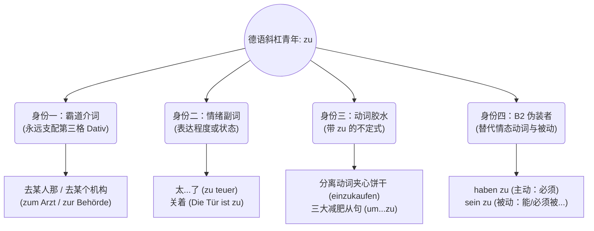

---
aliases:
  - zu
---

# zu的所有用法

今天我们要挑战的这个词 —— **“zu”**，堪称德语世界里的“终极斜杠青年”。它无处不在，有时候是介词，有时候是副词，有时候又变成了连接动词的胶水，甚至在 B 2 级别它还能摇身一变，成为伪装的被动语态！

很多同学在 B 2 阶段依然会被 `zu` 绊倒，就是因为没有把它的“多重人格”区分开。今天，大师就带你用一篇文章，把 `zu` 的家族祖坟给刨个底朝天，彻底扫清你移民路上的这颗大雷！

我们先用一张“雷达图”来看清 `zu` 的四个核心身份：

---

### 第一重身份：霸道介词 (Präposition) —— 永远的“第三格”死忠粉

当 `zu` 作为一个介词出现时，它表示**方向、目的地或时间**。

**大师铁律：`zu` 的身后，绝对、立刻、必须接第三格 (Dativ)！** 也就是变成 `zum` (zu + dem) 或者 `zur` (zu + der)。

* **去某人那里（看医生、找老板、找朋友）：**
* **【医疗场景】：** Ich muss morgen **zum Arzt** gehen. (我明天得去医生那里。)
* **【职场场景】：** Gehen Sie bitte **zum Chef**. (请您去老板那一趟。)
* **去某个机构、活动或具体建筑物：**
* **【行政场景】：** Ich fahre **zur Ausländerbehörde**. (我去外管局。)
* **【生活场景】：** Wir gehen **zur Party / zur Arbeit**. (我们去参加派对 / 去上班。)
* **特定节日时间（固定搭配）：**
* **zum** Geburtstag (生日时) / **zu** Weihnachten (圣诞节时)

---

### 第二重身份：情绪副词 (Adverb) —— 表达“越界”或“状态”

当 `zu` 后面直接跟着一个形容词，或者孤零零地放在句尾时，它就不再是介词了。

* **表示程度“太...了”（带有负面、抱怨的情绪）：**
* **【租房场景】：** Die Wohnung in München ist mir **zu teuer**. (慕尼黑的房子对我来说**太贵了**。👉 *潜台词：贵到我不想租了。*)
* **表示状态“关着”（口语高频）：**
* **【职场场景】：** Das Fenster ist **zu**. (窗户是**关着的**。相当于 geschlossen。)

---

### 第三重身份：动词胶水 (Infinitiv mit zu) —— 连词的“减肥平替”

这就是我们在上一课提到的。当一个句子里有两个动词（且没有情态动词时），第二个动词必须变成原形放到句尾，并在前面粘上一个 `zu`。

* **基础款（动词前贴标签）：**
* **【求职场景】：** Ich versuche, einen Job **zu finden**. (我试图去**找**一份工作。)
* **分离动词夹心饼干（极其重要）：**
* 如果遇到可分动词，`zu` 必须塞在**前缀和词干的中间**，连写成一个词！
* **【生活场景】：** Ich habe vergessen, die Tür **abzuschließen**. (我忘了**锁**门。)
* **B 1/B 2 核心：三大减肥从句（主语必须一致）：**
* **um ... zu ... (表目的：为了...)：** Ich lerne Deutsch, **um** in Deutschland **zu arbeiten**.
* **ohne ... zu ... (表方式：没有/而不...)：** Er hat den Vertrag unterschrieben, **ohne** ihn **zu lesen**.
* **anstatt ... zu ... (表替代：不...反而...)：** Er surft am Handy, **anstatt zu arbeiten**.

---

### 第四重身份：B 2 高级伪装者 (替代结构) —— 读懂德国人的“官腔”

这是 B 2 考试阅读和听力中最爱考的难点！在官方信件或合同中，德国人喜欢用 `sein` 或 `haben` 加上带 `zu` 的不定式，来替代长篇大论的情态动词或被动语态。

* ** `haben + zu + Infinitiv` = 主动义务 (必须 müssen / 不允许 nicht dürfen)**
* **【合同场景】：** Der Mieter **hat** die Miete pünktlich **zu bezahlen**.
* *大师翻译：* 租客**必须**按时交房租。 (等同于：Der Mieter muss bezahlen.)
* ** `sein + zu + Infinitiv` = 被动能力/义务 (可以被 können... / 必须被 müssen...)**
* **【行政表格】：** Das Formular **ist** in Druckbuchstaben **auszufüllen**.
* *大师翻译：* 该表格**必须被**用大写字母填写。 (等同于：Das Formular muss ausgefüllt werden.)

---

### 💣 决战紫禁之巅：`zu` 的易错易混点大对决

为了让你在口语和写作中做到“零失误”，大师把最容易把人绕晕的几个对比场景列成了清晰的表格。请把它们当作“口诀”背下来！

|**易混场景**|**错误说法 (雷区)**|**正确说法 (大师示范)**|**核心辨析法则**|
|---|---|---|---|
|**1. 目的地的较量**      (去哪里：zu 还是 nach?)|Ich gehe ~~nach~~ dem Arzt.      Ich fahre ~~zu~~ Berlin.|Ich gehe **zum** Arzt.      Ich fahre **nach** Berlin.|**口诀：“小范围用 zu，大地理用 nach”**      去人那里、机构建筑，用 **zu** (zum Arzt)。      去无冠词的城市、国家、大洲，用 **nach** (nach Berlin)。|
|**2. 回家 vs 在家**      (A1一直错到B2的顽疾)|Ich bin ~~nach~~ Hause.      Ich gehe ~~zu~~ Hause.|Ich bin **zu Hause** (在家).      Ich gehe **nach Hause** (回家).|**口诀：“nach 跑断腿，zu 宅到底”**      `nach Hause` 表示动作方向（正在回家的路上）；      `zu Hause` 表示静止状态（人已经躺在家里了）。|
|**3. 程度的较量**      (很/太：sehr 还是 zu?)|Das Essen ist ~~zu~~ lecker!      (想表达“很好吃”)|Das Essen ist **sehr** lecker!|**口诀：“sehr 是夸奖，zu 是抱怨”**      `sehr` 是中性的“很、非常”。      `zu` 是超出了可接受的极限，带有否定意味。如果说 zu lecker，德国人会以为好吃到你想吐。|
|**4. 目的的较量**      (为了：um...zu 还是 damit?)|Ich arbeite hart, ~~um~~ mein Sohn studieren kann.|Ich arbeite hart, **damit** mein Sohn studieren kann.|**口诀：“同用 zu，异用 damit”**      只有主句和目的的主语是**同一个人**，才能用 **um...zu** 减肥结构。      主语**不是同一个人**（我工作，为了儿子能上大学），必须用完整从句 **damit**。|
记住，“zu” 就像是德语里的一把多功能瑞士军刀。以后在阅读里看到它，先不要急着翻译，花一秒钟问问自己：“它这里是接名词（介词）？接形容词（副词）？还是接在动词前面（不定式/替代结构）？”一旦你养成了这个结构化拆解的习惯，B 2 级别的所有长难句在你眼中都将无处遁形。祝你在德语学习的路上一路绿灯！
