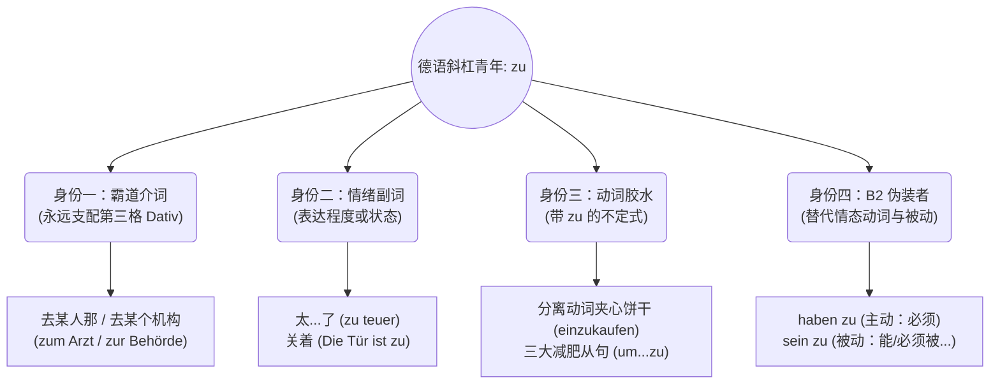

---
aliases:
  - zu
---

# zu的所有用法

今天我们要挑战的这个词 —— **“zu”**，堪称德语世界里的“终极斜杠青年”。它无处不在，有时候是介词，有时候是副词，有时候又变成了连接动词的胶水，甚至在 B 2 级别它还能摇身一变，成为伪装的被动语态！

很多同学在 B 2 阶段依然会被 `zu` 绊倒，就是因为没有把它的“多重人格”区分开。今天，大师就带你用一篇文章，把 `zu` 的家族祖坟给刨个底朝天，彻底扫清你移民路上的这颗大雷！

我们先用一张“雷达图”来看清 `zu` 的四个核心身份：

```mermaid
flowchart TD
    Root(("德语斜杠青年: zu")) --> Prep("身份一：霸道介词<br>(永远支配第三格 Dativ)")
    Root --> Adv("身份二：情绪副词<br>(表达程度或状态)")
    Root --> Inf("身份三：动词胶水<br>(带 zu 的不定式)")
    Root --> B2("身份四：B2 伪装者<br>(替代情态动词与被动)")

    Prep --> P1["去某人那 / 去某个机构<br>(zum Arzt / zur Behörde)"]
    Adv --> A1["太...了 (zu teuer)<br>关着 (Die Tür ist zu)"]
    Inf --> I1["分离动词夹心饼干 (einzukaufen)<br>三大减肥从句 (um...zu)"]
    B2 --> B21["haben zu (主动：必须)<br>sein zu (被动：能/必须被...)"]

```

---

### 第一重身份：霸道介词 (Präposition) —— 永远的“第三格”死忠粉

当 `zu` 作为一个介词出现时，它表示**方向、目的地或时间**。

**大师铁律：`zu` 的身后，绝对、立刻、必须接第三格 (Dativ)！** 也就是变成 `zum` (zu + dem) 或者 `zur` (zu + der)。

* **去某人那里（看医生、找老板、找朋友）：**
* **【医疗场景】：** Ich muss morgen **zum Arzt** gehen. (我明天得去医生那里。)
* **【职场场景】：** Gehen Sie bitte **zum Chef**. (请您去老板那一趟。)
* **去某个机构、活动或具体建筑物：**
* **【行政场景】：** Ich fahre **zur Ausländerbehörde**. (我去外管局。)
* **【生活场景】：** Wir gehen **zur Party / zur Arbeit**. (我们去参加派对 / 去上班。)
* **特定节日时间（固定搭配）：**
* **zum** Geburtstag (生日时) / **zu** Weihnachten (圣诞节时)

---

### 第二重身份：情绪副词 (Adverb) —— 表达“越界”或“状态”

当 `zu` 后面直接跟着一个形容词，或者孤零零地放在句尾时，它就不再是介词了。

* **表示程度“太...了”（带有负面、抱怨的情绪）：**
* **【租房场景】：** Die Wohnung in München ist mir **zu teuer**. (慕尼黑的房子对我来说**太贵了**。👉 *潜台词：贵到我不想租了。*)
* **表示状态“关着”（口语高频）：**
* **【职场场景】：** Das Fenster ist **zu**. (窗户是**关着的**。相当于 geschlossen。)

---

### 第三重身份：动词胶水 (Infinitiv mit zu) —— 连词的“减肥平替”

这就是我们在上一课提到的。当一个句子里有两个动词（且没有情态动词时），第二个动词必须变成原形放到句尾，并在前面粘上一个 `zu`。

* **基础款（动词前贴标签）：**
* **【求职场景】：** Ich versuche, einen Job **zu finden**. (我试图去**找**一份工作。)
* **分离动词夹心饼干（极其重要）：**
* 如果遇到可分动词，`zu` 必须塞在**前缀和词干的中间**，连写成一个词！
* **【生活场景】：** Ich habe vergessen, die Tür **abzuschließen**. (我忘了**锁**门。)
* **B 1/B 2 核心：三大减肥从句（主语必须一致）：**
* **um ... zu ... (表目的：为了...)：** Ich lerne Deutsch, **um** in Deutschland **zu arbeiten**.
* **ohne ... zu ... (表方式：没有/而不...)：** Er hat den Vertrag unterschrieben, **ohne** ihn **zu lesen**.
* **anstatt ... zu ... (表替代：不...反而...)：** Er surft am Handy, **anstatt zu arbeiten**.

---

### 第四重身份：B 2 高级伪装者 (替代结构) —— 读懂德国人的“官腔”

这是 B 2 考试阅读和听力中最爱考的难点！在官方信件或合同中，德国人喜欢用 `sein` 或 `haben` 加上带 `zu` 的不定式，来替代长篇大论的情态动词或被动语态。

* ** `haben + zu + Infinitiv` = 主动义务 (必须 müssen / 不允许 nicht dürfen)**
* **【合同场景】：** Der Mieter **hat** die Miete pünktlich **zu bezahlen**.
* *大师翻译：* 租客**必须**按时交房租。 (等同于：Der Mieter muss bezahlen.)
* ** `sein + zu + Infinitiv` = 被动能力/义务 (可以被 können... / 必须被 müssen...)**
* **【行政表格】：** Das Formular **ist** in Druckbuchstaben **auszufüllen**.
* *大师翻译：* 该表格**必须被**用大写字母填写。 (等同于：Das Formular muss ausgefüllt werden.)

---

### 💣 决战紫禁之巅：`zu` 的易错易混点大对决

为了让你在口语和写作中做到“零失误”，大师把最容易把人绕晕的几个对比场景列成了清晰的表格。请把它们当作“口诀”背下来！

|**易混场景**|**错误说法 (雷区)**|**正确说法 (大师示范)**|**核心辨析法则**|
|---|---|---|---|
|**1. 目的地的较量**      (去哪里：zu 还是 nach?)|Ich gehe ~~nach~~ dem Arzt.      Ich fahre ~~zu~~ Berlin.|Ich gehe **zum** Arzt.      Ich fahre **nach** Berlin.|**口诀：“小范围用 zu，大地理用 nach”**      去人那里、机构建筑，用 **zu** (zum Arzt)。      去无冠词的城市、国家、大洲，用 **nach** (nach Berlin)。|
|**2. 回家 vs 在家**      (A1一直错到B2的顽疾)|Ich bin ~~nach~~ Hause.      Ich gehe ~~zu~~ Hause.|Ich bin **zu Hause** (在家).      Ich gehe **nach Hause** (回家).|**口诀：“nach 跑断腿，zu 宅到底”**      `nach Hause` 表示动作方向（正在回家的路上）；      `zu Hause` 表示静止状态（人已经躺在家里了）。|
|**3. 程度的较量**      (很/太：sehr 还是 zu?)|Das Essen ist ~~zu~~ lecker!      (想表达“很好吃”)|Das Essen ist **sehr** lecker!|**口诀：“sehr 是夸奖，zu 是抱怨”**      `sehr` 是中性的“很、非常”。      `zu` 是超出了可接受的极限，带有否定意味。如果说 zu lecker，德国人会以为好吃到你想吐。|
|**4. 目的的较量**      (为了：um...zu 还是 damit?)|Ich arbeite hart, ~~um~~ mein Sohn studieren kann.|Ich arbeite hart, **damit** mein Sohn studieren kann.|**口诀：“同用 zu，异用 damit”**      只有主句和目的的主语是**同一个人**，才能用 **um...zu** 减肥结构。      主语**不是同一个人**（我工作，为了儿子能上大学），必须用完整从句 **damit**。|
记住，“zu” 就像是德语里的一把多功能瑞士军刀。以后在阅读里看到它，先不要急着翻译，花一秒钟问问自己：“它这里是接名词（介词）？接形容词（副词）？还是接在动词前面（不定式/替代结构）？”一旦你养成了这个结构化拆解的习惯，B 2 级别的所有长难句在你眼中都将无处遁形。祝你在德语学习的路上一路绿灯！

# zu 相关问答
## 先纠正一个前提
**zu 不定式（Infinitivsatz，不定式句）本身不是介词**，它属于"从句"这一类——只不过是一种**没有主语、没有变位动词**的"瘦身版从句"。德语里那个真正的介词 **zu**（zu Hause、zu Fuß、zu dem Bahnhof）和不定式符号 **zu** 只是长得一样、历史上同源，语法身份完全不同，得分开记。下面系统讲一遍。

---

## 一、形式：zu 不定式长什么样

| 类型 | 形式 | 例子 |
|---|---|---|
| 基本 | **zu** + 不定式 | Ich versuche, **zu schlafen**. |
| 可分动词 | 前缀与 zu 合写 | aufstehen → **aufzustehen**；anrufen → **anzurufen**；zumachen → **zuzumachen**（两个 zu 叠在一起） |
| 完成时 | 过去分词 + **zu haben / zu sein** | Ich freue mich, das **gesehen zu haben**. |
| 被动 | 过去分词 + **zu werden** | Er hofft, **eingeladen zu werden**. |
| 否定 | **nicht** 放在 zu 不定式之前 | Ich bat ihn, **nicht** zu rauchen. |

关键位置规律：**zu 永远紧贴不定式，整个不定式组站在句子末尾**。可分动词的前缀要"让位"给 zu，写成 **an|zu|rufen** 这个形状。

---

## 二、什么时候用 zu 不定式：三个触发口

这是判断的核心，你只要看**前面的词是什么类型**就行。

**（1）普通动词后面——必须加 zu。**
versuchen, vergessen, hoffen, planen, beabsichtigen, anfangen, aufhören, bitten, auffordern, überreden, zwingen, erlauben, verbieten, empfehlen, raten, scheinen, drohen, versprechen … 例如 Ich hoffe, dich bald **zu sehen**。

**（2）名词后面——常加 zu，作定语。**
der Wunsch, die Absicht, die Möglichkeit, die Gelegenheit, die Zeit, die Lust, die Angst, der Mut, die Pflicht, die Aufgabe, die Idee, das Ziel … 例如 Ich habe keine Zeit, das **zu erklären**。

**（3）形容词 / 无人称 es 后面——加 zu，作真正的主语。**
es ist wichtig / schön / notwendig / schwierig / möglich / verboten … 例如 Es ist wichtig, pünktlich **zu kommen**。

**反过来，有一批动词坚决不加 zu（裸不定式）：**
情态动词（**können, müssen, dürfen, sollen, wollen, mögen**）、**werden**（将来时）、**lassen**、感官动词（**sehen, hören, fühlen, spüren**）、位移动词（**gehen, kommen, fahren**）、**bleiben**。所以说 Ich muss **arbeiten**，而 Ich versuche **zu arbeiten**——同一个动作，因为前面的动词换了身份，zu 就出现了或消失了。

---

## 三、它在句子里担任什么角色

**① 主语**：Pünktlich zu kommen ist wichtig.（＝ Es ist wichtig, pünktlich zu kommen.）
**② 宾语**：Ich versuche, das zu verstehen.
**③ 定语**（最常用、也最容易被忽略）：Das ist eine gute Möglichkeit, Geld zu sparen.
**④ 状语**——这里才是你提到的"目的"：
- **um … zu**：表目的，"为了"。Ich lerne Deutsch, **um** in Berlin **zu** studieren.
- **ohne … zu**：表"没有做某事"。Er ging weg, **ohne** sich **zu** verabschieden.
- **(an)statt … zu**：表"取代、而非"。**Statt** zu klagen, half er mit.

除了这四类，还有两个**固化的框式结构**，语义很特别：
- **haben + zu + 不定式** ＝ 主动义务，"必须"。Ich **habe** noch viel **zu tun**.
- **sein + zu + 不定式** ＝ 被动＋情态，"可以被 / 必须被"。Das Problem **ist** leicht **zu lösen**（＝ Das Problem kann leicht gelöst werden）.

还有一个公文气十足的变体：**zu + 第一分词作定语**，表达"尚待处理的"。die **zu lösende** Aufgabe、der **zu prüfende** Text、die **zu erwartenden** Kosten——这个结构你会考试卷、合同、产品说明书里天天见到。

---

## 四、为什么用它？用了以后得到什么效果

**第一层动因是"压缩"。** 德语本来可以说 Ich hoffe, dass ich dich bald sehe，但既然两个小句的主语都是"我"，重复一遍主语和一个变位动词就浪费，于是把它压成 Ich hoffe, dich bald zu sehen。所以 zu 不定式的本质是**带 dass 的从句的缩略形态**，效果是句子更短、更紧凑、节奏更利落。

**第二层动因是"表达特定语义"。** 单纯压缩解释不了 um … zu、ohne … zu、statt … zu——它们各自携带"目的""否定伴随""替代"的独立意思，是主动选的，不是省出来的。

**第三层动因是"语体"。** 法律、行政、学术、说明书极度偏爱 zu 不定式，因为它**天然不点明施动者**：Die Anträge sind bis Freitag einzureichen 里看不到"谁"，责任被模糊掉，同时显得客观、去个人化。而 haben/sein + zu 结构则是用来**替代情态动词**的：说 Das ist zu machen 比说 Das muss gemacht werden 更短、更"制度腔"。

**代价也有两面。** 一是主语被隐去，容易产生歧义或"甩锅"效果；二是当句子已经很长、还叠了 um … zu 定语从句时，读者要一直悬着等句末的不定式，理解负担反而上升。所以效果好不好的分界线是：**信息清楚时用它是加分，信息复杂时用它是添乱。**

---

## 五、两条硬约束，越界就错

**约束一：语义上的主语必须"有人管"。** zu 不定式自己不带主语，它的隐含主语由主句决定——这叫"控制"：Ich versuche, das zu tun 里的 tun 是"我"做的（主语控制）；Ich bitte dich, das zu tun 里的 tun 是"你"做的（宾语控制）。**um … zu 尤其严格：它的小句主语必须和主句主语完全一致**。一旦两边主语不同，就不能用 um … zu，必须换成 **damit**（带变位动词，能自己带主语）。这是 um…zu 与 damit 最根本的分工。

**约束二：情态动词后面不加 zu。** Ich muss gehen 不能说成 Ich muss zu gehen；想表达"我必须做"，得靠 haben + zu（Ich habe zu gehen）或直接情态动词。

---

## 六、最后收一个例子

Ich habe keine Lust, heute Abend auszugehen, um morgen früh fit zu sein. —— 这一句同时用上了两个规律：**Lust** 是名词触发口，所以 **auszugehen** 带 zu 且可分前缀让位；**um … zu** 表目的，且主语自始至终都是"我"，两个条件刚好满足。同一个"zu＋不定式"，一处当定语、一处当目的状语，规则是同一套。