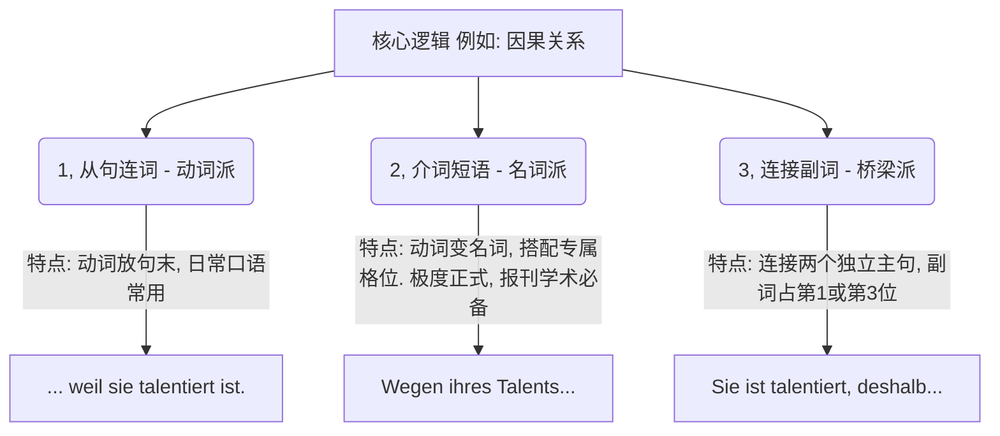
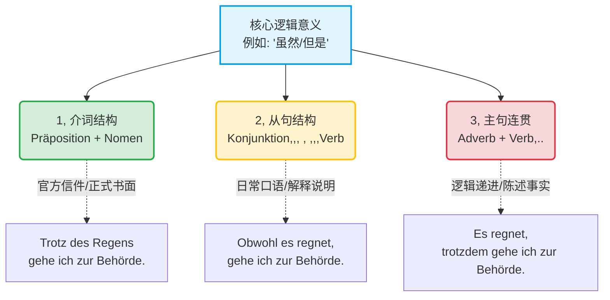

[[语言学习/德语/公共知识语法/从句.md#^DIcUHjM0|100%]]

![[image-347.png|1118]]

# 介词一副词一连词

| **评估维度**                                  | **1. 介词 (Präposition)**                                                                                        | **2. 从句连词 (Subjunktion)**                                                                                                   | **3. 连接副词 (Konjunktionaladverb)**                                                                                                         |
| ----------------------------------------- | -------------------------------------------------------------------------------------------------------------- | --------------------------------------------------------------------------------------------------------------------------- | ----------------------------------------------------------------------------------------------------------------------------------------- |
| **词性本质**                                  | **纯粹的“名词引导者”。** 只能搭配名词或代词。                                                                                     | **纯粹的“句子引导者”。** 必须引导包含主语和动词的完整从句。                                                                                           | **独立的“桥梁成分”。** 它本身是一个副词，充当主句里的状语。                                                                                                         |
| **句法结构**      **(Topologie)** | **不独立，是主句的内部成分。**      👉 **公式：** `[介词 + 名词] + 变位动词 + 主语...`      若放句首（占第1位），动词必须紧跟其后。 | **从句动词必须踢到句末。**      👉 **公式：** `连词 + 主语 + ... + 变位动词, 变位动词 + 主语...`      前一句的动词和后一句的动词被逗号隔开（动词相遇）。 | **连接两个独立的主句。**      👉 **公式：** `主句1. 副词 + 变位动词 + 主语...`      副词通常占据新句子的第1位，动词必须在第2位。 |
| **语体色彩**      **(Stil)**      | **极度正式 (Nominalstil 名词化风格)。** 书面语、官方信件、合同条款、系统报错、医疗诊断的标配。                                                      | **日常交流与解释 (Verbalstil 动词化风格)。** 口语、解释复杂原委、写邮件向同事说明情况时最自然。                                                                   | **客观陈述与逻辑推演。** 用于作报告、逻辑论证、平铺直叙地描述连续发生的事件。                                                                                                 |
| **因果关系**      (因为/所以)         | **wegen (+G)**, **aufgrund (+G)**      _(由于...)_                                                   | **weil**, **da**      _(因为...)_                                                                                 | **deshalb**, **deswegen**, **darum**      _(因此...)_                                                                           |
| **让步关系**      (虽然/但是)         | **trotz (+G/D)**, **ungeachtet (+G)**      _(尽管...)_                                               | **obwohl**, **obgleich**      _(虽然...)_                                                                         | **trotzdem**, **dennoch**      _(尽管如此...)_                                                                                    |
| **条件关系**      (如果/否则)         | **bei (+D)**, **im Falle (+G)**      _(在...情况下)_                                                   | **wenn**, **falls**, **sofern**      _(如果...)_                                                                  | **sonst**, **andernfalls**      _(否则...)_                                                                                     |
| **结果关系**      (导致)            | **infolge (+G)**      _(由于...的结果)_                                                                 | **sodass**, **so ..., dass**      _(以至于...)_                                                                    | **infolgedessen**, **folglich**      _(结果是...)_                                                                               |
### 🤖 大师点拨：德语句法界的“变形金刚”

在德国，表达同一个逻辑意思（比如“因为”），你有三种“交通工具”可以选择。在日常生活中你可以随便开，但在外管局的信件或 B 2 写作考试中，你必须学会切换高级模式（名动转换）：

1. **介词 (Präposition)：** 就像“极速压缩包”**。它必须且只能加**名词（通常是第二格或第三格）。这是德国政府机关和正式合同的最爱（名词化风格 Nominalstil），它能把一整句话压缩成一个词组。
2. **从句连词 (Subjunktion)：** 就像“拖车钩”。它引出一个完整的从句（必须有主语），并且把变位动词死死地踢到句末。这是日常解释说明的标配。
3. **连接副词 (Konjunktionaladverb)：** 就像“独立桥梁”。它把两个独立的主句连接起来，本身占一个句子成分的位置（通常在第 1 位，动词紧跟其后在第 2 位）。

代码段

现在，我们把您的框架彻底丰满起来！

### 🕒 模块一：时间掌控者 (Temporal)

描述动作发生的先后、同时或持续状态。**核心考点：时态的先后顺序与动名词的转化。**

|**逻辑关系**|**1. 从句连词 (动词尾位)**|**2. 介词 (名词化，极度正式)**|**3. 连接副词 (引出新主句)**|
|---|---|---|---|
|**同时发生**|**während** (当...时)|**während** + 第二格 / **bei** + 第三格|**währenddessen / dabei**|
|**先...后...**|**nachdem** (在...之后) ⚠️_从句需提前一个时态_|**nach** + 第三格|**danach / nachher**|
|**后...先...**|**bevor** (在...之前)|**vor** + 第三格|**davor / vorher**|
|**持续起点**|**seit / seitdem** (自从)|**seit** + 第三格|**seitdem**|
|**条件/单次**|**wenn** (经常/未来), **als** (过去单次)|**bei** + 第三格|**dabei** (在此情况下)|

**【移民实战场景演练】**

**1. 同时发生 (Gleichzeitigkeit) - 场景：租房看房**

- **介词:** **Während der Wohnungsbesichtigung** stellte der Mieter viele Fragen. (看房期间，租客问了很多问题。)
- **连词:** **Während** der Mieter die Wohnung **besichtigte**, stellte er viele Fragen.

**2. 先后顺序 (Vorzeitigkeit) - 场景：外管局延签**

- **介词:** **Vor dem Ablauf** meines Visums muss ich dringend einen Termin buchen. (在我的签证过期前，我必须紧急预约。)
- **连词:** **Bevor** mein Visum **abläuft**, muss ich dringend einen Termin buchen. 连词： 在我的签证到期之前，我急需预约。

**3. 过去单次 (Vergangenheit) - 场景：找工作**

- **连词 (als):** **Als** ich meinen ersten Job in Deutschland **bekam**, war ich sehr glücklich. (当我得到在德国的第一份工作时，我很开心。—— _过去只发生了一次，绝不能用 wenn！_)
- **连词 (wenn):** **Wenn** ich Einladungen zum Vorstellungsgespräch **bekomme**, bin ich immer nervös. (每次收到面试邀请时，我总是很紧张。—— _反复发生_)

### 💡 模块二：因果、让步与对比的博弈 (Kausal, Konzessiv, Adversativ)

这是 B 2 写作考试（如投诉信、求职信）中最常用来论证和反驳的工具！

| **逻辑关系**       | **1. 从句连词**              | **2. 介词**                              | **3. 连接副词 / 并列连词**                 |
| -------------- | ------------------------ | -------------------------------------- | ---------------------------------- |
| **原因 (因为)**    | **weil / da** (da 常放句首)  | **wegen / aufgrund** + 第二格             | **deshalb / nämlich / denn**(不占位)  |
| **让步 (虽然..但)** | **obwohl**               | **trotz** + 第二格 / **ungeachtet** + 第二格 | **trotzdem / dennoch / aber**(不占位) |
| **对比 (而/相反)**  | **während / wohingegen** | **im Gegensatz zu** + 第三格              | **dagegen / jedoch**               |

**【大师避坑指南】**

- **nämlich (因为/即)：** 这个词极其傲娇，**绝对不可以放在句首第 1 位！** 它通常放在动词之后（_Ich bleibe zu Hause. Ich bin nämlich krank._）。
- **denn (因为) & aber (但是)：** 它们是“零占位符” (Position 0)，不改变后面的正常语序！

**【移民实战场景演练】**

**1. 原因 (Kausal) - 场景：请病假**

- **介词 (高级):** **Aufgrund starken Fiebers** kann ich heute leider nicht zur Arbeit kommen. (由于高烧，我今天遗憾地无法来上班。)
- **连词 (da):** **Da** ich starkes Fieber **habe**, kann ich heute leider nicht zur Arbeit kommen.

**2. 让步 (Konzessiv) - 场景：租房纠纷维权**

- **介词:** **Trotz mehrmaliger Beschwerden** hat der Hausmeister die Heizung nicht repariert. (尽管多次投诉，房屋管理员仍未修理暖气。)
- **副词:** Wir haben uns mehrmals beschwert, **dennoch** hat der Hausmeister die Heizung nicht repariert.

**3. 对比 (Adversativ) - 场景：对比城市生活**

- **介词:** **Im Gegensatz zu München** sind die Mieten in Leipzig noch bezahlbar. (与慕尼黑相反，莱比锡的租金还是可以承受的。)
- **连词:** **Während** die Mieten in München extrem hoch **sind**, ist das Leben in Leipzig günstiger.

### 🎯 模块三：目的与结果的推导 (Final & Konsekutiv)

用于表达动作的后果或目标，外管局的公函最爱用这一套。

|**逻辑关系**|**1. 从句连词**|**2. 介词**|**3. 连接副词**|
|---|---|---|---|
|**结果 (导致/以至于)**|**sodass / so..., dass**|**infolge** + 第二格|**folglich / infolgedessen**|
|**目的 (为了)**|**damit / um...zu...**|**zu** + 第三格 / **zwecks** + 第二格|**dazu / dafür**|

**【大师语感构建】**

- `damit` 和 `um...zu...` 的区别：前后主语一致时，用极其精简的 `um...zu...` (带 zu 的不定式)；如果**前后主语不一致**（比如：我拼命赚钱，是为了让**孩子**能上好大学），必须且只能用 `damit`。

**【移民实战场景演练】**

**1. 结果 (Konsekutiv) - 场景：职场突发状况**

- **连词:** Mein Kollege war heute unerwartet krank, **sodass** ich seine Schicht übernehmen musste. (同事今天意外生病了，以至于我不得不接替他的班。)
- **副词:** Mein Kollege war heute krank, **infolgedessen** musste ich seine Schicht übernehmen.

**2. 目的 (Final) - 场景：办理行政手续**

- **介词 (极度官方):** Ich brauche einen Termin **zwecks Beantragung** des Kindergeldes. (我需要预约以申请儿童金。)
- **连词 (um...zu):** Ich gehe zur Behörde, **um** das Kindergeld **zu beantragen**.

### 🛠️ 模块四：条件、方式与替代 (Konditional, Modal, Alternativ)

描述动作发生的条件和手段，是展现你词汇丰富度的绝佳阵地。

|**逻辑关系**|**1. 从句连词**|**2. 介词**|**3. 连接副词**|
|---|---|---|---|
|**条件 (如果/否则)**|**wenn / falls / sofern**|**bei** + 第三格 / **im Falle** + 第二格|**sonst / andernfalls**|
|**方式 (通过...手段)**|**indem / dadurch, dass**|**durch** + 第四格 / **mit** + 第三格|**dadurch / damit**|
|**替代 (代替/而非)**|**(an)statt dass / (an)statt...zu**|**(an)statt** + 第二格|**stattdessen**|
|**缺失 (没有/不带)**|**ohne dass / ohne...zu**|**ohne** + 第四格|(无常用对应副词)|

**【移民实战场景演练】**

**1. 条件 (Konditional) - 场景：工作合同条款**

- **介词:** **Im Falle einer vorzeitigen Kündigung** müssen Sie die Personalabteilung informieren. (在提前解约的情况下，您必须通知人事部。)
- **副词 (警告):** Sie müssen pünktlich sein, **andernfalls** erhalten Sie eine Abmahnung. (您必须准时，否则您会收到警告信。)

**2. 方式 (Modal) - 场景：融入德国社会**

- **连词 (B 2 极度高频):** Ich habe mein Vokabular erweitert, **indem** ich jeden Tag deutsche Nachrichten **lese**. (我通过每天阅读德国新闻，扩大了我的词汇量。)
- **介词:** **Durch das tägliche Lesen** deutscher Nachrichten habe ich mein Vokabular erweitert.

