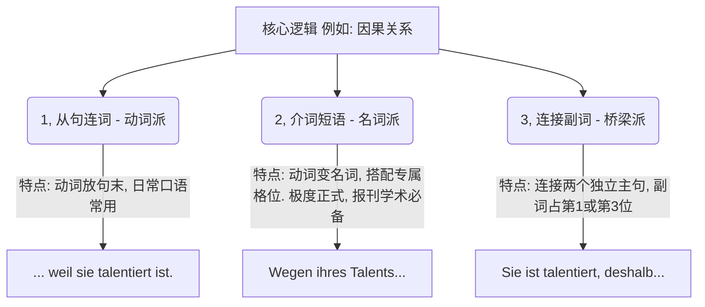

# 介词一副词一连词

掌握了这套系统，你就不再只是在“背单词”，而是在“玩转句子结构”。接下来，我为你将这三张图表的内容，提炼为**四大实战模块**。

### 🕒 模块一：时间掌控者 (Temporal)

_对应图 1。描述动作发生的先后、同时或持续状态。_

在时间表达中，最关键的是**时态的先后顺序**和**动词的转化**。

|**逻辑关系**|**1. 从句连词 (动词在句末)**|**2. 介词 (必须搭配名词化)**|**3. 连接副词 (引出新主句)**|
|---|---|---|---|
|**同时发生**|**während** (当...时)|**während** + 第二格 (在...期间)|**währenddessen** (与此同时)|
|**先...后...**|**nachdem** (在...之后 - _需注意时态提前_)|**nach** + 第三格 (在...之后)|**danach** (在那之后)|
|**后...先...**|**bevor** (在...之前)|**vor** + 第三格 (在...之前)|**davor / vorher** (在此之前)|
|**持续起点**|**seit / seitdem** (自从)|**seit** + 第三格 (自从)|**seitdem** (从那时起)|
|**条件/单次**|**wenn** (当.../常态), **als** (当.../过去单次)|**bei** + 第三格 (在...情况下)|**dabei** (在此情况下)|

**大师划重点：**

- `als` 和 `wenn` 是初中级易错点。过去的**单次**事件只能用 `als` (_Als ich ein Kind war..._)。
- `nachdem` 引导的从句，其时态必须比主句**早一个时态**（比如主句现在时，从句就得用现在完成时：_Nachdem ich getanzt habe, bin ich müde._）

### 💡 模块二：因果与让步的博弈 (Kausal & Konzessiv)

_对应图 2 上部。这是写作中最常用来论证和反驳的工具。_

|**逻辑关系**|**1. 从句连词**|**2. 介词**|**3. 连接副词 / 并列连词**|
|---|---|---|---|
|**原因 (因为)**|**weil / da** (da 常放句首)|**wegen / aufgrund** + 第二格|**deshalb / nämlich / denn**|
|**让步 (虽然/但是)**|**obwohl** (虽然)|**trotz** + 第二格 (尽管)|**trotzdem / dennoch / aber**|

**大师避坑指南：**

1. **nämlich (因为/即)：** 这个词极其傲娇，**绝对不可以放在句首！** 它通常放在主语和动词之后（_Sie hat großen Erfolg. Sie ist nämlich talentiert._）。
2. **denn (因为) & aber (但是)：** 这两个是“零占位符” (Position 0)。它们不改变后面的语序，直接加正语序主句（_..., denn sie ist talentiert._）。

### 🎯 模块三：目的与结果的推导 (Final & Konsekutiv)

_对应图 2 下部及图 3 中段。用于表达动作的后果或目标。_

|**逻辑关系**|**1. 从句连词**|**2. 介词**|**3. 连接副词**|
|---|---|---|---|
|**结果 (导致)**|**sodass** (以至于)|**infolge** + 第二格 (由于...的结果)|**folglich / infolgedessen** (因此)|
|**目的 (为了)**|**damit / um...zu...**|**zu** + 第三格 / **zwecks** + 第二格|**dazu / dafür** (为此)|

**大师语感构建：**

`damit` 和 `um...zu...` 的区别在于：如果前后主语一致，用极其精简的 `um...zu...` (带 zu 的不定式)；如果前后主语不一致（比如：我赚钱是为了让我儿子出国），必须用 `damit`。

### 🛠️ 模块四：条件、方式与替代 (Konditional, Modal, Alternativ)

_对应图 3 上部及下部。描述动作发生的条件和手段。_

|**逻辑关系**|**1. 从句连词**|**2. 介词**|**3. 连接副词**|
|---|---|---|---|
|**条件 (如果/否则)**|**wenn / falls** (如果)|**bei** + 第三格 / **im Falle** + 第二格|**sonst / andernfalls** (否则)|
|**方式/手段 (通过)**|**indem / dadurch, dass...**|**durch** + 第四格 / **mit** + 第三格|**dadurch / damit** (借此)|
|**替代 (代替/而非)**|**(an)statt dass / (an)statt...zu**|**(an)statt** + 第二格|**stattdessen** (取而代之)|
|**缺失 (没有)**|**ohne dass / ohne...zu**|**ohne** + 第四格|(无常用对应副词)|

**C 1 高阶表达：** `indem` (通过...方式) 是高级德语写作的宠儿。比如：_Er spart Geld, **indem** er jeden Tag kocht._ (他通过每天做饭来省钱。) 转化为名词派介词短语就是：_**Durch** tägliches Kochen spart er Geld._

### 🎓 德语大师的通关试炼

掌握这套系统的唯一方法，就是进行“同一句话的三重变形”。这能瞬间让你的德语表达从 B 1 跃升到 C 1。

现在，请你扮演一位高级德语使用者，将下面这句带有“虽然 (obwohl)”**的口语化从句，按照上述逻辑，分别转化为**“介词短语 (Nominalstil)”**和**“连接副词”的形式：

**原句 (从句形式):** Obwohl es stark regnet, gehen wir spazieren. (虽然雨下得很大，我们还是去散步。)

**你的任务：**

1. 请用介词 **trotz** 将其转化为一个单句 (注意动词名词化和格位)。
2. 请用连接副词 **trotzdem** 将其转化为两个独立的主句。

请给出你的答案吧！
