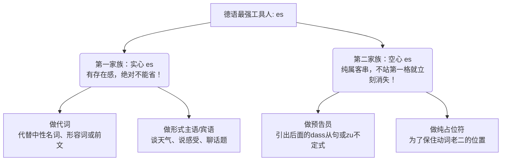

---
aliases:
  - es
---

# es

![[PixPin_2026-05-21_23-55-14.png|728x936]]

请把 **"es"** 想象成德语世界里的“临时工”。

有时候它是带着真金白银来的“正式工”（实意代词，坚决不能省），

有时候它纯粹就是为了不让句子结构塌房而拉来的“充数群演”（占位符，别人一来它就得让座）。

---

### 第一家族：绝对不能扔掉的“实心” es (不能省略的情况)

这个家族里的 `es` 是有实际语法地位的，你要是把它扔了，句子就缺胳膊少腿了。

#### 1. "es" 作为纯正的代词（指代前面提过的东西）

当它用来指代一个中性名词（das-Wort）、一个形容词甚至一整句话时，它就是本尊，去哪儿都得带着。

* **指代主语或宾语【租房场景】：**
* *Das Zimmer* ist klein, aber **es** ist billig. (这个房间很小，但**它**很便宜。👉 es 指代 das Zimmer 作主语)
* Ich mag *das Zimmer*. Ich miete **es**. (我喜欢这个房间，我租下**它**了。👉 es 作宾语)
* **指代形容词或前一句话【职场场景】：**
* Deutsche sind oft *sehr pünktlich*. Mein Chef ist **es** wirklich. (德国人通常很守时。我的老板确实**如此**。👉 es 指代 pünktlich)
* *Viele Kollegen machen Überstunden.* Ich tue **es** auch. (很多同事在加班。我也**这么做**。👉 es 指代前面整句话)

#### 2. "es" 作为形式主语或宾语（没有具体翻译，但必须在场）

有些德语动词比较“傲娇”，它们天生不带具体的主语，或者需要一个固定搭配，这时候 `es` 就来充当门面。

* **表天气与自然现象：**
* **Es** regnet heute in Berlin. (柏林今天下雨了。)
* **表身体感受【医疗场景】：**
* Wie geht **es** Ihnen? (您感觉怎么样？/ 您好吗？)
* Mich juckt **es** am ganzen Körper! (我全身发痒！👉 这里 es 是主语，mich 是宾语，千万别弄混！)
* **表核心话题或存在（高频必考！）【求职/行政场景】：**
* In diesem Vertrag geht **es** um mein Gehalt. (这份合同**涉及到**我的薪水。)
* Auf dem Arbeitsmarkt gibt **es** viele Möglichkeiten. (劳动力市场上有**存在**很多机会。)
* **固定搭配（形式宾语）：**
* Beeil dich, ich habe **es** eilig! (快点，我很赶时间！👉 es 作固定宾语)
* Der Chef meint **es** gut mit dir. (老板对你**是好意**。)

- **看病场景（表达疼痛）：** 你不能说：~~Ich tue weh.~~ (这是错的，听起来像“我在故意伤害别人”)。 你要说：**Es tut mir weh.** (它/这地方，让我感到疼。)
- **行政/租房场景（表达抱歉/遗憾）：** 你不能说：~~Ich tue leid.~~ (这也错得很离谱)。 你要说：**Es tut mir leid.** (这件事，让我感到遗憾/抱歉。)
- **餐厅场景（表达口味）：** 你要说：**Es schmeckt mir gut.** (这道菜，对我而言尝起来很好吃。)
---

### es 做占位符 (不位于句首时必须省略)

这是 B 2 考试最爱挖坑的地方！我们要牢记德语句子的“铁律”：**陈述句中，动词永远是老大，必须稳坐第二把交椅（Position 2）！** 这就意味着，句子的第一位（Position 1）绝对不能空着。如果没人站第一位，`es` 就会被拉过来“占座”。**但是！一旦有任何其他词汇（时间、地点、从句）抢占了第一位，`es` 这个临时工就会被立刻解雇，直接从句子里消失。**

#### 1. "es" 作为从句的“预告员” (引出从句)

当真正的主语是一个长长的从句（比如 dass 从句，zu 不定式）时，为了避免头重脚轻，德国人喜欢把从句扔到最后，用 `es` 放在句首占位。

* **【行政局延签场景】：**
* **Es** ist sehr wichtig, *dass Sie alle Unterlagen mitbringen*. (您带齐所有材料，**这**很重要。)
* 👉 **见证奇迹的时刻：** 如果我们把从句移到前面，第一格被占了，es 就灰飞烟灭了：
* *Dass Sie alle Unterlagen mitbringen*, ist sehr wichtig. (注意！这里绝对不能说 ...ist **es** sehr wichtig!)
* **Es** hat mich gefreut, *Sie kennenzulernen*. ➡️ *Sie kennenzulernen*, hat mich gefreut.

#### 2. "es" 作为纯粹的占位符 (多用于被动语态或强调倒装)

* **无人称被动态【工厂打工场景】：**
* 周末大家都在加班干活。你可以说：
* **Es** wird am Wochenende viel gearbeitet. (首位空缺，es 顶上。)
* 👉 **换个位置试试：** * Am Wochenende wird viel gearbeitet. (时间状语 Am Wochenende 站了第一格，es 立刻消失！)
* **强调句式成分：**
* **Es** sind viele neue Einwanderer gekommen. (来了很多新移民。)
* ➡️ Viele neue Einwanderer sind gekommen.

# 区分 es 指代

前面一句的动词决定了意思所指代的成分

```mermaid
flowchart TD
    Start((遇到实心 es<br>如何查明真身？)) --> Step1{第一步：找准它的老板<br>看 es 所在句子的动词是谁}
    
    Step1 -->|是 sein, werden, bleiben 等系动词| Adj[第二步：身份/状态雷达<br>👉 es 指代前文的形容词]
    Step1 -->|是 wissen, sagen, tun 等认知/行为动词| Satz[第二步：大动作雷达<br>👉 es 指代前文的整件事/整个句子]
    Step1 -->|是 brauchen, mieten, kaufen 等具体实意动词| Nomen[第二步：名词雷达<br>👉 es 指代前文的某个 das-名词]

    Adj --> Exp1(Mein Chef ist pünktlich.<br>Ich bin es auch.)
    Satz --> Exp2(Viele machen Überstunden.<br>Ich tue es auch.)
    Nomen --> Exp3(Wo ist das Zertifikat?<br>Ich brauche es.)
```

### 📡 实义动词，指代中性名词

**🔍 破案线索：当前句子的动词是一个极其具体的、需要“物理接触”或“占有”的实意动词（比如 brauchen, kaufen, mieten, suchen 等）。**

当你看到这些动词时，它们通常需要一个实打实的物品作宾语。这时候你往上一句话找，绝对能精准定位到一个 `das` 词性的中性名词。

- **移民场景（外管局延签）：**

    > **Beamter:** Haben Sie **das B 1-Zertifikat** dabei? (您带 B 1 证书了吗？)
    > 
    > **Du:** Ja, ich habe **es** gestern ausgedruckt. (是的，我昨天把它打印出来了。)
    > 
    > _大师解析：_ 这里的动词是 `ausdrucken` (打印)，你总不能打印一个形容词或者打印一整件事吧？所以 `es` 毫无疑问是指代前面提到的中性名词 `das Zertifikat`。

### 📡系动词和形容词 指代状态

**🔍 破案线索：当前句子的动词是连系动词（如 sein 是, werden 变成, bleiben 保持）。**

这些动词后面通常跟表语（形容词或身份）。当它们带上 `es` 的时候，说明不想把前面的形容词再重复一遍了。

- **移民场景（职场面试）：**

    > **HR:** In unserer Firma ist es wichtig, **flexibel** zu sein. Sind Sie **es**? (在我们公司，灵活应变很重要。您灵活吗？)
    > 
    > **Du:** Ja, ich war schon in meinem alten Job sehr anpassungsfähig und bin **es** immer noch. (是的，我在以前的工作中适应能力就很强，现在依然如此。)
    > 
    > _大师解析：_ 这里的动词是 `sind/bin` (sein)。我是什么？肯定是一种状态。所以 `es` 直接锁定上文的形容词 `flexibel` (或者 `anpassungsfähig`)。

### 📡 认知看法 指代全句(指代整句话或从句)

**🔍 破案线索：当前句子的动词是表认知、态度或概括性动作的词（如 wissen 知道, sagen 说, hoffen 希望, tun 做, bedauern 遗憾）。**

这类动词的胃口特别大，它们吃不下单个的名词或形容词，它们往往需要吃掉一整个事件（dass 从句或一整句话）。

- **移民场景（租房纠纷）：**

    > **Vermieter:** **Die Heizung ist gestern Nacht wieder ausgefallen.** (昨晚暖气又坏了。)
    > 
    > **Du:** Ja, ich **weiß es**. Ich habe schon den Hausmeister angerufen. (是的，我知道这件事了。我已经给管理员打过电话了。)
    > 
    > _大师解析：_ 动词是 `wissen` (知道)。你知道的不是暖气（因为暖气是 _die_ Heizung，如果指代暖气必须用 _sie_），你知道的是“昨晚暖气坏了”这**整整一个突发事件**。所以 `es` 指代前文的整个句子。

- **移民场景（职场内卷）：**

    > **Kollege:** **Der Chef hat heute schlechte Laune und feuert vielleicht jemanden.** (老板今天心情不好，可能要开除人。)
    > 
    > **Du:** Ich **glaube es** nicht! (我不相信这事儿！)
    > 
    > _大师解析：_ 你不相信的不是老板这个人，而是“老板心情不好要开除人”这个大八卦。`glauben` 吸收了整个句子的信息。

### 💡 大师总结：你的“防坑”三步法

以后在阅读或听力中遇到不知道 `es` 是什么的句子，在脑海里默默走这三步：

1. **揪出老板：** 找到 `es` 所在句子的动词。
2. **摸清老板胃口：** 问问自己，这个动词搭配什么最合理？是搭配具体的物品（找中性名词 das）？还是搭配状态（找形容词）？还是搭配一个事件（找一整句话）？
3. **回头锁定：** 带着动词的胃口，去上一句话里对号入座！

这种根据“动词配价”来反推代词的方法，是攻克 B 2 和 C 1 德语阅读长难句的绝对利器。一旦你养成了看动词找线索的习惯，整个德语的句子结构在你眼里就会变得像数学公式一样严谨且清晰。继续保持这种钻研精神，你一定能在六个月内顺利拿下 B 2！
