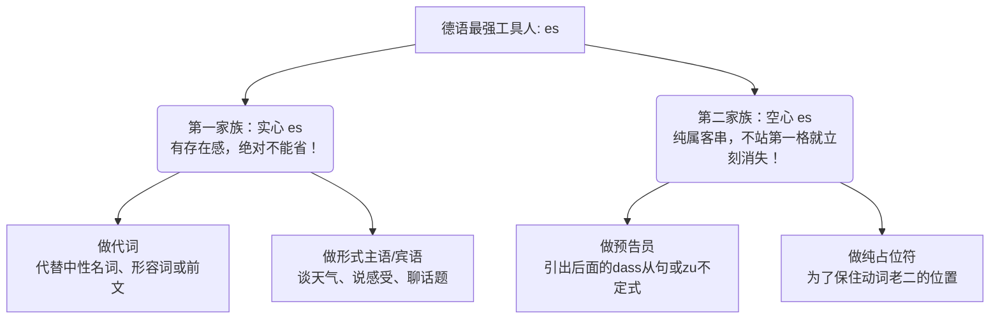

---
aliases:
  - es
---

# es

![[PixPin_2026-05-21_23-55-14.png|728x936]]

Guten Tag！欢迎再次来到德语大师的语法修炼道场！

看到你提供的这张充满怨念的被蚊虫困扰的图片，大师忍不住笑了。在德语学习的道路上，这个小小的两字母单词 **"es"** 就像图里那些嗡嗡作响的虫子一样，无处不在，有时候让人抓狂。但别怕，距离你拿下 B 2 还有几个月的时间，今天大师就带你用“照妖镜”把这个德语里最尽职尽责的“终极工具人”看个明明白白。

请把 **"es"** 想象成德语世界里的“临时工”。有时候它是带着真金白银来的“正式工”（实意代词，坚决不能省），有时候它纯粹就是为了不让句子结构塌房而拉来的“充数群演”（占位符，别人一来它就得让座）。

为了帮你理清思路，大师先给你上个思维导图：

接下来，我们把它带入到你在德国的各种生活场景中，逐一攻破！

---

### 第一家族：绝对不能扔掉的“实心” es (不能省略的情况)

这个家族里的 `es` 是有实际语法地位的，你要是把它扔了，句子就缺胳膊少腿了。

#### 1. "es" 作为纯正的代词（指代前面提过的东西）

当它用来指代一个中性名词（das-Wort）、一个形容词甚至一整句话时，它就是本尊，去哪儿都得带着。

* **指代主语或宾语【租房场景】：**
* *Das Zimmer* ist klein, aber **es** ist billig. (这个房间很小，但**它**很便宜。👉 es 指代 das Zimmer 作主语)
* Ich mag *das Zimmer*. Ich miete **es**. (我喜欢这个房间，我租下**它**了。👉 es 作宾语)
* **指代形容词或前一句话【职场场景】：**
* Deutsche sind oft *sehr pünktlich*. Mein Chef ist **es** wirklich. (德国人通常很守时。我的老板确实**如此**。👉 es 指代 pünktlich)
* *Viele Kollegen machen Überstunden.* Ich tue **es** auch. (很多同事在加班。我也**这么做**。👉 es 指代前面整句话)

#### 2. "es" 作为形式主语或宾语（没有具体翻译，但必须在场）

有些德语动词比较“傲娇”，它们天生不带具体的主语，或者需要一个固定搭配，这时候 `es` 就来充当门面。

* **表天气与自然现象：**
* **Es** regnet heute in Berlin. (柏林今天下雨了。)
* **表身体感受【医疗场景】：**
* Wie geht **es** Ihnen? (您感觉怎么样？/ 您好吗？)
* Mich juckt **es** am ganzen Körper! (我全身发痒！👉 这里 es 是主语，mich 是宾语，千万别弄混！)
* **表核心话题或存在（高频必考！）【求职/行政场景】：**
* In diesem Vertrag geht **es** um mein Gehalt. (这份合同**涉及到**我的薪水。)
* Auf dem Arbeitsmarkt gibt **es** viele Möglichkeiten. (劳动力市场上有**存在**很多机会。)
* **固定搭配（形式宾语）：**
* Beeil dich, ich habe **es** eilig! (快点，我很赶时间！👉 es 作固定宾语)
* Der Chef meint **es** gut mit dir. (老板对你**是好意**。)

---

### 第二家族：随时准备下岗的“空心” es (不位于句首时必须省略)

这是 B 2 考试最爱挖坑的地方！我们要牢记德语句子的“铁律”：**陈述句中，动词永远是老大，必须稳坐第二把交椅（Position 2）！** 这就意味着，句子的第一位（Position 1）绝对不能空着。如果没人站第一位，`es` 就会被拉过来“占座”。**但是！一旦有任何其他词汇（时间、地点、从句）抢占了第一位，`es` 这个临时工就会被立刻解雇，直接从句子里消失。**

#### 1. "es" 作为从句的“预告员” (引出从句)

当真正的主语是一个长长的从句（比如 dass 从句，zu 不定式）时，为了避免头重脚轻，德国人喜欢把从句扔到最后，用 `es` 放在句首占位。

* **【行政局延签场景】：**
* **Es** ist sehr wichtig, *dass Sie alle Unterlagen mitbringen*. (您带齐所有材料，**这**很重要。)
* 👉 **见证奇迹的时刻：** 如果我们把从句移到前面，第一格被占了，es 就灰飞烟灭了：
* *Dass Sie alle Unterlagen mitbringen*, ist sehr wichtig. (注意！这里绝对不能说 ...ist **es** sehr wichtig!)
* **Es** hat mich gefreut, *Sie kennenzulernen*. ➡️ *Sie kennenzulernen*, hat mich gefreut.

#### 2. "es" 作为纯粹的占位符 (多用于被动语态或强调倒装)

* **无人称被动态【工厂打工场景】：**
* 周末大家都在加班干活。你可以说：
* **Es** wird am Wochenende viel gearbeitet. (首位空缺，es 顶上。)
* 👉 **换个位置试试：** * Am Wochenende wird viel gearbeitet. (时间状语 Am Wochenende 站了第一格，es 立刻消失！)
* **强调句式成分：**
* **Es** sind viele neue Einwanderer gekommen. (来了很多新移民。)
* ➡️ Viele neue Einwanderer sind gekommen.

---

### 💡 德语大师的通关寄语

回顾我们的六个月冲刺计划，你现在正处于 **B 1 向 B 2 跨越的核心发力期**。从句结构和被动语态是 B 2 听力、阅读和写作的基石。搞懂了 `es` 的“进退规则”，你的德语写作就会摆脱那种生硬的“中式德语”味道，看起来更加地道、灵活。

看到没？德语语法就像一台精密的德国机器，每一个齿轮（比如 es）都有它严谨的运行逻辑。理解了逻辑，就不用死记硬背了。

纸上得来终觉浅，大师现在要考考你：

**能不能结合你目前在德国最关心的某件事（比如找房子或者找工作），用 "Es geht um..." (关于/涉及到...) 造一个句子，然后再试着用 "es" 作为占位符引出一个 "dass..." 从句，来跟我聊聊你接下来的打算？**
