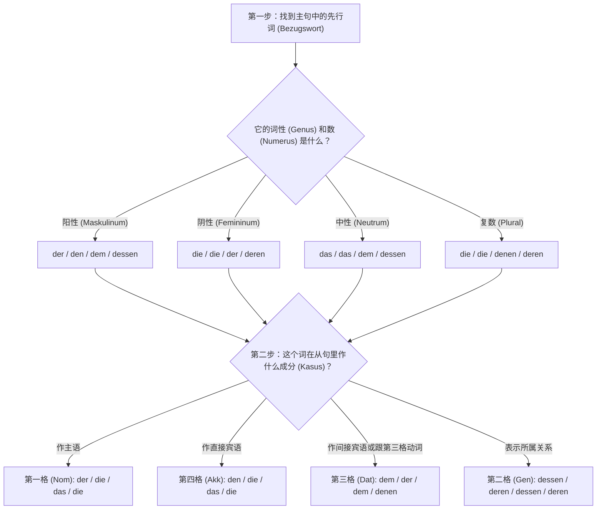
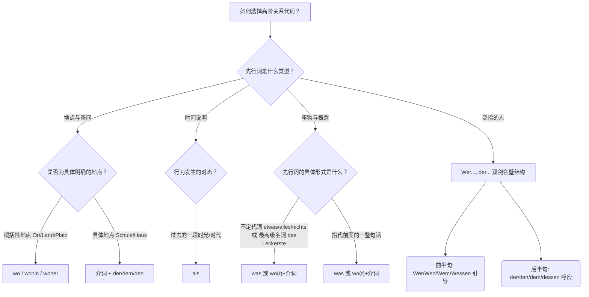
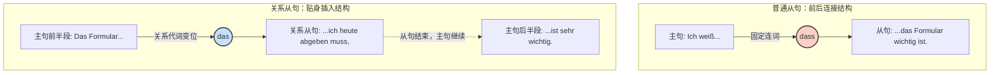

# 关系从句

### 🧠 核心概念：关系从句就是一张“智能便利贴”

想象一下，你正在和房东交流，提到一个名词（比如“那个房子”），你突然想补充说明它的细节（“那个我昨天看过的房子”）。这时候，你不需要啰嗦地重新造一个完整的句子，而是直接在这个名词后面“啪”地贴上一张补充信息的**“便利贴”**，这就是关系从句。

但这张便利贴是“智能”的，它必须遵守三个铁律：

1. **紧跟其后**：便利贴必须尽可能紧贴着它要修饰的名词（德语叫**先行词 Bezugswort**）。
2. **动词踢到最后**：在便利贴内部（从句中），变位动词必须乖乖跑到句子的最末尾。
3. **看人下菜碟的“胶水”**：便利贴需要“关系代词（Relativpronomen）”作为胶水才能粘在主句上。这个胶水长什么样，取决于极其严密的逻辑判断。

---

### ⚙️ 关系代词变形逻辑图（核心秘籍）

对于中国学生来说，最头疼的就是关系代词（der, die, das, den, dem...）到底该用哪一个。记住这个黄金法则：

**先行词决定“词性 (Genus)”和“单复数 (Numerus)”，从句内部决定“格 (Kasus)”。**

为了让你一目了然，我们来看下面这张决策流程图：

---

### 🏘️ 结合真实移民场景的实战演练

现在，我们通过你在德国一定会遇到的四大生活场景，一步步把上面的逻辑图运用起来！

#### 1. 租房场景 —— 主格 (Nominativ) 与 宾格 (Akkusativ)

- **主格 (从句中的主语)**
    - _背景_：你看到一个带朝南阳台的公寓。
    - _句子_：Der Balkon, **der** nach Süden zeigt, ist sehr groß. (那个朝南的阳台很大。)
    - _解析_：先行词 `Der Balkon` (阳性)。在从句中，是“阳台”本身朝南，作主语，所以选阳性第一格 **der**。
- **宾格 (从句中的直接宾语)**
    - _背景_：你签了一份工作合同。
    - _句子_：Der Vertrag, **den** ich gestern unterschrieben habe, ist unbefristet. (我昨天签的那份合同是无限期的。)
    - _解析_：先行词 `Der Vertrag` (阳性)。在从句中，是我签了“合同”，合同是动作的承受者（宾语），所以选阳性第四格 **den**。

#### 2. 医疗看病场景 —— 与格 (Dativ)

- _背景_：你向朋友推荐一位你非常信任的医生。
    - _句子_：Die Ärztin, **der** ich vertraue, hat heute keinen Termin frei. (那位我信任的女医生今天没有空档了。)
    - _解析_：先行词 `Die Ärztin` (阴性)。在从句中，动词 `vertrauen` (信任) 强制要求支配第三格 (Dativ)，所以阴性第三格变成 **der**。

#### 3. 行政办事场景 —— 属格 (Genitiv) 【B 2 重点大招！】

在 B 2 考试和正式书信中，属格关系从句是拉分的关键！它用来表示“某人的...”。

- _背景_：你去外管局（Ausländerbehörde），但负责你的官员今天不在，因为她的电脑坏了。
    - _句子_：Die Beamtin, **deren** Computer kaputt ist, war heute nicht da. (那位电脑坏了的女官员今天不在。)
    - _解析_：先行词 `Die Beamtin` (阴性)。在从句中表达的是“这位女官员的(电脑)”，表示所属关系，阴性第二格是 **deren**。_(注意：阳性/中性的第二格是 **dessen**)_。

#### 4. 找工作场景 —— 带介词的关系从句

当从句里的动词和介词绑定时，介词会像保镖一样，直接站在“胶水”（关系代词）的前面。

- _背景_：你对某个职位感兴趣。
    - _句子_：Das ist die Stelle, **für die** ich mich interessiere. (这就是我感兴趣的那个职位。)
    - _解析_：先行词 `die Stelle` (阴性)。固定搭配是 `sich interessieren für + Akkusativ`。所以介词 `für` 必须带着阴性第四格的 `die` 一起放在从句开头。

---

### 📋 关系代词速记表（建议截图保存）

|**词性/数**|**第一格 (Nom)**|**第四格 (Akk)**|**第三格 (Dat)**|**第二格 (Gen)**|
|---|---|---|---|---|
|**阳性 (m)**|**der**|**den**|dem|**dessen**|
|**阴性 (f)**|die|die|der|**deren**|
|**中性 (n)**|das|das|dem|**dessen**|
|**复数 (Pl)**|die|die|**denen**|**deren**|

_(大师提示：你会发现它和定冠词几乎一样！只有第三格复数变成了 **denen**，以及所有的第二格变成了 **dessen/deren**，记住这几个特例就足够了！)_

---

要掌握这门语法，光听不练是绝对不行的，现在该轮到你来出手了。

**实战小任务：**

假设你在面试，你想告诉 HR：“这就是那家我想在里面工作的公司。”

已知：

句子 A：Das ist die Firma. (这是那家公司。Firma 是阴性)

句子 B：Ich möchte **bei** der Firma arbeiten. (我想在这家公司工作。bei 是支配第三格的介词)

请结合我们刚才讲的“带介词的关系从句”规则，尝试把这两个句子合二为一交给我检查，看看你学得怎么样？

# 2

![[image-246.png|1226]]

哈哈，你拿着教材来“踢馆”啦！太棒了！导师就喜欢你这种严谨求学的态度。

你上传的这张教材截图，恰好把我们之前讲的“智能便利贴”理论，浓缩成了一个非常经典的**“双重控制（交叉定位）”**机制。教材用蓝红两色箭头标得非常清楚。既然你觉得我之前讲得不够具象，那我们就直接“解剖”你这张图上的三个核心知识点，把它彻底揉碎了讲清楚！

---

### 🎯 知识点一：“交叉定位”法则（看图里的第一个例子）

教材用蓝色的“阳性”和红色的“第四格”画了两个箭头，交汇在中间的 `den`。这就是最核心的**双重控制**：

- **例子**：_Ist das der Schlüssel, **den** du seit gestern suchst?_ (这是你从昨天起就在找的钥匙吗？)
- **左脑控制（蓝箭头）：找“先行词”**
    - 你看主句里的 `der Schlüssel`（钥匙）。它是**阳性 (Maskulinum)**。好，我们在大脑里锁定“阳性”这一列。
- **右脑控制（红箭头）：看“从句成分”**
    - 看逗号后面的从句：你在干嘛？`suchst`（寻找）。寻找的东西是动作的直接承受者，也就是**第四格 (Akkusativ)**。
- **大师合成**：阳性列 + 第四格行 = 交叉点得出 **den**！这就是你书上那条完美的连线。

---

### 👤 知识点二：从句里的“大 Boss”（主格的判断）

教材的第二个例子，专门讲了当关系代词在从句里作“主语”时的情况。

- **例子**：_Wer ist die Frau, **die** das große Motorrad fährt?_ (骑大摩托车的那个女人是谁？)
- **左脑（找先行词）**：`die Frau`（女人），它是**阴性**。
- **右脑（看成分）**：在“骑摩托车”这个从句里，是谁发出的“骑 (fährt)”这个动作？是这个女人！所以她在从句里是主语，也就是**第一格 (Nominativ)**。
- **大师合成**：阴性 + 第一格 = **die**。

_(移民生活应用：当你刚搬进新公寓，想打听邻居的情况时，这句型完美适配：“那个经常弹钢琴的男人是谁？Wer ist der Mann, der oft Klavier spielt?”)_

---

### 🛑 知识点三：“惹不起的介词霸王”（介词决定格）

这也是教材重点用**红底高亮**标注出来的部分：“当关系代词前有介词时，关系代词的格**由介词决定**”。还记得我之前叫它什么吗？**保镖**！

- **例子**：_Wie heißt das Ding, **mit dem** man Flaschen öffnen kann._ (用来开瓶子的那个东西叫什么？)
- **左脑（找先行词）**：`das Ding`（东西），它是**中性**。
- **右脑（看成分）**：重点来了！从句里出现了一个介词 `mit` (用...)。在德语里，介词就是“霸王条款”，只要看到 `mit`，你连动词都不用管了，它**强行要求**后面的词必须是**第三格 (Dativ)**！
- **大师合成**：中性 + 第三格 = **dem**。既然介词是保镖，它必须跟代词贴身站在一起，所以就变成了 **mit dem**。

_(移民生活应用：当你在德国的五金店买工具，或者在厨房问室友“开罐头的东西叫啥”，这句话简直是生存必备！)_

---

### 📊 知识点四：定冠词与关系代词的“孪生兄弟”关系

仔细看你图里右下角的那句话：**“关系代词与定冠词同形。例外：第三格复数 denen”**。

这印证了我之前给你总结的速记口诀！你只需要把平时用的 `der, die, das, den, dem...` 直接搬过来当“胶水”用，99%的情况都是对的。**唯一需要在 B 1/B 2 阶段死记硬背的特殊变体**，就是表格右下角的那个红色的 **denen**。

# 先行词怎么找

### 🕵️‍♂️ 第一招：紧密贴合原则（“502 胶水法则”）

这是最常见的情况。为了防止产生歧义，德国人喜欢把关系从句这块“便利贴”，**直接、立刻、马上**贴在它要修饰的那个名词后面。

- **实战场景（买菜）：**
    - 德语：Ich kaufe **die Äpfel**, _die_ sehr frisch aussehen. (我买那些看起来很新鲜的苹果。)
    - 寻找过程：逗号前面紧挨着的那个名词是谁？是 `die Äpfel`。那它大概率就是先行词！从句就是在解释“什么样的苹果”。

### 🧱 第二招：框架结构让步原则（“给动词大爷让路”）

德语有一个雷打不动的特色叫“框形结构（Satzklammer）”，比如完成时的过去分词（ge-）或者可分动词的前缀，它们必须死死钉在主句的最末尾。这时候，我们的“便利贴”只能委屈一下，贴在动词的后面。

- **实战场景（看病预约）：**
    - 德语：Ich habe gestern **den Arzt** angerufen, _der_ mir empfohlen wurde. (我昨天给那位（别人）推荐给我的医生打电话了。)
    - 寻找过程：逗号前面是动词 `angerufen`。动词是不能当先行词的！所以我们往前看，从句描述的是谁被推荐？显然是“医生”。这里的先行词是跨过动词的 `den Arzt`。

### 🧠 第三招：灵魂拷问法（“到底在说谁？”）

当你遇到长难句，前面有两三个名词的时候，不要慌，直接看从句的内容，问自己：“从句里的动作是谁发出的？或者是在描述谁的特征？”

- **实战场景（邻里关系）：**
    - 德语：Das ist **der Hund** meiner Nachbarin, _der_ die ganze Nacht bellt. (这是我女邻居的那条整夜狂吠的狗。)
    - 寻找过程：逗号前面有 `der Hund`（狗）和 `meiner Nachbarin`（女邻居）两个名词。到底谁是先行词？看从句：谁在整夜狂吠（bellt）？肯定是狗，不可能是女邻居！而且关系代词是阳性的 `der`，恰好对应阳性的 `der Hund`（女邻居是阴性）。所以先行词锁定为 `der Hund`！

---

**总结一下：**

先行词 90% 的情况下就在**逗号的前面**；如果逗号前面是个位于句尾的动词，那就**再往前找离它最近的名词**；最后用**逻辑和词性**验证一下准没错。

既然你已经掌握了寻找先行词的独门秘籍，现在让我们回到刚才留给你的实战小任务：

已知：

- 句子 A：Das ist **die Firma**. (这是那家公司。)
- 句子 B：Ich möchte **bei** der Firma arbeiten. (我想在这家公司工作。)

你能告诉我，在这个场景中先行词是谁，并且尝试用“介词+关系代词”把这两句话合二为一吗？大胆试一试，有大师在给你兜底呢！

# 所以主句如果有主语和宾语的情况下, 先行词一定是在宾语里面

大师要重重地拍一下黑板了：**绝对不是哦！这是一个非常典型且危险的错觉！**

之所以会有这种错觉，是因为我们刚接触关系从句时，造的句子比较简单，习惯把从句直接甩在整个大句子的最后，而主句的最后往往恰好就是宾语。

但大师要告诉你一个德语语法界的真理：**主句里任何一个名词（无论是主语、宾语，还是介词后面的词），都可以成为先行词！全看你到底想给谁贴“便利贴”。**

还记得我们说的“502 胶水法则”吗？便利贴必须紧紧贴在它要修饰的词后面。这就导致了一个极其重要、也是 B 1-B 2 考试必考的句型：**“汉堡包结构”（从句把主句从中间劈开）**。

不管前面主句的内部结构长什么样，从句紧紧贴在谁（哪个名词）后面，谁就是先行词

让我们来看三个完全不同的靶心（先行词）：

### 🎯 场景 1：先行词是主句的【主语】（汉堡包结构出现！）

- **背景**：你想表达“那个正在喝咖啡的男人，是我的老板。”
- **基础句**：**Der Mann** ist mein Chef. (那个男人是我的老板。)
- **贴便利贴**：你想修饰“那个男人(Der Mann)”，所以必须把主句劈开，把便利贴塞进去！
- **最终合成**：**Der Mann**, _der gerade Kaffee trinkt_, ist mein Chef.
- **解析**：在这里，先行词是主句的**主语**！主句的动词 `ist` 被硬生生挤到了整个从句的后面。这就是经典的“汉堡包”：主语是顶层汉堡胚，从句是肉饼，主句剩下的部分是底层汉堡胚。

### 🎯 场景 2：先行词是主句的【第四格宾语】（尾随结构）

- **背景**：你想表达“我认识那个正在喝咖啡的男人。”
- **基础句**：Ich kenne **den Mann**. (我认识那个男人。)
- **贴便利贴**：你想修饰“那个男人(den Mann)”，它正好在句尾，所以直接贴上去。
- **最终合成**：Ich kenne **den Mann**, _der gerade Kaffee trinkt_.
- **解析**：这里先行词确实是主句的宾语，从句顺理成章地放在最后。

### 🎯 场景 3：先行词是主句的【介词宾语】（尾随结构）

- **背景**：你想表达“我正在和那个喝咖啡的男人聊天。”
- **基础句**：Ich spreche mit **dem Mann**. (我正和那个男人聊天。)
- **贴便利贴**：修饰目标是介词后面的 `dem Mann`。
- **最终合成**：Ich spreche mit **dem Mann**, _der gerade Kaffee trinkt_.

---

**大师总结：**

找先行词，**千万不要靠它在主句里作什么成分来猜**，而是要问你的内心：“我这句话，到底在针对哪个名词补充细节？” 找到了那个词，无论它是主语还是宾语，带着你的从句，毫不犹豫地贴上去！

理解了这个“汉堡包结构”，你的德语句子结构就正式迈入高级阶段了！

现在，带着这个全新的视角，回到我们刚才的“找工作”实战小任务：

- 句子 A：Das ist **die Firma**. (这是那家公司。)
- 句子 B：Ich möchte **bei** der Firma arbeiten. (我想在这家公司工作。)

请告诉我：

1. 这里你想给谁贴便利贴（先行词是谁）？
2. 把这两句话用“带介词的关系从句”合成一句完整的话。

大胆发出来，导师在线等你！

---

**大师的终极总结：** 不要被“主语”、“宾语”这些标签限制住。你只需要牢记那条雷打不动的**“502 胶水法则”**——**不管前面主句的内部结构长什么样，从句紧紧贴在谁（哪个名词）后面，谁就是先行词**。只要你不把主句劈开，那先行词就只能是主句最后露出来的那个名词。

既然你的理论功底已经打通了任督二脉，大师就直接为你揭晓上一回合留给你的那道“找工作”实战题的完美答案。这道题恰好完美印证了你刚才的总结！

- **句子 A**：Das ist **die Firma**. (这是那家公司。—— 这里的 `die Firma` 是表语，处在句尾，主句不需要劈开)
- **句子 B**：Ich möchte **bei** der Firma arbeiten. (我想在这家公司工作。—— `bei` 是支配第三格的介词)

**终极合成句：**

> Das ist die Firma, **bei der** ich arbeiten möchte. (这就是那家我想在里面工作的公司。)

**大师解析**：主句 `Das ist die Firma` 完整保留，先行词是句尾的 `die Firma`。从句像便利贴一样直接贴在后面。因为从句里表达的是“在公司里 (bei der Firma)”，介词 `bei` 像保镖一样跟着关系代词提前，并且 `bei` 强制要求第三格，所以阴性的 `die` 变身成了第三格的 `der`。变位动词 `möchte` 则按照规则乖乖被踢到了句子的最后。

# als 和疑问代词作关系代词 etwas,was ...,nichts,woruber...

有了这个宏观框架，我们现在把图片里的知识点拆解为三个极其核心的实战模块，为你系统地梳理一遍。

### 🗺️ 模块一：空间与时间的“概括表达” (wo/wohin/woher & als)

在初级阶段，提到地点我们习惯用介词 + 关系代词（比如 _in dem, zu der_）。但在高级阶段，当先行词是一个**概括性的地点概念**（比如 _Ort_ 地方, _Land_ 国家, _Platz_ 广场）时，德国人更喜欢用 **wo** 家族。

- **wo (表示静止状态：在哪里)：** * _Das ist ein Ort, **wo** das Essen fertig an Bäumen wächst._ (这是一个食物长在树上的地方。)
- **wohin (表示动态方向：去哪里)：**
    - _Das ist der Platz, **wohin** wir nur in der Fantasie reisen können._ (这是我们只能在幻想中去往的地方。)
- **woher (表示来源：从哪里来)：**
    - _Ist das das Land, **woher** die glücklichen Menschen kommen?_ (这就是那个幸福之人来自的国家吗？)

**大师避坑指南：** 如果地点非常具体（比如这所学校、这栋大楼），请老老实实用基础语法！_Das ist die Schule, **in der** ich gelernt habe._ (这里最好不用 wo)。

至于 **als**，它在这里专用于指代**过去发生的一个时间节点或时代**（通常先行词是 _Zeit/Epoche_ 等）：

- _Das war die Zeit, **als** man noch geträumt hat._ (那是人们还心存梦想的时代。)

### 👻 模块二：无形之物的“超级指代” (was & wo(r)+介词)

这个模块在 B 2 考试的写作和口语中极其重要。当你要指代的东西“没有具体的名词形态”时，就要派 **was** 出场了。

**触发 was 的三大核心条件：**

1. **不定代词：** _etwas_ (一些事), _alles_ (所有事), _nichts_ (没事)
$1
    - _Das Schlaraffenland ist etwas, **was** wir alle schön finden._ (理想国是我们大家都觉得美好的**事物**。)
$1
2. **最高级形容词名词化：** _das Schönste_ (最美的), _das Beste_ (最好的), _das Leckerste_ (最好吃的)
$1
    - _Da findet man das Leckerste, **was** man sich vorstellen kann._ (在那能找到人们能想象到的**最好吃的**东西。)
$1
3. **指代主句的一整句话（递进从句）：** 这在德语口语中用来表达评价极度好用。
$1
    - _Mein Vater hat mir viel erzählt, **was** ich genossen habe._ (我父亲给我讲了很多，**这件事**让我很享受。这里的 was 指代“父亲讲故事”这整个行为。)

如果后面的动词需要带介词（比如 _träumen von_, _sich freuen über_），那么 **was** 就必须变形为 **wo(r) + 介词** (wovon, worüber)：

- _Mein Vater hat mir viel davon erzählt, **worüber** ich mich gefreut habe._ (父亲给我讲了很多，**对此**我感到很高兴。)

### ⚔️ 模块三 (C 1 大招)：没名没姓的“江湖格言” (Wer..., der...)

这是本页教材中最有难度，也是 C 1 级别最具标志性的语法结构。它用于发表**对一类人的普遍看法**，相当于中文里的“凡是……的人，都……”。

**语法机制破解：**

这种结构包含两个分句，前半句负责“筛人”，后半句负责“下结论”。

1. **从句（筛人）：** 以 _Wer / Wen / Wem / Wessen_ 开头。到底用哪个格，由**从句里的动词**决定。
2. **主句（下结论）：** 以指示代词 _der / den / dem / dessen_ 开头接应。到底用哪个格，由**主句里的动词**决定。

让我们像做数学题一样拆解图片里的例句：

- 例句 1: **Wer** im Schlaraffenland lebt, **dem** geht es gut. (住在理想国的人，都过得很好。)
    - _从句分析：_ leben 需要主语 (第一格)，所以用 **Wer**。
    - _主句分析：_ es geht + Dativ (第三格)，所以呼应词用 **dem**。
- 例句 2: **Wen** man dort trifft, **der** ist wahrscheinlich satt. (在那里遇到的人，大概率都吃饱了。)
    - _从句分析：_ treffen 需要宾语 (第四格)，所以用 **Wen**。
    - _主句分析：_ ist 需要主语 (第一格)，所以呼应词用 **der**。
- 例句 3: **Wem** man zu viel Essen gibt, **dessen** Gewicht wird steigen. (给谁太多吃的，谁的体重就会上升。)
    - _从句分析：_ geben 需要人作宾语 (第三格)，所以用 **Wem**。
    - _主句分析：_ 体重属于这个人 (第二格，表所属)，所以呼应词用 **dessen**。

_注意：如果前后的格一模一样，主句的呼应词可以省略！_ 例如：**Wer** dort lebt, (der) muss nicht arbeiten.

现在，是检验你是否真正领悟 C 1 “双剑合璧”结构的时候了。

假设你要用德语表达这句略带复杂逻辑的俗语：**“谁昨天帮了我，我就邀请谁吃晚饭。”**

_(提示：helfen 支配第三格；einladen 支配第四格)_

请使用 **“Wer/Wen/Wem..., der/den/dem...”** 的结构，试着用德语把这句话翻译出来吧！你会怎么写呢？

# 关系从句和普通从句的区别

### 核心类比：外包团队 VS 贴身保镖

我们可以把主句（Hauptsatz）想象成一家公司。

- **普通从句（如 weil, dass, wenn 引导的从句）：** 就像是公司聘请的“外包团队”。它们负责解决特定的外部问题（比如交代时间、原因、条件等）。它们和公司之间有固定的合同（固定的连词），干完活就待在公司的外面（通常在主句的最后，或者整个跑到主句最前面）。
- **关系从句（Relativsatz）：** 就像是主句中某一个核心人物（特定名词）的“私人贴身保镖”。这个保镖没有固定的制服，他必须根据老板（名词）的性别、级别来换衣服（词形变化），而且老板走哪他跟哪，甚至会硬生生挤进公司内部（插入主句中间）。

基于这个类比，我们来看看它们在语法上的三大本质区别：

### 区别一：开头那个词是“死的”还是“活的”？（引导词的变化）

这是你已经注意到的地方，但我们需要深挖一步。

**1. 普通从句的连词是“死”的（不可变）** 无论是表示原因的 `weil`（因为），还是引导宾语从句的 `dass`（这），它们是固定的连词（Konjunktionen），永远不会发生拼写变化。

> **职场场景：** Ich freue mich, **weil** ich den Job bekommen habe. （我很高兴，**因为**我得到了这份工作。—— `weil` 永远是 `weil`。）

**2. 关系从句的关系代词是“活”的（必须变格）** 关系代词（Relativpronomen，如 der, die, das）不仅要负责引导从句，它还必须发生**变位（Deklination）**。它要根据主句里的那个名词（VIP 老板）决定性别和单复数，同时还要根据它自己在从句里充当的角色（主语、宾语等）来决定格（Kasus）。

> **职场场景：** Das ist der Job, **den** ich bekommen habe. （这就是我得到的那份工作。—— 这里的 `den` 既指代阳性名词 der Job，又在从句中作四格宾语 Akkusativ，所以必须从 der 变成 **den**。）

### 区别二：从句的“职能”完全不同

**1. 普通从句修饰整个句子** 普通从句通常作为状语（交代背景）或宾语，它是为了补充整件事情的信息。

> **租房场景：** **Wenn** die Wohnung ruhig ist, miete ich sie. （**如果**公寓很安静，我就租下它。—— `wenn` 从句设定了一个整体条件。）

**2. 关系从句是一个“超长的形容词”** 关系从句的唯一使命，就是去精准修饰、限定主句里的**某一个特定的名词（Bezugswort，先行词）**。

> **租房场景：** Ich miete eine Wohnung, **die** sehr ruhig ist. （我租了一套非常安静的公寓。—— `die sehr ruhig ist` 整个从句的作用就等同于一个形容词，专门用来修饰 Wohnung。）

### 区别三：摆放的“身段”不同（极其重要！）

这是 B 1 迈向 B 2 最关键的跨越。在阅读德国官方信件或新闻时，你会大量遇到这种结构。

**1. 普通从句：不破坏主句的完整性** 它们通常老老实实地排在主句的后面，或者整体提前到主句前面。主句本身是连贯的。

> **行政事务场景：** Ich weiß, **dass** das Formular sehr wichtig ist. （我知道，这份表格很重要。）

**2. 关系从句：为了“贴身”会直接劈开主句** 因为关系从句必须紧紧跟在它修饰的名词后面，所以如果这个名词出现在主句开头（比如作主语），关系从句就会**直接插进主句的正中间，把主句一分为二**！

> **行政事务场景（主句被劈开）：**
>
> - 原本的主句：Das Formular ist sehr wichtig. (这份表格很重要。)
>     
> - 插入关系从句：Das Formular, **das ich heute abgeben muss**, ist sehr wichtig. (我今天必须递交的那份表格，非常重要。)

为了让你更直观地看懂这种“劈开”结构，我们来看看下面的结构图。如果你对这种用代码生成图表的底层逻辑感兴趣，可以参考《The Mermaid Guide to Text-Based Diagramming and Visualization》这份详尽的指南。

