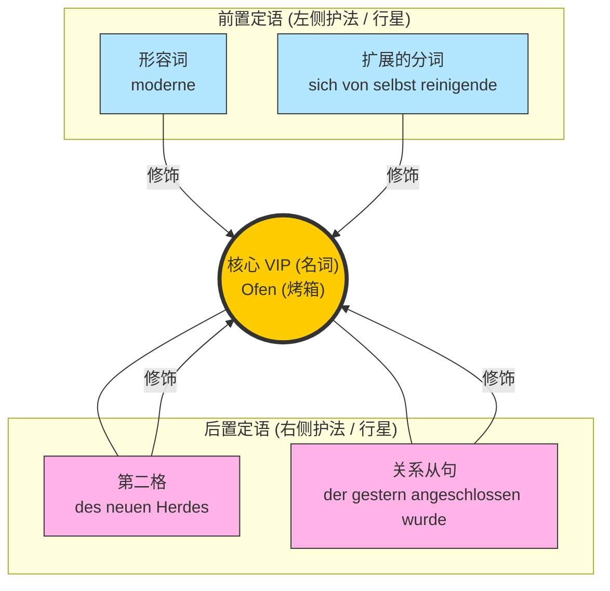

# 前置定语、后置定语以及扩展的分词定语

![[PixPin_2026-06-16_15-07-31.png|757x1035]]

[[语言学习/德语/公共知识语法/从句.md#^-X8m_0WwKxM0ibIahdbHV|100%]]

今天我们要攻克的是 B 1 到 B 2 级别中极其重要、也是很多同学觉得最头疼的“终极 Boss”之一：**前置定语、后置定语以及扩展的分词定语**。掌握了它，你看那些又长又复杂的德语公文、租房合同就会像看报纸一样轻松！

#### 1. 核心概念：太阳与行星的类比

"PixPin _2026-06-15_22-32-15.jpg" 中给出了一个非常绝妙的解释：**名词是整个名词词组的中心词，其他成分围绕着它，就像行星围绕太阳一样。**

你可以把“名词”想象成一位“VIP 贵宾”。为了让这位贵宾的身份更加明确，我们需要给他安排“左侧护法”（前置定语）和“右侧护法”（后置定语）。在阅读时，最重要的任务就是揪出这位 VIP，并看清哪些保镖是属于他的。

为了让你一目了然，我们用图表来解构图片中的核心长句：

_Leider funktioniert der moderne, sich von selbst reinigende Ofen des neuen Herdes, der gestern angeschlossen wurde, schon nach der ersten Benutzung nicht mehr so, wie er sollte._
Leider，昨天连接的新炉子的现代自清洁烤箱，已经不再像第一次使用时那样工作 sollte.
代码段

#### 2. 后置定语 (Post-modifiers)

后置定语永远放在名词的**后面**。在移民生活中，我们每天都在用。图片中列举了多种后置定语的形式：

- **第二格 (Genitiv)**：表示所属关系。
    - _图例_：der Ofen **des neuen Herdes** (新炉灶的烤箱)。
    - _生活场景 (行政)_：Die Verlängerung **meines Visums** ist wichtig. (我签证的延期很重要。)
- **介词短语 (Präpositionalphrase)**：
    - _图例_：der Ofen **mit dem tollen Grill** (带有超棒烤架的烤箱)。
    - _生活场景 (看病)_：Ich brauche einen Termin **beim Augenarzt**. (我需要一个眼科医生的预约。)
- **关系从句 (Relativsatz)**：这是 B 1 的核心！用一个完整的句子来解释前面的名词。
    - _图例_：der Ofen, **der gestern angeschlossen wurde** (昨天被接通的那个烤箱)。
    - _生活场景 (找工作)_：Ich suche eine Stelle, **die zu meinem Profil passt**. (我在找一份与我履历相符的工作。)
- **带 zu 不定式 (Infinitiv mit zu)**：
    - _图例_：die Entscheidung, **einen Ofen zu kaufen** (买烤箱的决定)。
    - _生活场景 (租房)_：Ich habe die Absicht, **die Wohnung zu mieten**. (我有意向租这套公寓。)

#### 3. 扩展的前置定语 (Erweiterte Attribute) —— B 2 核心重灾区！

这是本章的最高潮。德语有一种“疯狂”的语法现象：它可以把一个长长的句子（比如关系从句），压缩成一个巨大的“形容词”，硬生生地塞在“冠词”和“名词”之间！这就是图片下方标注的“扩展成分位于形容词或分词的左边”。

图片底部的终极例句：

- _Die zwei modernen, sich in einer Stunde automatisch von selbst reinigenden ==Öfen== sind wunderbar._
	(这两台现代化的、能在一小时内自动进行自清洁的烤箱太棒了。)

看这个结构：

- **冠词**：Die (这两台)
- **扩展成分**：zwei modernen, sich in einer Stunde automatisch von selbst reinigenden (修饰语：数词+反身代词+介词短语+副词+分词)
- **名词中心词**：Öfen (烤箱)

**如何攻克分词前置定语？**

在 B 2 考试中，你必须学会将“关系从句”和“扩展的分词定语”进行互相转换。分词分为两种：

**A. 第一分词 (Partizip I = 动词原形 + d)：表示主动、正在进行。**

- _基础结构_：Das weinende Kind (正在哭泣的孩子)。
- _扩展结构_：Das **laut auf der Straße weinende** Kind.
- _转换原理_：Das Kind, das laut auf der Straße weint.
- _生活场景 (找工作)_：
    - _关系从句_：Die Firma, die sich schnell entwickelt, sucht neue Mitarbeiter.
    - _前置定语_：Die **sich schnell entwickelnde** Firma sucht neue Mitarbeiter. (那家正在快速发展的公司在招人。)

**B. 第二分词 (Partizip II = 过去分词)：表示被动、已经完成。**

- _基础结构_：Das gekaufte Auto (买来的汽车)。
- _扩展结构_：Das **gestern von mir gekaufte** Auto.
- _转换原理_：Das Auto, das gestern von mir gekauft wurde.
- _生活场景 (租房/合同)_：
    - _关系从句_：Der Mietvertrag, der gestern von beiden Parteien unterschrieben wurde, ist gültig.
    - _前置定语_：Der **gestern von beiden Parteien unterschriebene** Mietvertrag ist gültig. (昨天由双方签署的租房合同是有效的。)

**C. 表方式的分词 (zu + Partizip I) —— 图中的高级知识点**

图片中提到了一个特殊结构：_der regelmäßig zu reinigende Ofen_。

- **大师解析**：这个结构相当于 `müssen/können + 被动语态`。它表示“必须/可以被做某事”。
- _转换原理_：Der Ofen, der regelmäßig gereinigt werden muss. (必须被定期清洁的烤箱)。
- _生活场景 (行政事务)_：
    - Das **noch auszufüllende** Formular bitte hier abgeben!
    - = Das Formular, das noch ausgefüllt werden muss, bitte hier abgeben!
    - (请将这份**还必须被填写的**表格交到这里！)

### 德语大师的通关秘籍 (Master-Tipps)

1. **“找 VIP 法则”**：在阅读又长又臭的德语信件（比如外管局或保险公司寄来的信）时，看到冠词（der/die/das/ein），不要急着翻译！先往后找，跳过中间所有复杂的形容词和分词，**找到那个大写的名词（VIP）**。先把“冠词+名词”看懂，再去读中间的修饰语。
2. **词尾变化规律**：无论中间塞了多少扩展成分，紧挨着名词的那个分词或形容词，必须严格遵循形容词词尾变化规则。比如图中的 _der ... reinigende Ofen_，因为是阳性单数第一格（der Ofen），所以词尾是 -e。
