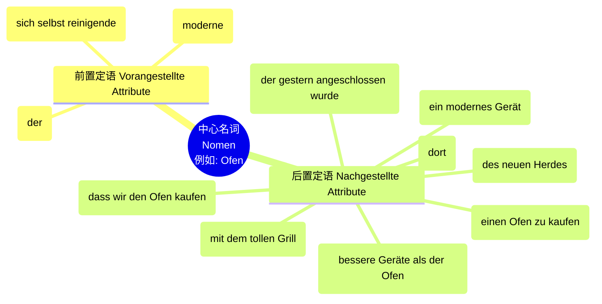
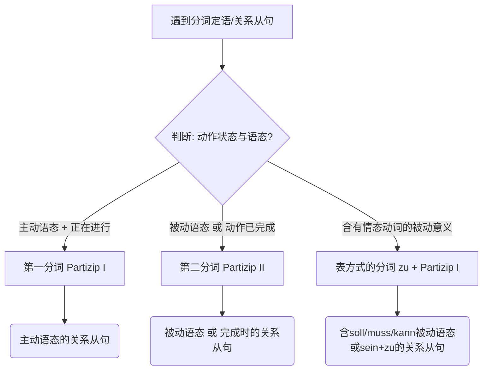

# 前置定语、后置定语以及扩展的分词定语

![[PixPin_2026-06-16_15-07-31.png|757x1035]]

[[语言学习/德语/公共知识语法/从句.md#^-X8m_0WwKxM0ibIahdbHV|100%]]

今天我们要攻克的是 B 1 到 B 2 级别中极其重要、也是很多同学觉得最头疼的“终极 Boss”之一：**前置定语、后置定语以及扩展的分词定语**。掌握了它，你看那些又长又复杂的德语公文、租房合同就会像看报纸一样轻松！

### 第一部分：名词的“太阳系”——前置与后置定语

#### 1. 实战拆解经典长句

让我们来看教材中这句经典的“魔鬼”长句：

> _Leider funktioniert der moderne, sich von selbst reinigende **Ofen** des neuen Herdes, der gestern angeschlossen wurde, schon nach der ersten Benutzung nicht mehr so, wie er sollte._
>
> （遗憾的是，这台新灶具上那台昨天刚接好、现代且能自动清洁的**烤箱**，在第一次使用后就不能正常工作了。）

在这句话里，**Ofen（烤箱）** 就是那颗“太阳”。

- **前置的行星：** _der_ (定冠词), _moderne_ (形容词), _sich von selbst reinigende_ (扩展的第一分词)。
- **后置的行星：** _des neuen Herdes_ (第二格), _der gestern angeschlossen wurde_ (关系从句)。

阅读时最重要的技巧：**先找准“太阳”（名词），然后把前后的“行星”（定语）剥离开，句子的主干就一清二楚了。**（句子的主干其实仅仅是：_Leider funktioniert der Ofen nicht mehr so, wie er sollte._）

#### 2. 后置定语的八大门派

除了前置定语，名词后面的“小尾巴”非常多变。根据教材，后置定语共有以下几种形式，我们结合**移民生活场景**来一一对应：

| **定语类型**     | **德语原句/教材示例**                                  | **移民生活实战场景词汇**                                            |
| ------------ | ---------------------------------------------- | --------------------------------------------------------- |
| **第二格**      | der Ofen **des neuen Herdes**                  | der Mietvertrag **der neuen Wohnung** (新公寓的租房合同)          |
| **关系从句**     | der Ofen, **der gestern angeschlossen wurde**  | der Arzt, **der mich gestern untersucht hat** (昨天为我检查的医生) |
| **介词短语**     | der Ofen **mit dem tollen Grill**              | die Stelle **als Softwareentwickler** (作为软件开发者的职位)        |
| **副词**       | der Ofen **dort**                              | der Termin **morgen** (明天的预约)                             |
| **同位语**      | der Ofen, **ein modernes Gerät**               | Herr Müller, **mein neuer Vermieter** (米勒先生，我的新房东)        |
| **带 zu 不定式** | die Entscheidung, **einen Ofen zu kaufen**     | der Versuch, **einen Job zu finden** (找工作的尝试)             |
| **dass 从句**  | die Entscheidung, **dass wir den Ofen kaufen** | die Hoffnung, **dass ich das Visum bekomme** (拿到签证的希望)    |
| **比较级**      | bessere Geräte **als der Ofen**                | ein höheres Gehalt **als mein altes** (比我以前更高的薪水)         |

### 第二部分：B 2 核心难点——扩展定语 (Erweiterte Attribute)

在 B 2 级别的阅读（尤其是新闻、行政文件）中，前置定语往往会被无限拉长，这就是所谓的“扩展定语”。形容词和分词成分都可以被扩展。

**扩展成分的黄金排列顺序：**

它们总是位于形容词或分词的**左边**。具体顺序为：

**数词 + 反身代词/含介词的说明语 + 副词 + 形容词/分词 + 中心名词**

教材示例：

> _Die **zwei** (数词) **modernen** (形容词), **sich** (反身代词) **in einer Stunde** (介词说明语) **automatisch** (副词) **von selbst reinigenden** (分词) Öfen sind wunderbar._

**💡 实战应用（求职场景）：**

> _Der **von mir gestern online eingereichte** Lebenslauf..._
>
> （我昨天在网上提交的简历...）
>
> 这里，_von mir_ (介词说明语) 和 _gestern online_ (副词) 完美地扩展了过去分词 _eingereichte_。

### 第三部分：终极杀招——前置定语与关系从句的相互转换

这是所有 B 1/B 2 级别考试（如歌德学院考试、Telc 考试）中必考的语法大项。掌握了这项技能，你的德语表达将瞬间提升一个档次。分词作定语和关系从句之间，本质上是“浓缩”与“展开”的关系。

我们可以通过下面这个决策图，快速判断该如何转换：

代码段

我们将严格按照教材，将这六大转换规则掰碎了揉烂了教给你：

#### 1. 第一分词 (Partizip I) ⇌ 主动语态，事件正在发生

第一分词由“动词原形 + d”构成（如 rasiert -> rasierend）。它代表主动，且动作正在进行。可以包含反身代词。

- **分词定语：** _Einen **sich rasierenden** Mann sollte man nicht stören._ (教材原句)
- **关系从句：** _Einen Mann, **der sich rasiert**, sollte man nicht stören._
- **🏥 医疗场景应用：**
    - _Das **im Wartezimmer weinende** Kind..._ (在候诊室哭泣的孩子)
    - _Das Kind, **das im Wartezimmer weint**..._

#### 2. 第二分词 (Partizip II) ⇌ 被动语态 或 完成时状态

第二分词代表动作已经完成（状态被动/完成时），或者承受动作（过程被动）。

- **分词定语：** _Der **reparierte** Zug..._ (教材原句)
- **关系从句（事件过程）：** _Der Zug, **der repariert wurde**..._ (被修好的火车——强调当年被修的过程)
- **关系从句（最终状态）：** _Der Zug, **der repariert ist**..._ (修好状态的火车——强调现在的状态)
- **🏠 租房场景应用：**
    - _Der **unterschriebene** Mietvertrag..._ (已签署的租房合同)
    - _Der Mietvertrag, **der unterschrieben wurde / ist**..._

#### 3. 当动词为反身动词时 ⇌ 不带反身代词的第二分词

**这是一个极易踩坑的重点！** 当把反身动词转化为第二分词作定语时，**绝不能包含反身代词 (sich)**。

- **分词定语：** _Ein **rasierter** Mann..._ (教材原句，注意这里没有 sich)
- **关系从句：** 它可以转换出三种细微差别的从句：
$1
    1. _Ein Mann, **der rasiert wurde**..._ (事件比较重要：一个被刮了胡子的男人)
    2. _Ein Mann, **der rasiert ist**..._ (状态比较重要：一个胡子刮干净了的男人)
    3. _Ein Mann, **der sich rasiert hat**..._ (事件完结比较重要：一个自己刮完了胡子的男人)

#### 4. 包含施动者 (von / durch) 的第二分词 ⇌ 施动者变为从句的主语

如果在分词短语中看到了 _von_ 或 _durch_ 引出的执行者，那么在改写成关系从句时，这个执行者往往翻身做主人，变成从句的主语（主动语态）。

- **分词定语：** _Ein **von einem Starfrisör rasierter** Mann..._ (教材原句)
- **关系从句：** _Ein Mann, **den ein Starfrisör rasiert hat**..._ (注意：Mann 变成了宾语 den，发型师变成了主语)。
- **🏢 行政场景应用：**
    - _Das **von der Ausländerbehörde ausgestellte** Visum..._ (外管局签发的签证)
    - _Das Visum, **das die Ausländerbehörde ausgestellt hat**..._

#### 5. 用 sein 作助动词的不及物动词 ⇌ 主动语态，过去相关时态

不及物动词（不能加第四格宾语的动词）通常不能变被动语态，也就不能随便用第二分词作定语。**唯一的例外**是：用 _sein_ 构成完成时，且表达“某种行动的结果”的不及物动词（如 ankommen, laufen, fahren）。

- **分词定语：** _Der **angekommene** Zug..._ (教材原句)
- **特殊情况示例：** _der **gelaufene** Mann_ (跑完步的男人), _die **gefahrenen** Kilometer_ (行驶过的公里数)。
- **关系从句：** _Der Zug, **der angekommen ist / der ankam**..._

#### 6. 表方式的分词 (Gerundivum) ⇌ 含有情态动词的被动语态 或 sein + zu + 不定式

这是由“zu + 第一分词”构成的特殊定语，通常翻译为“必须要/应该被...的”。

- **分词定语：** _Der **zu reparierende** Zug..._ (教材原句)
- **关系从句（情态被动）：** _Der Zug, **der repariert werden soll/muss/kann**..._
- **关系从句（sein+zu）：** _Der Zug, **der zu reparieren ist**..._
- **📄 行政/租房场景应用：**
    - _Das **auszufüllende** Anmeldeformular..._ (必须被填写的登记表)
    - _Das Anmeldeformular, **das ausgefüllt werden muss**..._

这一课的内容非常充实，属于 B 2 阶段最硬核的骨头。我们用了“太阳系”的类比帮你认清了名词与其修饰语的关系，并详细拆解了定语与从句转换的六大定律。

在这个紧凑的学习周期里，能够耐心看完并理解这些规则，你已经比很多人走得更靠前了！深呼吸，消化一下。
