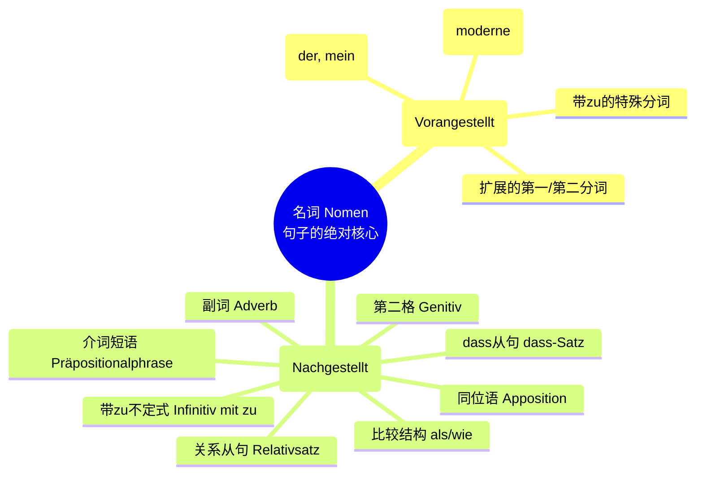
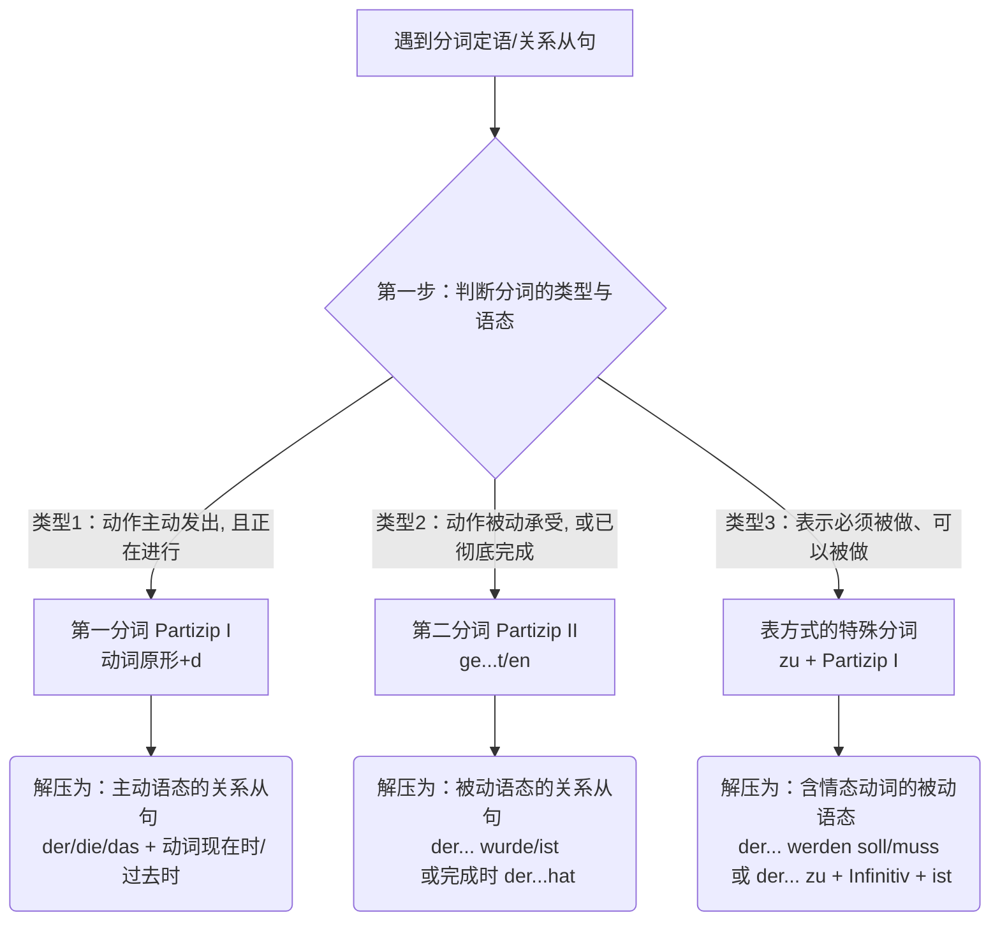

# 前置定语、后置定语以及扩展的分词定语

![[PixPin_2026-06-16_15-07-31.png|757x1035]]

[[语言学习/德语/公共知识语法/从句.md#^-X8m_0WwKxM0ibIahdbHV|100%]]

今天我们要攻克的是 B 1 到 B 2 级别中极其重要、也是很多同学觉得最头疼的“终极 Boss”之一：**前置定语、后置定语以及扩展的分词定语**。掌握了它，你看那些又长又复杂的德语公文、租房合同就会像看报纸一样轻松！

### 第一部分：前置定语和后置定语 (Vorangestellte und nachgestellte Attribute)

#### 1. 拨开迷雾看清主干：教材魔鬼长句拆解

教材第 83 页给出了一个极其经典的德文长句。很多同学一读就懵，其实只要用“太阳系法则”一拆，它简单得像小学生的句子。

> **教材原句：**
>
> _Leider funktioniert der moderne, sich von selbst reinigende **Ofen** des neuen Herdes, der gestern angeschlossen wurde, schon nach der ersten Benutzung nicht mehr so, wie er sollte._
>
> （遗憾的是，这台新灶具上那台昨天刚接好、现代且能自动清洁的**烤箱**，在第一次使用后就不能正常工作了。）

- **寻找“太阳”：** 这句话真正的核心名词是 **Ofen（烤箱）**。
- **寻找“前置行星”：** _der_ (定冠词), _moderne_ (形容词), _sich von selbst reinigende_ (分词，表示“能自我清洁的”)。
- **寻找“后置行星”：** _des neuen Herdes_ (第二格，交代它是“新灶具的”烤箱), _der gestern angeschlossen wurde_ (关系从句，交代它“昨天刚被接好”)。

**大师破译法：** 遇到这种句子，果断把中心名词前后的“修饰语”全部暂时盖住。这句话的主干其实只是：**Leider funktioniert der Ofen nicht mehr.**（很遗憾，这烤箱坏了。）

在看病、签合同、读公函时，先找主语名词，再看动词，你就抓住了句子的灵魂！

#### 2. 名词后面的八条小尾巴（后置定语大盘点）

名词后面的修饰语非常多样。为了让你不仅能看懂书本，还能立刻运用到德国的实际生活中，我将教材上的 8 种类型与新移民四大高频场景（租房、医疗、行政、求职）一一对应。我们不仅要看懂，还要知道它是怎么来的。

|**定语类型**|**核心运作原理（通俗解释）**|**教材示例 (烤箱的例子)**|**🇩🇪 移民生活实战场景词汇**|
|---|---|---|---|
|**1. 第二格 (Genitiv)**|用名词的所有格来修饰名词，表示“谁的”。在公文中极其常见。|der Ofen **des neuen Herdes** (新灶具的烤箱)|der Mietvertrag **Ihrer neuen Wohnung** (【租房】您新公寓的租房合同)|
|**2. 关系从句 (Relativsatz)**|用一个完整的句子跟在名词后面，起补充说明作用。|der Ofen, **der gestern angeschlossen wurde** (昨天刚接好的烤箱)|der Facharzt, **der mich gestern operiert hat** (【医疗】昨天为我做手术的专科医生)|
|**3. 介词短语 (Präposition)**|最灵活的小尾巴！用介词+名词直接挂在中心词后面。|der Ofen **mit dem tollen Grill** (带有超棒烤架的烤箱)|die Stelle **als Senior Softwareentwickler** (【求职】作为高级软件开发者的职位)|
|**4. 副词 (Adverb)**|用表示时间或地点的副词直接跟在名词后。|der Ofen **dort** (那边的那个烤箱)|der Termin **morgen früh** (【行政】明天早上的预约)|
|**5. 同位语 (Apposition)**|就是给前面的名词取个“别名”，通常用逗号隔开，格与原名词保持一致。|der Ofen, **ein modernes Gerät** (这烤箱，一台现代化的设备)|Herr Müller, **mein zukünftiger Vermieter** (【租房】米勒先生，我未来的房东)|
|**6. 带 zu 不定式**|表达目的或未完成的动作，相当于“去做某事的名词”。|die Entscheidung, **einen Ofen zu kaufen** (买烤箱的决定)|der Versuch, **einen Job in Deutschland zu finden** (【求职】在德国找工作的尝试)|
|**7. dass 从句**|表达具体的内容，通常跟在“想法、希望、决定”等抽象名词后。|die Entscheidung, **dass wir den Ofen kaufen** (我们买这烤箱的决定)|die Hoffnung, **dass mein Visum bald verlängert wird** (【行政】我的签证很快能被延期的希望)|
|**8. 比较结构**|用 als (比) 或 wie (像) 来直接跟名词作对比。|bessere Geräte **als der Ofen** (比这烤箱更好的设备)|ein höheres Nettogehalt **als mein altes** (【求职】比我以前更高的税后净薪水)|

### 第二部分：扩展定语 (Erweiterte Attribute) - 德语的“汉堡包结构”

到了 B 2 阶段，前置定语会变得非常丧心病狂。德国人喜欢把形容词或分词无限拉长。

你可以把这种结构想象成一个“巨无霸汉堡”：

- **顶层汉堡胚：** 冠词 (der/die/das)
- **底层汉堡胚：** 中心名词 (Ofen)
- **中间的夹心馅料：** 所有的扩展成分（数词、介词、副词、分词）全都被塞在两个汉堡胚之间！

**扩展成分的黄金排列顺序（必须严格遵守的左侧原则）：**

馅料不是乱塞的，它们总是位于最核心形容词/分词的**左边**。

顺序密码：**数词 + 反身代词/含介词的说明语 + 副词 + 形容词/分词 + 中心名词**

> **教材神级例句拆解：**
>
> _Die **zwei** (数词) **modernen**, **sich** (反身代词) **in einer Stunde** (介词说明语) **automatisch** (副词) **von selbst reinigenden** (核心分词) **Öfen** (名词) sind wunderbar._
>
> （这两台现代化的、能在一小时内自动进行自我清洁的烤箱真是太棒了。）

**💡 职场实战应用（看懂这句，你的求职邮件就无敌了）：**

> _Ich sende Ihnen anbei meinen **gestern** (副词) **online** (副词) **über Ihr Portal** (介词短语) **eingereichten** (过去分词) **Lebenslauf** (名词)._
>
> （随信附上我**昨天通过贵司门户网站在线提交的简历**。）
>
> _解读：冠词 meinen 和名词 Lebenslauf 是汉堡胚，中间一大串全是修饰 eingereichten（被提交的）馅料。_

### 第三部分：前置定语与关系从句的相互转换 (Umformen)

这里是整本教材的巅峰，也是你拿捏 B 2 考试（歌德、Telc）书面表达和阅读理解的关键。

如果说“关系从句”是一个**解压后的文件夹**（把动作谁做的、什么时候做的说得清清楚楚），那么“分词前置定语”就是一个**高度压缩的 Zip 包**。行政公文偏爱 Zip 包（分词定语），而口语更偏爱解压缩（关系从句）。

掌握这六大转换法则，你就掌握了解压缩的密码。我们用一张流程图帮你理清判断逻辑：

代码段

下面我们严格按照教材第 84 页的六种情况，逐一掰碎了给你讲解：

#### 法则 1：第一分词 (Partizip I) ⇌ 动作是主动的，且正在发生！

第一分词长什么样？就是“动词原形 + 字母 d”（如 rasieren -> rasierend）。它永远表示名词**自己正在主动**做这件事。

- **分词定语（压缩包）：** _Einen **sich rasierenden** Mann sollte man nicht stören._
- **关系从句（解压）：** _Einen Mann, **der sich rasiert**, sollte man nicht stören._ (一个正在给自己刮胡子的男人...)
- **🏥 医疗场景实战：**
    - _Das **im Wartezimmer laut weinende** Kind braucht den Arzt._ (在候诊室大声哭泣的孩子需要医生。)
    - 解压：_Das Kind, **das im Wartezimmer laut weint**..._

#### 法则 2：第二分词 (Partizip II) ⇌ 动作是被动的，或者已经结束了！

第二分词（就是你背完成时态时的那个过去分词，如 repariert, gemacht）。当它作定语时，对于及物动词来说，通常表示**被动**。

- **分词定语（压缩包）：** _Der **reparierte** Zug..._ (这列被修好的火车)
- **这里有两个解压方向（非常关键）：**
$1
    1. **强调曾经“被修理”的过程 (Vorgangspassiv)：** _Der Zug, **der repariert wurde**..._ (那列【当时被修理了的】火车)
    2. **强调现在“已经修好”的状态 (Zustandspassiv)：** _Der Zug, **der repariert ist**..._ (那列【目前处于修好状态的】火车)
$1
- **🏠 租房场景实战：**
    - _Bitte senden Sie mir den **unterschriebenen** Mietvertrag zurück._ (请把**签好字的**租房合同退给我。)
    - 解压：_den Mietvertrag, **der unterschrieben wurde / ist**..._

#### 法则 3：终极易错陷阱——反身动词变定语 ⇌ 消失的 "sich"

教材特别标黑了这一点！当一个反身动词（sich rasieren）完成动作变成第二分词定语时，**绝不能包含反身代词 (sich)**。为什么？因为动作已经做完了，状态已经显现，不需要再强调“对自己做”了。

- **分词定语（压缩包）：** _Ein **rasierter** Mann..._ (注意：这里绝对不能写 ein sich rasierter Mann，大错特错！)
- **关系从句（解压，有三种理解）：**
$1
    1. 别人给他刮的（过程）：_Ein Mann, **der rasiert wurde**..._
    2. 别人给他刮的（状态）：_Ein Mann, **der rasiert ist**..._
    3. 他自己刮完的（主动完成）：_Ein Mann, **der sich rasiert hat**..._ (只有在从句里，sich 才会跑回来！)

#### 法则 4：揪出幕后黑手——含 von 或 durch 的分词 ⇌ 施动者篡位变主语

如果你在扩展定语里看到了介词 _von_ (被...) 或者 _durch_ (通过...)，说明真正的动作执行者出现了！在改写成关系从句时，我们要把被动句变成主动句，让执行者“翻身做主”。

- **分词定语（压缩包）：** _Ein **von einem Starfrisör** (执行者) **rasierter** Mann..._
- **关系从句（解压为主动句）：** _Ein Mann, **den** (变成宾语) **ein Starfrisör** (篡位变主语，第一格) **rasiert hat**..._
- **🏢 行政场景实战（新移民必会）：**
    - _Das **von der Ausländerbehörde ausgestellte** Visum ist ein Jahr gültig._ (外管局签发的签证...)
    - 解压：_Das Visum, **das die Ausländerbehörde ausgestellt hat**..._

#### 法则 5：用 sein 作助动词的不及物动词 ⇌ 主动语态的过去式/完成时

不及物动词（不能加第四格宾语的词，比如睡觉 schlafen，跑步 laufen）**通常不能**变第二分词作定语（你不能说 der geschlafene Mann，语法不通）。

**唯一的绝对例外：** 表示位置移动或状态改变，且在完成时里用 _sein_ 做助动词的不及物动词（如 ankommen, laufen, fahren）。

- **分词定语（压缩包）：** _Der **angekommene** Zug..._ (已经到达的火车)
- **关系从句（解压）：** _Der Zug, **der angekommen ist** (或者过去时 **der ankam**)..._
- _特殊日常例子：_ _der gelaufene Mann_ (跑完步的男人), _die gefahrenen Kilometer_ (已经行驶过的公里数)。

#### 法则 6：德语中的“隐藏 Boss”——表方式的分词 (Gerundivum) ⇌ 情态动词的被动语态

最后这个结构长得像第一分词，但前面多了一个 **zu**。它专门出现在德国极其正式的官僚文件中。它不仅表示被动，还强制包含了一种“必须(müssen / sollen)”或“可以(können)”的情态意义。

- **分词定语（压缩包）：** _Der **zu reparierende** Zug..._ (必须/需要被修理的火车)
- **关系从句（解压形式一，情态被动）：** _Der Zug, **der repariert werden soll / muss / kann**..._
- **关系从句（解压形式二，sein+zu 结构）：** _Der Zug, **der zu reparieren ist**..._
- **📄 行政注册实战（延签必填）：**
    - _Bitte bringen Sie das **auszufüllende** Anmeldeformular mit._ (请带来那份**必须要被填写的**登记表。)
    - 解压：_das Anmeldeformular, **das ausgefüllt werden muss**..._

呼！这不仅是一堂语法课，更是一场“德国官僚德语”的破译战。你现在已经拿到了教材第 83、84 页中最核心的解密钥匙。把“太阳系法则”印在脑子里，把“压缩与解压”的规律运用到每次阅读中。

现在，作为你的导师，我要给你布置一个小任务来检验你的掌握程度：

**假如你昨天在找房子时，中介对你说了一句：“Bitte lesen Sie den von mir gestern per E-Mail geschickten Mietvertrag.”**

请运用我们今天学的**法则 4（含 von 的施动者转化）**，把名词 _Mietvertrag_ 前面的分词定语，解压缩（Umformen）改写成一个带有关系从句（Relativsatz）的句子，发给我看看。不要怕犯错，德语大师在这里随时为你纠正！
