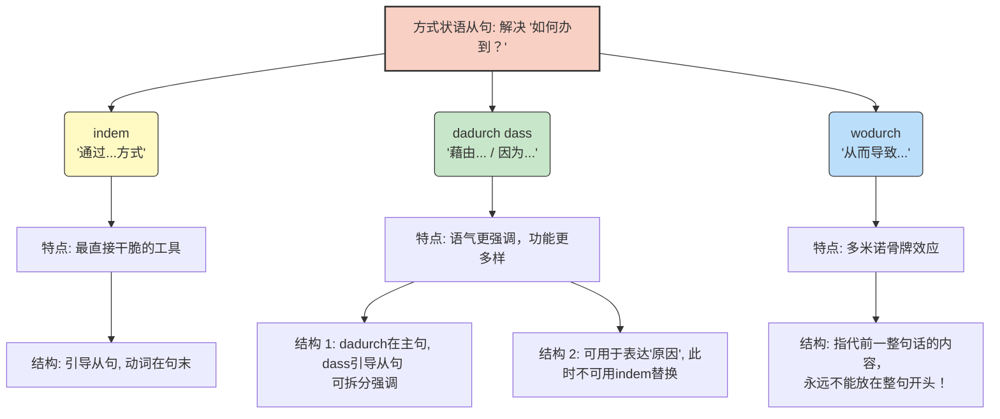

---
aliases:
  - indem
  - dadurch
  - dass
  - wodurch
---

# 方式状语从句 indem, dadurch dass, wodurch..

### 1. indem (经典款：“通过...的手段/方式”)

这是你最需要熟练掌握的一个词，它非常直接，相当于英语的 "by doing..."。

- **造句铁律：** `indem` 引导的是从句，**变位动词必须放在句末**。
- **💡 移民实战：找工作 (Jobsuche)**
    - _你想表达：_ 通过每天投递五份简历，我得到了面试机会。
    - _德语思维：_ 我得到了面试机会，通过（indem）我每天投五份简历。
    - _德语造句：_ Ich bekam eine Einladung zum Vorstellungsgespräch, **indem** ich jeden Tag fünf Bewerbungen schickte.

### 2. dadurch, dass (升级款：“藉由... / 拆分强调 / 表原因”)

这个词组和 `indem` 意思极度相近，很多时候可以互换，但它有两个 `indem` 没有的“绝活”：

- **绝活一：可以“分身”以加强语气。** 你可以把 `dadurch` 留在主句里当个“占位符”，告诉听众“我是靠**这个**办法做到的！”，然后用 `dass` 慢条斯理地引出具体做法。
- **绝活二：可以表达“原因 (weil)”。** 当它表达原因时，绝对不能用 `indem` 替换（这也是图片里重点标记的易错点！）。
- **💡 移民实战：租房 (Wohnungssuche)**
    - _强调手段：_ 他得到了这套热门公寓，是**通过**提供了一份完美的信用报告(Schufa)。
    - _德语造句：_ Er hat die Wohnung **dadurch** bekommen, **dass** er eine perfekte Schufa-Auskunft vorgelegt hat. (你看，dadurch 和 dass 被完美拆开了，显得极有逻辑)。
    - _表原因：_ **由于**她不仅有全职工作还懂德语，房东很喜欢她。
    - _德语造句：_ Der Vermieter mag sie sehr, **dadurch dass** sie Vollzeit arbeitet und Deutsch kann. (这里是原因，千万别用 indem！)

### 3. wodurch (顺水推舟款：“从而导致... / 结果是...”)

这是一个非常神奇的“继续性从句 (Weiterführender Relativsatz)”。它就像倒下的多米诺骨牌，** `wodurch` 指代的不是某一个具体的词，而是前面“一整句话的内容”**，并引出这件事导致的“结果”。

- **⚠️ 致命雷区：** 既然是引出结果，它**绝对不可以**放在整个句子的最前面！
- **💡 移民实战：医疗与行政 (Beim Arzt & Behördengänge)**
    - _你想表达：_ 我昨天把所有缺失的文件都补交了，**从而**加快了外管局处理签证的进度。
    - _德语造句：_ Ich habe gestern alle fehlenden Dokumente nachgereicht, **wodurch** sich die Visabearbeitung beschleunigt.
    - _大师平替技巧：_ 如果你觉得用 `wodurch` 引出从句太长了会出错，你可以把它拆成两句话，用副词 `dadurch` 代替：Ich habe gestern alle fehlenden Dokumente nachgereicht. **Dadurch** beschleunigt sich die Visabearbeitung. (我补交了文件。**借此**，进度加快了。)
