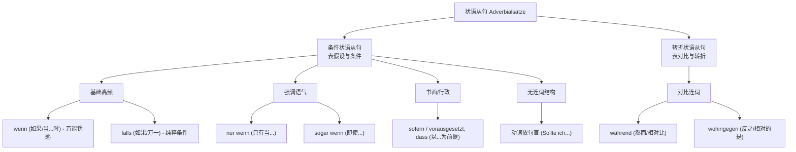

# 条件状语从句与转折状语从句 wenn,falls, wahrend,wohingegen.

### 🧠 核心知识图谱：你的大脑导航

### 第一部分：条件状语从句 (表条件) —— 给德国人立规矩

条件状语从句就是我们在生活里常说的“如果...就...”。在德国办事，讲究的就是契约精神和先决条件。

#### 1. 基础款：`wenn` 与 `falls` (如果 / 万一)

- ** `wenn` (如果 / 当)：** 这是德语里的万能膏药。它**既可以表示条件（如果），也可以表示时间（当...时候）**。
    - **移民场景（租房）：** **Wenn** Sie die Kaution bezahlen, bekommen Sie den Schlüssel. (如果您交了押金，就会拿到钥匙。)
- ** `falls` (如果 / 万一)：** 这个词非常纯粹！它**只能表示条件，绝对不能表示时间**。当你想表达“万一”发生某种情况时，用 `falls` 会让你的德语听起来更精准。
    - **移民场景（医疗）：** **Falls** Sie heute Fieber haben, kommen Sie bitte nicht in die Praxis. (万一您今天发烧了，请不要来诊所。)

#### 2. 情绪加强款：`nur wenn`, `sogar wenn`, `außer wenn` (只有、即使、除非)

当你想和签证官或者雇主据理力争、强调特殊情况时，加上这些修饰词。

- ** `nur wenn` (只有当)：** 强调唯一条件。
    - **移民场景（工作）：** Ich unterschreibe den Vertrag **nur wenn** das Gehalt netto 3000 Euro ist. (只有当净薪水是 3000 欧时，我才签字。)
- ** `sogar wenn` (即使 / 就算)：** 表让步的条件。
    - **移民场景（融入）：** **Sogar wenn** Deutsch schwer ist, lerne ich es jeden Tag. (就算德语很难，我每天也在学。)

#### 3. B 2/C 1 炫技款：`sofern`, `vorausgesetzt, dass` (以...为前提)

看到这几个词，德国人的第一反应是：“哇，这个人受过良好的教育！” 它们多用于**正式信件、合同和官方文书**中。

- **移民场景（签证）：** Sie bekommen die Niederlassungserlaubnis, **vorausgesetzt, dass** Sie das B 1-Zertifikat haben. (您将获得永居，前提是您拥有 B 1 证书。)

#### 4. 高级隐身术：没有连词的条件句

这是图片中特别提到的一点，也是 B 2 考试写作中的大加分项！**当我们不使用 `wenn` 或 `falls` 时，把动词直接扔到从句的最前面（句首）。** 这通常和情态动词 `sollte` (万一) 搭配。

- **常规说法：** Wenn Sie weitere Fragen haben, rufen Sie mich an.
- **大师级改写（行政邮件必备）：** **Sollten** Sie weitere Fragen haben, rufen Sie mich an. (万一您还有其他问题，请给我打电话。)
    - _注意：这种结构在口语中极少使用，但在写给外管局的邮件里用上一次，好感度拉满！_

### 第二部分：转折状语从句 (表反义/对比) —— 优雅地表达不同意见

在德国职场或日常生活中，直接否定别人有时显得生硬。用转折状语从句，你可以通过对比来展现差异。

#### 1. 双面间谍：`während` (然而 / 与此同时)

`während` 是个双面间谍，它既可以表时间（在...期间），也可以表对比（然而）。

- **移民场景（面试/职场）：** **Während** ich in China im Marketing gearbeitet habe, möchte ich hier in der IT-Branche anfangen. (虽然/然而我在国内做的是市场营销，但我希望在这里从 IT 行业起步。)
    - _类比：这就像是在画两条平行线，左边是过去/别人，右边是现在/自己，形成鲜明对比。_

#### 2. 高级对比：`wohingegen` (反之 / 相对的是)

这个词非常正式，指出前后两句话的直接对应/反差。**⚠️ 核心注意点（图表脚注）：** 这种从句被称为“递进从句”，**因此它绝不能放在主句之前！** 必须是“主句在前，`wohingegen` 引导的从句在后”。

- **错误：** Wohingegen ich in Berlin lebe, wohnt mein Bruder in München. (❌)
- **移民场景（生活交流）：** Mein Mann lernt gerne mit Büchern, **wohingegen** ich lieber deutsche Podcasts höre. (我丈夫喜欢用书本学习，与此相反，我更喜欢听德语播客。 ✅)

### ⏳ 大师的六个月 B 2 冲刺建议

要在半年内达到 B 2 并应对移民生活，你的战略必须是“抓大放小，学以致用”：

1. **词汇场景化 (1-2 个月)：** 不要背孤立的单词，去背“租房词汇包”、“看病词汇包”。
2. **吃透三大从句 (3-4 个月)：** 德语的灵魂在从句（动词尾语序）。把条件句、原因句（weil/da）、关系从句（引导定语）练成肌肉记忆。
3. **刻意练习“官话” (5-6 个月)：** B 2 考试的核心是“正式与非正式的转换”。就像我们今天学的，你要能随时把口语的 `Wenn ich Zeit habe...` 切换成写信用的 `Sollte ich Zeit haben...`。

### 🛠️ 你的实战时间

听懂了不等于掌握了。我们来做一个场景模拟：

假设你要写一封邮件给房东（Vermieter），想告诉他：“如果（万一）下水道明天还堵着，我就不交下个月的房租了。**然而（对比来看）**，我一直都是个按时交租的好租客。”

尝试用今天学的“无连词的条件句（动词放句首）”**和**“während”**或者**“wohingegen”来用德语把这句话表达出来，发给我帮你批改，怎么样？
