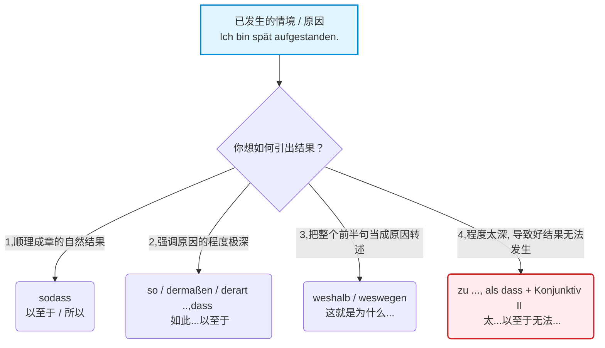

---
aliases:
  - sodass
  - so
  - dermaßen
  - derart
  - dass
  - weshlb
  - weswegen
  - als dass
  - zu
---

# 结果状语从句 sodass,weshalb,dermafsen ..,dass

现在，我们把这四大绝招逐一拆解。

### 🌊 第一层：基础平 A 输出 `sodass` (以至于 / 所以)

这是最基础、最没有感情色彩的结果表达法（B 1-B 2 级别）。前半句陈述一件事，后半句紧接着陈述这件事导致的直接后果。

- **句型结构：** 主句 , **sodass** + 结果从句 (动词放句末)。
- **教材例句：** Ich war spät, **sodass** ich den Bus verpasst habe. (我迟到了，**以至于**我错过了公交车。)
- **大师解析：** `sodass` 是一个整体，连在一起写。它平铺直叙，不强调任何极端的语气。

### 🌋 第二层：暴击强调 

`so/dermaßen/derart ..., dass` : 注意这个结构，主语用 `so/dermaßen/derart` 加深形容词程度，从句 dass 开头。

当你想强烈吐槽、夸张地表达某个动作或状态的**程度极深**时，必须把 `sodass` 拆开来用！这是 B 2 迈向 C 1 的关键。

**1. 强调形容词/副词 (最常用)：**

- **B 2 表达：** Ich war **so** spät, **dass** ich den Bus verpasst habe.
- **C 1 升级表达：** 把 `so` 替换为词汇量更高级的 `dermaßen` 或 `derart`。
    - _Ich war **dermaßen / derart** spät, **dass** ich den Bus verpasst habe._ (我**竟然迟到了这种地步**，以至于错过了公交。)

**2. 强调名词 (高级变形)：**

如果原因里核心词是个名词，你可以把 `derart` 变成形容词 `derartig` 加在名词前。

- _Ich hatte eine **derartige** Verspätung, **dass**..._ (我遇到了**如此严重的**延误，以至于...)

**3. 隐藏的形容词 (语境大师)：**

教材中提到一个极其地道的口语用法——当句子中没有形容词，只有动词时，`so/dermaßen` 直接修饰动词，潜台词通常是“如此快/如此剧烈”。

- _Ich bin **so/dermaßen** gerannt, **dass** ich ganz außer Atem war._ (我**如此拼命地**跑，以至于我完全喘不上气了。—— 这里隐藏了 _schnell/stark_ 的含义。)

### 🎤 第三层：麦克风转交 weshalb / weswegen (这就是为什么...)

- **核心逻辑：** 它们的作用是指代**前面那一整句话的内容**。前面发生了那一连串的事情，**“这就是为什么/正是由于这个原因”**，导致了后面的结果。
- **教材例句：** Ich war sehr spät, **weshalb / weswegen** ich auch den Bus verpasst habe.
- **大师解析：** 在语法功能上，`weshalb` 引导的是从句（动词在句末）。如果你不想用从句，完全可以用主句连词 `deshalb / deswegen` 替换它（此时动词在第二位：_..., deshalb habe ich den Bus verpasst._）。两者的意思百分之百相同，仅仅是句法结构的区别。

### ☠️ 第四层：终极地狱难度 `zu ..., als dass + Konjunktiv II` (太...以至于无法...)

这是 C 1 级别中最有逼格、最容易考到的句型。它结合了**程度过深**与**虚拟语气**两个考点。

- **核心逻辑：** 英文里的 "Too... to..."。前半句的情境实在**太过极端 (zu)**，导致后半句那个**理想的、好的结果根本不可能发生**（因为不可能发生，所以必须用第二虚拟式 Konjunktiv II）。
- **句型结构：** 主句含有 **zu** + 形容词/副词 , **als dass** + 主语 + 宾语 + 第二虚拟式动词 (句末)。
- **教材例句：** Ich war **zu** spät, **als dass** ich den Bus noch bekommen **hätte**.
- **大师暴力翻译：** 我**太**晚了，晚到我能赶上公交车**变成了一种不切实际的幻想 (hätte)**。

**大师避坑指南：**

使用这个句型时，`als dass` 后面的从句**不需要加否定词 (nicht)**！因为这个句型本身就自带了“否定/无法实现”的含义。你只要写出那个“本该发生的好事”，然后配上虚拟式，德国人自然就懂“这事儿黄了”。

### 📝 大师总结

这四个层级，代表了你在德语中表达“结果”时的武器库储备。

- 日常汇报用 `sodass`。
- 夸张吐槽用 `dermaßen..., dass`。
- 承上启下用 `weswegen`。
- 表达“无力回天”用 `zu..., als dass + KII`。

把这页教材吃透，你的德语逻辑表达就正式踏入 C 1 的大门了。祝你学得愉快！

# so/dermaßen/derart,这些词用来加深形容词程度，那为什么又不用最高级，是否可以联合使用呢还是说只能用一个，因为我觉得两个一起用有点奇怪

这就好比我们在中文里说“这房子**简直贵得离谱**！”和“这是全城**最贵的**房子！”的区别。

- **最高级 (Superlativ)：** 它的核心作用是“排名/对比”。当你说 `am teuersten`（最贵的），你是在把它和所有其他的房子做比较，它必须是那个绝对的冠军。
- **程度副词 (`so/dermaßen/derart`)：** 它们的核心作用是“情绪发泄 / 绝对强调”。你根本不在乎这房子是不是全城第一贵，你只是想表达它的价格已经超出了你的心理预期，达到了某种夸张的程度。

**【移民场景实战：吐槽外管局办事效率】**

- **用最高级：** Die Ausländerbehörde in Berlin ist **am langsamsten**. (柏林外管局是最慢的。👉 _客观排名，它可能打败了慕尼黑和法兰克福。_)
- **用程度放大器：** Die Ausländerbehörde ist **dermaßen langsam**! (外管局真是慢得令人发指！👉 _主观情绪输出，你不在乎别的地方慢不慢，你只觉得眼前这个慢得让你抓狂。_)

### 🍔 第二回合：它们可以联合使用吗？

你觉得“两个一起用有点奇怪”，这在语法洁癖者的眼里确实如此。但是，**在德国人的真实口语中，它们完全可以联合使用！而且德国人特别爱这么干！**

这就好比中文里的“超级无敌”或者“太特么”一样，是为了把情绪推到顶峰。

#### ✅ 可以这样组合：`so + dermaßen` 或 `so + derart`

`so` 就像是一个启动键，它可以放在 `dermaßen` 或 `derart` 前面，起到“双重强调”的作用。

- **【医疗场景：表达极度痛苦】** Mir tut der Rücken **so dermaßen** weh! _(我的背真的是疼得要命！)_
- **【职场场景：表达极度震惊/愤怒】** Das Projekt ist **so derart** kompliziert! _(这个项目真的是复杂到变态！)_

#### ❌ 绝对不能这样组合：

1. **不能把 `dermaßen` 和 `derart` 放一起：** ~~dermaßen derart teuer~~ (❌ 这是语病，因为这两个词是同级别的重量级选手，一山不容二虎)。
2. **不能和“比较级/最高级”一起用：** ~~so dermaßen besser~~ (❌ 错，比较级不能用程度副词修饰，要用 `viel besser`)。 ~~so dermaßen am besten~~ (❌ 错，这就像在说“超级无敌天下第一”，在德语逻辑里是崩溃的)。

### 🌟 第三回合：B 2 必杀技 —— 它们是来引出“结果从句”的！

在 B 2 级别，这三个词最大的价值其实并不是单独使用，而是为了铺垫一个“结果状语从句 (Konsekutivsatz)”。

它们的固定搭配是：** `so / dermaßen / derart + 形容词 ..., dass ...` (如此...以至于...)**

如果你能在 B 2 考试或者面试中用出这个句型，考官/面试官立刻会觉得你的德语非常有深度。我们来看看这三个词在语气上的微小区别：

1. ** `so` (最常见、最百搭)：**
    
    - _Der Mietvertrag ist **so** lang, **dass** ich ihn nicht ganz lesen kann._ (租房合同这么长，以至于我没法完全看完。)
        
2. ** `dermaßen` (带有浓烈的情绪，常用于抱怨、惊讶或极度夸张)：**
    
    - _Mein Chef war heute **dermaßen** wütend, **dass** niemand mit ihm sprechen wollte._ (我老板今天愤怒到了极点，以至于没人敢跟说话。)
        
3. ** `derart` (偏书面、高雅，多用于新闻或正式信件)：**
    
    - _Die Bürokratie in Deutschland ist **derart** kompliziert, **dass** viele Einwanderer Hilfe brauchen._ (德国的官僚主义是如此复杂，以至于许多移民都需要帮助。)
