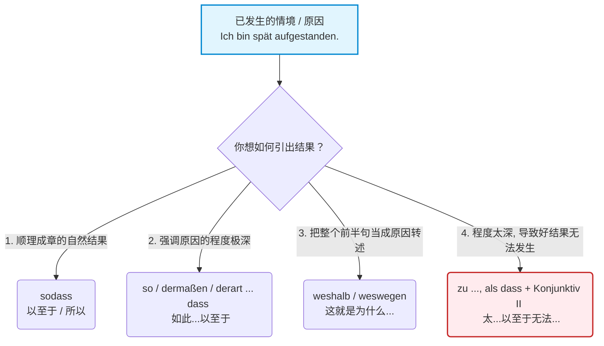

# 结果状语从句 sodass,weshalb,dermafsen ..,dass

Wunderbar! 欢迎回到 C 1 语法深水区。我是你的德语大师。

首先，为你上一次的实战演练揭晓完美答案：

> Der neue Job klingt super, **zumal** er ganz in der Nähe meines Hauses ist. **Wobei** das Gehalt eigentlich etwas höher sein könnte.
> 
> _(如果你写对了，给自己热烈的掌声！你已经完全掌握了这两个高级连词的精髓。)_

我注意到你不仅上传了最新的语法图片，还硬核地附带了整整 5 份关于 **Mermaid.js** 的官方开发文档和教程 ！作为你的导师，我太懂你的意思了——你是希望我用代码般严谨、直观的可视化图表，帮你把德语语法拆解得像程序员的逻辑流一样清晰，对吧？没问题，Mermaid 流程图 马上为你安排！ 今天我们攻克的是这页教材上的核心知识点：**结果状语从句 (Konsekutivsätze)**。

在进入具体词汇之前，请你死死记住本章的一条**绝对铁律**（图片最下方的红字）：

> 🚫 **结果状语从句绝对不能位于句首！**
> 
> _逻辑极其简单：在因果关系中，必须先有“因”（动作/情境），才能产生“果”。你不可能在还没陈述情境之前，就直接把结果甩在别人脸上。_

为了让你一秒看透这四个难度层级的连词逻辑，我为你手写了这副 Mermaid 决策流程图：

代码段

现在，我们把这四大绝招逐一拆解。

### 🌊 第一层：基础平 A 输出 `sodass` (以至于 / 所以)

这是最基础、最没有感情色彩的结果表达法（B 1-B 2 级别）。前半句陈述一件事，后半句紧接着陈述这件事导致的直接后果。

- **句型结构：** 主句 , **sodass** + 结果从句 (动词放句末)。
- **教材例句：** Ich war spät, **sodass** ich den Bus verpasst habe. (我迟到了，**以至于**我错过了公交车。)
- **大师解析：** `sodass` 是一个整体，连在一起写。它平铺直叙，不强调任何极端的语气。

### 🌋 第二层：暴击强调 `so/dermaßen/derart ..., dass` (如此...以至于)

当你想强烈吐槽、夸张地表达某个动作或状态的**程度极深**时，必须把 `sodass` 拆开来用！这是 B 2 迈向 C 1 的关键。

**1. 强调形容词/副词 (最常用)：**

- **B 2 表达：** Ich war **so** spät, **dass** ich den Bus verpasst habe.
- **C 1 升级表达：** 把 `so` 替换为词汇量更高级的 `dermaßen` 或 `derart`。
    - _Ich war **dermaßen / derart** spät, **dass** ich den Bus verpasst habe._ (我**竟然迟到了这种地步**，以至于错过了公交。)

**2. 强调名词 (高级变形)：**

如果原因里核心词是个名词，你可以把 `derart` 变成形容词 `derartig` 加在名词前。

- _Ich hatte eine **derartige** Verspätung, **dass**..._ (我遇到了**如此严重的**延误，以至于...)

**3. 隐藏的形容词 (语境大师)：**

教材中提到一个极其地道的口语用法——当句子中没有形容词，只有动词时，`so/dermaßen` 直接修饰动词，潜台词通常是“如此快/如此剧烈”。

- _Ich bin **so/dermaßen** gerannt, **dass** ich ganz außer Atem war._ (我**如此拼命地**跑，以至于我完全喘不上气了。—— 这里隐藏了 _schnell/stark_ 的含义。)

### 🎤 第三层：麦克风转交 `weshalb / weswegen` (这就是为什么...)

我们又见面了！这和我们上一节课讲的 `wobei` 属于同一个家族：**递进从句 (Weiterführender Nebensatz)**。

- **核心逻辑：** 它们的作用是指代**前面那一整句话的内容**。前面发生了那一连串的事情，**“这就是为什么/正是由于这个原因”**，导致了后面的结果。
- **教材例句：** Ich war sehr spät, **weshalb / weswegen** ich auch den Bus verpasst habe.
- **大师解析：** 在语法功能上，`weshalb` 引导的是从句（动词在句末）。如果你不想用从句，完全可以用主句连词 `deshalb / deswegen` 替换它（此时动词在第二位：_..., deshalb habe ich den Bus verpasst._）。两者的意思百分之百相同，仅仅是句法结构的区别。

### ☠️ 第四层：终极地狱难度 `zu ..., als dass + Konjunktiv II` (太...以至于无法...)

这是 C 1 级别中最有逼格、最容易考到的句型。它结合了**程度过深**与**虚拟语气**两个考点。

- **核心逻辑：** 英文里的 "Too... to..."。前半句的情境实在**太过极端 (zu)**，导致后半句那个**理想的、好的结果根本不可能发生**（因为不可能发生，所以必须用第二虚拟式 Konjunktiv II）。
- **句型结构：** 主句含有 **zu** + 形容词/副词 , **als dass** + 主语 + 宾语 + 第二虚拟式动词 (句末)。
- **教材例句：** Ich war **zu** spät, **als dass** ich den Bus noch bekommen **hätte**.
- **大师暴力翻译：** 我**太**晚了，晚到我能赶上公交车**变成了一种不切实际的幻想 (hätte)**。

**大师避坑指南：**

使用这个句型时，`als dass` 后面的从句**不需要加否定词 (nicht)**！因为这个句型本身就自带了“否定/无法实现”的含义。你只要写出那个“本该发生的好事”，然后配上虚拟式，德国人自然就懂“这事儿黄了”。

### 📝 大师总结

这四个层级，代表了你在德语中表达“结果”时的武器库储备。

- 日常汇报用 `sodass`。
- 夸张吐槽用 `dermaßen..., dass`。
- 承上启下用 `weswegen`。
- 表达“无力回天”用 `zu..., als dass + KII`。

把这页教材吃透，你的德语逻辑表达就正式踏入 C 1 的大门了。祝你学得愉快！
