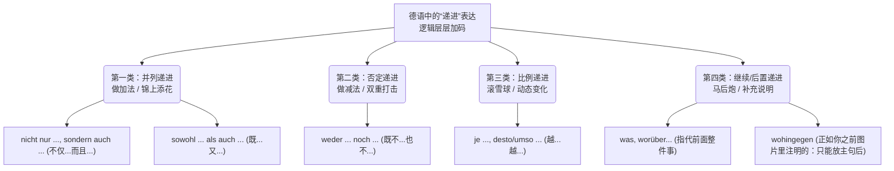

# 递进从句合集

关于你提到的“递进从句”**，这里大师要帮你破除一个国内德语教材常挖的坑：在德国原版的语法书里，其实并没有一个单一的家族叫“递进从句”。国内教材所说的“递进”，其实涵盖了**四种完全不同的语法逻辑（做加法、做减法、按比例放大、马后炮补充）。

为了让你一目了然，我们先用一张雷达图（逻辑树）把它们分拣清楚，然后再进入硬核的表格！

### 🧠 德语“递进”家族逻辑全景图

代码段

### 📊 B 2 核心考点：各类“递进从句”场景与用法速查表

| **逻辑场景**                                                              | **标志连词 (Markers)**                                                                                                                               | **大师语法口诀 (用法与位置)**                                                                                                                                  | **B 2 移民实战例句 (场景应用)**                                                                                                                                                                                                                                                                                          |
| --------------------------------------------------------------------- | ------------------------------------------------------------------------------------------------------------------------------------------------ | --------------------------------------------------------------------------------------------------------------------------------------------------- | -------------------------------------------------------------------------------------------------------------------------------------------------------------------------------------------------------------------------------------------------------------------------------------------------------------- |
| 1. 做加法：      并列递进      _(强调好上加好，或坏上加坏)_       | **nicht nur ..., sondern auch ...**      (不仅...而且...)         **sowohl ... als auch ...**      (既...又...) | **口诀：“门当户对”**      这两个连词连接的成分必须完全对称（名词对名词，句子对句子）。      ⚠️ `sondern auch` 后面通常跟着正常的正语序。                                      | **【职场求职】**      Er spricht **nicht nur** fließend Deutsch, **sondern** er hat **auch** viel Erfahrung.      _(他不仅德语流利，而且经验丰富。)_         Wir suchen **sowohl** Bäcker **als auch** Verkäufer.      _(我们既招面包师，也招售货员。)_                                        |
| 2. 做减法：      否定递进      _(连根拔起，啥都不剩)_          | **weder ... noch ...**      (既不... 也不...)                                                                                            | **口诀：“自带否定，老大老二”**      词本身就带否定，句子里**绝不能**再出现 nicht 或 kein！      ⚠️ `weder` 放第一位时，动词紧跟其后；`noch` 必须紧跟动词！                     | **【租房纠纷】**      Die Wohnung hat **weder** einen Balkon **noch** gibt es einen Aufzug.      _(这公寓既没阳台，也没电梯。)_                                                                                                                                                                           |
| 3. 滚雪球：      比例递进      _(动态变化，B 2/C 1 写作必考)_  | **je ..., desto / umso ...**      (越... 越...)                                                                                        | **口诀：“前尾后反，紧抱形容词”**      `je` 引导的是**从句（动词踢到句尾）**；      `desto` 引导的是**主句（动词反装倒装紧跟其后）**。      ⚠️ 这俩词必须紧紧抱着比较级形容词！ | **【医疗保险】**      **Je** älter man wird, **desto** teurer ist die private Krankenversicherung.      _(人越老，私立医疗保险就越贵。)_                                                                                                                                                                   |
| 4. 马后炮：      继续/后置递进      _(对前面整句话进行评价或转折补充)_ | **was** (这件事情...)      **worüber** (关于这件事...)         **wohingegen** (而/反之...)                                        | **口诀：“永远的老二，绝不抢跑”**      这种从句在语法上叫 _Weiterführende Nebensätze_。它必须依赖前面已经发生的事实，所以**绝对不能放在整个句子的最前面**！（这就是你之前图片脚注里提到的那条铁律）。                | **【外管局延签】**      Ich habe mein B 1-Zertifikat bekommen, **worüber** ich mich sehr freue.      _(我拿到 B 1 证书了，对此我非常高兴。)_         **【生活融入】**      Ich fahre gerne Fahrrad, **wohingegen** meine Frau das Auto bevorzugt.      _(我喜欢骑车，而我妻子却偏爱开车。)_ |

### 💡 大师的 B 2 避坑指南：

在这张表里，中国学生最容易翻车的是 ** `je..., desto...` (越...越...)**。

很多同学会按照中文语序说：~~Je du lernst mehr, desto du sprichst besser.~~ (❌ 灾难级错误)

记住，在德语里，** `je` 和 `desto` 就像是一对吸铁石，它们必须把“比较级”紧紧吸在自己身上！**

✅ 正确做法：**Je** _mehr_ du lernst, **desto** _besser_ sprichst du.

当你掌握了这些递进结构的底层逻辑，你的德语就不再是毫无关联的短句堆砌，而是像德国的高速公路一样，逻辑严密、层层递进。你可以随时尝试用 `je..., desto...` 或 `nicht nur..., sondern auch...` 结合你目前的移民生活造几个句子发给我，我会为你提供最及时的“大师级”精修与批改！
