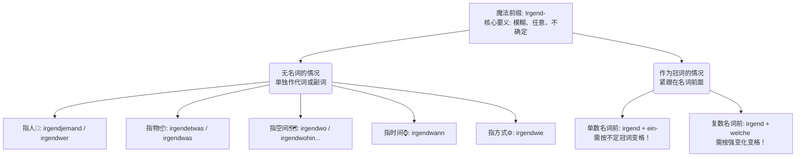

---
aliases:
  - irgend
---

# Irgend

![[PixPin_2026-05-21_17-07-17.png]]

[[从句#^uBKzxWyF|100%]]

表示不在乎的/不确定的/任意的 -> 人/时间/地点。...想象成德语世界里的“马赛克滤镜”或者“盲盒”。**

看一眼老爷爷掏空口袋的绝望瞬间（来自你提供的教材图片）：

> _"**Irgendwer** hat meine Schlüssel **irgendwohin** gelegt. Das kommt mir **irgendwie** komisch vor."_
> （**不知道是谁**把我的钥匙放到**不知道哪里**去了。这事儿让我觉得**莫名其妙地**奇怪。）

你看，一句话用了三个 `irgend-`，把那种“一问三不知”的懵圈感表达得淋漓尽致。

为了让你在脑海中建立清晰的知识树，大师给你画了一张思维导图。你可以把它刻在脑子里：

代码段

接下来，我们把这两个大分支掰开揉碎了讲，并且直接带入到你的德国移民生活场景中去。

### 第一部分：当 Irgend- 独自美丽（无名词的情况）

当后面不跟名词时，`irgend-` 可以和各种疑问代词复合，变成新的不定代词或副词。它们在句子里的位置，和它们所指代的成分位置完全相同。

- **指人 (Someone/Anyone)：** `irgendjemand`, `irgendwer`, `irgendeiner`
    - _注意：_ 这三个词意思完全相同，都是“某个人”。`irgendjemand` 可以变格也可以不变；但 `irgendwer` 和 `irgendeiner` **必须变格**。
    - **【医疗场景】** * Ist hier **irgendwer** Arzt? (这里**有谁**是医生吗？—— 突发急病时的呼救)
        - Ich brauche **irgendjemanden**, der mir bei der Übersetzung hilft. (我需要**随便哪个人**来帮我翻译一下。—— 在医院填表时的无奈)
- **指物 (Something/Anything)：** `irgendetwas` (口语常缩读为 `irgendwas`)
    - **【租房场景】** * Hauptsache, ich habe erst mal **irgendwas** zum Wohnen. (最重要的是，我得先有**个什么地方**住。—— 刚到德国找房的卑微)
- **指空间 (Somewhere/Anywhere)：** `irgendwo` (在某处), `irgendwohin` (去某处), `irgendwoher` (从某处来)
    - **【行政事务场景】** * Ich habe mein Visum **irgendwo** verloren! (我把我的签证丢在**不知道什么地方**了！—— 外管局门口的惊恐)
        - Wir müssen die Unterlagen **irgendwohin** schicken, aber ich weiß nicht genau, an welche Abteilung. (我们得把材料寄到**某个地方**，但我不知道具体哪个部门。)
- **指时间 (Sometime/Anytime)：** `irgendwann`
    - **【职场场景】** * Ich werde **irgendwann** fließend Deutsch sprechen. (我**总有一天**会流利地说德语的。—— 学习遇到瓶颈时的自我打气)
- **指方式/方法 (Somehow/Anyhow)：** `irgendwie` (常出现在形容词左边，表示“某种程度上”、“莫名其妙地”)
    - **【日常生活】** * Die Bürokratie in Deutschland ist **irgendwie** kompliziert. (德国的官僚主义**莫名其妙地**复杂。)

### 第二部分：当 Irgend- 贴上名词（作冠词位于名词前）

这是 B 1-B 2 考试最爱考的“变格陷阱”！

当你想表达“随便哪个某某某”时，你需要把 `irgend-` 和不定冠词拼在一起放在名词前面。

**黄金口诀：单数用 irgend + 不定冠词；复数用 irgend + welche。而且，必须跟着后面的名词变格！**

为了让你查阅方便，大师把教材里的变格表给你重新整理了一遍：

| **格 (Kasus)** | **阳性单数 (Mann)**            | **中性单数 (Kind)**            | **阴性单数 (Frau)**      | **复数 (Leute)**               |
| ------------- | -------------------------- | -------------------------- | -------------------- | ---------------------------- |
| **第一格 (Nom)** | irgendein Mann             | irgendein Kind             | irgendeine Frau      | irgendwelche Leute           |
| **第四格 (Acc)** | irgendein**en** Mann       | irgendein Kind             | irgendeine Frau      | irgendwelche Leute           |
| **第三格 (Dat)** | irgendein**em** Mann       | irgendein**em** Kind       | irgendein**er** Frau | irgendwelche**n** Leute**n** |
| **第二格 (Gen)** | irgendein**es** Mann**es** | irgendein**es** Kind**es** | irgendein**er** Frau | irgendwelche**r** Leute      |

**【高频实战场景训练】**

1. **找工作 (Jobsuche) - 贬义/任意性表达**

    - _错误心态：_ Ich nehme _irgendeinen_ Job. (我随便接**个什么**工作都行。—— 第一格是 irgendein Job，作 nehmen 的第四格宾语，变为 irgendeinen。)
    - _正确心态：_ Ich bin gut qualifiziert, ich möchte nicht nur _irgendeinen_ Job, sondern eine Karriere! (我资质很好，我不想只找**随便一个**工作，我要的是事业！)

2. **租房找室友 (WG-Suche) - 第三格应用**

    - Ich möchte nicht mit _irgendeinem_ fremden Mann zusammenziehen. (我不想和**随便哪个**陌生的男人同居。—— mit + Dativ，阳性变 -em。)

3. **看病就医 (Arztbesuch) - 阴性单数及复数应用**

    - Haben Sie _irgendeine_ Salbe gegen diesen Ausschlag? (您有**随便什么**药膏能治这个皮疹吗？—— haben + Akkusativ，阴性保持 -e。)
    - Der Arzt hat mir _irgendwelche_ Tabletten verschrieben, aber ich kann die Schrift nicht lesen. (医生给我开了**些不知道什么**药片，但我看不懂他的字。—— 复数第四格。)

### 德语大师的半年通关规划建议

既然你的目标是六个月拿下 B 2，时间安排必须极其自律：

- **前 2 个月（夯实 B 1 地基）：** 重点攻克词尾变格（就是我们今天讲的这张表）、各种从句连词（weil, dass, obwohl...）以及过去时的形态。
- **中间 2 个月（冲刺 B 2 堡垒）：** 强攻被动语态的各种时态替代形式、虚拟一式（间接引语）和虚拟二式（非真实条件/礼貌表达）。每天强迫自己用 B 2 语法写一篇 50 字的德语日记。
- **最后 2 个月（真题与输出）：** 疯狂做题，熟悉考试套路。同时，把你日常生活中（租房、找局子、看病）的所有中文抱怨，全都在脑子里翻译成德语。

**【今日作业 - 德语大师的考验】**

纸上得来终觉浅，绝知此事要躬行。请你结合你目前的职业背景，或者你来德国最担心的一件事（比如租房、或者去外管局），使用今天学的 **irgendjemand / irgendwo / irgendein (注意变格)** 造三个完整的德语句子。

把德语当成你手中的工具，而不是要膜拜的神像。大胆用，搞错了大师给你兜底！加油，Viel Erfolg！
