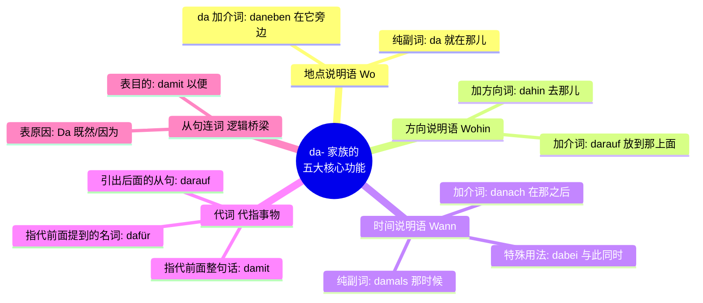

---
aliases:
  - darauf
  - da
  - dafür
  - damit
  - damals
  - dabei
  - danach
  - dahin
  - danaben
---
# da-构成的代副词

^x9mmil

这部分知识在日常交流和 B 2 考试（特别是口语和写作）中极其重要。为了让你秒懂这个概念，我们来打个比方：**德语里的 `da-` 家族，就像我们电脑里的“压缩包”或者“桌面快捷方式”。**

德国人非常讲究效率，如果前面已经提过某个长长的地点、一件复杂的事情，他们绝对不想再啰嗦地重复一遍。这时候，把它们“打包”成一个以 `da` 开头的小词（比如 _daneben, danach, dafür_），句子瞬间就清爽高级了！

为了让你在脑海中建立清晰的知识树，我们先来看一张“da- 家族”的全景图表：

|**代副词**|**构成方式**|**中文核心翻译/含义**|**移民生活高频场景与例句**|**核心用法提示**|
|---|---|---|---|---|
|**dabei**|da + bei|在这方面 / 同时 / 随身带着|**医疗：** Haben Sie Ihre Versichertenkarte **dabei**?      _(您随身带着医保卡吗？)_|常用于表示某物在身边，或在做某事的过程“中”。|
|**dadurch**|da + durch|通过这（种方式）/ 因此|**工作：** Er arbeitet jeden Tag mit deutschen Kollegen. **Dadurch** lernt er schnell.      _(他每天和德国同事工作。由此他学得很快。)_|强烈的因果或手段关系。|
|**dafür**|da + für|为此 / 赞成这事|**行政：** Ich brauche ein Visum. Was muss ich **dafür** tun?      _(我需要签证。为此我必须做什么？)_|常接在动词 _sich interessieren für_ 或 _sein für_ 之后。|
|**dagegen**|da + gegen|反对这个 / 与此相比|**生活：** Die Miete wird erhöht. Ich bin absolut **dagegen**!      _(房租要涨了。我绝对反对！)_|表达反对意见，或作对比（相反）。|
|**dahinter**|da + hinter|在这后面|**租房：** Hier ist die Küche und **dahinter** liegt das Schlafzimmer.      _(这是厨房，在这后面是卧室。)_|纯方位描述。|
|**damit**|da + mit|用这个 / 与此相关|**工作：** Hier ist mein neuer Laptop. **Damit** kann ich im Homeoffice arbeiten.      _(这是我的新电脑。用它我可以在家办公。)_|注意与连词 _damit_ (为了) 区分，这里是副词“用它”。|
|**danach**|da + nach|在这之后 / 询问这个|**行政：** Ich gehe zuerst zur Ausländerbehörde, und **danach** zur Bank.      _(我先去外管局，之后去银行。)_|表示时间先后，或接 _fragen nach_ (询问)。|
|**daneben**|da + neben|在这旁边|**租房：** Da steht der Kleiderschrank. **Daneben** können wir ein Bett stellen.      _(那儿放着衣柜。在它旁边我们可以放张床。)_|纯方位描述。|
|**daran**|da + r + an|在这上面 / 对此|**工作：** Ich arbeite hart **daran**, mein B2-Zertifikat zu bekommen.      _(我正为此努力，以取得B2证书。)_|结合动词固定搭配如 _denken an_, _arbeiten an_。|
|**darauf**|da + r + auf|在这上面 / 等待这个|**租房：** Der Vermieter meldet sich bald. Ich warte **darauf**.      _(房东很快会回复。我正等这个呢。)_|极为高频！常用于 _warten auf_, _sich freuen auf_。|
|**daraus**|da + r + aus|从这里面 / 由此|**行政：** Hier ist mein Arbeitsvertrag. **Daraus** können Sie mein Gehalt ersehen.      _(这是我的工作合同。从中您能看出我的薪水。)_|表示来源或推论。|
|**darin**|da + r + in|在这其中 / 在这方面|**租房：** Das Zimmer ist sehr groß. **Darin** steht schon ein Schreibtisch.      _(这房间很大。里面已经有张书桌了。)_|表示内部空间或抽象的“在某一点上”。|
|**darüber**|da + r + über|关于这个 / 在这上方|**行政：** Mein Antrag wurde abgelehnt. Ich ärgere mich sehr **darüber**.      _(我的申请被拒了。我对此非常生气。)_|极高频！配合 _sprechen über_, _sich ärgern über_。|
|**darum**|da + r + um|围绕这个 / 因此|**行政：** Es gibt ein Problem mit meiner Steuernummer, aber mein Steuerberater kümmert sich **darum**.      _(我的税号有点问题，但我的税务师会处理这事。)_|常接在 _sich kümmern um_ (照顾/负责) 后面。|
|**darunter**|da + r + unter|在这下方 / 在这之中|**生活：** Ich habe viele Dokumente, **darunter** auch mein Zeugnis.      _(我有很多文件，其中也包括我的毕业证。)_|常用来表示“包含在其中”（among them）。|
|**davon**|da + von|从这里 / 关于这个|**工作：** Google ist eine tolle Firma. Ich träume **davon**, dort zu arbeiten.      _(谷歌是家好公司。我梦想去那儿工作。)_|结合动词搭配 _träumen von_, _erzählen von_。|
|**davor**|da + vor|在这之前 / 害怕这个|**医疗：** Morgen ist meine Operation. Ich habe etwas Angst **davor**.      _(明天我要手术。我对此有点害怕。)_|时间在先，或配合 _Angst haben vor_ (害怕某事)。|
|**dazu**|da + zu|对此 / 另外加进去|**生活：** Ich habe Pommes bestellt und möchte noch Ketchup **dazu**.      _(我点了薯条，还想加点番茄酱。)_|表示补充，或者配合 _Was sagst du dazu?_ (你怎么看？)|
|**dazwischen**|da + zwischen|在这两者之间|**租房：** Hier ist der Herd und da der Kühlschrank. **Dazwischen** ist Platz für ein Regal.      _(这是炉灶，那是冰箱。这中间有放架子的空间。)_|强调夹在中间的状态。|
接下来，我们结合你未来的**租房、找工作、医疗和行政事务**四大真实移民场景，把这五大功能逐一击破！

## da / daneben / darauf 地点说明语：快捷定位 (Wo?)

当我们需要指出某个具体位置，但不想重复那个地名或物品时，就可以用到它。

- **纯副词用法 (`da`)：** 直接替代前面提过的地点。
    - _教材原句：_ Ich habe lange in Kenia gewohnt. **Da** (= in Kenia) ist es immer warm.
        - 我在肯尼亚住了很久。那里（=在肯尼亚）总是温暖。
    - **【租房场景】** Die Wohnung hat einen großen Balkon. **Da** können wir im Sommer grillen. (这套公寓有个大阳台。在那儿我们夏天可以烧烤。)
- **da + 介词 (`daneben, darauf...`)：** 表示“在那个东西的旁边/上面...”。
    - _教材原句：_ Am Platz ist eine Apotheke und links **daneben** ist das Kino.
        - 在广场上有一家药店，药店左边紧邻着电影院。
    - **【行政事务场景】** Hier ist das Bürgeramt und direkt **daneben** befindet sich die Ausländerbehörde. (这里是市民中心，紧挨着它旁边就是外管局。)

> **大师点拨：** 当介词是以元音开头的（比如 auf, in, über），为了发音好听，中间必须加个缓冲的 **-r-**，变成 da**r**auf, da**r**in, da**r**über！

## da+介词/方位词 方向说明语：快捷导航 (Wohin?)

表示动作的移动方向。

- **da + hin/her/rüber/runter：** 替代要去的地方。
    - _教材原句：_ Sie fliegt nach Rom. Er fährt auch **dahin**.
    - **【职场场景】** Herr Müller geht ins Meeting. Ich gehe jetzt auch **dahin**. (米勒先生去开会了。我现在也去那儿。)
- **da + 介词 (`darauf, darin...`)：** 结合表示移动的动词（如 legen, stellen）。
    - _教材原句：_ Kannst du den Ordner bitte **darauf** (= auf den Tisch) legen?
    - **【医疗场景】** Hier ist Ihre Versichertenkarte. Bitte legen Sie diese **darauf** (auf das Lesegerät). (这是您的医保卡。请把它放在读卡器上。)

## da / damal /danach/davor... 时间说明语：快捷时间线 (Wann?)

这是日常对话中极其高频的用法，能让你的叙事条理清晰。

- **纯副词 (`da, damals`)：**
    - _教材原句：_ Ich war nicht gerne im Kindergarten. **Damals** wollte ich lieber alleine spielen.
    - **【求职面试场景】** Ich bin 2020 nach Deutschland gekommen. **Damals** konnte ich noch kein Wort Deutsch. (我 2020 年来到德国。那时候我还一句德语都不会说。) _(注：`damals` 也可以变成形容词 `damalig`)_
- **da + 介词 (`danach, davor...`)：**
    - _教材原句：_ Ich muss jetzt erst etwas essen, **danach** können wir spazieren gehen.
    - **【行政事务场景】** Sie müssen das Formular ausfüllen. **Danach** können Sie den Pass abholen. (您必须先填表。之后您就可以拿护照了。)

**重点突破：戏超多的 `dabei` **

图片中特别指出了 `dabei` 的四种极其地道的用法，请务必背诵：

1. **同时发生：** Er arbeitet und hört **dabei** Musik. (他一边工作一边听音乐。)
2. **身体感受：** Er fühlt sich nicht wohl **dabei**. (做这事让他觉得不太舒服。——比如医疗抽血场景)
3. **正忙于做某事 (gerade dabei sein, etwas zu tun)：** Ich bin gerade **dabei**, meinen Lebenslauf zu schreiben. (我正忙着写我的简历呢。)
4. **惯用语 (Was ist schon dabei?)：** = Das ist nicht schlimm. (这有什么大不了的？)

## 四、 代词功能：快捷指代核心神器 (B 2 必考点！)

在德语 B 1-B 2 阶段，你会背诵大量的“动词+固定介词”搭配（比如 _sich interessieren für_）。当你要指代一个**事物/事情**（绝不能是指代人！）时，必须用 da- 词。

|**核心功能**|**移民生活实战例句**|**解析说明**|
|---|---|---|
|**指代前面的事物**|Hast du dich schon um die Krankenversicherung gekümmert? – Ja, ich habe mich schon **darum** gekümmert. (医保的事处理好了吗？- 嗯，处理好了。)|对应动词搭配 _sich kümmern um_。|
|**指代前面的整句话**|Der Vermieter will die Miete stark erhöhen. **Damit** bin ich nicht einverstanden. (房东想大幅涨租。对此我不同意。)| `Damit` 直接把前面“房东要涨租”这一整件事打包了。|
|**引出后面的从句**|Ich freue mich **darauf**, bald einen guten Job zu finden. (我很期待很快能找到一份好工作。)|对应搭配 _sich freuen auf_。把 `darauf` 扔在主句占位，引出后面真正的动作。|

## da / damit 从句连词：逻辑担当

这里 `da` 和 `damit` 已经不再是代副词了，它们化身为连接从句的“桥梁”，把主语和变位动词踢到句末。

- **Da (原因状语从句)：** 类似于 _weil_，但比 _weil_ 更正式，经常放在句首，表示“既然、因为”。
    - **【租房场景】** **Da** ich eine feste Arbeitsstelle habe, bekomme ich diese Wohnung leichter. (既然我有一份稳定的工作，我拿到这套房就更容易些。)
- **damit (目的状语从句)：** 表示“以便于、为了”。前后主语通常不一致时使用。
    - _教材原句：_ Ich muss mich beeilen, **damit** der Bericht rechtzeitig fertig wird.
    - **【家庭融入场景】** Ich lerne jeden Tag hart Deutsch, **damit** meine Kinder hier ein besseres Leben haben. (我每天刻苦学德语，是为了让我的孩子们在这里有更好的生活。)
- “占位符” [[Vorwort#^dn78es]]
