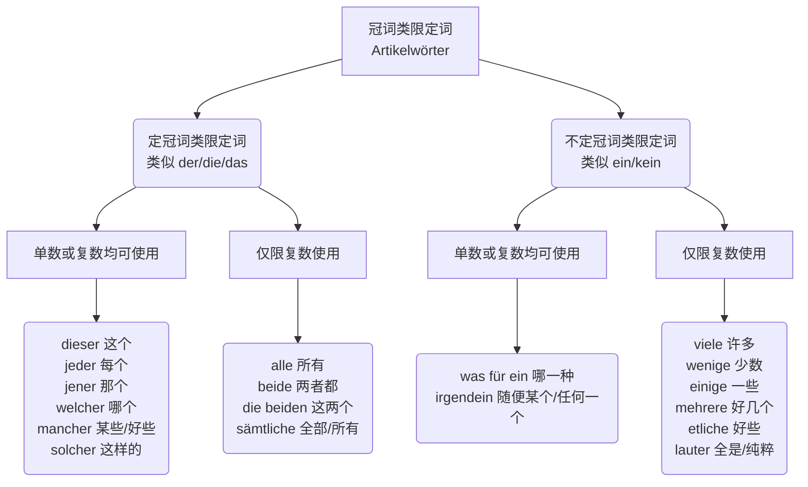
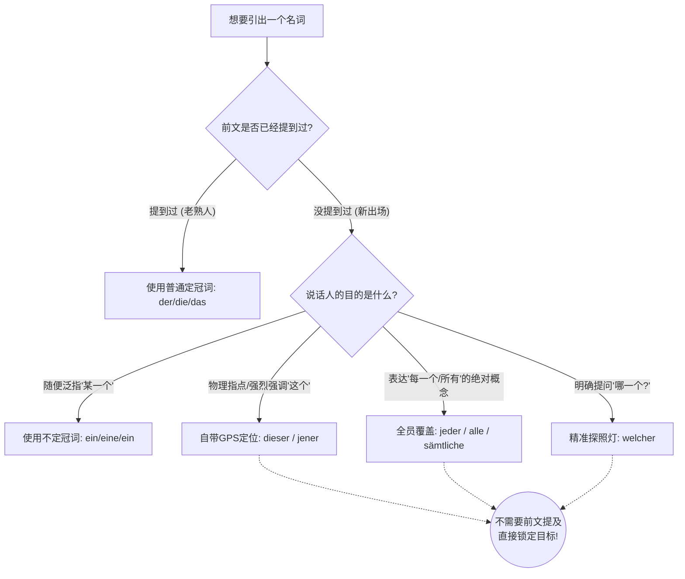

---
aliases:
  - 限定词
  - dieser
  - dieses
  - diese
  - jeder
  - jedes
  - jede
  - alle
  - jener
  - jenes
  - jene
  - welcher
  - welches
  - welche
  - mancher
  - manches
  - manche
  - solcher
  - solches
  - solche
  - beide
  - die beiden
  - sämtliche
  - was für ein
  - was für eine
  - was für welche
  - irgendein
  - irgendeine
  - irgendwelche
  - wenige
  - einige
  - mehrere
  - etliche
  - viele
  - lauter
  - viel
  - wenig
---

[[格; 限定词#^Rl-J6eW9JAqnknnhfwfkG|100%]]

# 冠词类限定词（Artikelwörter）及其形容词词尾变化

^81tlk5

在德语的句子里，名词就像是来参加聚会的“客人”**。如果这位客人光着身子来（零冠词），会显得很没礼貌；所以我们通常会给他们穿上“衣服”——这就是**冠词（der/die/das/ein/eine）**。 然而，有时候普通的衣服不够用，我们需要给这些客人贴上更明确的**“VIP 标签”**或**“特殊身份牌”**，比如“**这个**客人”、“**所有**客人”、“**某一个**客人”。这些代替了普通冠词，直接贴在名词前面的词，就是**限定词（Determinativ）。

根据你提供的学习资料，我们用一张图表把它们梳理清楚：

代码段

---

## 变格方式

限定词和冠词（定冠词或不定冠词）通常不能同时存在。

在德语语法中，这类词被称为“冠词类限定词”（Artikelwörter）。这意味着它们在名词短语中占据了冠词的语法位置，并起到了相同的功能（限定名词并提示性、数、格）。

互斥原则： 既然你已经用了一个限定词来明确名词的范围，就不需要（也不能）再加定冠词了。比如，只能说 dieses Kind（这个孩子），绝对不能说 das dieses Kind。

图片里的特例： 图片中列出的 die beiden（这两个）是一个固定用法的特例，它本身已经自带了定冠词 die。

形容词用法的例外： 像 viele (许多) 或 wenige (少数) 这种词，在某些特定的高级语法结构中可以作为形容词跟在定冠词后面（例如：die vielen Kinder 那些许多的孩子们），但在你图片所讲的作为限定词的语境下，它们是直接代替冠词放在名词前面的（例如：Viele kleine Kinder...）。

总结来说，把它们当作冠词的“替身”来用就对了，用了替身，本尊（定冠词/不定冠词）就不出场了。

## 分类讲解

### 第一部分：定冠词类限定词 (The VIP Club)

**核心心法：** 这一派的词，地位等同于**定冠词 (der/die/das/die)**。

1. 它们自身的变格方式，和定冠词一模一样（比如第三格会变成 _mit diesem_）。
2. **重点中的重点：** 它们右边的**形容词词尾**，必须乖乖遵守“定冠词后的弱变化”规则（单数通常加 -e 或 -en，复数一律加 -en）。

#### 1. 单数或复数都能接的“常客”

- _dieser_ (这个), _jeder_ (每个 - 注意复数通常用 _alle_), _jener_ (那个), _welcher_ (哪个), _mancher_ (好些个 - 单数), _solcher_ (这样的 - 复数)

> **移民生活场景：租房 (Wohnungssuche)**
>
> 想象你正在看房，你想指着合同说：“**这个**小房间太贵了！”
>
> - **Dieses kleine** Zimmer ist zu teuer.
>     
>     _(解析：Zimmer 是中性 das，所以 dies 加上中性词尾 -es 变成 dieses。它等同于 das，所以后面的形容词 klein 只需加 -e)_
>     
> 
> 房东要求你签署文件：“请您在**每一份**重要的文件上签字。”
>
> - Bitte unterschreiben Sie auf **jedem wichtigen** Dokument.
>     
>     _(解析：auf + Dativ 第三格，das Dokument 变成 dem，所以 jeder 变成 jedem。形容词 wichtig 弱变化加 -en)_

#### 2. “仅限复数”的专属词

- _alle_ (所有), _beide_ (两者), _die beiden_ (这两个), _sämtliche_ (全部)

> **移民生活场景：办理行政手续 (Behördengang)**
>
> 你去外管局 (Ausländerbehörde) 办签证，工作人员对你说：“**所有**新来的移民都必须登记。”
>
> - **Alle neuen** Einwanderer müssen sich anmelden.
>     
>     _(解析：复数 Nominativ 第一格。alle 相当于复数的 die。重点：看资料左下角的例子 "Alle kleinen Kinder essen Schokolade." 这里的 kleine**n** 就是因为在 alle 后面，复数形容词一律加 -en！)_

---

### 第二部分：不定冠词类限定词 (The Casual Club)

**核心心法：** 这一派的词，地位等同于**不定冠词 (ein/eine/ein)** 或**否定词 (kein)**。

1. 它们自身的变格方式，和 _kein-_ 一模一样。
2. 它们右边的**形容词词尾**，必须遵守“不定冠词或无冠词后的强/混合变化”规则。

#### 1. 单数或复数都能接的“常客”

- _irgendein_ (随便某个), _was für ein_ (哪一种)

> **移民生活场景：医疗就诊 (Arztbesuch)**
>
> 刚到德国，你突发肠胃炎，你痛苦地对室友说：“随便给我找**一个**好医生吧！”
>
> - Bitte such mir **irgendeinen guten** Arzt!
>     
>     _(解析：找医生是 Akkusativ 第四格，der Arzt 变成 den，所以 irgendein 变成 irgendeinen。)_
>     
> 
> 室友问你：“你需要**哪一种**特效药？”
>
> - **Was für ein wirksames** Medikament brauchst du?
>     
>     _(解析：das Medikament，中性。was für ein 在这里充当 ein 的角色。后面的形容词 wirksam 承担了中性的标志 -es)_

#### 2. “仅限复数”的专属词

- _viele_ (许多), _wenige_ (少数), _einige_ (一些), _mehrere_ (好几个), _etliche_ (好些个)

> **移民生活场景：职场求职 (Jobsuche)**
>
> 经历了漫长的面试，你终于拿到了 offer，你感慨道：“尽管遭到了**好几次**无情的拒绝，我还是找到了工作。”
>
> - Trotz **mehrerer schonungsloser** Absagen habe ich einen Job gefunden.
>     
>     _(解析：trotz 支配 Genitiv 第二格。die Absage 的复数二格标志是 -er。所以 mehrere 变成 mehrerer。**关键点：** 资料右下角指出，viele/einige 等词后面的形容词变格**参照无冠词的强变化**。所以 "Viele kleine Kinder" 中是 klein**e**，而不是 kleinen！)_

---

### 第三部分：必须注意的“奇葩”例外 (Ausnahmen)

在你的资料右下角，有两个红色的警告标记，这是德国人经常设下的语法陷阱，B 2 考试最爱考：

1. **不可数名词前的 viel 和 wenig：**

    当 _viel_ (多) 和 _wenig_ (少) 用在不可数名词（比如钱、时间、水）前面时，**它们绝对不加词尾！**

    - **正确：** Ich habe **viel Geld** und **wenig Zeit**. (我有很多钱，却没多少时间。)
    - **错误：** Ich habe vieles Geld... (千万别这么说！)
        
2. **特殊的 lauter：**

    _lauter_ 的意思是“全是、纯粹是”。它不仅只跟复数，而且**它本身永远不变格**。

    - Hier sind **lauter nette** Kollegen. (这里全都是友好的同事。)

---

# 限定词包含不定代词吗

![[不定代词#限定词包含不定代词吗]]

# 限定词用法

^u3abe5

> [!question]
>
> 针对您的疑问：“关于定冠词类限定词的用法，是不是也必须要在前文已经提及的情况下才能使用这些词，否则的话也是使用不定冠词？”

我的直接回答是：**绝对不是的！这恰恰是“定冠词类限定词”（如 dieser, jeder, alle）与普通的“定冠词”（der/die/das）之间最大的区别。它们不需要前文提及，可以直接“空降”在句子里！**

### 核心原理解析：自带“高光”的定冠词类限定词

**理解类比：舞台上的“老熟人”与“自带高光的主角”**

- **普通定冠词（der/die/das）：** 就像舞台上的“老熟人”。如果要用它，通常必须在前文先介绍过（用不定冠词 ein 介绍），否则观众会一头雾水问：“你说的 _der Mann_（那个男人）到底是哪个男人？”
- **不定冠词（ein）：** 就像是“跑龙套的路人甲”。你只是随便抓出一个人或物，不需要特定是谁。
- **定冠词类限定词（dieser, jeder, alle, welcher 等）：** 它们是“自带聚光灯和 GPS 定位的主角”**！它们之所以能被称为“定冠词类”，并不是因为它们需要前文铺垫，而是因为它们**本身就蕴含了极强的“限定、指示或全包”的能量。只要它们一出场，听者瞬间就能精准锁定目标，完全不需要前文的废话。

为了让您一目了然，我为您绘制了下面这张“名词限定出场判定图”：

代码段

### 完整解析：四大“定冠词类限定词”的实战应用 (B 1-B 2 核心)

让我们对照您提供的图表左侧分支（定冠词类限定词），结合德国移民生活的四大场景，看看它们是如何不需要前文提及，直接霸气出场的。

#### 1. 指示代词 (Demonstrativa)：自带 GPS 定位的 `dieser` (这个) / `jener` (那个)

当您在物理空间中指着某物，或者在语境中强烈强调当下的事物时，直接用 `dieser`。

- **租房场景：**
    - 假设您第一次走进一套公寓，根本不需要先说“这里有一套公寓（eine Wohnung）”，您可以直接指着墙壁对房东说：
    - **Dieser** Raum ist wirklich sehr hell!
    - _(**这个**房间真的是非常明亮！—— 物理空间指代，瞬间锁定)_

#### 2. 全称代词 (Totalitätswörter)：全员覆盖的 `jeder` (每个) / `alle` (所有)

当您想表达“毫无例外”的绝对概念时，无论前文有没有提过具体的人或物，直接全包。

- **行政事务场景：**
    - 假设您在阅读外管局官网的一份全新规定，开头第一句话就是：
    - **Jeder** Antragsteller muss seinen Pass mitbringen.
    - _(**每一位**申请人都必须带上护照。—— 泛指整个群体中的每一个个体，无需铺垫)_
    - **Alle** Dokumente müssen übersetzt werden.
    - _(**所有的**文件都必须被翻译。—— 图表中明确写了 alle 仅限复数使用，直接囊括全部)_

#### 3. 疑问词 (Interrogativ)：精准探照灯 `welcher` (哪一个)

当您需要在几个未知的选项中让对方挑出一个特定的时，直接用 `welcher` 提问。

- **医疗场景：**
    - 您第一次走进诊室，医生看到您捂着肚子，他不需要前文，会直接问您：
    - **Welches** Medikament haben Sie heute Morgen eingenommen?
    - _(您今天早上吃了**哪一种**药？—— 直接要求对方明确特定目标)_

#### 4. 特征指代：归类的 `solcher` (这样的) / `mancher` (某些)

用来直接框定某一种特定类型的人或事物。

- **找工作场景：**
    - **Solche** IT-Spezialisten suchen wir dringend.
    - _(我们急需**这样的** IT 专家。—— 根据刚刚聊到的某个技能标准，直接框定这一类人)_

### 大师的语法正名：为什么它们被分在“定冠词类”？

这其实是很多语法书没有讲透的地方。图表（PixPin _2026-06-15_12-44-51.png）之所以把它们称为“定冠词类限定词”（Artikelwörter wie der/die/das），**指的不是它们的“前文依赖性”，而是它们的“衣服”（词尾变化）！**

在德语变格（Deklination）体系中：

- `dieser, jeder, welcher, alle` 等词的词尾变化规律，**百分之百照抄定冠词 der/die/das 的强变化词尾**（比如阳性第一格都是 -er：der -> dieser; 中性第一第四格都是 -es：das -> dieses）。
- 右侧分支的“不定冠词类限定词”（`ein, kein, mein` 等），照抄的是不定冠词的弱变化词尾（比如阳性第一格没有词尾：ein, mein, kein）。

**总结：它们是靠自己词尾的“制服”和自身强大的“限定词义”来完成限定的，绝不依赖前文的铺垫。**

既然您已经彻底明白了它们自带高光、随时可以出场的特性，那么考考您的实战反应：假设您去超市买苹果，店员问您要哪种苹果，您指着红色的那堆想说：**“我要买这些苹果。”** 根据今天讲的知识，您应该用图表中的哪个“定冠词类限定词”来完成这句地道的德语表达呢？
