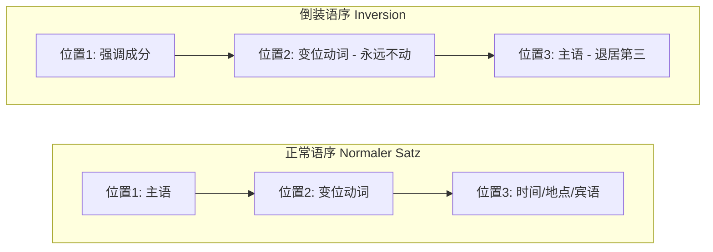
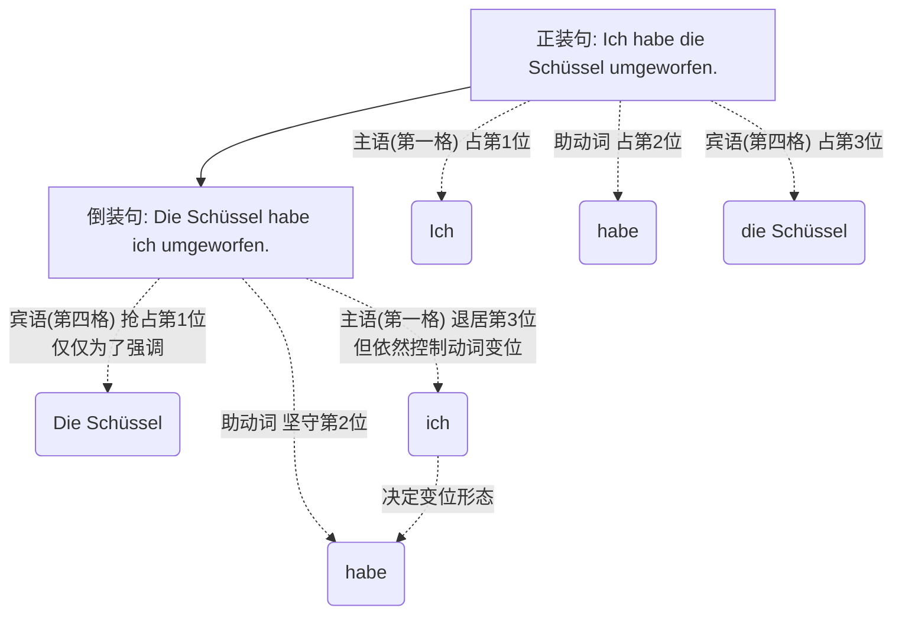
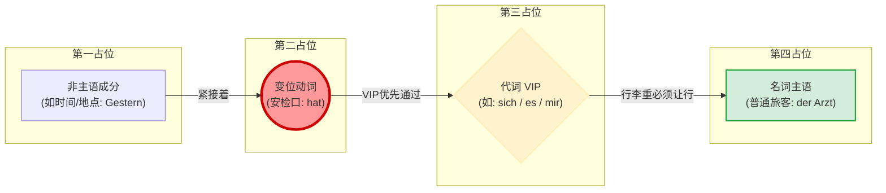

# 倒装句

### 1. 核心概念：什么是倒装句？

很多初学者习惯了中文或英文的语序：**主语 + 动词 + 其他**（我 + 昨天 + 去看了医生）。如果你每句德语都这么说（*Ich bin gestern zum Arzt gegangen.*），考官或面试官立刻就会觉得你的德语还停留在 A 1 水平。

在德语中，为了强调某个时间、地点或重要事件，我们经常把它们放在句首。这个时候，就要用到**倒装**。

**💡 大师类比：动词是“永远的国王”**

想象一下，德语的主句是一个拥有严格座次表的高级餐厅。

* **二号专座（位置 2）**是属于“变位动词”的王座。国王永远、绝对、不可撼动地坐在第二位！
* **一号专座（位置 1）**通常是给“主语”留的。
* **但是！** 如果今天来了一位“重要贵宾”（比如表示时间的“昨天”，或者表示地点的“在柏林”），这位贵宾抢占了一号专座，那么原本的主语怎么办？它只能委屈地挪到国王的另一边，也就是**三号座位（位置 3）**。

这就是倒装：**强调成分 + 动词（第二位） + 主语 + 其他。**

---

### 2. 图解倒装句结构

---

### 3. 实战演练：移民生活场景

下面几个例子分别是时间提前和宾语提前

#### 场景一：找工作与面试 (Jobsuche)

* **平淡无奇 (A 1):** ***Ich* habe *heute*** einen Termin für das Vorstellungsgespräch. (我今天有个面试预约。)
* **地道倒装 (B 1/B 2):** ***Heute*** **habe** *ich* einen Termin für das Vorstellungsgespräch.
* *(把“今天”放前面强调，动词 habe 稳居第二位，主语 ich 退居第三位。)*

#### 场景二：行政事务 - 外管局 (Ausländerbehörde)

* **平淡无奇 (A 1):** *Wir* müssen <mark style="background:#d4b106">*nächste Woche*</mark> die Dokumente einreichen. (我们下周必须提交文件。)
* **地道倒装 (B 1/B 2):** <mark style="background:#d4b106">Nächste Woche</mark> **müssen** *wir* die Dokumente einreichen.
* *(强调“下周”这个时间限制，向办事员表达紧迫感。)*

#### 场景三：租房与看房 (Wohnungssuche)

* **平淡无奇 (A 1):** *Ich* bezahle *die Kaution* sofort. (我立刻支付押金。)
* **地道倒装 (B 1/B 2):** ***Die Kaution*** **bezahle** ==*ich*== sofort.
	* 可能会有人觉得这里会发生误会，我们只需要看后面接着的人称代词是异形它是第一格，那就说明它是主语
* *(强调“押金”，表明你的诚意和财力，房东最爱听这句！在这里，宾语变成了抢占一号座位的贵宾。)*

# 我打翻了碗；还是碗打翻了我

**核心解答与语法诊断**

- **德语（工牌法则）：** 德语是靠格（Kasus）**来识别身份的。每个词出场时都挂着一个“工牌”。只要你挂着**第一格（Nominativ）**的工牌，你走到哪里都是主语（老板）；只要你挂着**第四格（Akkusativ）的工牌，哪怕你坐到最前面的尊贵位置，你也依然是个直接宾语（被作用的对象）。

---

**德语原句拆解与对比分析**

我们用德语的现在完成时（表示已经发生的动作）来翻译“我打翻了那只碗”。

**正常语序（正装句）：**

**Ich habe die Schüssel umgeworfen.**

（我打翻了那只碗。）

**强调“碗”的倒装句：**

**Die Schüssel habe ich umgeworfen.**

（那只碗，我打翻了。/ 打翻那只碗的人，是我。）

在这个倒装句中，为什么德国人绝对不会误解成“碗打翻了人”？我们来逐词拆解：

- **Die Schüssel**: 名词 (Substantiv)。在这里它是**第四格 (Akkusativ)**。虽然阴性名词的第一格和第四格长得一模一样（都是 die Schüssel），但后面的成分会揭示它的真实身份。它被提前到了第一位（前场 Vorfeld），目的是为了**强调**（比如：我打翻的是那只碗，不是那个杯子）。
- **habe**: 助动词 (Hilfsverb)。占据雷打不动的**第二位**。注意它的变位！它是第一人称单数变位。这就给出了强烈暗示：主语是“我”。
- **ich**: 人称代词 (Personalpronomen)。**第一格 (Nominativ)**，这才是它不可剥夺的“老板工牌”。虽然它被挤到了第三位，但它永远是动作的发出者。
- **umgeworfen**: 可分动词 umwerfen 的第二分词 (Partizip II)。位于句末，和 habe 构成框形结构。

**如果真的想表达“碗成精了，打翻了我”，德语该怎么说？**

你需要给“碗”换上第一格的工牌，给“我”换上第四格的工牌，并改变动词的变位来配合“碗”：

**Die Schüssel hat mich umgeworfen.**

（_hat_ 配合第三人称单数；_mich_ 是“我”的第四格形式，戴上了被打翻的工牌）。

---

**Mermaid 逻辑树状图：倒装句的乾坤大挪移**

通过下面这幅图，你可以直观地看到：在德语倒装句中，只是**位置**发生了交换，但**语法功能（工牌）**和**动词的配合关系**丝毫没有改变。

代码段

---

**举一反三与知识考核**

德语的这种“工牌机制”给了说话人极大的自由度，你可以把任何你想强调的信息（时间、地点、宾语）放在句首，只要保证**动词在第二位，主语紧跟其后**即可。

现在，导师来考考你：

在德语中，“狗”是阳性名词（第一格 der Hund，第四格 den Hund）；“男人”也是阳性名词（第一格 der Mann，第四格 den Mann）；“咬”是动词 beißen。

如果我想说倒装句“Den Mann beißt der Hund.”，请问运用今天学到的“工牌法则”，这句话到底意思是“男人咬了狗”，还是“狗咬了男人”？为什么？

# 主从句的倒装，从句在前

在日常的德国生活中（比如租房、找工作、跟外管局打交道），我们经常会把从句放在最前面（第 1 号车厢）。**主要场景和目的只有一个：强调前提、条件、时间或地点！**

把从句放在前面，就像是用荧光笔在文件上画重点，告诉听众：“先听好这个大前提，我再告诉你结果。”

> **移民生活场景举例：**
>
> - **行政事务（延签）：** _Wenn Sie die Dokumente nicht vollständig einreichen,_ (前提：如果您不把材料交齐) **verzögert** sich der Prozess. (结果：流程就会延迟。)
>     
> - **租房场景：** _Wo es gute Schulen gibt,_ (地点强调：哪里有好学校) **sind** die Mieten extrem hoch. (结果：哪里的房租就极高。)

# 句子第一位的认识

> [!note]
> 在倒装句中，第一位常规本被认为是名词胜任，但是却出现了形容词或其他任何词，因为他们都有权利做第一位, 只需要保证第二位是动词就行

#### 第一位到底能放什么？（结合移民生活场景）

既然只要保证“导演（动词）”在第二位，聚光灯下（第一位）可以放任何词。那么到底能放什么？我们直接带入您在德国的生活场景来实战：

##### 1. 第一位放“主语” (最常见的平铺直叙，不强调任何特殊信息)

- _场景：您在外管局（Ausländerbehörde）陈述基本事实。_
- **Ich** (主语/Pos 1) _habe_ (动词/Pos 2) den Antrag gestern eingereicht.
    - （我昨天提交了申请。）—— 毫无波澜，普通的男一号站在聚光灯下。

##### 2. 第一位放“时间状语” (强调发生的时间，极常用)

- _场景：您要跟房东（Vermieter）强调交房租的时间。_
- **Morgen** (时间/Pos 1) _werde_ (动词/Pos 2) **ich** (主语/Pos 3) die Miete überweisen.
    - （**明天**，我就会转账房租。）—— 聚光灯打在“明天”上。主语“ich”乖乖跑到动词后面。

##### 3. 第一位放“第四格宾语 / Akkusativobjekt” (强调动作的承受者，B 2 高级感瞬间拉满)

- _场景：求职面试（Vorstellungsgespräch），面试官问您有没有相关经验。您想强调“这个软件”您非常精通。_
- **Dieses Programm** (第四格宾语/Pos 1) _beherrsche_ (动词/Pos 2) **ich** (主语/Pos 3) fließend.
    - （**这款软件**，我掌握得非常熟练。）—— 中文也会把宾语提前来强调！注意，这里的主语依然是 ich，Dieses Programm 是宾语抢了聚光灯！

##### 4. 第一位放“第三格宾语 / Dativobjekt” (强调对象)

- _场景：在医院看病（Beim Arzt），医生问谁过敏。您强调是“您的妻子”对青霉素过敏。_
- **Meiner Frau** (第三格宾语/Pos 1) _hilft_ (动词/Pos 2) **dieses Medikament** (主语/Pos 3) leider nicht.
    - （**对我妻子而言**，这款药可惜没起作用。）—— 这个句子中，dieses Medikament 才是发起动作（起作用）的**主语 (第一格)**，而 Meiner Frau 是承受者（第三格）。这是典型的 B 2 级别倒装句！

##### 5. 第一位放“形容词/副词” (强调状态或方式，情绪拉满)

- _场景：您在德国的高速公路上开车，想感叹德国车开得真快。_
- **Wahnsinnig schnell** (副词/Pos 1) _fahren_ (动词/Pos 2) **die Autos** (主语/Pos 3) hier!
    - （**快得极其疯狂**，这里的汽车开得！）—— 聚光灯打在“极快”这个状态上。

##### 6. 极致的高阶应用：第一位甚至可以放“原形动词/过去分词”！

- 您问题中提到“主语是不是可以是动词”。其实动词本身不能做主语（除非名词化，如 Das Essen），但**动词可以占据第一占位来表示强烈的对比和强调！**
- _场景：您的德国同事问您是不是买了一辆新车（Auto kaufen）。您强调：买是没买，我是租的。_
- **Gekauft** (过去分词/Pos 1) _habe_ (助动词/Pos 2) **ich** (主语/Pos 3) das Auto nicht, sondern geleast.
    - （**买**，我是没买这车的，而是租的。）—— 这里把过去分词直接扔到了第一位！

### 阶段性总结：解开您的终极疑惑

回到您最初的问题：_“主语是不是可以是任何句子成分包括形容词亦或是其他任何词？”_

作为德语大师，我给您的标准回答是： **不！主语只能是第一格（名词、代词等）。** 但是，**德语句子的“开头（第一占位）”可以是任何句子成分（时间、地点、宾语、形容词、甚至动词分词）！** 只要它占据了第一位，原配主语就必须乖乖交出首位，进行倒装，坐到变位动词的后面。

这种灵活性正是德语的魅力所在。德语是一门“逻辑拼图”语言，动词是卡扣（永远在第二位），其他的成分你可以根据“你想强调什么”随意拼装在前面。

# 倒装句中代词位置规则

### 德语倒装句中代词与名词主语的语序规则解析

在正式讲解规则之前，我们需要明确一个德语语法的核心概念：**句中区（Mittelfeld）的排序优先级**。

在德语倒装句中（即第一占位被时间、地点、条件等非主语成分占据时），变位动词依然坚挺地坐在第二位。那么，变位动词之后的成分（即“句中区”）到底该怎么排？

#### 核心原则：代词的“VIP 插队”特权

在德语中，所有的代词（无论是反身代词 _sich_，还是人称代词 _es, ihn, mir, dir_ 等）都是非常轻巧、缺乏独立重音的词。因此，德语语法赋予了代词一个极高的特权：**只要一进入倒装句，代词必须紧紧贴在变位动词之后，甚至可以把沉重的“名词主语”挤到后面去！**

为了让您能够秒懂这个抽象的规则，我们来打一个生活化的类比：

您可以把变位动词（第二占位）想象成德国机场的**安检口**。

- 代词（Pronomen）就像是拿着头等舱机票、且没有托运行李的 **VIP 旅客**。他们身轻如燕，过安检极快。
- **名词主语（Nomen-Subjekt，如 der Arzt, die Ausländerbehörde）**就像是推着三个大箱子的**普通旅客**，体积庞大，行动缓慢。

当句子发生倒装时，大家都在变位动词（安检口）后面重新排队。此时，**VIP 旅客（代词）拥有绝对的优先权，他们会直接“插队”到变位动词后面，而提着大箱子的普通旅客（名词主语）只能委屈地往后退一步。**

为了给您提供最清晰的视觉化呈现，我为您制作了一张语法结构流程图。这里我参考了名为 "The Mermaid Guide to Text-Based Diagramming and Visualization" 的官方指南文件。该指南指出，Mermaid 是一种能够将文本声明转化为图表的 JavaScript 库。我使用了指南中提到的 `flowchart LR`（从左到右布局）语法，以及 `subgraph` 分组功能来展示不同占位的逻辑关系。

代码段

### 移民生活场景实战演练

光说不练假把式。我们将这个规则带入您未来在德国生活最常见的四个场景中，看看“代词 VIP”是如何把“名词主语”挤到后面的。

#### 场景一：医疗就医（反身代词 sich 的插队）

- **语境：** 您在向朋友感叹，这家诊所的医生人真好，每天都为病人花很多时间。
- **基础正装句：** _Der Arzt_ (主语) nimmt (动词) _sich_ (代词) jeden Tag Zeit für die Patienten.
- **B 2 倒装句运用：** 我们把时间“jeden Tag”放在句首强调。
    - _(错误语序 - 中文直翻)：_ Jeden Tag nimmt _der Arzt sich_ Zeit... （✖ 名词主语挡了代词的路）
    - _(正确语序 - VIP 插队)：_ Jeden Tag **nimmt** (动词) **sich** (代词 VIP) **der Arzt** (名词主语) Zeit für die Patienten. （✔）

#### 场景二：行政事务（第四格宾语代词 es 的插队）

- **语境：** 您去外管局（Ausländerbehörde）询问居留卡，办事员告诉您，系统今天出了一个错误。
- **基础正装句：** _Ein Fehler_ (主语) hat (动词) _es_ (代词：指代系统系统崩溃这件事) heute verursacht.
- **B 2 倒装句运用：** 办事员为了强调“今天”，把 heute 放在前面。
    - _(正确语序)：_ Heute **hat** (动词) **es** (代词 VIP) **ein Fehler** (名词主语) verursacht. （✔ 今天，是“一个错误”导致了“它”。）

#### 场景三：租房入住（第三格宾语代词 mir 的插队）

- **语境：** 经历了漫长的看房，房东终于要把合同给您了。
- **基础正装句：** _Der Vermieter_ (主语) gibt (动词) _mir_ (代词) endlich den Mietvertrag.
- **B 2 倒装句运用：** 您为了表达激动之情，把“终于 (endlich)”放在第一位。
    - _(正确语序)：_ Endlich **gibt** (动词) **mir** (代词 VIP) **der Vermieter** (名词主语) den Mietvertrag. （✔）

### 特殊情况：当主语也是“代词”时怎么办？

刚才讲的是“代词（宾语）遇上名词（主语）”**的情况。但是，如果您在表达时，主语和宾语**都是代词呢？

比如：_“终于，他把（合同）给我了。”_

这里有三个代词：他 (er - 主语)，它 (es - 第四格宾语)，我 (mir - 第三格宾语)。三个都是 VIP 旅客，到底谁排在变位动词后面？

**德语大师终极法则：主语代词是“至尊 VIP (VVIP)”，永远排在其他代词前面！**

当大家都是轻量级的代词时，身份（格）就决定了地位：

**第一格代词 (Nominativ) > 第四格代词 (Akkusativ) > 第三格代词 (Dativ)**

- _(正装句)：_ **Er** (VVIP 主语) gibt **es** (VIP 四格) **mir** (VIP 三格) endlich.
- _(倒装句 - 强调 endlich)：_ Endlich gibt **er** (VVIP 主语) **es** (VIP 四格) **mir** (VIP 三格).

**发现了吗？只要主语是代词（ich, du, er, sie, es, wir, ihr, sie/Sie），哪怕句子倒装，它也牢牢地占据在变位动词正后方，绝不让位给其他代词！** 只有当主语是**沉重的名词**（der Mann, die Frau, das Auto）时，其他代词才能趁机插队。

### 规则总结

为了让您能够将其刻入肌肉记忆，请记住这句口诀：

**倒装句中动词后，代词永远走在前；若是名词做主语，乖乖退后靠边站；大家同为代词群，第一格主语是特权！**

### 您的专属课后练习 (B 2 实战挑战)

今天的知识密度很大，但我相信您的理解能力完全可以消化。为了巩固您的“德语神经回路”，我们来进行一个小测验，请尝试翻译下面这个找工作（Jobsuche）时的场景句：

**场景任务：**

面试结束后，您回到家跟配偶讲述面试经历。面试官最后对您说了一句话。

**中文原意：** _“很遗憾，（这个岗位）对您来说，目前缺乏了相关的工作经验。”_

**词汇提示：**

- 很遗憾：Leider (放在句首第一占位)
- 缺乏/缺少：fehlen (变位动词)
- 对您来说：Ihnen (尊称第三格，代词)
- 相关的工作经验：die relevante Berufserfahrung (名词主语)
- 目前：im Moment (时间状语，放在主语后即可)

**请运用今天学到的“代词 VIP 插队，名词主语后置”的核心规则，把这句话拼装出来吧！期待您的完美德语造句！**
